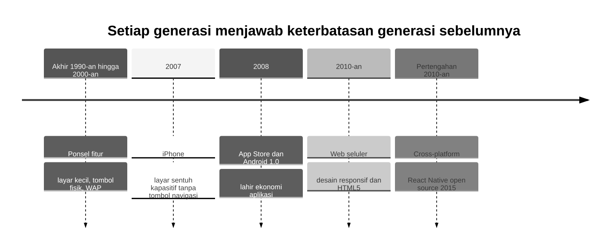

<!-- _class: lead -->
<!-- _paginate: skip -->
<!-- _footer: "" -->

# Bab 1 — Pengantar Pemrograman Mobile

Fondasi konseptual sebelum menulis kode · Pertemuan 1

<!--
Buka dengan satu kalimat pengait: "Hari ini kita tidak menulis kode apa pun, tetapi
keputusan kita hari ini menentukan 14 bab berikutnya."

Tanyakan pembuka: "Kalau data akademik sudah ada di website kampus, mengapa kampus
masih butuh aplikasi mobile?" Tampung 2–3 jawaban, jangan dikoreksi dulu.
-->

---

## Tujuan Pembelajaran

* Menjelaskan pengertian dan karakteristik aplikasi mobile
* Membedakan native, web, hybrid, dan cross-platform
* Menjelaskan posisi Android & iOS serta evolusi teknologi mobile
* Menjelaskan konsep kerja React Native dan peran Expo
* Menganalisis trade-off React Native dan arsitektur aplikasi mobile

<!--
Bacakan kata kerjanya saja. Tekankan bahwa tujuan ke-5 adalah inti cara berpikir
profesional: keputusan teknologi selalu berupa trade-off, bukan soal selera.

Kaitkan dengan penilaian: pertemuan ini dinilai lewat keaktifan diskusi dan Tugas 1
(laporan pengamatan tiga aplikasi mobile).
-->

---

## Peta Konsep Bab 1



<!--
Jelaskan alur membaca peta dari atas ke bawah: karakteristik dan jenis aplikasi
melahirkan pertanyaan "platform mana, dengan pendekatan apa", dan pertanyaan itu
dijawab lewat analisis trade-off.

Titik temu ketiga cabang ada di satu simpul: analisis trade-off pada Subbab 1.7.
-->

---

<!-- _class: center -->

## Tiga Pertanyaan Pembuka

* Mengapa aplikasi ojek daring tahu posisi Anda, tetapi website tidak?
* Kalau satu aplikasi harus dibangun dua kali, apa akibatnya?
* Apa yang terjadi pada aplikasi saat jaringan tiba-tiba hilang?

Jawabannya tersebar di Subbab 1.1 (karakteristik), 1.2–1.7 (trade-off), dan 1.8 (arsitektur).

<!--
Think-pair-share: 2 menit berpikir sendiri, 2 menit berpasangan, lalu 2–3 pasangan
menyampaikan jawaban singkat. Jangan langsung menjawab.

Pemicu bila kelas pasif: "Sebutkan satu hal yang bisa dilakukan aplikasi di ponsel
Anda tetapi tidak bisa dilakukan website kampus."
-->

---

<!-- _class: lead -->
<!-- _paginate: skip -->

# Bagian 1 — Karakteristik, Jenis & Platform

Subbab 1.1 Karakteristik · 1.2 Empat Pendekatan · 1.3 Android & iOS · 1.4 Evolusi

<!--
Bagian ini konseptual. Bila waktu mepet, bagian ini yang boleh dipadatkan, tetapi
Subbab 1.1 tidak boleh dilewati karena menjadi rujukan seluruh bab berikutnya.
-->

---

## Apa Itu Aplikasi Mobile?

**Aplikasi mobile** adalah perangkat lunak yang dirancang untuk perangkat bergerak, terutama *smartphone* dan tablet.

<div class="grid2">
<div>

**Bukan sekadar website yang diperkecil**

* Diinstal pada perangkat, bukan dibuka lewat peramban
* Hidup dalam ekosistem toko aplikasi
* Memanfaatkan kemampuan fisik perangkat

</div>
<div>

**Dari mana nilainya lahir**

* Istilah *mobile* menunjuk mobilitas: dipakai sambil beraktivitas
* Sesi pendek dan sering terinterupsi, jadi aplikasi harus tahan berhenti-lanjut

</div>
</div>

<!--
Analogi: aplikasi web seperti membuka kantor layanan setiap kali ingin dilayani;
aplikasi mobile seperti petugas layanan yang tinggal di saku pengguna.

Minta mahasiswa menyebut satu aplikasi dan satu website yang mereka buka hari ini,
lalu bandingkan "rasanya".
-->

---

## Karakteristik Aplikasi Mobile (1–4)

| # | Karakteristik | Konsekuensi desain |
|---|---|---|
| 1 | **Mobilitas & konteks pengguna** | Sesi pendek dan sering terinterupsi → harus bisa lanjut tanpa kehilangan data |
| 2 | **Antarmuka berbasis sentuhan** | Ukuran jari, gerakan geser dan cubit, lebar layar terbatas |
| 3 | **Akses sensor & fitur perangkat** | Kamera, mikrofon, GPS, akselerometer, notifikasi selalu aktif |
| 4 | **Konektivitas berubah-ubah** | Wi-Fi berganti data seluler, kadang hilang → prinsip *offline-first* |

<!--
Jangan dihafalkan; hubungkan tiap butir dengan pengalaman mahasiswa. Tanyakan:
"Kapan terakhir kali aplikasi di ponsel Anda lambat atau kehilangan data?"

Karakteristik 1 adalah alasan mengapa state dan penyimpanan lokal dibahas serius
pada Bab 9 dan Bab 11 — bukan sekadar teori.
-->

---

## Karakteristik Aplikasi Mobile (5–7)

| # | Karakteristik | Konsekuensi desain |
|---|---|---|
| 5 | **Distribusi melalui toko aplikasi** | Google Play & App Store menjamin keamanan dasar, tetapi ada proses *review* |
| 6 | **Sumber daya perangkat terbatas** | Baterai dan memori terbatas → hindari pemrosesan berulang yang tidak perlu |
| 7 | **Siklus hidup diatur sistem** | Sistem dapat membekukan aplikasi → aplikasi harus menyimpan keadaannya |

> Hampir setiap sistem informasi modern punya "wajah mobile": e-learning, presensi, layanan akademik, sistem antrean rumah sakit.

<!--
Karakteristik 7 paling sering tidak disadari. Demonstrasi: buka aplikasi, tekan Home,
tunggu, lalu buka kembali — pada aplikasi yang buruk, posisi pengguna hilang.

Cek pemahaman: "Kalau aplikasi ditutup lalu dibuka besok, data yang sedang diisi
seharusnya bagaimana?" (Jawaban: tersimpan, tidak hilang.)
-->

---

## Dari Karakteristik ke Keputusan Desain

| Karakteristik | Konsekuensi desain | Dilatih pada |
|---|---|---|
| Mobilitas & siklus hidup | State dan penyimpanan agar data tidak hilang | Bab 9, Bab 11 |
| Antarmuka sentuh | Komponen dan tata letak khusus mobile | Bab 5, Bab 6 |
| Sensor & fitur perangkat | Kamera, lokasi, notifikasi melalui Expo | Bab 12 |
| Konektivitas berubah | Pola *offline-first* dan sinkronisasi | Bab 11 |
| Distribusi via toko | *Build* dan penerbitan aplikasi | Bab 15 |
| Sumber daya terbatas | Kebiasaan menulis kode yang hemat | Setiap bab |

<!--
Slide ini adalah peta jalan tersembunyi: karakteristik yang terlihat teoretis akan
berubah menjadi baris kode di bab tertentu.

Jika ada yang bertanya "kenapa teori dulu, bukan langsung koding?", jawab dengan
slide ini — tanpa karakteristik 1 dan 4, aplikasi akan kehilangan data saat
jaringan hilang dan pengembangnya tidak tahu mengapa itu salah.
-->

---

## Empat Pendekatan (1): Native & Web Mobile

<div class="grid2">
<div>

**Aplikasi native**

* Bahasa dan alat resmi satu platform: Kotlin/Java, Swift
* Performa tertinggi, akses fitur perangkat paling lengkap
* Kelemahan: satu basis kode per platform, biaya berlipat

</div>
<div>

**Aplikasi web mobile**

* Situs web yang dioptimalkan untuk layar kecil, dibuka lewat peramban
* Akses sensor dan notifikasi terbatas, performa di bawah native

Satu basis kode, tanpa melewati toko aplikasi, pembaruan langsung berlaku.

</div>
</div>

<!--
Tekankan dua hal yang sering tertukar: (a) native tidak selalu "lebih baik", ia hanya
lebih mahal; (b) web mobile paling murah, tetapi kalah pada senjata utama mobile —
notifikasi dan kehadiran di layar utama.

Pertanyaan pemandu: "Kalau anggaran hanya cukup untuk satu aplikasi, mana pilihan
Anda dan apa risikonya?"
-->

---

## Empat Pendekatan (2): Hybrid & Cross-platform

<div class="grid2">
<div>

**Aplikasi hybrid**

* Antarmuka ditulis dengan HTML, CSS, JavaScript
* Dibungkus kontainer native lewat WebView, dengan jembatan ke sebagian fitur
* Tidak pernah terasa native — populer 2012–2015, lalu ditinggalkan

</div>
<div>

**Cross-platform modern**

* Satu bahasa: JavaScript (React Native) atau Dart (Flutter)
* Diterjemahkan menjadi antarmuka native sungguhan, bukan halaman web

"Tulis sekali, jalankan di mana-mana yang *layak*."

</div>
</div>

<!--
Pertanyaan pembeda yang harus dijawab mahasiswa: "hasil akhirnya halaman web atau
komponen UI milik sistem operasi?" Hybrid = halaman web; cross-platform modern =
komponen native.

Kesalahpahaman tersering: "cross-platform sama dengan hybrid". Slide tabel 1.1
berikutnya dipakai untuk mematahkan itu.
-->

---

## Tabel 1.1 — Perbandingan Pendekatan (1/2)

| Aspek | Native | Web mobile | Hybrid | Cross-platform |
|---|---|---|---|---|
| **Bahasa** | Kotlin/Java, Swift | HTML, CSS, JS | HTML, CSS, JS | JavaScript/JSX |
| **Basis kode** | Dua (per platform) | Satu | Satu | Satu |
| **Distribusi** | Toko aplikasi | Peramban web | Toko aplikasi | Toko aplikasi |
| **Performa** | Tertinggi | Rendah–sedang | Sedang | Tinggi, mendekati native |

<!--
Bandingkan dua kolom yang paling kontras (native vs web mobile) lebih dulu, jangan
membaca baris satu per satu.

Tanyakan: "Kolom mana yang paling tepat untuk aplikasi kampus?" Biarkan mahasiswa
menemukan sendiri bahwa jawabannya cross-platform, lalu buktikan di slide berikutnya.
-->

---

## Tabel 1.1 — Perbandingan Pendekatan (2/2)

| Aspek | Native | Web mobile | Hybrid | Cross-platform |
|---|---|---|---|---|
| **Akses fitur perangkat** | Penuh | Terbatas | Sebagian (via bridge) | Luas (via modul) |
| **Tampilan** | Asli platform | Tidak asli | Tidak asli | Mendekati asli |
| **Biaya pengembangan** | Paling tinggi | Rendah | Sedang | Sedang |

> Tidak ada pendekatan yang menang mutlak. Setiap pilihan adalah pertukaran antara biaya, performa, dan pengalaman pengguna.

<!--
Titik diskusi paling penting: dua kolom terakhir sama-sama "satu basis kode", tetapi
pada baris Tampilan hybrid "tidak asli" sementara cross-platform "mendekati asli".

Itulah inti perbedaan hybrid dan cross-platform modern — tanyakan ulang ke kelas
sebelum lanjut.
-->

---

## Kapan Memilih yang Mana?



> Prioritas pasar menentukan urutan: jangkauan luas (khas Indonesia) → Android dulu; pengguna premium ekosistem Apple → iOS jangan dilewatkan.

<!--
Bagan ini kriteria pegangan, bukan aturan mutlak. Kasus nyata sering campuran:
aplikasi cross-platform dengan satu modul berat ditulis native.

Pertanyaan lanjutan: "Aplikasi absensi dengan foto selfie dan lokasi masuk cabang
mana?" (Jawaban: cross-platform — form, data, dan fitur perangkat standar.)
-->

---

<!-- _class: center -->

## Latihan: Memilih Pendekatan

* Kampus Anda akan membangun aplikasi untuk melihat jadwal dan nilai
* Tim hanya **dua mahasiswa praktikan**, kemampuan JavaScript dasar, anggaran terbatas
* Target pengguna: **Android kelas menengah ke bawah** dan **iPhone**
* Tugas: pilih satu pendekatan dan sebutkan minimal **empat kriteria**

<!--
Think-pair-share 5 menit, lalu bahas. Jawaban kuat menyebut: keterbatasan perangkat
kelas bawah (ukuran dan memori aplikasi), kebutuhan dua platform dengan tim kecil,
serta peran Expo Go dalam mempercepat pengembangan.

Jawaban yang hanya menyebut "cross-platform karena modern" belum menjawab — minta
alasannya.
-->

---

## Android dan iOS: Perbandingan

| Aspek | Android (Google, 2008) | iOS (Apple, 2007) |
|---|---|---|
| Model sumber | Terbuka (AOSP) | Tertutup |
| Perangkat | Ratusan merek | Hanya perangkat Apple |
| Bahasa native | Kotlin (Java) | Swift |
| Toko aplikasi | Google Play & sumber lain | App Store |
| Review aplikasi | Lebih longgar | Ketat |
| Alat pengembangan | Android Studio (semua OS) | Xcode (khusus macOS) |

<!--
Kaitkan dengan praktikum: seluruh praktikum buku ini dijalankan di Android (Expo Go
atau emulator) karena tidak membutuhkan komputer Mac, sementara kode yang sama tetap
dapat dijalankan di iOS.

Pertanyaan pemandu: "Mengapa pengembang kecil di Indonesia hampir selalu mulai dari
Android?" (Pangsa pasar, rentang harga perangkat, tidak perlu Mac.)
-->

---

## Fragmentasi vs Konsistensi

> Android terbuka dan menguasai mayoritas pasar, tetapi membawa **fragmentasi**: ribuan model dengan ukuran layar, kinerja, dan versi sistem berbeda.

<div class="grid2">
<div>

**Konsekuensi Android**

* Aplikasi harus diuji pada beragam perangkat
* Perilaku bisa berbeda antar ponsel
* Distribusi tidak selalu lewat toko (berkas APK)

</div>
<div>

**Konsekuensi iOS**

* Perilaku aplikasi dapat diprediksi
* Biaya masuk pengembang dan perangkat relatif mahal; aturan lebih kaku

</div>
</div>

<!--
Dari sini lahir reaksi yang wajar: jika membangun native untuk dua platform berarti
dua bahasa, dua alat, dua proses review, maka pengembang mencari cara membangun
sekali untuk dua platform — itulah titik lahir React Native.

Kebijakan toko dan privasi dibahas di Bab 12 dan Bab 13.
-->

---

## Evolusi Teknologi Mobile



<!--
Jangan menghafal tanggal. Yang harus dipahami adalah polanya: setiap generasi lahir
sebagai jawaban atas keterbatasan generasi sebelumnya.

Pertanyaan cepat: "Keterbatasan apa yang dijawab oleh toko aplikasi?" (Distribusi yang
sebelumnya dikendalikan operator seluler.)
-->

---

<!-- _class: lead -->
<!-- _paginate: skip -->

# Bagian 2 — React Native, Expo & Arsitektur

Subbab 1.5 React Native · 1.6 Expo · 1.7 Trade-off · 1.8 Arsitektur · 1.9–1.10

<!--
Bagian ini adalah inti bab dan bagian yang paling mungkin muncul di ujian. Bila waktu
di pertemuan ini tinggal sedikit, pindahkan Subbab 1.8–1.10 ke pertemuan berikutnya.
-->

---

## React Native: Konsep Inti

<div class="grid2">
<div>

**React Native (RN)**

* Framework sumber terbuka dari Meta, memakai JavaScript
* Turunan React: komponen, props, state dibawa utuh
* Menulis antarmuka sekali, digambar sebagai komponen native

</div>
<div>


</div>
</div>

<!--
Versi buku ini: React Native 0.86 dalam Expo SDK 57, dengan React 19.2 sebagai
pustaka antarmukanya (versi-teknologi dirangkum pada pendahuluan buku).

Inilah pembeda terbesar dari hybrid: komponen View di Android menjadi ViewGroup dan
di iOS menjadi UIView — elemen antarmuka milik sistem operasi, bukan kotak di dalam
halaman web.

Pertanyaan pemandu: "Kalau kode JavaScript tetap berjalan sebagai JavaScript, apa
yang sebenarnya native?" (Jawaban: tampilan antarmukanya.)
-->

---

## Cara Kerja React Native


> **Hot reload** membuat perubahan kode langsung terlihat tanpa membangun ulang aplikasi.

<!--
Alur mudah dibayangkan: JavaScript memerintahkan "buat tombol hijau di sini", lapisan
native menerjemahkannya menjadi tombol asli, lalu melaporkan ketukan pengguna kembali
ke JavaScript.

Kaitkan bridge dengan keterbatasan performa di Subbab 1.7: komunikasi lintas lapisan
menambah beban, sehingga grafis berat tetap lebih baik native.
-->

---

## Yang Bukan React Native

* Bukan penerjemah kode ke bahasa native Kotlin atau Swift
* Bukan pembungkus halaman web di dalam WebView
* Yang native adalah **tampilan antarmukanya**, bukan kode JavaScript-nya

> Konsekuensinya: RN unggul untuk aplikasi berbasis data — form, daftar, integrasi server — bukan untuk permainan ber-grafik berat.

<!--
Tampilkan judul, minta kelas menebak lebih dulu, baru klik untuk memunculkan tiap
pernyataan. Dua miskonsepsi inilah yang paling sering muncul di kelas.

Pertanyaan lanjutan: "Kalau RN bukan pembungkus web, mengapa aplikasinya bisa lebih
besar daripada aplikasi native?" (Karena membawa runtime JavaScript.)
-->

---

## Expo: Tiga Komponen Utama

* **Expo SDK 57** — satu API JavaScript untuk kamera, lokasi, notifikasi, penyimpanan
* **Expo Go** — menjalankan project di ponsel tanpa *build* native: pindai kode QR
* **EAS** — layanan cloud untuk *build* dan menerbitkan aplikasi ke toko aplikasi

Perintah utamanya `npx expo start`; praktiknya di Bab 2, penerbitan dijelaskan di Bab 15.

<!--
Analoginya: jika React Native adalah "bahasa dan mesin", Expo adalah "lingkungan kerja
yang membuat mesin itu mudah dipakai".

Manfaat terbesar bagi mahasiswa adalah kurva belajar: dari nol hingga aplikasi berjalan
di ponsel hanya butuh beberapa langkah, tanpa memasang Android Studio lebih dulu.
-->

---

## Expo: Harga yang Dibayar

* Ukuran aplikasi Expo cenderung lebih besar
* Modul native yang belum didukung Expo menuntut *prebuild* atau *development build*
* Fitur perangkat mutakhir baru tersedia setelah Expo menyesuaikan SDK terbaru

> Bagi mayoritas aplikasi sistem informasi, ketiga keterbatasan ini tidak menghalangi. Bagi project khusus, inilah pertimbangan trade-off.

<!--
Semua keputusan teknologi punya harga. Minta mahasiswa menilai: keterbatasan mana
yang paling berisiko untuk aplikasi kampus mereka (biasanya: ukuran aplikasi pada
perangkat kelas bawah).

Menyebutkan biaya ini di depan kelas bukan kelemahan, melainkan bagian dari analisis
yang jujur.
-->

---

## Keunggulan dan Keterbatasan React Native

| Keunggulan | Keterbatasan |
|---|---|
| Satu basis kode untuk Android dan iOS | Performa di bawah native untuk beban ekstrem |
| Tim JavaScript dapat langsung produktif | Aplikasi lebih besar dan lebih boros memori |
| Ekosistem npm yang sangat luas | Fitur platform terbaru kadang terlambat diadopsi |
| *Hot reload* mempercepat iterasi | *Debugging* lintas lapisan JS dan native lebih rumit |
| Pembaruan tanpa membangun ulang aplikasi | Modul native khusus tetap butuh keahlian native |
| Komunitas besar dan banyak materi belajar | Bergantung pada kestabilan pustaka pihak ketiga |

<!--
Cara membawakan: setiap keunggulan punya sisi lain. "Satu basis kode" menghemat
pemeliharaan jangka panjang, tetapi ketergantungan pada pustaka pihak ketiga adalah
harganya.

Pertanyaan penutup: "Sebutkan satu keterbatasan yang paling berisiko untuk aplikasi
kampus." (Biasanya: perangkat Android kelas bawah dengan memori terbatas.)
-->

---

## Kapan React Native Tepat?

* Aplikasi kaya antarmuka dan data, bukan rendering grafis kelas berat
* Aplikasi bisnis, e-commerce, layanan, dan sistem informasi
* Game 3D dan editor video tetap lebih baik ditulis native
* Keputusan diambil lewat analisis trade-off, bukan karena tren

<!--
Tekankan penghematan terbesar justru pada pemeliharaan jangka panjang, bukan pada
penulisan awal — argumen ini yang paling kuat saat berdebat dengan pemangku kepentingan.

Ingatkan bahwa pola pikir ini yang akan dipakai di dunia kerja, apa pun framework yang
berlaku saat itu.
-->

---

## Arsitektur Umum Aplikasi Mobile



> Contoh alur: aplikasi cek nilai → permintaan "tampilkan nilai saya" → server menjawab JSON → aplikasi menggambar tabel nilai.

<!--
Pola paling umum adalah client–server: perangkat menampilkan antarmuka dan
mengumpulkan masukan, server menyediakan data dan aturan bisnis.

Tekankan bahwa pemisahan tiga lapisan bukan sekadar kerapian: lapisan yang terpisah
dapat diuji, dirawat, dan diganti secara independen.
-->

---

## Tiga Lapisan Klien dan Bab Terkait

| Lapisan | Di React Native/Expo | Dibahas pada |
|---|---|---|
| **Presentasi** | Komponen React, `View`, `Text`, `FlatList`, Flexbox, navigasi | Bab 4, 5, 6, 7 |
| **Bisnis** | State lokal dan global, validasi form, logika yang diuji | Bab 8, 9, 14 |
| **Data** | `fetch` ke REST API, penyimpanan lokal, token autentikasi | Bab 10, 11, 13 |

> Pada Project Akhir, Anda membangun aplikasi yang menerapkan arsitektur tiga lapis ini.

<!--
Slide ini menjawab pertanyaan "kapan saya memakai semua ini?". Setiap bab punya
"rumah" di dalam arsitektur, sehingga materi tidak terasa terpisah-pisah.

Ajak menebak: "Form login dengan validasi dan panggilan API menyentuh lapisan apa
saja?" (Presentasi: tampilan; bisnis: validasi; data: permintaan ke server.)
-->

---

## Contoh Aplikasi Nyata (1/2)

| Kategori | Contoh | Fitur perangkat yang dimanfaatkan |
|---|---|---|
| Transportasi daring | Ojek daring, taksi daring | GPS, kamera, notifikasi status pesanan |
| Belanja daring | Marketplace, toko daring | Notifikasi promo, pembayaran scan kode QR |
| Perbankan dan pembayaran | Aplikasi bank, dompet digital | Sidik jari, kamera, notifikasi transaksi |
| Komunikasi | Aplikasi pesan, panggilan video | Mikrofon, kamera, notifikasi *real-time* |

<!--
Minta mahasiswa memilih satu baris yang paling dekat dengan kesehariannya dan
menyebutkan karakteristik Subbab 1.1 mana yang paling dominan di aplikasi itu.

Contoh: dompet digital memindai QR dengan kamera sambil mengunci akses dengan sidik
jari — konteks, sensor, dan notifikasi bekerja bersama.
-->

---

## Contoh Aplikasi Nyata (2/2)

| Kategori | Contoh | Fitur perangkat yang dimanfaatkan |
|---|---|---|
| Media sosial | Jejaring sosial, berbagi video | Kamera, galeri, GPS untuk tag lokasi |
| Edukasi | Kursus daring, aplikasi kampus | Notifikasi jadwal, unduhan materi offline |
| Kesehatan | Pedometer, telekonsultasi | Sensor gerak, GPS, kamera |
| Produktivitas | Catatan, kalender | Notifikasi pengingat, sinkronisasi lintas perangkat |

> Pola menarik: banyak aplikasi besar **memulai sebagai web**, menambahkan aplikasi mobile, lalu menjadikan mobile sebagai produk utamanya.

<!--
Slide ini jembatan ke Praktikum: mengamati tiga aplikasi, memperkirakan jenisnya
(Subbab 1.2), mengidentifikasi fitur perangkat, dan menilai pengalaman pengguna.

Kemampuan "membedah" aplikasi seperti ini akan terus dipakai saat merancang aplikasi
sendiri di bab-bab berikutnya.
-->

---

## Studi Kasus: Kebutuhan Kampus

**Kasus fiktif dengan pola nyata.** Universitas Wijaya Nusantara, ± 8.000 mahasiswa.

<div class="grid2">
<div>

**Masalah**

* Jadwal kuliah hanya ditempel di papan pengumuman
* Perubahan ruang diumumkan lewat grup percakapan tidak resmi
* Nilai hanya di biro akademik pada jam kantor; KRS selalu antre

</div>
<div>

**Kebutuhan yang dirumuskan**

* Mahasiswa butuh jadwal, nilai, KRS, pengumuman
* Dosen dan staf akademik: jadwal mengajar, beban layanan berkurang

Akar masalahnya **bukan pada data**, melainkan pada saluran penyampaiannya.

</div>
</div>

<!--
Bacakan sebagai cerita, bukan sebagai daftar. Tujuannya membuat mahasiswa merasakan
bahwa analisis kebutuhan dimulai dari pengguna, bukan dari teknologi.

Pertanyaan sebelum slide berikutnya: "Kalau Anda analis sistem di kampus ini, apa
keputusan pertama Anda?" Biarkan mereka menebak lebih dulu.
-->

---

## Studi Kasus: Keputusan Arsitektur

| Opsi | Pertimbangan | Hasil |
|---|---|---|
| Situs web mobile | Hemat, tetapi tanpa notifikasi proaktif dan tanpa ikon di layar utama | Ditolak |
| Native dua platform | Kualitas terbaik, tetapi tim kecil harus memelihara dua basis kode | Ditolak |
| **React Native + Expo** | Satu basis kode, notifikasi lewat Expo SDK, kurva belajar praktikan memadai | **Dipilih** |

> Arsitekturnya mengikuti Subbab 1.8: klien tiga lapisan, server menyediakan REST API. Autentikasi (Bab 13), penyimpanan lokal (Bab 11), dan notifikasi (Bab 12).

<!--
Tekankan pola pengambilan keputusan: dua opsi pertama bukan "salah", melainkan kalah
karena tidak cocok dengan konteks — kebutuhan notifikasi proaktif dan kapasitas tim.

Inilah bentuk analisis trade-off yang menjadi tujuan pembelajaran pertemuan ini, dan
polanya sama dengan Project Akhir.
-->

---

<!-- _class: center -->

## Diskusi Kelas: Teknologi vs Proses

* Antrean KRS berkurang karena aplikasi — tetapi tetap ada bila prosesnya berbelit
* Data yang tidak terpelihara tetap salah, walau aplikasinya secantik apa pun
* Analis sistem yang matang memisahkan masalah teknologi dari masalah proses

**Pertanyaan:** sebutkan satu masalah di kampus Anda yang tampak seperti masalah teknologi, tetapi sebenarnya masalah proses atau data.

<!--
Slide terpenting untuk mahasiswa Sistem Informasi: menempatkan teknologi pada
tempatnya. Beri 3 menit berpasangan, lalu tampung 2–3 jawaban.

Bila jawaban lemah, beri arah: sistem presensi yang datanya tidak pernah
diverifikasi (masalah data), atau prosedur cuti bertanda tangan berlapis (masalah
proses) — bukan masalah aplikasinya.
-->

---

## Kompetensi dan Peta 15 Bab

<div class="grid2">
<div>

**Kompetensi yang diraih**

* Menjelaskan konsep dan arsitektur aplikasi mobile
* Membangun aplikasi dengan React Native dan Expo, termasuk UI dan navigasi

</div>
<div>

**Perjalanan 15 bab**

* Bab 2–7: lingkungan, JavaScript, React, React Native, UI, navigasi
* Bab 8–11: form, state, REST API, penyimpanan lokal
* Bab 12–15: fitur perangkat, keamanan, pengujian, rilis

Puncaknya: **Project Akhir** — sistem informasi akademik mobile.

</div>
</div>

<!--
Tunjukkan bahwa setiap bab adalah batu bata: Bab 3 (JavaScript) menjadi fondasi
Bab 4 (React), yang menjadi fondasi Bab 5 (React Native).

Tekankan kebiasaan profesional yang menyertai seluruh perjalanan: membaca dokumentasi
resmi, membaca pesan kesalahan sebelum bertanya, dan mencatat kendala.
-->

---

## Praktikum Pertemuan Ini

* Unduh dan instal **Node.js LTS** dari nodejs.org — pilih label LTS, bukan Current
* Instal **Visual Studio Code** sebagai editor kode
* Buat **akun Expo** di expo.dev sebagai syarat layanan pengembangan
* Jalankan script `cek-lingkungan.js` dan baca hasilnya
* Susun **laporan observasi** tiga aplikasi mobile yang Anda gunakan sehari-hari

> Jika sebuah langkah gagal, jangan lanjut — selesaikan dahulu lewat bagian Troubleshooting pada bab.

<!--
Ingatkan pilihan LTS, bukan Current: kesalahan paling umum di praktikum, karena
perilaku npm dan Expo CLI dapat berbeda dari yang dibahas di buku.

Mahasiswa yang memakai komputer laboratorium kampus harus berkoordinasi dengan
pengelola lab sebelum jadwal praktikum (butuh Node.js LTS dan VS Code).
-->

---

## Contoh Kode: cek-lingkungan.js

`kode/bab-01/cek-lingkungan.js` — bagian penilaian

```js
const nomorUtamaNode = Number(versiNode ? versiNode.match(/^v(\d+)/)?.[1] : 0);
if (nomorUtamaNode >= 22) {
  console.log('\nHasil: lingkungan siap. Versi Node.js memenuhi syarat (minimal 22).');
} else if (versiNode) {
  console.log('\nHasil: Node.js terpasang, tetapi versinya lebih lama dari 22.');
  console.log('       Instal ulang Node.js LTS terbaru dari situs resminya.');
} else {
  console.log('\nHasil: Node.js belum terpasang. Instal dahulu Node.js LTS.');
}
```

> Pola **periksa → bandingkan → simpulkan** ini adalah cermin mini cara kerja aplikasi yang lebih besar.

<!--
Tunjukkan tiga hal saja: ekspresi reguler mengambil angka utama versi, ambang 22
adalah syarat buku ini, dan tiga cabang if/else memberi kesimpulan berbeda.

Menyebut sintaksis secara rinci belum perlu — variabel, fungsi, dan ekspresi reguler
dibangun pada Bab 3.
-->

---

<!-- _class: center -->

## Uji Pemahaman

* Karakteristik apa yang paling membedakan aplikasi mobile dari aplikasi web?
* Aplikasi yang ditulis dengan teknologi web lalu dibungkus WebView disebut apa?
* Di dalam React Native, komponen `View` akan digambar sebagai apa?
* Dalam arsitektur client–server, REST API berada di sisi mana?

<!--
Kuis lisan 5 menit: tampilkan pertanyaan, minta kelas menjawab serentak atau angkat
tangan, baru lanjut ke slide jawaban. Jangan membocorkan jawaban di slide ini.

Bila jawaban kelas beragam, catat dan ulangi pembedanya di akhir pertemuan.
-->

---

<!-- _class: center -->

## Jawaban

* Memanfaatkan sensor, konteks, dan notifikasi perangkat
* Aplikasi hybrid — bukan web mobile, bukan native
* Komponen UI native milik platform, misalnya `ViewGroup` di Android
* Di sisi server — klien memanggilnya lewat HTTP

<!--
Ulangi pembeda yang paling sering tertukar: hybrid (WebView) versus cross-platform
modern (komponen native).

Jika banyak yang salah pada pertanyaan pertama, ulangi karakteristik Subbab 1.1
sebelum menutup pertemuan.
-->

---

## Rangkuman

1. Tujuh karakteristik khas aplikasi mobile, dari mobilitas sampai siklus hidup
2. Empat pendekatan: native, web mobile, hybrid, cross-platform
3. Android terbuka dan terfragmentasi; iOS tertutup dan konsisten
4. React Native memetakan JavaScript ke komponen native; Expo melengkapinya
5. Arsitektur client–server dengan tiga lapisan klien: presentasi, bisnis, data

<!--
Jangan dibacakan. Minta mahasiswa memilih satu nomor dan menjelaskannya dengan kalimat
sendiri — cara ini lebih efektif daripada mengulang bacaan.

Pesan penutup: kebiasaan profesional dimulai hari ini — setiap kali menemui istilah
asing, cari maknanya; setiap kali aplikasi gagal, baca pesan errornya sebelum bertanya.
-->

---

## Referensi

| Sumber | Tautan |
|---|---|
| React Native documentation (2026) | reactnative.dev |
| Expo documentation (2026) | docs.expo.dev |
| React documentation (2026) | react.dev |
| JavaScript, MDN Web Docs (2026) | developer.mozilla.org |
| Node.js documentation (2026) | nodejs.org |

<div class="grid2">
<div>

**Bacaan lanjutan**

- Bab 2 — Persiapan Lingkungan Pengembangan

</div>
<div>

**Versi teknologi buku ini**

- Expo SDK 57 · React Native 0.86 · React 19.2 · Node.js LTS ≥ 22

</div>
</div>

<!--
Rujukan lengkap ada di Lampiran D; glosarium istilah (60 entri) di Lampiran C sangat
membantu untuk istilah seperti bridge, WebView, dan hot reload.

Sumber utama bab ini tetap dokumentasi resmi reactnative.dev dan docs.expo.dev,
bukan blog yang mungkin sudah usang.
-->

---

<!-- _class: lead -->
<!-- _paginate: skip -->

# Siap Menuju Bab 2

**Tugas:** selesaikan praktikum (Node.js LTS, VS Code, akun Expo) dan susun laporan observasi tiga aplikasi mobile.

Pertemuan berikutnya: menyiapkan lingkungan dan menjalankan aplikasi pertama.

<!--
Tutup dengan satu kalimat: "Hari ini kita membeli peta; mulai Bab 2 kita berjalan."

Sebutkan tenggat Tugas 1 secara eksplisit: dikumpulkan kapan, format apa, dan dinilai
dari aspek apa (lihat Lampiran A — rubrik praktikum: pemahaman konsep 15%,
implementasi 25%, kualitas kode 15%, UI/UX 15%, debugging 10%, dokumentasi 20%).
-->
