<!-- _class: lead -->
<!-- _paginate: skip -->
<!-- _footer: "" -->

# Bab 2 — Persiapan Lingkungan Pengembangan

Menyiapkan meja kerja, menjalankan aplikasi pertama · Pertemuan 2

<!--
Buka dengan kalimat pengait: "Bab 1 kita menyusun peta; hari ini kita menyiapkan
peralatan dan menyalakan mesinnya."

Tanyakan pembuka: "Apa yang Anda siapkan lebih dulu ketika memakai laptop baru untuk
kuliah?" Tampung dua sampai tiga jawaban sebagai jembatan ke konsep lingkungan kerja
yang baku dan dapat diulang.

Sesuai RPS, pertemuan ini berbeban 3 SKS (2 SKS teori + 1 SKS praktikum); sisipkan
demo singkat lalu langsung praktik di depan komputer.
-->

---

## Tujuan Pembelajaran

* Menjelaskan peran Node.js, npm, dan npx dalam ekosistem Expo
* Mengidentifikasi komponen lingkungan pengembangan beserta fungsinya
* Mengimplementasikan pembuatan project Expo pertama dan menjalankannya
* Menganalisis tiga jalur pengujian dari sisi kecepatan dan kesetiaan perilaku
* Menjelaskan struktur folder project dan mengevaluasi kendala umum

<!--
Bacakan kata kerjanya saja. Tujuan keempat adalah inti cara berpikir analitis dan
yang paling sering muncul pada soal ujian.

Kaitkan dengan penilaian RPS pertemuan ini: rubrik praktikum Bab 2 plus checklist
troubleshooting yang dikumpulkan bersama laporan praktikum.

Tegaskan bahwa tujuan kelima bersifat diagnostik: mahasiswa harus mampu memilih
solusi, bukan sekadar menghafal pesan galat.
-->

---

## Peta Konsep Bab 2


<!--
Bacakan peta ini sebagai tiga langkah: siapkan fondasi, pilih alat uji, lalu buat dan
jalankan project pertama.

Tekankan bahwa tiga cabang itu tidak berdiri sendiri: project pertama baru bisa
berjalan bila fondasi terpasang dan salah satu alat uji tersedia.

Tanyakan: "Cabang mana yang paling sering gagal di praktikum?" (Jawaban: fondasi,
terutama Node.js yang belum ada di PATH.)
-->

---

<!-- _class: center -->

## Tiga Pertanyaan Pembuka

* Mengapa alat disiapkan dahulu sebelum satu baris kode ditulis?
* Apa akibatnya bila versi Node.js tiap anggota tim berbeda?
* Mengapa aplikasi yang jalan di laptop Anda gagal di laptop rekan?

Jawabannya ada di Subbab 2.1 (fondasi), 2.2 (package manager), dan Studi Kasus bab ini.

<!--
Think-pair-share: 2 menit berpikir sendiri, 2 menit berpasangan, lalu dua sampai tiga
pasangan menyampaikan jawaban singkat. Jangan dikoreksi dulu, catat saja polanya.

Pemicu bila kelas pasif: "Pernahkah Anda mendengar kalimat 'di komputer saya jalan
kok'? Menurut Anda apa penyebab paling seringnya?"

Pertanyaan ketiga adalah jembatan ke konsep reproducibility pada Studi Kasus.
-->

---

<!-- _class: lead -->
<!-- _paginate: skip -->

# Bagian 1 — Fondasi: Node.js, npm & VS Code

Subbab 2.1 Node.js dan npm · 2.2 Package Manager · 2.3 Visual Studio Code

<!--
Bagian ini konseptual tetapi menentukan seluruh praktikum hari ini. Bila waktu mepet,
padatkan Subbab 2.2 dan 2.3, jangan lewati Subbab 2.1.

Ingatkan bahwa mahasiswa yang gagal di Bagian 1 hampir selalu gagal juga di Bagian 2,
karena semua alat Expo berjalan di atas Node.js.
-->

---

## Node.js: Runtime JavaScript di Luar Browser

**Node.js** adalah *runtime* (lingkungan eksekusi) JavaScript yang berjalan di luar peramban.

<div class="grid2">
<div>

**Mengapa ia fondasi**

* Membungkus mesin JavaScript V8, mesin yang sama dengan Chrome
* Expo CLI dan Metro Bundler berjalan di atas Node.js
* Satu bahasa untuk aplikasi dan alat pengembangnya

</div>
<div>

**Yang sering disalahpahami**

* Bukan bahasa pemrograman baru: JavaScript tetap JavaScript
* Bukan peramban: tidak ada layar, hanya terminal

**Penjelasan tambahan:** istilah *runtime* di sini berarti program yang menyediakan tempat JavaScript dieksekusi.

</div>
</div>

<!--
Analogi: JavaScript adalah bahasa yang Anda kuasai, Node.js adalah ruang kerja yang
membuat bahasa itu bisa dipakai di luar halaman web.

Pertanyaan pemandu: "Kalau Node.js hanya untuk alat, mengapa kita perlu repot
mengurus versinya?" (Jawaban: versi runtime memengaruhi perilaku sintaks dan alat,
sehingga perbedaan versi menimbulkan galat tersamar.)

Peringatan miskonsepsi: banyak mahasiswa mengira Node.js adalah bahasa atau framework.
Tegaskan bahwa Node.js tidak menambah sintaks, hanya menyediakan tempat menjalankan.
-->

---

## npm: Pengelola Paket Project

**npm** (*Node Package Manager*) adalah pengelola paket yang terpasang otomatis bersama Node.js.

<div class="grid2">
<div>

**Tugasnya**

* Mengunduh paket dari registry npmjs.com
* Mengelola versi dan mencatatnya di `package.json`
* Menyimpan seluruh paket di folder `node_modules/`

</div>
<div>

**Bila dikerjakan manual**

* Pustaka disalin tangan dan rawan salah ketik
* Versi di tiap komputer berbeda dan sulit dilacak

</div>
</div>

<!--
Analogi: npm seperti perpustakaan yang mencatat setiap buku yang dipinjam, sehingga
rak kerja Anda bisa dibangun ulang kapan saja dari satu daftar.

Tekankan istilah registry: gudang daring npmjs.com yang memuat jutaan paket, bukan
folder di komputer mahasiswa.

Pertanyaan pemandu: "Apa yang terjadi bila folder node_modules dihapus?" (Jawaban:
cukup jalankan npm install, semua paket dipasang ulang sesuai catatan package.json.)
-->

---

## `npm install` atau `npx`?

| Aspek | `npm install <paket>` | `npx <perintah>` |
|---|---|---|
| Peran | Memasang paket ke dalam project | Menjalankan paket tanpa memasangnya permanen |
| Hasil | Tercatat di `package.json` dan `node_modules/` | Tidak meninggalkan instalasi global |
| Contoh | `npm install <nama-paket>` | `npx create-expo-app`, `npx expo start` |
| Nilai tambah | Menjamin dependency project lengkap | Selalu memakai versi terbaru dari registry |

> Paket JavaScript murni dipasang dengan `npm install`; paket bawaan SDK dipasang dengan `npx expo install`.

<!--
Bandingkan dua kolom pertama pada baris Peran saja, jangan dibaca baris per baris.
Baris Contoh yang paling sering ditanyakan mahasiswa.

Pertanyaan pemandu: "Mengapa create-expo-app dijalankan dengan npx, bukan dipasang
dulu?" (Jawaban: alat ini berubah seiring waktu, npx selalu mengambil versi terkini
dan tidak menumpuk program jarang dipakai di komputer.)

Peringatan: jangan menuliskan nomor versi pada perintah instalasi, biarkan npm
memilih versi yang cocok dengan SDK.
-->

---

## Package Manager: Mengapa dan Pilihan Mana

Sepuluh pustaka yang saling bergantung cepat menghasilkan masalah yang dikenal sebagai *dependency hell* (neraka ketergantungan).

* Mencatat daftar dependensi agar project dapat dipasang ulang di komputer lain
* Mengunduh versi yang saling kompatibel secara otomatis
* Menyimpan paket di `node_modules/` sehingga satu perintah cukup untuk menyiapkan

| Package Manager | Ciri Khas | Kapan Cocok Dipakai |
|---|---|---|
| **npm** | Bawaan Node.js, paling luas dipakai | Project standar — buku ini memakai npm |
| **yarn** | Berkas kunci ketat, dikembangkan Meta | Tim yang sudah memakai yarn |
| **pnpm** | Hemat ruang disk karena berbagi paket | Monorepo atau project besar |

<!--
Pesan utama: perbedaan npm, yarn, dan pnpm bukan pada kemampuan, melainkan pada
strategi penyimpanan berkas dan kecepatan.

Tanyakan: "Kalau ada tiga pilihan, mana yang paling aman untuk kerja tim di kelas?"
(Jawaban: npm, karena bawaan Node.js dan dipakai default oleh create-expo-app —
menghindari perbedaan lockfile antaranggota tim.)

Peringatan: mencampur package manager dalam satu tim adalah penyebab konflik
lockfile, seperti pada Studi Kasus akhir bab ini.
-->

---

## VS Code: Editor dan Ekstensi Bantu

<div class="grid2">
<div>

**VS Code** — editor kode sumber gratis buatan Microsoft

* Penyorotan sintaks dan pelengkapan otomatis (IntelliSense)
* Penelusuran lintas berkas untuk project berisi puluhan berkas
* Terminal terintegrasi, tidak perlu berpindah aplikasi

</div>
<div>

**Ekstensi yang membantu**

* **ESLint** memeriksa kualitas kode; **Prettier** merapikan format saat berkas disimpan
* **Error Lens** menampilkan pesan galat di samping baris bermasalah

</div>
</div>

> Kombinasi ESLint + Prettier + terminal Expo sudah cukup untuk mengikuti seluruh buku ini.

<!--
Tekankan alasan keberadaan fitur, bukan daftar fiturnya: satu project React Native
berisi puluhan hingga ribuan berkas, sehingga editor teks polos tidak realistis.

Pertanyaan pemandu: "Mengapa Prettier penting dalam kerja tim?" (Jawaban: format kode
semua anggota menjadi seragam, sehingga perubahan pada Git lebih mudah dibaca.)

Peringatan versi: ekstensi di marketplace berubah dan sebagian diarsipkan
pengembangnya, termasuk yang pernah populer seperti React Native Tools. Kode ini
ditandai version-sensitive pada bab: cek nama ekstensi di marketplace saat membaca.
Material Icon Theme bersifat opsional, semata kenyamanan visual.
-->

---

## Memverifikasi Node.js dan npm

`Terminal` — dua perintah pemeriksaan wajib

```bash
node --version
npm --version
```

Bila keduanya menampilkan nomor versi, lingkungan Anda siap. Buku ini memakai **Node.js LTS** minimal versi 22.

**Pertanyaan:** apa yang terjadi bila Node.js belum terpasang atau belum dikenali?

<!--
Cara menjelaskan: minta seluruh kelas menjalankan kedua perintah ini sekarang, lalu
angkat tangan yang belum menampilkan nomor versi. Jangan lanjut sebelum tuntas.

Tekankan pilihan LTS, bukan Current: LTS dipelihara lebih lama sehingga paling stabil
untuk pengembangan, dan itulah yang dipakai buku ini.

Peringatan version-sensitive: angka versi LTS terbaru berubah seiring waktu; gunakan
rilis LTS terbaru dari situs resmi nodejs.org.

Jawaban pertanyaan ini ada di slide berikutnya — jangan dijawab sekarang.
-->

---

## Bila Perintah Tidak Dikenali

* Terminal menjawab `node: command not found` atau `'node' is not recognized`
* Penyebab: Node.js belum terpasang, atau pemasangannya tidak tercatat pada PATH
* Solusi: pasang Node.js LTS dari nodejs.org; di Windows centang opsi "Add to PATH"
* Setelah memasang, **buka terminal baru** — terminal lama belum membaca PATH baru
* Pencegahan: unduh hanya dari situs resmi dan verifikasi sebelum memulai project

<!--
PATH adalah daftar folder tempat sistem operasi mencari perintah; gambarkan sebagai
"buku alamat" terminal. Masalah tersering bukan pada pemasangan, melainkan pada
terminal lama yang belum memuat PATH.

Pertanyaan pemandu: "Mengapa menutup dan membuka ulang terminal bisa menyelesaikan
masalah?" (Jawaban: terminal baru membaca PATH yang sudah diperbarui; terminal lama
masih memakai daftar lama.)

Peringatan: mahasiswa sering memasang ulang Node.js berkali-kali padahal hanya perlu
membuka terminal baru.
-->

---

<!-- _class: lead -->
<!-- _paginate: skip -->

# Bagian 2 — Expo, Alat Uji & Project Pertama

Subbab 2.4 Expo dan Expo Go · 2.5 Emulator · 2.6 iOS Simulator · 2.7-2.9 Project pertama

<!--
Bagian ini adalah inti praktikum hari ini: dari konsep alat uji sampai aplikasi
pertama tampil di layar.

Bila waktu hanya cukup untuk satu bagian, pilih bagian ini dan pindahkan pembahasan
struktur folder ke tugas mandiri.
-->

---

## Expo CLI: Antarmuka Baris Perintah

**Expo CLI** adalah antarmuka baris perintah untuk membuat, menjalankan, dan mengelola project Expo — tidak perlu dipasang global.

* `npx create-expo-app` — membuat project baru
* `npx expo start` — menyalakan server pengembangan
* `npx expo install <paket>` — menambah paket bawaan SDK dengan versi yang cocok

<!--
Tekankan bahwa semua perintah dijalankan lewat npx: tidak ada instalasi global yang
perlu diurus dan versi alat selalu segar.

Pertanyaan pemandu: "Untuk apa npx expo install dipakai nanti?" (Jawaban: memasang
paket bawaan SDK, misalnya kamera di Bab 12, agar versinya otomatis cocok dengan SDK.)

Peringatan: npm install tetap benar untuk paket JavaScript murni; jangan tertukar,
karena salah cara memasang adalah sumber galat versi yang sulit dilacak.
-->

---

## Expo Go: Cepat, dengan Batas

<div class="grid2">
<div>

**Yang Anda dapatkan**

* Aplikasi di ponsel sebagai "pemutar" project: pindai kode QR
* Tanpa proses build, hasil terlihat dalam hitungan detik
* Ponsel cukup berada di jaringan Wi-Fi yang sama dengan komputer

</div>
<div>

**Harga yang dibayar**

* Hanya mendukung API yang tersedia pada paket Expo
* Tidak memuat kode native sendiri, jadi fitur khusus butuh *development build* (Bab 15)

</div>
</div>

<!--
Analogi: build tradisional seperti mencetak buku sebelum bisa dibaca; Expo Go seperti
membaca naskah langsung dari layar penulis.

Pertanyaan pemandu: "Kapan Expo Go tidak lagi cukup?" (Jawaban: ketika aplikasi butuh
kode native sendiri atau pengujian yang mendekati produksi, sehingga perlu
development build pada Bab 15.)

Peringatan version-sensitive: SDK 57 baru dirilis, sehingga Expo Go di Google Play dan
App Store dapat masih menunggu persetujuan. Sementara itu, pasang lewat eas go untuk
perangkat iOS atau lewat fasilitas Expo CLI untuk Android dan emulator sesuai
petunjuk resmi docs.expo.dev; mekanisme ini dapat berubah sewaktu waktu.
-->

---

## Metro Bundler dan Fast Refresh


> Laptop Anda menjadi "dapur"; perangkat hanya menerima hasil olahan.

<!--
Alur dibacakan dari kiri ke kanan: Metro membaca semua modul yang diimpor, menggabungkannya,
lalu mengirimkannya ke perangkat melalui jaringan pada port default 8081.

Tekankan Fast Refresh: perubahan tersimpan langsung tampil tanpa kehilangan state yang
sedang berjalan, dan pengalaman itu akan terasa pada Praktikum 2.

Pertanyaan pemandu: "Mengapa perangkat tidak perlu mengetahui kode asli aplikasi?"
(Jawaban: yang dikirim adalah bundel hasil olahan Metro, bukan berkas sumber.)
-->

---

## Tiga Jalur Pengujian Aplikasi

| Jalur | Persiapan | Kecepatan dan kesetiaan perilaku |
|---|---|---|
| **Expo Go** (Wi-Fi) | Paling ringkas: ponsel dan komputer di Wi-Fi yang sama | Tercepat; perilaku ponsel sungguhan |
| **Emulator Android** | Perangkat virtual dibuat dan dinyalakan lebih dulu | Lebih lambat; sebagian sensor tidak didukung |
| **Perangkat fisik** (USB) | Developer options dan USB debugging aktif | Paling meyakinkan untuk kamera, lokasi, notifikasi |

> Untuk pengembangan harian, jalur Wi-Fi + Expo Go lebih praktis karena tidak bergantung kabel.

<!--
Bandingkan kolom terakhir lebih dahulu, karena itulah alasan memilih jalur, bukan
kolom persiapan.

Pertanyaan pemandu: "Kelompok Anda akan menguji fitur kamera di Bab 12; jalur mana
yang dipilih?" (Jawaban: perangkat fisik, karena emulator tidak mewakili sensor nyata.)

Peringatan: emulator menghabiskan banyak memori komputer; disarankan laptop dengan
RAM 8 GB ke atas, dan emulator dinyalakan sebelum npx expo start.
-->

---

<!-- _class: center -->

## Apa yang Terjadi Jika…?

Ponsel dan komputer berada pada **jaringan yang berbeda** — kode QR tidak dapat dihubungkan.

* Apa yang gagal: kodenya, jaringannya, atau perangkatnya?
* Solusi apa yang tersedia tanpa mengubah pengaturan jaringan kampus?
* Kecepatan apa yang harus dibayar dari solusi itu?

<!--
Tanyakan lebih dahulu, jangan dijawab: tampung dua sampai tiga dugaan, baru lanjut ke
slide berikutnya. Pertanyaan ini menguji apakah mahasiswa paham bahwa aplikasi dikirim
lewat jaringan, bukan dipasang dari kabel.

Pemicu bila kelas diam: "Wi-Fi kampus biasanya memblokir komunikasi antarperangkat;
kalau begitu, apa yang masih bisa kita pakai?"

Jawaban yang diharapkan ada di slide berikutnya: yang gagal adalah jaringan, dan
npx expo start --tunnel menjadi solusinya.
-->

---

<!-- _class: center -->

## Jawaban — Jaringan Berbeda

* Yang gagal adalah **jaringan**, bukan kode: Metro dan ponsel tidak saling menjangkau
* Hentikan server (**Ctrl+C**), lalu jalankan `npx expo start --tunnel`
* Opsi `--tunnel` menjembatani koneksi lewat server publik; jaringan tidak diubah
* Harga yang dibayar: transfer lebih lambat dan butuh koneksi internet yang stabil

<!--
Hubungkan dengan slide troubleshooting: baris "kode QR tidak dapat dihubungkan" adalah
kasus yang sama, jadi jawaban ini bukan pengetahuan baru melainkan pola diagnosis.

Tekankan bahwa tunnel adalah cadangan, bukan kebiasaan harian; untuk kerja harian,
jaringan Wi-Fi yang sama tetap lebih cepat.

Pertanyaan penutup: "Kapan Anda akan memilih tunnel alih alih Wi-Fi kelas?" (Jawaban:
ketika jaringan memblokir komunikasi antarperangkat, misalnya hotspot ponsel.)
-->

---

## Emulator Android: Android Studio dan AVD

**Emulator** adalah program yang menyimulasikan perilaku ponsel Android di dalam komputer.

* **Android Studio** — IDE resmi Android, tempat emulator dikelola
* **AVD Manager** — membuat perangkat virtual: pilih model ponsel dan versi Android
* Keunggulan: menguji lintas versi Android dengan biaya hampir nol
* Keterbatasan: lebih lambat, boros memori, sebagian sensor tidak didukung

<!--
Analogi: emulator seperti simulator penerbangan — cukup realistis untuk latihan dasar,
tetapi tidak menggantikan penerbangan sungguhan.

Pertanyaan pemandu: "Mengapa pengembang tidak membeli banyak ponsel untuk uji lintas
versi?" (Jawaban: emulator memungkinkan pengujian berbagai versi Android tanpa biaya
perangkat.)

Peringatan: AVD yang belum pernah dibuat membuat tombol a di terminal Expo tidak
bereaksi apa pun, dan itu bukan kesalahan kode mahasiswa.
-->

---

## adb dan Perangkat Fisik

* **adb** — jembatan baris perintah antara komputer dan perangkat Android
* `adb devices` menampilkan daftar perangkat yang dikenali komputer
* Aktifkan Developer options: ketuk *Build number* tujuh kali di *About phone*
* Aktifkan *USB debugging*, lalu izinkan autentikasi RSA saat ponsel bertanya
* Untuk Expo Go, koneksi USB tidak wajib — cukup satu jaringan Wi-Fi

<!--
Jelaskan urutan yang sering terbalik: Developer options dulu, baru USB debugging,
baru sambungkan kabel. Demonstrasikan bila ada ponsel di kelas.

Pertanyaan pemandu: "Kapan adb benar-benar dibutuhkan?" (Jawaban: saat memastikan
emulator atau ponsel dikenali komputer sebelum menjalankan aplikasi, misalnya ketika
tombol a tidak membuka apa pun.)

Peringatan: kabel pengisian daya tanpa jalur data adalah penyebab tersembunyi; status
unauthorized berarti ponsel belum menyetujui autentikasi komputer.
-->

---

## iOS Simulator: Pengenalan

**iOS Simulator** adalah program simulasi iPhone atau iPad yang berjalan di komputer.

* Hanya berjalan di **macOS** dan membutuhkan **Xcode** yang berukuran sangat besar
* Windows dan Linux tidak dapat menjalankannya sama sekali
* Alternatif: iPhone fisik dengan Expo Go, atau build cloud EAS Build (Bab 15)
* Di komputer Mac, tekan **i** di terminal Expo untuk membukanya

<!--
Pesan pentingnya bukan pada alatnya, melainkan pada pola pikir: pengembangan
lintas-platform tidak berarti setiap orang wajib memiliki semua perangkat.

Pertanyaan pemandu: "Bagaimana mahasiswa ber-Windows menguji tampilan di iOS?"
(Jawaban: meminjam iPhone dan memasang Expo Go pada jaringan yang sama, atau
menyerahkan build ke layanan cloud pada Bab 15.)

Peringatan: jangan menjanjikan pengujian iOS lengkap di kelas yang tidak memiliki Mac.
-->

---

## Alur Membuat Project Pertama



> **Penjelasan tambahan:** selesaikan dahulu langkah yang gagal sebelum melanjutkan ke langkah berikutnya.

<!--
Bacakan sebagai urutan kerja praktikum hari ini, lalu tuliskan urutannya di papan
sebagai checklist yang dicentang mahasiswa satu per satu. Diagram dibaca dua baris
(menyiapkan, lalu menjalankan); tunjuk langkah 4 (`code .`) sebagai langkah yang sama
dengan baris perintah pada slide berikutnya.

Pertanyaan pemandu: "Langkah mana yang boleh dilewati bila hanya ingin melihat
aplikasi di emulator?" (Jawaban: tidak ada yang boleh dilewati, tetapi langkah 6
dijalankan dengan menekan a alih alih memindai kode QR.)

Peringatan: melompati langkah 1 adalah kebiasaan paling sering dan penyebab galat
beruntun pada langkah berikutnya.
-->

---

## Membuat Project Expo Pertama

`Terminal` — dari folder kerja sampai server menyala

```bash
npx create-expo-app aplikasi-pertama --template blank
cd aplikasi-pertama
code .
npx expo start
```

* `npx` menjalankan versi terbaru `create-expo-app` tanpa memasangnya global
* `aplikasi-pertama` menjadi nama folder project: huruf kecil, tanpa spasi
* `--template blank` memilih templat JavaScript polos tanpa TypeScript

<!--
Tekankan bacaan perintah, bukan hafalan: npx, nama project, lalu templat. Proses
pembuatan memakan satu sampai beberapa menit karena npm mengunduh seluruh dependency.

Jelaskan dua perintah yang belum dibahas pada slide: cd memindahkan terminal ke folder
project, dan code . menyuruh VS Code membuka folder aktif. Bila code . tidak dikenal,
buka lewat menu File lalu Open Folder.

Pertanyaan pemandu: "Mengapa seluruh perintah berikutnya dijalankan dari dalam folder
project?" (Jawaban: npm dan Expo membaca package.json di folder aktif.)
-->

---

## Mengapa `--template blank`?

| Aspek | `--template blank` | Tanpa opsi (templat default) |
|---|---|---|
| Bahasa | JavaScript polos pada berkas `.js` | TypeScript pada berkas `.tsx` |
| Navigasi | Tanpa Expo Router | Expo Router sudah termasuk |
| Kecocokan | Sesuai keputusan buku: JavaScript polos | Menambah konsep yang belum dibutuhkan |
| Fokus belajar | Struktur sesederhana mungkin | Navigasi baru dibahas pada Bab 7 |

> Bab 3 mengupas alasan pemilihan JavaScript; navigasi file-based baru dipelajari pada Bab 7.

<!--
Ini keputusan penulisan buku, bukan sekadar selera: seluruh contoh kode pada buku ini
memakai JavaScript polos, sehingga templat default berbasis TypeScript akan membuat
mahasiswa bertemu anotasi tipe yang belum diajarkan.

Pertanyaan pemandu: "Apa akibatnya bila kita terlanjur memakai templat default?"
(Jawaban: project berisi berkas .tsx dan Expo Router yang belum dibutuhkan di tahap
ini, sehingga mahasiswa belajar dua hal sekaligus.)

Peringatan version-sensitive: perilaku templat dapat berubah antarversi Expo; bila
ragu, periksa deskripsi templat di docs.expo.dev atau jalankan perintah bantuan
create-expo-app.
-->

---

## Menyalakan Server Pengembangan

`Terminal` — dijalankan dari dalam folder project

```bash
npx expo start
```

* Muncul kode QR, alamat LAN seperti `exp://192.168.x.x:8081`, dan tombol pintas
* **a** Android · **i** iOS Simulator (macOS) · **w** web · **r** muat ulang manual
* **Ctrl+C** menghentikan server pengembangan

> Simpan perubahan pada App.js, lalu amati layar berubah sendiri dalam 1-2 detik — itulah Fast Refresh.

<!--
Demonstrasikan langsung di proyektor, bukan dijelaskan: tampilkan antarmuka terminal
Expo dan tunjuk setiap bagiannya, terutama alamat LAN yang membuktikan Metro bekerja.

Pertanyaan pemandu: "Mengapa alamat exp:// penting bagi mahasiswa yang memakai
ponsel?" (Jawaban: itulah alamat tempat Metro menyajikan aplikasi, dan ponsel harus
berada di jaringan yang sama.)

Peringatan: jangan menutup terminal Expo selama praktikum; menutupnya mematikan Metro
dan aplikasi di ponsel kehilangan sambungan.
-->

---

## Perintah Penting Bab 2

| Perintah | Fungsi |
|---|---|
| `node --version` / `npm --version` | Memeriksa versi Node.js dan npm |
| `npx create-expo-app <nama> --template blank` | Membuat project Expo JavaScript polos |
| `npx expo start` | Menyalakan Metro Bundler dan server pengembangan |
| `npx expo start --tunnel` | Menyalakan server dengan jembatan jaringan publik |
| `npx expo start --port 8082` | Memakai port lain bila 8081 sudah dipakai |
| `adb devices` | Menampilkan daftar perangkat Android yang terhubung |

<!--
Slide ini adalah rujukan yang boleh difoto mahasiswa; jangan dibacakan satu per satu.

Tanpa masuk tabel: tombol pintas a, i, w, r dan Ctrl+C di terminal Expo, perintah
cd dan code ., npx expo start --android untuk langsung membuka emulator, serta opsi
pembersih cache pada perintah start.

Pertanyaan pemandu: "Kapan opsi --tunnel dipakai?" (Jawaban: ketika ponsel dan
komputer tidak berada di satu jaringan, misalnya Wi-Fi kampus yang memblokir
komunikasi antarperangkat.)
-->

---

## Struktur Folder Project Expo

`aplikasi-pertama/` — hasil `create-expo-app --template blank`

```plaintext
aplikasi-pertama/
├── assets/
├── node_modules/
├── .gitignore
├── App.js
├── app.json
├── index.js
└── package.json
```

<!--
Minta mahasiswa membuka panel Explorer di VS Code dan mencocokkan struktur mereka
dengan slide ini, bukan menghafalnya.

Peringatan version-sensitive: isi persis templat dapat berbeda antarversi SDK, misalnya
nama aset ikon atau berkas tambahan. Bila struktur mahasiswa tidak persis sama, itu
normal; yang wajib dipahami adalah peran berkas intinya.

Setelah npx expo start dijalankan, akan muncul folder .expo yang menyimpan pengaturan
lokal dan informasi perangkat, dibuat otomatis dan tidak perlu disentuh.
-->

---

## Peran Berkas dan Folder Inti

| Berkas / Folder | Perannya |
|---|---|
| `App.js` | Komponen utama aplikasi — berkas yang paling sering Anda edit |
| `index.js` | Pintu masuk; memanggil `registerRootComponent` |
| `app.json` | Konfigurasi project: nama, slug, versi, orientasi, ikon |
| `package.json` | Nama project, daftar skrip, dan dependensi versi eksak |
| `assets/` | Aset statis: ikon aplikasi dan gambar bawaan templat |
| `node_modules/` | Semua paket unduhan npm; tidak diedit dan tidak dilacak Git |

<!--
Kelompokkan peran menjadi tiga fungsi: identitas project (app.json, package.json),
pintu masuk aplikasi (index.js, App.js), dan isi pendukung (assets, node_modules).

Pertanyaan pemandu: "Mengapa node_modules tidak pernah diedit dan tidak dilaporkan ke
Git?" (Jawaban: isinya dapat dipasang ulang kapan saja dengan npm install, sehingga
menyimpannya hanya memperbesar repositori.)

Peringatan: jangan mengedit package.json secara manual kecuali memahami dampaknya;
gunakan perintah npm atau npx expo install.

File .gitignore memuat pola yang dikecualikan Git, misalnya node_modules dan .expo.
-->

---

## Alur Eksekusi: index.js lalu App.js


> Urutan pemanggilannya sederhana: `package.json` menunjuk `index.js`, `index.js` mendaftarkan `App.js`, dan `App.js` menggambar tampilan.

<!--
Tekankan bahwa alur ini menjelaskan mengapa App.js adalah berkas yang paling sering
diedit: ia adalah pintu masuk tampilan.

Pertanyaan pemandu: "Bila index.js dihapus, apa yang terjadi?" (Jawaban: Metro tidak
menemukan pintu masuk, aplikasi gagal dimuat meski App.js masih ada.)

Peringatan: konsep import dan export baru dibahas tuntas pada Bab 3; cukup pahami
alurnya sekarang, jangan menjelaskan modul secara panjang di sini.
-->

---

## Contoh Kode: App.js "Halo, Dunia!"

`kode/bab-02/App.js` — produk praktikum pertemuan ini

```js
import { StatusBar } from 'expo-status-bar';
import { StyleSheet, Text, View } from 'react-native';

export default function App() {
  return (
    <View style={styles.kontainer}>
      <Text style={styles.judul}>Halo, Dunia!</Text>
      <Text style={styles.keterangan}>
        Project Expo pertama saya berhasil berjalan di perangkat.
      </Text>
      <StatusBar style="auto" />
    </View>
  );
}
```

> Objek `styles` (`StyleSheet.create`) ada pada berkas lengkap `kode/bab-02/App.js`.

<!--
Kode ini mengikuti pola resmi templat SDK 57 dan memang tidak dijalankan di emulator
oleh tim penulis; sampaikan secara netral bahwa mahasiswa yang mengujinya sendiri.

Tunjukkan tiga hal saja: dua baris import meminjam alat dari paket, View adalah kotak
penampung, Text adalah teks yang tampil. View, Text, dan StyleSheet dikupas mendalam
pada Bab 5, jadi di sini cukup meniru polanya.

Pertanyaan pemandu: "Bagian mana yang boleh Anda ubah hari ini?" (Jawaban: isi teks
pada Text judul dan keterangan, lalu simpan untuk melihat Fast Refresh bekerja.)
-->

---

## Hasil yang Diharapkan Praktikum

* Dua nomor versi tampil saat `node --version` dan `npm --version` dijalankan
* Folder `aplikasi-pertama` terbentuk tanpa galat
* `npx expo start` menampilkan kode QR dan alamat `exp://...:8081`
* Teks "Halo, Dunia!" tampil di Expo Go dan/atau emulator Android
* Menyimpan perubahan App.js mengubah layar dalam 1-2 detik (Fast Refresh)

<!--
Jadikan daftar ini lembar centang: mahasiswa mencentang setiap butir lalu melampirkan
tangkapan layar sebagai bukti praktikum sesuai rubrik.

Latihan sengaja merusak kode juga penting: hapus satu tanda kutip, simpan, amati layar
kesalahan merah, lalu kembalikan kode. Tujuannya melatih membaca pesan galat.

Pertanyaan pemandu: "Apa arti layar merah itu?" (Jawaban: galat bundling Metro, bukan
kerusakan perangkat, dan baris pertama pesan menyebut berkas serta barisnya.)
-->

---

## Studi Kasus: Standarisasi Lingkungan

**Contoh ilustratif** dengan pola nyata: tiga mahasiswa magang di Divisi Sistem Informasi kampus mengerjakan prototipe aplikasi pengumuman akademik.

| Tiga masalah minggu pertama | Tiga senjata dari bab ini |
|---|---|
| Satu magang memakai Node versi lama dari tutorial tahun sebelumnya | **Pembakuan platform**: Node.js LTS yang sama, diverifikasi `node --version` |
| Magang lain memakai yarn, sehingga berkas kunci berbeda dari rekan | **Satu package manager**: npm secara seragam, hindari perbedaan berkas kunci |
| Aplikasi jalan di satu laptop, gagal di laptop lain | **npx daripada instalasi global**: selalu versi terkini dari registry |

> Versi runtime yang berbeda adalah sumber galat tersamar, bukan sekadar peringatan.

<!--
Bacakan kolom masalah lebih dahulu, minta kelas menebak senjata yang cocok untuk tiap
masalah, baru buka kolom kanan. Jangan dibacakan sebagai daftar: satu minggu terbuang
untuk menyamakan versi sebelum satu baris kode pun ditulis.

Tekankan istilah reproducibility: kemampuan memasang ulang project yang sama di
komputer lain. Inilah cikal bakal praktik environment management yang dibutuhkan pada
Project Akhir, Sistem Informasi Akademik Mobile.

Pertanyaan pemandu: "Apa satu langkah termurah untuk mencegah kasus ini terulang?"
(Jawaban: menuliskan langkah setup dan mencatat versi alat di dokumentasi tim.)

Peringatan: kasus ini ilustratif, disusun dari pola nyata pada bab, bukan data nyata
sebuah kampus.
-->

---

## Troubleshooting yang Sering Muncul (1/2)

| Gejala | Penyebab | Solusi |
|---|---|---|
| `node: command not found` | Belum terpasang atau belum ada di PATH | Pasang Node.js LTS, lalu buka terminal baru |
| Port 8081 sedang dipakai | Aplikasi lain memakai port default Metro | Tutup aplikasi itu atau pakai port 8082 |
| Layar merah saat menyimpan | Galat sintaks atau modul tidak ditemukan | Baca baris pertama galat, lalu bersihkan cache |
| Menekan **a** tidak bereaksi | Emulator belum menyala | Nyalakan AVD di Android Studio lebih dulu |

<!--
Ajarkan urutannya: baca pesan galat, identifikasi lapisan yang gagal, baru bertindak.
Melompat ke solusi tanpa membaca pesan adalah kebiasaan yang paling mahal.

Pertanyaan pemandu: "Mengapa membersihkan cache Metro kadang diperlukan?" (Jawaban:
cache dapat menyimpan versi lama kode atau modul, sehingga perubahan tidak tampil.)

Peringatan: jangan menyarankan memasang ulang seluruh project sebelum memeriksa pesan
galat; itu menghapus petunjuk yang paling berharga.
-->

---

## Troubleshooting yang Sering Muncul (2/2)

| Gejala | Penyebab | Solusi |
|---|---|---|
| `adb devices` kosong atau `unauthorized` | USB debugging belum aktif atau belum diizinkan | Aktifkan debugging, izinkan autentikasi, ganti kabel |
| Perubahan kode tidak tampil | Fast Refresh gagal atau cache Metro lama | Tekan **r**; bila tetap, bersihkan cache |
| Project tidak kompatibel dengan Expo Go | SDK project dan Expo Go berbeda versi | Samakan versi, lalu periksa dengan `npx expo-doctor` |
| Kode QR tidak bisa dihubungkan | Ponsel dan komputer berbeda jaringan | Nyalakan ulang server dengan opsi `--tunnel` |

<!--
Hubungkan tiap baris dengan slide sebelumnya: masalah jaringan, masalah perangkat, dan
masalah versi SDK. Ketiganya adalah penyebab tersering di kelas.

Pertanyaan pemandu: "Kapan npx expo-doctor dipakai?" (Jawaban: ketika ragu apakah
project sehat dan paketnya kompatibel dengan SDK yang dipakai.)

Peringatan: opsi tunnel lebih lambat daripada jaringan lokal dan membutuhkan koneksi
internet stabil; simpan sebagai cadangan, bukan kebiasaan harian.
-->

---

## Rangkuman

1. Node.js adalah runtime JavaScript di luar browser — prasyarat Expo CLI dan Metro
2. npm mengelola dependensi di `package.json`; `npx` menjalankan perintah tanpa memasang
3. VS Code + ESLint + Prettier adalah meja kerja; Expo Go menguji instan tanpa build
4. Emulator untuk uji lintas versi; perangkat fisik untuk sensor dan pengalaman nyata
5. `--template blank` = JavaScript polos; `npx expo start` menyalakan Metro di port 8081

<!--
Jangan dibacakan. Minta mahasiswa memilih satu nomor dan menjelaskannya dengan kalimat
sendiri; cara ini lebih melekat daripada mengulang bacaan.

Lengkapi secara lisan: iOS Simulator hanya tersedia di macOS, dan reproducibility
dicapai dengan membakukan versi serta package manager.

Pesan penutup: mulai hari ini, setiap aplikasi yang gagal dipandang sebagai pesan yang
harus dibaca, bukan musibah.
-->

---

<!-- _class: center -->

## Uji Pemahaman

* Alat apa yang wajib ada sebelum menjalankan `npx create-expo-app`?
* Apa beda `npm install <paket>` dan `npx <perintah>`?
* Mengapa buku ini memilih `--template blank`?
* Apa peran Metro Bundler pada `npx expo start`?
* Port default yang dipakai Metro Bundler adalah?

<!--
Kuis lisan 5 menit: tampilkan pertanyaan, minta kelas menjawab serentak atau angkat
tangan, baru lanjut ke slide jawaban. Jangan membocorkan jawaban di slide ini.

Lima pertanyaan ini diambil dari Evaluasi Bab 2 bagian pilihan ganda; pakai sebagai
pemeriksaan cepat sebelum menutup pertemuan.

Bila jawaban kelas beragam pada pertanyaan ketiga, ulangi slide template blank sebelum
menutup pertemuan.
-->

---

<!-- _class: center -->

## Jawaban

* Node.js — wajib ada sebelum alat Expo dijalankan
* `npm install` memasang paket ke project; `npx` menjalankan tanpa memasang permanen
* `blank` menghasilkan JavaScript polos, sementara templat default memakai TypeScript
* Menggabungkan modul JavaScript dan mengirimkannya ke perangkat
* Port default Metro Bundler adalah **8081**

<!--
Ulangi pembeda yang paling sering tertukar: npm memasang, npx menjalankan.

Tanyakan ulang satu nomor secara acak untuk memastikan kelas benar benar mengikuti,
lalu tutup dengan mengaitkan jawaban kelima ke pesan troubleshooting port 8081.
-->

---

## Diskusi Kelas: Reproducibility

<div class="grid2">
<div>

**Pertanyaan**

* Siapa pernah menemui "di komputer saya jalan kok"?
* Apa yang akan Anda bakukan lebih dahulu di project tim berikutnya?

</div>
<div>

**Yang dinilai**

* Ketepatan menghubungkan versi, package manager, dan npx
* Kemampuan menyusun kebiasaan verifikasi lingkungan

</div>
</div>

<!--
Beri 3 menit berpasangan, lalu tampung dua sampai tiga jawaban. Tuliskan usulan
kebiasaan tim di papan agar bisa dipakai pada Project Akhir.

Bila jawaban lemah, arahkan ke tiga hal: catat versi alat, pilih satu package manager,
dan jangan mengandalkan instalasi global.

Yang dinilai bukan panjang jawaban, melainkan kemampuan menghubungkan penyebab dengan
pencegahan.
-->

---

## Referensi

| Sumber | Tautan |
|---|---|
| Node.js documentation (2026) | nodejs.org |
| Expo documentation (2026) | docs.expo.dev |
| React Native documentation (2026) | reactnative.dev |

<div class="grid2">
<div>

**Bacaan lanjutan**

- Bab 3 — JavaScript Modern

</div>
<div>

**Versi teknologi buku ini**

- Expo SDK 57 · React Native 0.86 · React 19.2 · Node.js LTS ≥ 22

</div>
</div>

<!--
Rujukan lengkap ada di Lampiran D, dan glosarium istilah di Lampiran C memuat entri
seperti Dependency, Emulator, Metro Bundler, npm, dan Node.js.

Sumber utama bab ini tetap dokumentasi resmi, bukan tutorial pihak ketiga yang
versinya tidak diketahui.

Ingatkan bahwa bagian yang bertanda version-sensitive pada bab wajib dicocokkan dengan
dokumentasi resmi sebelum dipakai di kelas berikutnya.
-->

---

<!-- _class: lead -->
<!-- _paginate: skip -->

# Siap Menuju Bab 3

**Tugas:** kumpulkan laporan Praktikum 2 — tangkapan layar aplikasi di Expo Go atau emulator, catatan versi Node.js dan npm, serta checklist troubleshooting.

Pertemuan berikutnya: JavaScript modern — variabel, tipe data, dan fungsi.

<!--
Tutup dengan satu kalimat: "Hari ini kita menyalakan mesinnya; mulai Bab 3 kita
mulai menulis bahasanya."

Sebutkan tenggat pengumpulan laporan praktikum secara eksplisit dan penilaiannya
mengikuti rubrik praktikum: pemahaman konsep, implementasi, kualitas kode, UI/UX,
debugging, dan dokumentasi.

Pesan terakhir: simpan project aplikasi-pertama karena akan dipakai kembali pada
beberapa bab berikutnya.
-->
