<!-- _class: lead -->
<!-- _paginate: skip -->
<!-- _footer: "" -->

# Bab 3 — JavaScript Modern untuk React Native

Fondasi bahasa sebelum menulis komponen · Pertemuan 3–4

<!--
Buka dengan satu kalimat pengait: "Tiga pertemuan ke depan kita belum menulis satu layar pun.
Hari ini kita membangun bahasanya lebih dulu, karena React Native pada akhirnya adalah JavaScript."

Tanyakan pembuka: "Bahasa pemrograman apa yang sebenarnya dipakai React Native?" (Jawaban:
JavaScript, bukan Kotlin atau Swift — keduanya bahasa native yang tidak kita pakai di buku ini.)
-->

---

## Tujuan Pembelajaran

* Menjelaskan `const` dan `let` beserta konsekuensi *scope*-nya
* Menerapkan tipe data, operator, percabangan, dan perulangan
* Menganalisis fungsi biasa dan arrow function, termasuk perilaku `this`
* Mengimplementasikan *destructuring*, *spread*, `map`, `filter`, `reduce`
* Mengevaluasi module `import`/`export` dan pola asinkron `async`/`await`

<!--
Bacakan kata kerjanya saja, jangan seluruh kalimatnya. Tekankan bahwa tujuan ke-1 sampai ke-4
dinilai lewat Latihan Bab 3 dan Kuis 1 di pertemuan berikutnya, sedangkan tujuan ke-5 baru
terpakai penuh ketika kita memanggil server di Bab 10.

Kaitkan dengan janji bab: seluruh kode bab ini dijalankan dengan Node.js, belum ada antarmuka —
tujuannya mengasah logika sebelum menulis komponen di Bab 4.
-->

---

<!-- _class: center -->

## Tiga Pertanyaan Pembuka

* Mengapa `'3' == 3` bernilai benar, sedangkan `'3' === 3` bernilai salah?
* Apa yang terjadi pada aplikasi ketika data dari server belum selesai dimuat?
* Kalau satu berkas JavaScript sudah mencapai 500 baris, bagaimana kita memecahnya?

<!--
Think-pair-share: 2 menit berpikir sendiri, 2 menit berpasangan, lalu tampung 2–3 jawaban singkat.
Jangan mengoreksi dulu; ketiga jawabannya akan muncul di Subbab 3.2, 3.9–3.10, dan 3.8.

Pemicu bila kelas pasif: "Pernah tidak aplikasi ponsel Anda diam saja lalu muncul pesan gagal
memuat? Itulah salah satu topik hari ini."
-->

---

## Peta Konsep Bab 3



> Pertemuan 3: Dasar Bahasa, Struktur Data, dan Sistem Modul (Subbab 3.1–3.8); pertemuan 4: Pemrograman Asinkron (3.9–3.10) + Praktikum 3 — sesuai RPS Mg-3/Mg-4.

<!--
Bacakan peta dari akar ke daun: satu bahasa, tiga kemampuan, satu praktikum sebagai titik temu.
Tegaskan bahwa cabang Struktur Data, Modul, dan Asinkron semuanya mengalir ke Praktikum 3.

Tanyakan: "Cabang mana yang menurut Anda paling sering dipakai nanti saat aplikasi memanggil
server?" (Jawaban: Pemrograman Asinkron, karena fetch di Bab 10 mengembalikan Promise.)
-->

---

<!-- _class: lead -->
<!-- _paginate: skip -->

# Bagian 1 — Dasar Bahasa JavaScript

Subbab 3.1 Variabel · 3.2 Tipe Data & Operator · 3.3 Percabangan & Perulangan · 3.4 Fungsi

<!--
Bagian ini adalah bekal wajib. Bila waktu pertemuan ini mepet, percepat Subbab 3.3 karena
polanya sudah dikenal dari bahasa pemrograman lain, tetapi jangan lewatkan Subbab 3.1 dan 3.4
yang menjadi kebiasaan penulisan kode React.

Semua contoh di bagian ini disimpan di folder praktik-js dan dijalankan dengan node.
-->

---

## Variabel: `const` dan `let`

**Variabel** adalah tempat menyimpan nilai di dalam program, dideklarasikan dengan `const` atau `let`.

* Keduanya ber-*block scope* — hanya berlaku di dalam `{ }` terdekat
* `const` untuk nilai yang diisi sekali; ia disiplin, bukan sekadar gaya penulisan
* `let` untuk nilai yang memang berubah, misalnya penghitung perulangan
* `var` ditinggalkan: ber-*function scope* dan nilainya mudah berubah tanpa disadari

<!--
Analogi: const seperti nilai yang sudah ditulis dengan tinta, let seperti tulisan pensil.

Pertanyaan pemandu: "Mengapa React hampir selalu memakai const?" (Jawaban: nilai state tidak
diganti langsung, melainkan melalui fungsi pengubah dari useState di Bab 4.)

Peringatan miskonsepsi: mahasiswa sering mengira const membuat objeknya beku. Slide berikutnya
mematahkan anggapan itu.
-->

---

## `const` Menjaga Rujukan, Bukan Isi

`praktik-js/01-variabel.js`

```js
const namaAplikasi = 'Aplikasi Mahasiswa';
let jumlahMahasiswa = 5;

jumlahMahasiswa = jumlahMahasiswa + 1; // boleh: let dapat diisi ulang
console.log(namaAplikasi, jumlahMahasiswa); // Aplikasi Mahasiswa 6

const mahasiswa = { nama: 'Budi Santoso', ipk: 3.45 };
mahasiswa.ipk = 3.5; // BOLEH: properti objek tetap bisa diubah
console.log(mahasiswa.ipk); // 3.5
```

> `const` menjaga rujukan ke objek, bukan isi objeknya.

<!--
Tunjukkan tiga baris saja: let diisi ulang, const tidak boleh diisi ulang, dan properti objek
ber-const tetap bisa diubah.

Peringatan miskonsepsi paling sering: "const berarti data tidak bisa diubah sama sekali".
Yang dijaga const adalah alamat memori objeknya, bukan nilai propertinya.

Jika dijalankan, `namaAplikasi = 'Nama Lain'` memunculkan TypeError; tunjukkan di editor.
-->

---

## Tipe Data Dasar di JavaScript

| Tipe | Contoh | Catatan |
|---|---|---|
| **string** | `'2201001'` | teks |
| **number** | `3.45` | termasuk bilangan desimal |
| **boolean** | `true` / `false` | hasil perbandingan |
| **undefined** | `nilaiBelumDiketahui` | belum terdefinisi |
| **null** | `null` | sengaja dikosongkan |
| **object** | `{ nama: 'Budi' }`, `[1, 2, 3]` | mencakup array dan fungsi |

> Diperiksa dengan `typeof`, tetapi `typeof []` dan `typeof null` sama-sama `"object"`.

<!--
Jangan dibacakan baris per baris. Minta mahasiswa menyebutkan tipe dari nilai yang Anda
tuliskan di papan, misalnya nim, ipk, dan status kelulusan.

Peringatan: `typeof` saja tidak cukup untuk membedakan array dan null. Penjelasan tambahan:
untuk array, gunakan pemeriksaan khusus seperti Array.isArray.

Tanyakan: "Kalau properti yang tidak ada diakses, error atau undefined?" (Jawaban: undefined,
dan itu harus diperlakukan hati-hati.)
-->

---

## Operator dan Kesetaraan Ketat

| Kelompok | Operator | Contoh hasil |
|---|---|---|
| Aritmetika | `+` `-` `*` `/` `%` | `10 % 3` menghasilkan `1` |
| Perbandingan | `===` `!==` `>` `<` `>=` `<=` | `3.45 >= 3.5` menghasilkan `false` |
| Logika | `&&` \|\| `!` | `aktif && ipk >= 3.5` |
| Kesetaraan | `===` dipakai, `==` dihindari | `'3' === 3` menghasilkan `false` |

> `'3' == 3` bernilai `true` karena JavaScript mengubah tipe otomatis — inilah alasan buku ini memakai `===`.

<!--
Tekankan satu aturan saja: selalu ===. Tunjukkan bahwa == "menolong" dengan mengubah teks
menjadi angka, dan pertolongan itulah sumber bug.

Kejutan klasik yang layak disebut: 0.1 + 0.2 === 0.3 bernilai false pada JavaScript (bilangan
desimal disimpan dalam biner). Untuk nilai uang, jangan bandingkan langsung.

Pertanyaan pemandu: "Operator mana yang dipakai untuk tahu baris ganjil atau genap?"
(Jawaban: modulo %.)
-->

---

## Optional Chaining dan Nullish Coalescing

`praktik-js/03-operator.js`

```js
const mahasiswa = { nama: 'Siti Aminah', alamat: null };

console.log(mahasiswa.alamat?.kota);  // undefined, tidak error
console.log(mahasiswa.alamat ?? 'Alamat tidak tercatat');
// Alamat tidak tercatat
```

* `?.` mengamankan akses properti yang mungkin bernilai `null` atau `undefined`
* `??` menyediakan nilai bawaan hanya ketika nilainya `null` atau `undefined`

<!--
Analogi: `?.` seperti bertanya sekaligus "benda ini ada dan punya properti itu?" tanpa menulis
`if (objek && objek.profil)` yang panjang.

Peringatan: tanpa `?.`, mengakses `alamat.kota` saat `alamat` bernilai null akan melempar error.
Tunjukkan bedanya dengan mengomentari satu baris.

Jika mahasiswa bertanya soal perbedaan `??` dengan `||`, cukup jawab singkat bahwa `??` hanya
menyala pada null/undefined, lalu lanjut — detailnya bukan tuntutan bab ini.
-->

---

## Percabangan: `if`, Ternary, `switch`

`praktik-js/04-percabangan.js`

```js
const ipk = 3.45;

if (ipk >= 3.5) {
  console.log('Predikat Cumlaude');
} else if (ipk >= 3.0) {
  console.log('Predikat Sangat Memuaskan');
} else {
  console.log('Predikat Memuaskan');
}

const statusKelulusan = ipk >= 2.0 ? 'Lulus' : 'Tidak Lulus';
```

> Ternary untuk dua pilihan sederhana; `switch` untuk satu nilai dengan banyak kemungkinan.

<!--
Urutan kondisi adalah inti slide ini. Tanyakan: "Kalau `ipk >= 3.0` ditulis lebih dulu, IPK 3.45
masuk cabang mana?" (Jawaban: Sangat Memuaskan — padahal berhak Cumlaude.)

Sebutkan bahwa `break` pada switch mencegah eksekusi jatuh ke kasus berikutnya, dan bahwa
ternary akan sering mereka lihat di kode React pada Bab 4 saat kondisi di dalam tampilan.
-->

---

## Falsy dan Truthy

* Nilai *falsy* hanya: `false`, `0`, `''`, `null`, `undefined`, dan `NaN`
* Semua nilai lain *truthy* — termasuk array kosong `[]` dan objek kosong `{}`
* Akibatnya `if ([])` selalu masuk cabang benar
* Karena itu tulis kondisi eksplisit: `if (daftarMahasiswa.length > 0)`

<!--
Ini miskonsepsi paling mahal di bagian ini: "kosong berarti salah". Buktikan langsung di Node.js
dengan `if ([])` dan `if (daftar.length > 0)`.

Pertanyaan pemandu: "Kalau daftar mahasiswa kosong, apakah `if (daftarMahasiswa)` dianggap salah?"
(Jawaban: tidak — selalu benar.)

Kaitkan ke depan: pemeriksaan panjang array seperti ini muncul saat menampilkan daftar di Bab 4.
-->

---

## Perulangan: `for`, `while`, `for...of`

`praktik-js/05-perulangan.js`

```js
let sisaPercobaan = 3;
while (sisaPercobaan > 0) {
  console.log(`Login gagal, sisa ${sisaPercobaan} kali`);
  sisaPercobaan--;
}

const daftarNilai = [3.45, 3.82, 3.2, 3.61, 2.95];
let total = 0;
for (const nilai of daftarNilai) {
  total = total + nilai;
}
console.log(`Total IPK: ${total}`); // Total IPK: 17.03
```

<!--
Tekankan pemilihan alat, bukan sintaks: for saat jumlah putaran diketahui, while saat berhenti
bergantung kondisi (misalnya percobaan login di Bab 13), for...of untuk menelusuri array.

Peringatan: `for (const nilai in daftarNilai)` mengembalikan indeks, bukan nilainya — jangan
tertukar dengan for...of.

Sebutkan bahwa for...of adalah dasar pemahaman iterasi yang dipakai React untuk merender daftar.
-->

---

<!-- _class: center -->

## Apa yang Terjadi Jika…?

* `for (let i = 1; i <= 5; i--)` dijalankan — apa yang terjadi?
* Rantai `if` diurutkan dari kondisi paling longgar — cabang mana yang salah?
* `for (const nilai in daftarNilai)` dipakai untuk array — apa yang tercetak?

<!--
Berikan 3 menit berpikir berpasangan. Minta alasan, bukan hanya jawaban; jawaban lengkap ada di
slide berikutnya sehingga semua kelompok tetap menebak lebih dulu.

Bila ada kelompok yang benar semua, minta mereka menulis perbaikan satu baris untuk setiap kasus
di papan — itu latihan berikutnya.
-->

---

<!-- _class: center -->

## Jawaban

* Perulangan tidak pernah berhenti: `i` makin kecil, syarat `i <= 5` selalu benar
* IPK 3.45 salah dikategorikan; urutan kondisi harus dari ketat ke longgar
* Yang tercetak adalah indeks `0, 1, 2, …`, bukan nilai IPK — gunakan `for...of`

<!--
Ulangi penyebabnya, bukan hasilnya: ketiga kesalahan ini adalah kesalahan "alat yang salah",
bukan kesalahan "JS yang sulit".

**Penjelasan tambahan:** perulangan tak berujung hanya membekukan terminal, bukan merusak komputer
— ajarkan Ctrl+C supaya mahasiswa tidak panik saat praktikum.
-->

---

## Fungsi Deklarasi dan Arrow Function

`praktik-js/06-fungsi.js`

```js
function tentukanPredikat(ipk = 0) {
  if (ipk >= 3.5) return 'Cumlaude';
  if (ipk >= 3.0) return 'Sangat Memuaskan';
  return 'Memuaskan';
}

const tentukanStatus = (ipk) => (ipk >= 2.0 ? 'Lulus' : 'Tidak Lulus');

const jumlahkan = (...angka) => angka.reduce((total, nilai) => total + nilai, 0);

console.log(tentukanPredikat());     // Memuaskan (parameter default 0)
console.log(jumlahkan(1, 2, 3, 4));  // 10
```

> **Arrow function** (fungsi panah) lebih ringkas dan tidak memiliki `this` sendiri — karena itu dominan di React.

<!--
Bahas tiga hal: pola early return (setiap cabang mengembalikan nilai), arrow function satu
ekspresi tanpa return eksplisit, dan parameter default ipk = 0.

Peringatan miskonsepsi: arrow function bukan sekadar "fungsi yang lebih pendek" — pembedanya adalah
`this` yang merujuk lingkup luar, dan sebab itulah React memakainya untuk penangan peristiwa.

Sebutkan jalan ke depan: fungsi kecil yang satu tujuan adalah fondasi pure function yang diuji
di Bab 14.
-->

---

<!-- _class: lead -->
<!-- _paginate: skip -->

# Bagian 2 — Array, Object & Pengolahan Data

Subbab 3.5 Array & Object · 3.6 Destructuring & Spread · 3.7 map / filter / reduce

<!--
Bagian ini adalah bagian yang paling sering dipakai di bab-bab berikutnya: hampir semua data
aplikasi berbentuk array of object, dan hampir semua tampilan daftar lahir dari map.

Ingatkan bahwa pola ini berlanjut sampai Project Akhir, jadi jangan sekadar dihafal.
-->

---

## Array dan Object: Tipe Rujukan

`praktik-js/07-array-object.js`

```js
const daftarNama = ['Budi', 'Siti', 'Agus'];
daftarNama.push('Dewi');
console.log(daftarNama.includes('Siti')); // true
console.log(daftarNama.slice(1, 3));      // [ 'Siti', 'Agus' ]

const mahasiswa = { nim: '2201001', nama: 'Budi Santoso', ipk: 3.45 };
const salinan = mahasiswa;       // SALAH jika ingin data terpisah
salinan.ipk = 4.0;
console.log(mahasiswa.ipk);      // 4.0 — objek asli ikut berubah!
```

> Array dan object adalah tipe rujukan: menyalin dengan `=` hanya menyalin alamatnya.

<!--
Analogi: menyalin rujukan itu seperti memberi nama panggilan kedua untuk orang yang sama —
mengubah nama panggilan tidak membuat orang kedua muncul.

Tunjukkan kejutan pada tiga baris terakhir, lalu tanyakan: "Bagaimana cara benar menyalin objek?"
(Jawaban: spread pada Subbab 3.6 — biarkan mahasiswa menebak sebelum slide berikutnya.)

Peringatan: bug jenis aliasing ini jarang muncul saat praktik kecil, tetapi sangat sering terjadi
saat mengubah state React di Bab 4.
-->

---

## Data Mahasiswa Baku Buku Ini

| NIM | Nama | Prodi | IPK |
|---|---|---|---|
| 2201001 | Budi Santoso | Sistem Informasi | 3.45 |
| 2201002 | Siti Aminah | Teknik Informatika | 3.82 |
| 2201003 | Agus Wijaya | Informatika | 3.20 |
| 2201004 | Dewi Lestari | Rekayasa Perangkat Lunak | 3.61 |
| 2201005 | Rizky Pratama | Sistem Informasi | 2.95 |

> Bentuk objeknya `{ id, nim, nama, prodi, angkatan, ipk, email, telepon }`, dipakai ulang sampai Project Akhir.

<!--
Jelaskan bahwa lima data ini bukan contoh sekali pakai: struktur yang sama dipakai pada Bab 4
sampai Bab 8, Bab 10, dan Project Akhir, sehingga mahasiswa selalu bekerja pada data yang dikenal.

Pertanyaan pemandu: "Ada berapa program studi unik di tabel ini?" (Jawaban: empat, dan Sistem
Informasi muncul dua kali.)

Peringatan: jangan mengarang data mahasiswa lain di latihan, agar hasil mahasiswa dapat
dibandingkan satu sama lain.
-->

---

## Destructuring: Mengambil Nilai dalam Satu Baris

`praktik-js/08-destructuring.js`

```js
const mahasiswa = { nim: '2201002', nama: 'Siti Aminah', ipk: 3.82 };
const { nama, nim: nomorInduk, prodi = 'Belum diketahui' } = mahasiswa;
console.log(nama, nomorInduk, prodi);
// Siti Aminah 2201002 Belum diketahui

const nilaiUjian = [80, 90, 75, 88];
const [pertama, kedua, ...sisaNilai] = nilaiUjian;
console.log(pertama, kedua, sisaNilai); // 80 90 [ 75, 88 ]
```

> **Destructuring** (penguraian struktur) mengambil nilai objek/array ke variabel dalam satu baris.

<!--
Tunjukkan tiga kemampuan sekaligus: mengambil properti langsung menjadi variabel, mengganti nama
variabel dengan `nim: nomorInduk`, dan memberi nilai bawaan untuk properti yang tidak ada.

Peringatan: destructuring array bekerja berdasarkan urutan, bukan nama — menukar posisi akan
menukar nilai.

Kaitkan ke depan: pola `const [nilai, setNilai] = useState(0)` di Bab 4 memakai mekanisme yang
sama, sehingga slide ini adalah pintu masuk hook.
-->

---

## Spread Operator: Menyalin dan Memperbarui

`praktik-js/08-destructuring.js` dan `praktik-js/pengolah-nilai.mjs`

```js
const dataLama = { nim: '2201003', nama: 'Agus Wijaya', ipk: 3.2 };
const dataBaru = { ...dataLama, ipk: 3.35 };

console.log(dataLama.ipk); // 3.2 (tidak berubah)
console.log(dataBaru.ipk); // 3.35 (objek baru)

// Set menolak duplikat, spread mengubahnya kembali menjadi array
const prodiUnik = [...new Set(daftarMahasiswa.map((m) => m.prodi))];
```

* Simbol `...` sama, tugas berbeda: *spread* menyebarkan isi, *rest* mengumpulkan sisa
* Pola `{ ...dataLama, ipk: 3.35 }` adalah dasar pembaruan *immutable* di React

<!--
Tekankan pola "salin dulu, baru perbarui": objek asli tetap utuh, dan kita memperoleh objek baru
untuk ditampilkan. Inilah cara React memperbarui state pada Bab 4 dan Bab 9.

Bedakan spread dan rest dengan satu contoh singkat: `...dataLama` menyebar, `...sisaNilai`
mengumpulkan.

Pertanyaan pemandu: "Mengapa React lebih suka membuat objek baru daripada mengubah yang lama?"
(Jawaban: agar perubahan data terdeteksi dan tidak ada komponen yang membaca data yang salah.)
-->

---

## `map`, `filter`, dan `reduce`

| Metode | Tugasnya | Hasilnya |
|---|---|---|
| `map` | mengubah setiap elemen menjadi elemen baru | array baru, panjang sama |
| `filter` | memilih elemen yang memenuhi kondisi | array baru, lebih pendek atau sama |
| `reduce` | menggabungkan seluruh elemen | satu nilai, misalnya total IPK |

* Ketiganya mengembalikan nilai baru tanpa mengubah array asli
* Kawan pendampingnya: `find` mencari satu data, `some` dan `every` memeriksa kondisi

<!--
Bacakan kolom tengah saja, lalu minta mahasiswa menebak nama metode untuk tiga tugas: "ambil nama
semua mahasiswa", "ambil IPK di atas 3.5", "hitung total IPK". (Jawaban: map, filter, reduce.)

Peringatan: `reduce` tanpa nilai awal akan memakai elemen pertama sebagai akumulator dan gagal
untuk array kosong — selalu tulis nilai awal `0`.

Sebutkan bahwa `map` mengembalikan array baru, sedangkan `forEach` hanya berkeliling tanpa
mengembalikan apa pun; itulah sebabnya pencetakan di praktikum memakai forEach.
-->

---

## Contoh: Rekap Mahasiswa Berprestasi

`praktik-js/09-map-filter-reduce.js`

```js
const berprestasi = daftarMahasiswa.filter((m) => m.ipk >= 3.5);
console.log(berprestasi.map((m) => `${m.nama} (${m.ipk})`));
// [ 'Siti Aminah (3.82)', 'Dewi Lestari (3.61)' ]

const totalIpk = daftarMahasiswa.reduce((total, m) => total + m.ipk, 0);
const rataRata = totalIpk / daftarMahasiswa.length;
console.log(`Rata-rata IPK: ${rataRata.toFixed(2)}`); // Rata-rata IPK: 3.41

const namaBerprestasi = daftarMahasiswa
  .filter((m) => m.ipk >= 3.5)
  .map((m) => m.nama);
console.log(namaBerprestasi); // [ 'Siti Aminah', 'Dewi Lestari' ]
```

> Rantai `filter(...).map(...)` dibaca alami: saring dulu, petakan setelahnya.

<!--
Tunjukkan bahwa argumen setiap metode adalah callback yang menerima satu elemen array — di sini
diberi nama m singkatan dari mahasiswa.

Bandingkan cara berpikirnya: perulangan manual memberitahu komputer *bagaimana*, sedangkan rantai
ini menyatakan *apa* yang diinginkan; hasilnya tidak mungkin salah indeks.

Peringatan: pemula sering menulis `filter` untuk sesuatu yang sebenarnya pencarian satu data —
untuk itu gunakan `find`, yang mengembalikan objek alih-alih array.
-->

---

<!-- _class: lead -->
<!-- _paginate: skip -->

# Bagian 3 — Module & Pemrograman Asinkron

Subbab 3.8 Module · 3.9 Promise · 3.10 async/await & try/catch

<!--
Bagian ini pembeda antara "bisa menulis JavaScript" dan "siap memakai React Native": aplikasi
mobile selalu memanggil data dari luar dirinya, dan semuanya berbentuk operasi asinkron.

Sesuai RPS, Sistem Modul (3.8) masih bagian pertemuan 3; bila waktu pertemuan 3 habis, Subbab
3.9–3.10 yang dipindahkan ke pertemuan 4 bersama Praktikum 3.
-->

---

## Module: Memecah Kode Menjadi File


> **Module** (modul) memecah kode menjadi berkas; hanya yang di-`export` dapat dipakai berkas lain.

<!--
Jelaskan alasan historisnya secara singkat: sebelum ada module, semua berkas dimuat lewat tag
script dan berbagi satu ruang nama global, sehingga dua berkas yang memakai nama `daftarMahasiswa`
saling menimpa tanpa peringatan.

Pertanyaan pemandu: "Mengapa berkas data dipisahkan dari berkas logika?" (Jawaban: data dan logika
dapat diuji serta diubah sendiri-sendiri, dan itu cerminan pemisahan data dari presentasi nanti.)

Peringatan: nama di dalam kurung kurawal import harus sama persis dengan nama ekspornya.
-->

---

## Menjalankan Module di Node.js

`praktik-js/cetak-data.mjs` — dijalankan dari dalam folder `praktik-js`

```bash
node cetak-data.mjs
node --check cetak-data.mjs
```

`praktik-js/package.json` — alternatif bila berkas tetap berekstensi `.js`

```json
{
  "type": "module"
}
```

* Tanpa `.mjs` atau `"type": "module"`, Node menolak `import` dengan `SyntaxError`
* `node --check` berhasil bila terminal tidak menampilkan apa pun (kode keluar 0)

<!--
Tunjukkan dua cara mengaktifkan ESM, lalu tegaskan pilihan praktis untuk bab ini: pakai ekstensi
.mjs karena paling cepat.

Peringatan: ketiadaan keluaran dari opsi pemeriksa sintaks sering dianggap kegagalan oleh
mahasiswa. Suruh mereka memeriksa kode keluar dengan `echo $?` (macOS/Linux) atau
`echo %errorlevel%` (Windows): angka 0 berarti sintaks valid.

Pertanyaan pemandu: "Apa yang terjadi kalau import menunjuk berkas yang salah nama?" (Jawaban:
ERR_MODULE_NOT_FOUND, karena nama berkas di Node peka huruf besar-kecil.)
-->

---

## Promise dan Tiga Statusnya



> **Promise** adalah objek yang mewakili hasil operasi asinkron yang belum tentu selesai.

<!--
Analogi: promise seperti nomor antrean layanan — Anda belum membawa barangnya, tetapi sudah punya
bukti bahwa hasilnya akan ada, atau bahwa permintaannya gagal.

Tekankan alasan keberadaannya: JavaScript berjalan pada satu utas, sehingga operasi lambat yang
dibiarkan memblokir akan membekukan seluruh aplikasi.

Peringatan: mahasiswa sering mengira mereka harus sering membuat Promise sendiri. Yang wajib
adalah bisa mengonsumsinya, karena fetch di Bab 10 mengembalikan Promise.
-->

---

## Mengonsumsi Promise: `then` dan `catch`

`praktik-js/10-promise.js`

```js
function ambilDataMahasiswa() {
  return new Promise((resolve, reject) => {
    setTimeout(() => {
      resolve({ nim: '2201001', nama: 'Budi Santoso', ipk: 3.45 });
    }, 1000);
  });
}

console.log('Mengambil data...');
ambilDataMahasiswa()
  .then((data) => console.log(`Data diterima: ${data.nama} (IPK ${data.ipk})`))
  .catch((error) => console.error('Gagal mengambil data:', error.message))
  .finally(() => console.log('Proses selesai.'));
```

> `.finally` selalu dijalankan — tempat yang tepat untuk menutup indikator "memuat…".

<!--
Jelaskan bahwa setTimeout di sini hanyalah alat bantu agar terasa seperti latensi jaringan; pada
Bab 10 perannya digantikan fetch.

Tunjukkan bentuk kode yang rata: rantai .then/.catch menggantikan callback bersarang yang makin
dalam dan sulit dibaca.

Pertanyaan pemandu: "Di mana kita menuliskan 'Mengambil data…' dan di mana kita menghapusnya?"
(Jawaban: sebelum pemanggilan, dan di dalam .finally.)

Sebutkan bahwa Promise.all dipakai bila beberapa permintaan ingin ditunggu sekaligus.
-->

---

## `async`/`await`: Asinkron Seperti Sinkron

`praktik-js/11-async-await.js`

```js
async function tampilkanData() {
  try {
    console.log('Memuat data...');
    const data = await ambilDataMahasiswa();
    console.log(`Data diterima: ${data.nama} (IPK ${data.ipk})`);
    return data;
  } catch (error) {
    console.error('Terjadi kegagalan:', error.message);
  }
}

tampilkanData();
```

* Fungsi `async` selalu mengembalikan *promise*
* `await` menunggu satu Promise tanpa membekukan seluruh aplikasi

<!--
Tunjukkan bahwa satu-satunya baris yang berbeda dari kode sinkron hanyalah `await` di depan
pemanggilan — itulah daya tarik sintaks ini untuk tiga langkah berurutan seperti "ambil data,
olah, simpan".

Peringatan: `await` hanya sah di dalam fungsi async atau di tingkat teratas module; memakainya di
tempat lain memunculkan SyntaxError.

Kaitkan ke depan: pola async/await + try/catch inilah yang dipakai setiap kali memanggil server di
Bab 10, menyimpan lokal di Bab 11, dan autentikasi di Bab 13.
-->

---

## `try`/`catch`: Aplikasi Tidak Boleh Diam



> Blok `catch` adalah tempat aplikasi memilih bereaksi, bukan tempat menyembunyikan kesalahan.

<!--
Bacakan alurnya sebagai cerita satu permintaan data: berhasil sampai pengguna melihat data, gagal
sampai pengguna melihat pesan yang jelas.

Pertanyaan pemandu: "Aplikasi mana yang pernah Anda pakai lalu diam saja saat gagal memuat?"
(Jawaban beragam; arahkan ke kesimpulan bahwa diam adalah pilihan desain yang buruk.)

**Penjelasan tambahan:** blok `catch` kosong membuat error hilang tanpa jejak — selalu tampilkan
atau catat pesan kegagalannya.
-->

---

## Praktikum 3: Pengolah Nilai Mahasiswa

* Siapkan folder `praktik-js`; `node --version` menampilkan 22 atau lebih
* `pengolah-nilai.mjs` memuat enam fungsi, satu teknik per fungsi
* Ringkas (`map`) · saring (`filter`) · rata-rata (`filter`+`reduce`)
* Cari (`find`) · prodi unik (`Set`+`spread`) · simpan (`async`/`await` + `try`/`catch`)
* Periksa `node --check`, jalankan `node pengolah-nilai.mjs`, hasilnya `hasil-rekap.json`

> Berkas lengkap tersedia di `kode/bab-03/`: `data-mahasiswa.mjs` mengekspor `daftarMahasiswa` (lima data baku) dengan `export`; `pengolah-nilai.mjs` adalah program utama yang memanggil `main()` — tanpa `export`.

<!--
Tekankan bahwa latihan ini adalah versi kecil dari otomatisasi laporan: satu skrip yang dapat
dijalankan ulang dengan hasil yang konsisten.

Sisipkan satu pertanyaan pemandu: "Apa yang terjadi kalau perintah dijalankan dari folder lain?"
(Jawaban: program tetap berjalan, tetapi hasil-rekap.json muncul di folder tempat terminal berada.)

Peringatan: praktikum ini tanpa dependency, jadi kegagalan hampir selalu berasal dari ekstensi
berkas atau folder kerja yang salah, bukan dari paket yang belum dipasang.
-->

---

## Hasil yang Diharapkan dan Verifikasi

| Prodi | Rata-rata IPK |
|---|---|
| Sistem Informasi | 3.20 |
| Teknik Informatika | 3.82 |
| Informatika | 3.20 |
| Rekayasa Perangkat Lunak | 3.61 |

* Mahasiswa berprestasi (IPK minimal 3.5): Siti Aminah 3.82 dan Dewi Lestari 3.61
* Lulus bila terminal tanpa error, angka sesuai, dan `hasil-rekap.json` terbentuk

<!--
Tekankan tiga penanda keberhasilan, bukan hanya "tidak error": keluaran sesuai, berkas terbentuk,
dan isi berkas memiliki jumlahMahasiswa 5.

Catat sebagai hal yang wajar bila berbeda: catatan pada naskah menyebut angka di atas berasal dari
eksekusi nyata penulis buku, sehingga satu-satunya nilai yang boleh berbeda pada komputer
mahasiswa adalah disimpanPada (waktu penyimpanan).

Pertanyaan pemandu: "Mengapa rata-rata Sistem Informasi dan Informatika sama-sama 3.20?"
(Jawaban: masing-masing prodi hanya memiliki satu mahasiswa pada data baku.)
-->

---

## Studi Kasus: Laporan Bagian Akademik

| Permintaan pimpinan | Teknik yang dipakai |
|---|---|
| Rata-rata IPK per program studi | `filter` + `reduce` per prodi |
| Penerima beasiswa (IPK minimal 3,5) | `filter` dengan ambang |
| Data mahasiswa dengan NIM tertentu | `find` |
| Laporan yang dapat diulang konsisten | *script* JavaScript dengan keluaran JSON |

> Sebelumnya staf menyaring berkas Excel secara manual: lambat, rawan salah salin, dan hasilnya berbeda antar staf.

<!--
Bacakan sebagai cerita masalah kantor, bukan sebagai tabel. Intinya: masalahnya bukan pada data,
melainkan pada pengolahan manual yang tidak dapat diulang.

Pertanyaan pemandu: "Apa risiko terbesar bila dua staf mengerjakan permintaan yang sama dengan
cara manual?" (Jawaban: dua laporan berbeda dari data yang sama.)

Kaitkan ke Project Akhir: daftar mahasiswa nanti diambil dari server, disaring, dihitung, dan
ditampilkan di layar perangkat dengan teknik yang sama.
-->

---

<!-- _class: center -->

## Mini Kuis

* Hasil `[5, 8, 3, 9].filter((x) => x > 4)` adalah…
* Hasil `[1, 2, 3, 4].reduce((total, x) => total + x, 0)` adalah…
* Agar `import` berjalan di Node.js tanpa konfigurasi tambahan, ekstensi berkasnya…
* Pernyataan yang benar tentang arrow function adalah…

<!--
Kuis lisan 5 menit: tampilkan pertanyaan, minta seluruh kelas menjawab serentak atau mengangkat
tangan, baru lanjut ke slide jawaban. Jangan membocorkan jawaban di slide ini.

Butir ketiga dan keempat paling sering salah; bila itu terjadi, ulangi Subbab 3.8 dan 3.4 sebelum
menutup pertemuan. Pertanyaan ini juga menjadi pemanasan untuk Kuis 1 pada pertemuan berikutnya.
-->

---

<!-- _class: center -->

## Jawaban

* `[5, 8, 9]` — `filter` menyisakan elemen yang memenuhi kondisi
* `10` — `reduce` menjumlahkan seluruh elemen dengan nilai awal `0`
* `.mjs` — alternatifnya `"type": "module"` pada `package.json`
* Arrow function tidak memiliki `this` sendiri — sebabnya ia dominan di React

<!--
Ulangi dua pembeda yang paling sering tertukar: `filter` mengembalikan array, sedangkan `find`
mengembalikan satu elemen; dan ekstensi .mjs mengubah cara Node membaca berkas, bukan isi kodenya.

Jika jawaban kelas beragam pada butir keempat, tulis ulang contoh event handler di papan dan
tanyakan nilai `this` di dalamnya.
-->

---

## Rangkuman

1. `const` untuk nilai tetap dan `let` untuk nilai yang berubah; keduanya ber-*block scope*
2. Pakai `===`, serta `?.` dan `??`; ingat nilai *falsy* saat menulis kondisi
3. Arrow function lebih ringkas dan tidak memiliki `this` sendiri — dasar kode React
4. `map`, `filter`, `reduce`, *destructuring*, dan *spread* mengolah data tanpa mengubah aslinya
5. Module memecah kode; `async`/`await` dengan `try`/`catch` adalah pola baku memanggil data

<!--
Jangan dibacakan. Minta lima mahasiswa berbeda menjelaskan satu nomor dengan kalimat sendiri —
cara ini jauh lebih efektif daripada mengulang bacaan.

Pesan penutup: dua kebiasaan yang dibawa dari bab ini ke seluruh buku adalah memakai === dan
memperlakukan data sebagai sesuatu yang disalin, bukan diubah.
-->

---

## Latihan dan Diskusi

<div class="grid2">
<div>

**Latihan (lihat Bab 3)**

- `latihan-predikat.js`: `map` + `tentukanPredikat`
- `latihan-cari.js`: `find` menurut NIM
- `hitungRataRataAngkatan(angkatan)`: `filter` + `reduce`

</div>
<div>

**Diskusi kelas**

- `for` dengan penampung vs `reduce` untuk IPK tertinggi
- Mengapa `try`/`catch` lebih baik daripada membiarkan error menghentikan program?

</div>
</div>

<!--
Latihan pertama dan kedua dikerjakan di kelas bila waktu tersisa, ketiga menjadi pekerjaan rumah
bersama soal 1–5 pada Latihan Bab 3, sesuai RPS pertemuan 3.

Untuk diskusi, beri 3 menit berpasangan lalu tampung 2–3 jawaban. Jawaban yang diharapkan pada
butir kedua: aplikasi tetap hidup dan pengguna menerima pesan yang jelas, bukan layar beku.

Nilai diskusi dari kualitas alasan, bukan dari pilihan jawabannya; catat keaktifan untuk komponen
partisipasi.
-->

---

## Referensi

| Sumber | Tautan |
|---|---|
| JavaScript, MDN Web Docs (2026) | developer.mozilla.org |
| Node.js documentation (2026) | nodejs.org |
| React documentation (2026) | react.dev |
| React Native documentation (2026) | reactnative.dev |
| Expo documentation (2026) | docs.expo.dev |

<div class="grid2">
<div>

**Bacaan lanjutan**

- Bab 4 — Dasar React (komponen, JSX, `state`)
- Lampiran C — Glosarium (istilah *Promise*, *hook*, *JSX*)

</div>
<div>

**Versi teknologi buku ini**

- Expo SDK 57 · React Native 0.86 · React 19.2 · Node.js LTS ≥ 22

</div>
</div>

<!--
Sebutkan bahwa glosarium Lampiran C memuat istilah yang dipakai hari ini — destructuring, spread
operator, Promise, Async/Await — sehingga mahasiswa tidak perlu mencari arti di blog asing.

Sumber utama bab ini adalah dokumentasi resmi MDN dan Node.js; semua contoh dijalankan dengan
Node.js pada folder praktik-js tanpa dependency tambahan.
-->

---

<!-- _class: lead -->
<!-- _paginate: skip -->

# Siap Menuju Bab 4

**Tugas:** selesaikan Praktikum 3, kerjakan Latihan Bab 3, dan siapkan diri untuk Kuis 1.

Pertemuan berikutnya: Dasar React — komponen, JSX, props, dan state.

<!--
Tutup dengan pengait: "Hari ini kita belajar berbicara; pertemuan berikutnya kita mulai menggambar
di layar." Tekankan bahwa semua materi hari ini akan muncul kembali di setiap bab berikutnya.

Sebutkan tenggat secara eksplisit: Latihan Bab 3 dikumpulkan kapan, dalam format apa, dan dinilai
lewat rubrik praktikum Lampiran A (pemahaman konsep 15%, implementasi 25%, kualitas kode 15%,
UI/UX 15%, debugging 10%, dokumentasi 20%).
-->
