<!-- _class: lead -->
<!-- _paginate: skip -->
<!-- _footer: "" -->

# Bab 4 — Dasar React

Komponen, JSX, props, state, dan hooks · Pertemuan 4–5

<!--
Buka dengan mengaitkan ke pertemuan sebelumnya: Bab 3 sudah memberi alat bahasanya
(variabel, fungsi, array, object, spread, map). Hari ini alat itu dipakai membangun
antarmuka.

Tanyakan pembuka: "Kalau data mahasiswa berubah, siapa yang seharusnya memperbarui
layar? Kode kita atau alatnya?" Tampung jawaban tanpa dikoreksi, karena slide 8 yang
menjawabnya.
-->

---

## Tujuan Pembelajaran (1/2)

* Menjelaskan konsep UI deklaratif dan `UI = f(state)`
* Mengidentifikasi aturan penulisan JSX dan membedakan komponen dengan elemen
* Mengimplementasikan komponen reusable dengan props dan nilai default
* Menganalisis perbedaan props dan state serta memperbarui state secara immutable

<!--
Bacakan kata kerjanya saja, lalu tekankan bahwa tujuan ke-4 adalah yang paling sering
diuji: mayoritas bug pemula lahir dari mencampur props dan state.

Petakan penilaian: tujuan-tujuan ini dinilai lewat Latihan Bab 4 dan Praktikum Bab 4
(rubrik praktikum Lampiran A); Kuis 1 pada pertemuan ini menguji materi JavaScript
Bab 3, bukan materi bab ini.
-->

---

## Tujuan Pembelajaran (2/2)

* Menerapkan event handling dengan referensi fungsi pada prop `on`
* Menerapkan conditional rendering dan list rendering dengan `key` yang benar
* Mengimplementasikan lifecycle sederhana dengan `useEffect` termasuk cleanup
* Mengevaluasi kapan `useMemo` dan `useCallback` benar-benar diperlukan

<!--
Tujuan terakhir (mengevaluasi useMemo dan useCallback) adalah yang paling sering
disalahpahami: mahasiswa cenderung memakai useMemo di mana-mana karena mengira itu
"wajib". Tekankan kata mengevaluasi.

Catatan penomoran: deck memecah tujuan ke-5 bab sumber (event handling, conditional
dan list rendering) menjadi dua butir, sehingga tujuan useMemo menjadi butir ke-8.

Pertanyaan pemandu: "Tujuan ke-4 soal apa, dan tujuan terakhir soal apa?"
(Jawaban: ke-4 soal memperbarui state tanpa mutasi, terakhir soal menahan diri agar
tidak mengoptimasi tanpa alasan.)
-->

---

<!-- _class: center -->

## Tiga Pertanyaan Pembuka

* Siapa yang harus memperbarui layar: kode kita atau React?
* Kalau satu komponen dipakai di lima tempat, siapa pemilik datanya?
* Apa risiko kalau penanda identitas elemen daftar berubah setiap render?

Jawabannya tersebar di Subbab 4.1 (konsep), 4.3–4.4 (props & state), dan 4.6 (list rendering).

<!--
Think-pair-share: 2 menit berpikir sendiri, 2 menit berpasangan, lalu 2–3 pasangan
menyampaikan jawaban singkat. Jangan menjawab sekarang.

Pemicu bila kelas pasif: "Bayangkan lima kartu mahasiswa di satu layar; kalau data
Budi berubah, berapa tempat yang harus Anda perbarui?"
-->

---

## Peta Konsep Bab 4



> Satu peta: konsep deklaratif di puncak, komponen sebagai unit, hooks sebagai pintu masuk fitur React.

<!--
Jelaskan alur membacanya dari atas ke bawah: semua berpangkal pada satu gagasan
UI = f(state); komponen adalah unitnya; props dan state adalah dua jenis datanya;
hooks adalah cara komponen memakai fitur React.

Ingatkan bahwa peta ini juga menjadi kerangka seluruh bab, sehingga mahasiswa tahu
sedang berada di bagian mana ketika kita berpindah subbab.
-->

---

<!-- _class: lead -->
<!-- _paginate: skip -->

# Bagian 1 — Pola Pikir, Komponen & Props

Subbab 4.1 Konsep React · 4.2 Component dan JSX · 4.3 Props

<!--
Bagian ini konseptual dan paling menentukan. Bila waktu pertemuan ke-4 tersisa
sedikit, bagian inilah yang harus tetap utuh, karena Subbab 4.4 dan seterusnya
mengandaikan mahasiswa sudah memegang UI = f(state).

Sisa bagian bab ini dipindahkan ke pertemuan ke-5.
-->

---

## Mengapa React Ada?

**Imperatif** — kode memerintahkan langsung: ambil elemen ini, ubah teksnya, tambahkan baris itu.

**Deklaratif** — kode mendeskripsikan *apa yang tampil* dari data; React yang memperbarui layar.

* Makin besar aplikasi, perintah imperatif makin tersebar dan sulit dilacak
* Satu data berubah, lima bagian layar bisa tertinggal karena perintahnya terlewat
* React (2013, dikembangkan Meta) hadir justru untuk menutup celah itu

<!--
Analogi: imperatif seperti memberi sopir daftar belokan satu per satu, sedangkan
deklaratif seperti menuliskan alamat tujuan dan membiarkan sopir memilih jalannya.

Tanyakan: "Aplikasi apa yang pernah Anda lihat datanya berubah di satu tempat tetapi
tidak berubah di tempat lain?" (Jawaban yang diharapkan: pengalaman nyata, misalnya
jumlah barang di keranjang tidak cocok dengan isi keranjang.)

Miskonsepsi yang sering muncul: deklaratif dianggap berarti "tidak menulis logika".
Yang berpindah hanyalah tempat logikanya, bukan jumlahnya.
-->

---

## `UI = f(state)`: Tampilan adalah Fungsi dari State

Tampilan adalah **fungsi dari state**: setiap kali state berubah, React menghitung tampilan baru dan memperbarui bagian yang benar-benar berubah.

* Mekanismenya disebut **reconciliation** (rekonsiliasi/pencocokan)
* React membandingkan gambaran tampilan lama dengan yang baru
* Selisih (diff) minimal itulah yang diterapkan ke layar
* Di React Native, "layar" adalah pohon komponen native, bukan elemen HTML

> Anda tidak lagi menulis perintah "perbarui teks ini" satu per satu — ubah state, layar mengikuti.

<!--
Kaitkan dengan istilah fungsi pada Bab 3: komponen menerima data dan mengembalikan
tampilan, persis seperti fungsi yang menerima argumen dan mengembalikan nilai.

Tekankan bahwa reconciliation cukup dipahami sebagai ide, bukan dihafal detailnya:
React menyimpan gambaran lama, membandingkan, lalu menerapkan perbedaan.

Pertanyaan pemandu: "Kalau state tidak berubah tetapi layar berubah juga, apa yang
salah?" (Jawaban: ada yang memutasi data di luar state, misalnya langsung mengubah
isi array.)
-->

---

## Komponen: Unit Terkecil UI

**Komponen** adalah fungsi JavaScript yang menerima data (props) dan mengembalikan deskripsi tampilan.

* Aplikasi besar tersusun dari puluhan komponen kecil yang saling disusun
* `App.js` di akar project adalah **komponen akar**: pintu masuk seluruh tampilan (Bab 2)
* React modern hanya mengenal **functional component**, bukan class component

`components/Sapaan.jsx`

```jsx
export default function Sapaan() {
  return <Text>Halo, mahasiswa!</Text>;
}
```

<!--
Jelaskan bahwa komponen pada dasarnya fungsi biasa: bisa diberi nama, dipanggil, dan
dikembalikan komponen lain. Mahasiswa sudah menulis fungsi seperti ini di Bab 3,
sehingga hambatannya kecil.

Sebutkan bahwa Text adalah komponen bawaan React Native untuk menampilkan teks
(padanan span atau p di web); pembahasannya di Bab 5, jadi untuk sekarang cukup
dipahami sebagai wadah teks.

Pertanyaan pemandu: "Apa bedanya komponen dengan elemen?" (Jawaban: komponen adalah
fungsinya, elemen adalah hasil pemanggilannya berupa deskripsi tampilan.)

Peringatan: kode di atas belum bisa berjalan sendirian, karena Text harus diimpor dari
react-native. Hal itu dibahas pada slide praktikum.

Sebutkan sekali bahwa <Text>Halo, mahasiswa!</Text> ditulis dengan JSX (JavaScript
XML); namanya dan aturannya baru dibahas pada slide berikutnya.
-->

---

## Enam Aturan Penulisan JSX

Tampilan komponen ditulis dengan **JSX** (JavaScript XML): ekstensi sintaks untuk menulis struktur tampilan mirip markup di dalam kode JavaScript.

| Aturan | Konsekuensi |
|---|---|
| **Satu elemen akar** | Kembalikan satu pembungkus, atau fragment `<>...</>` |
| **Semua tag ditutup** | Tulis `<Image />`, bukan `<Image>` ala HTML |
| **Atribut camelCase** | Tidak ada `class` atau `for`; pakai `style`, `onPress` |
| **Ekspresi dalam `{}`** | Variabel, pemanggilan fungsi, dan operasi dibungkus kurawal |
| **Komentar `{/* */}`** | Komentar JSX ditulis di dalam kurung kurawal |
| **Teks di dalam `<Text>`** | String telanjang memicu error di React Native |

<!--
Pastikan istilah JSX (JavaScript XML) mendarat lebih dulu: itu sintaks mirip markup
yang dikompilasi menjadi pemanggilan fungsi JavaScript.

Jangan dibacakan berurutan. Mulai dari aturan yang paling sering menimbulkan error di
praktikum: aturan terakhir dan aturan pertama.

Tunjukkan fragment dengan contoh cepat di editor: dua elemen bersaudara tanpa
pembungkus menghasilkan error, dan solusinya adalah tag kosong pembuka penutup.

Pertanyaan pemandu: "Mengapa JSX tidak bisa menulis class seperti HTML?" (Jawaban:
karena JSX dikompilasi menjadi pemanggilan fungsi JavaScript, dan class adalah kata
kunci khusus di JavaScript.)
-->

---

## Props: Data dari Induk ke Anak

**Props** (properties) adalah cara mengalirkan data dari komponen induk ke komponen anak — bayangkan sebagai parameter fungsi untuk komponen.

`components/KartuMahasiswa.jsx`

```jsx
export default function KartuMahasiswa({ mahasiswa }) {
  return (
    <View>
      <Text>{mahasiswa.nama}</Text>
      <Text>NIM {mahasiswa.nim}</Text>
    </View>
  );
}
```

<!--
Tekankan satu hal: komponen anak tidak perlu tahu dari mana data berasal. Pemakaiannya
dari komponen induk terlihat seperti tag HTML biasa, misalnya
KartuMahasiswa mahasiswa={mahasiswaBudi}.

Kaitkan kurung kurawal pada parameter dengan destructuring yang sudah dipelajari di
Bab 3 Subbab 3.6: cara singkat membuka bungkusan objek props.

Pertanyaan pemandu: "Kalau data yang sama ditampilkan sepuluh kali, berapa komponen
yang harus ditulis?" (Jawaban: satu, dipakai sepuluh kali dengan props berbeda.)

Peringatan: jangan menyebut props sebagai "variabel global"; props selalu mengalir
satu arah dari induk ke anak.
-->

---

## Props: Read-only, Nilai Default, dan `children`

* **Read-only:** komponen anak dilarang mengubah props yang diterimanya
* **Nilai default:** pakai parameter fungsi, bukan `defaultProps` yang tidak diperlukan lagi
* **`children`:** isi di antara tag pembuka dan penutup otomatis menjadi prop

`components/KartuMahasiswa.jsx`

```jsx
function KartuMahasiswa({ mahasiswa = {} }) {
  return <Text>{mahasiswa.nama}</Text>;
}
```

<!--
Tekankan alasan read-only: kalau anak boleh mengubah data milik induk, sumber
kebenaran data menjadi kabur. Perubahan data harus diminta ke pemiliknya, yaitu
komponen induk atau setter yang diturunkan.

Jelaskan bahwa pada React 19.2 nilai default cukup ditulis pada parameter fungsi,
seperti yang sudah dipakai di Bab 3; defaultProps adalah cara lama.

Pertanyaan pemandu: "Bila induk lupa mengirim props mahasiswa, apa yang terjadi?"
(Jawaban: komponen tetap berjalan dengan nilai default, tidak error.)

Peringatan: pola children dibahas ulang pada slide komposisi; jangan mendahului
materi lifting state up yang baru muncul di Bab 9.
-->

---

## State dan `useState`

**State** adalah data internal komponen yang boleh berubah seiring waktu; perubahannya memicu re-render.

* `useState('Semua')` menerima nilai awal dan mengembalikan sepasang nilai
* Pasangan itu: state `kategoriProdi` dan fungsi pengubahnya, yaitu **setter**
* Konvensi penamaannya `const [x, setX] = useState(...)` — destructuring array (Bab 3)
* Memanggil setter membuat React menjalankan ulang komponen dan menyesuaikan JSX

> Ubah state, layar mengikuti — inilah wujud nyata `UI = f(state)`.

<!--
Analogi: props seperti paket kiriman dari luar yang tidak boleh dibongkar isinya,
state seperti buku catatan pribadi yang boleh ditulis ulang oleh pemiliknya.

Tunjukkan di editor: menekan tombol memanggil setter, dan teks di layar berubah tanpa
satu pun perintah manipulasi tampilan ditulis.

Pertanyaan pemandu: "Mana yang boleh diubah oleh komponen: props atau state?"
(Jawaban: hanya state miliknya sendiri, dan hanya lewat setter.)

Peringatan: useState tidak boleh dipanggil di dalam percabangan if atau perulangan;
aturan ini diulang pada slide hooks.
-->

---

## Aturan Emas: Immutability (ketidakberubahan)

Jangan pernah mengubah state secara langsung, karena React tidak mendeteksi perubahan itu dan layar tidak diperbarui.

| Jangan (mutasi) | Lakukan (nilai baru) |
|---|---|
| `kategoriProdi = 'X'` | `setKategoriProdi('X')` |
| `data.push(mahasiswaBaru)` | `setData([...data, mahasiswaBaru])` |

> Aturan ini berlaku untuk seluruh sisa buku dan menjadi salah satu sumber bug tersering pemula.

<!--
Ini slide yang paling layak diulang bila waktu memungkinkan. Tunjukkan bahwa push
mengubah isi array yang sama, sehingga React tidak melihat state "berubah"; spread
operator membuat array baru sehingga React mendeteksi perubahan.

Kaitkan dengan Bab 3: spread operator sudah dikuasai, jadi yang baru hanyalah
kebiasaan memakainya untuk menyalin sebelum mengubah.

Pertanyaan pemandu: "Kalau datanya sudah benar tetapi layar tidak berubah, apa
tersangka pertama Anda?" (Jawaban: state dimutasi langsung, bukan lewat setter.)

Peringatan: banyak mahasiswa menyimpulkan bahwa array tidak boleh diubah sama sekali.
Yang dilarang adalah memutasi state, bukan memakai operasi yang mengembalikan nilai
baru.
-->

---

## Props vs State

| Aspek | Props | State |
|---|---|---|
| Asal data | dari komponen induk | internal komponen itu sendiri |
| Boleh berubah? | tidak (read-only) | ya, lewat setter |
| Memicu re-render? | ya, jika induk mengirim nilai baru | ya, jika setter dipanggil |
| Pemilik | komponen induk | komponen yang mendeklarasikannya |

> Keduanya sama-sama data yang menentukan tampilan; bedanya hanya siapa pemilik dan siapa yang boleh mengubah.

<!--
Jangan membaca tabel baris per baris. Bandingkan dua kolom lewat satu contoh: kategori
prodi dipilih pengguna sehingga menjadi state di App, sedangkan objek mahasiswa
dikirim ke kartu sehingga menjadi props.

Latih dengan pertanyaan cepat: "sedangMemuat itu props atau state?" (Jawaban: state,
karena dikelola dan diubah di dalam App sendiri.)

Peringatan: props tetap dapat memicu re-render, tetapi bukan anak yang mengubahnya;
induk yang mengirim nilai baru. Perbedaan halus ini sering tertukar di ujian.
-->

---

<!-- _class: lead -->
<!-- _paginate: skip -->

# Bagian 2 — Interaksi, Rendering & Komposisi

Subbab 4.5 Event Handling · 4.6 Conditional & List · 4.7 Komposisi · 4.8–4.9 Hooks

<!--
Bagian ini adalah inti praktikum dan paling padat. Bila waktu pertemuan ke-5 mepet,
pindahkan Subbab 4.9 (useMemo dan useCallback) ke sesi tanya jawab, karena sifatnya
pengantar.

Semua kode yang dibahas di sini berkumpul menjadi satu aplikasi kecil pada slide
praktikum.
-->

---

## Event Handling: Serahkan Referensi Fungsi

Event disampaikan lewat prop berawalan `on`, yang paling umum `onPress` — padanan `onClick` di web.

`components/KartuMahasiswa.jsx`

```jsx
const ubahTampilDetail = () => {
  setDetailTampil((tampilSebelumnya) => !tampilSebelumnya);
};

<Pressable onPress={ubahTampilDetail}>
  <Text>Tampilkan Detail</Text>
</Pressable>
```

<!--
Inti slide ini satu kalimat: yang diserahkan ke onPress adalah fungsi itu sendiri,
bukan hasil pemanggilannya.

Kesalahan klasik yang harus ditunjukkan langsung di editor: menulis
onPress={ubahTampilDetail()} membuat fungsi dijalankan seketika saat render sehingga
tombol tampak tidak berfungsi.

Jelaskan juga functional update pada setDetailTampil: nilai baru dihitung dari nilai
lama, sehingga aman meski pembaruan terjadi beberapa kali dalam satu gelombang.

Pertanyaan pemandu: "Bagaimana membawa data ke dalam handler, misalnya nama prodi?"
(Jawaban: fungsi panah inline, misalnya onPress={() => ubahKategoriProdi(prodi)}.)

Peringatan: Pressable menggantikan TouchableOpacity; detailnya di Bab 5, jadi cukup
sebutkan sekali agar tidak mengalihkan perhatian.
-->

---

## Conditional Rendering: Tiga Pola

* **Ternary `? :`** — memilih salah satu dari dua tampilan
* **Operator `&&`** — menampilkan elemen hanya jika kondisi benar
* **`null` eksplisit** — cara paling jelas untuk "jangan tampilkan apa pun"

`App.jsx`

```jsx
{sedangMemuat ? (
  <Text>Memuat data mahasiswa...</Text>
) : (
  <DaftarMahasiswa data={dataTampil} />
)}
```

`components/KartuMahasiswa.jsx`

```jsx
{detailTampil && (<Text>Email: {mahasiswa.email}</Text>)}
```

<!--
Tekankan bahwa ketiga pola ini memanfaatkan ekspresi JavaScript yang mengembalikan
nilai truthy dan falsy, materi Bab 3 Subbab 3.2, bukan fitur baru dari React.

Tunjukkan satu state menggerakkan dua tampilan sekaligus: detailTampil menentukan
teks tombol sekaligus memunculkan blok detail. Ini contoh paling murah untuk
menjelaskan UI = f(state).

Pertanyaan pemandu: "Kalau nilainya 0 atau string kosong, apakah && tetap aman?"
(Jawaban: berhati-hatilah, karena 0 dan string kosong adalah nilai falsy yang tetap
dapat tercetak di layar. Untuk kondisi semacam ini pakai ternary.)

Peringatan: kondisi kosong sering membuat mahasiswa menulis if di dalam JSX; ingatkan
bahwa yang diperlukan hanya ekspresi.
-->

---

## List Rendering dengan `map`

* `map` mengubah array data menjadi array elemen JSX (Bab 3 Subbab 3.7)
* Data tidak pernah dimutasi, karena `map` mengembalikan array baru
* Setiap elemen daftar wajib diberi **key**: identitas unik di antara saudara kandungnya

`components/DaftarMahasiswa.jsx`

```jsx
{data.map((mahasiswa) => (
  <KartuMahasiswa key={mahasiswa.id} mahasiswa={mahasiswa} />
))}
```

<!--
Hubungkan dengan komposisi: list rendering dan komponen reusable adalah pasangan yang
tidak terpisahkan, karena map menghasilkan satu komponen yang sama berulang kali.

Perhatikan titik penulisan key: key diletakkan pada elemen yang dihasilkan map, bukan
di dalam komponen KartuMahasiswa. Ini kekeliruan yang paling sering terjadi.

Pertanyaan pemandu: "Mengapa data tidak boleh diubah di dalam map?" (Jawaban: karena
map sudah mengembalikan array baru; memutasi data justru melanggar aturan
immutability.)

Peringatan: untuk daftar besar, jangan menyimpulkan bahwa map selalu cukup. FlatList
diperkenalkan pada Bab 5.
-->

---

## `key`: Unik, Stabil, Bukan Indeks

* Hilang key memunculkan peringatan: "Each child in a list should have a unique key prop"
* Key yang berubah membuat React salah mencocokkan elemen antar render
* Pakai identitas data yang memang unik, misalnya `mahasiswa.id`
* Hindari `key={index}` bila urutan daftar dapat berubah: tambah, urut, atau hapus
* Indeks baru dapat ditoleransi untuk daftar statis yang tidak pernah berubah

> Daftar ribuan item ditangani `FlatList` pada Bab 5; untuk data kecil, `View` + `map` sudah memadai.

<!--
Ini slide yang menjawab pertanyaan pembuka ketiga. Tekankan kata stabil: key bukan
sekadar unik, tetapi juga tidak berubah antar render.

Contoh yang paling meyakinkan: kartu yang sedang terbuka detailnya ikut berpindah ke
kartu lain setelah daftar disaring, karena React mengira elemen indeks 2 yang lama
adalah elemen indeks 2 yang baru.

Pertanyaan pemandu: "Mengapa Math.random() sebagai key justru lebih buruk daripada
indeks?" (Jawaban: key berubah setiap render, sehingga React membuang dan membangun
ulang semua elemen.)

Peringatan: hilangnya key tidak menghentikan aplikasi; peringatannya mudah diabaikan
justru karena aplikasi tetap berjalan. Bug-nya muncul belakangan dan sulit dilacak.
-->

---

<!-- _class: center -->

## Apa yang terjadi jika…?

* Daftar lima mahasiswa memakai `key={index}`, lalu Anda menyaring per program studi?
* Sebuah kartu sedang terbuka detailnya, lalu daftar diurutkan ulang berdasarkan nama?
* React memberi tahu lewat apa ketika daftar bermasalah?

<!--
Skenario ini diambil dari praktikum bab ini. Minta mahasiswa menuliskan dugaan
jawabannya di kertas selama 2 menit sebelum slide berikutnya ditampilkan.

Jangan mengonfirmasi jawaban dari bangku; cukup catat siapa yang menyebut kata
"bergeser" atau "tertukar", karena itulah inti jawabannya.

Bila kelas ragu, beri petunjuk: "React mencocokkan elemen berdasarkan apa?"
-->

---

<!-- _class: center -->

## Jawaban: Detail Tersangkut ke Kartu Lain

* Indeks bergeser, sehingga React mencocokkan elemen lama dengan elemen yang salah
* State `detailTampil` milik kartu lain ikut terbuka — datanya benar, tampilannya salah
* Peringatan di konsol: *"Each child in a list should have a unique key prop"*

> Perbaikan: `key={mahasiswa.id}` — unik dan tidak berubah antar render.

<!--
Tegaskan bahwa gejala ini menipu: mahasiswa akan menuduh data mahasiswa tertukar,
padahal datanya benar dan yang salah adalah pencocokan elemen oleh React.

Tunjukkan di editor: ganti key menjadi id, maka perilaku aneh itu hilang tanpa
mengubah satu baris pun logika data.

Pertanyaan pemandu: "Mengapa React tidak sekadar memperbaiki sendiri masalah ini?"
(Jawaban: React tidak tahu identitas data yang benar; hanya pengembang yang
mengetahuinya.)

Peringatan: jangan menyarankan key acak sebagai jalan pintas; itu memindahkan bug,
bukan menghilangkannya.
-->

---

## Komposisi Komponen & Reusable Component


* Data mengalir ke bawah lewat props; state tinggal di tempat ia dideklarasikan
* `KartuMahasiswa` menyimpan `detailTampil` sendiri, jadi setiap kartu berdiri sendiri

> Satu komponen `KartuMahasiswa` yang sama dapat muncul di daftar, di layar detail, bahkan di layar lain pada project akhir.

<!--
Jelaskan arah panahnya sekali saja: data turun ke bawah, sedangkan state berdiri di
tempat ia dideklarasikan. Jangan membaca ulang label yang sudah terlihat di layar.

Sebutkan pola children sebagai bentuk kedua penyaluran tampilan: komponen induk
menentukan slot, pemakainya mengisi isi slot tersebut. Komponen KartuInfo pada bab
adalah contohnya.

Pertanyaan pemandu: "Kalau menekan tombol di kartu Budi, apakah kartu Siti ikut
terbuka?" (Jawaban: tidak, karena detailTampil adalah state lokal setiap kartu.)

Peringatan: jangan mengajak mahasiswa memecah komponen terlalu halus. Aturan praktis
bab ini dua saja: dipakai di lebih dari satu tempat, atau mulai terlalu panjang untuk
dipahami sekilas.
-->

---

## Dua Aturan Hooks yang Tidak Boleh Dilanggar

* Hooks hanya dipanggil **di dalam fungsi komponen** atau custom hook (Bab 9)
* Selalu di **tingkat atas**: bukan di dalam `if`, perulangan, atau fungsi bersarang
* React mengandalkan urutan pemanggilan hooks yang sama di setiap render
* Melanggar aturan ini membuat React kehilangan jejak state

> Aturan yang sama berlaku untuk `useState`, `useEffect`, `useMemo`, dan `useCallback`.

<!--
Tekankan alasan di balik aturan ini: React tidak menyimpan state dengan nama variabel,
tetapi berdasarkan urutan pemanggilan. Kalau urutannya bergeser karena berada di dalam
percabangan, React membaca state yang salah.

Sebutkan bahwa ESLint pada project Expo sudah menegur jika aturan ini dilanggar, jadi
mahasiswa tidak perlu menghafal tanpa alat bantu.

Pertanyaan pemandu: "Mengapa useEffect di dalam if berbahaya?" (Jawaban: pada render
tertentu efeknya dipanggil dan pada render lain tidak, sehingga urutan hooks bergeser.)
-->

---

## `useEffect`: Efek Samping dan Cleanup

Render harus murni; pekerjaan yang menyentuh dunia luar, seperti timer dan pembacaan data, ditempatkan di `useEffect`.

`App.js`

```jsx
useEffect(() => {
  const timer = setTimeout(() => {
    setSedangMemuat(false);
  }, 2000);

  return () => clearTimeout(timer);
}, []);
```

<!--
Jelaskan dua argumen useEffect: fungsi efek dan dependency array. Fungsi efek berjalan
setelah komponen dirender, sedangkan array menentukan kapan ia dijalankan ulang.

Fungsi yang dikembalikan adalah cleanup: dipanggil ketika komponen dilepas atau
sebelum efek dijalankan ulang. Tanpa cleanup, timer terus berjalan dan dapat memicu
pembaruan state pada komponen yang sudah tidak ada.

Sebutkan bahwa di mode pengembangan React sengaja menjalankan efek dua kali untuk
membantu menemukan efek yang tidak bersih; ini normal dan bukan bug kode mahasiswa.

Pertanyaan pemandu: "Apa bedanya [] , [dep], dan tanpa array sama sekali?"
(Jawaban: sekali saat mount, dijalankan ulang saat dep berubah, dan setiap render.)

Peringatan: efek ini adalah simulasi pemuatan data, bukan pengambilan data sungguhan.
Loading state yang sebenarnya dibahas pada Bab 10.
-->

---

## Lifecycle: Mount, Update, Unmount


* **Mount** — render pertama selesai; efek dengan `[]` berjalan sekali
* **Update** — ada dependency yang berubah; efek dijalankan ulang
* **Unmount** — komponen dihapus dari layar; fungsi cleanup dipanggil

<!--
Ingatkan bahwa istilah mount dan unmount akan muncul lagi pada navigation lifecycle di
Bab 7, jadi penting dipakai dengan makna yang konsisten.

Analogi sederhana: menyalakan lampu saat masuk ruangan, menyesuaikan terangnya saat
kondisi berubah, dan mematikannya saat keluar ruangan.

Pertanyaan pemandu: "Kalau dependency array dihilangkan sama sekali, efek berjalan
kapan?" (Jawaban: setiap render, jarang diinginkan, dan sering menjadi sumber masalah
kinerja.)

Peringatan: jangan menyamakan lifecycle dengan urutan kerja komponen kelas. Di React
modern semuanya dikelola lewat efek.
-->

---

## `useMemo` dan `useCallback`: Kapan Dipakai

| Hook | Menyimpan apa | Kapan diperlukan |
|---|---|---|
| `useMemo` | hasil perhitungan | komputasi terukur mahal: filter, agregasi, transformasi data besar |
| `useCallback` | referensi fungsi | fungsi diteruskan ke anak yang dibungkus `React.memo` |

* Tanpa `useMemo`, `filter` dijalankan ulang pada setiap render
* Keduanya menyimpan data di memori dan menambah kerumitan membaca kode
* Optimasi prematur, yaitu menebak tanpa data kinerja, membuat kode lebih sulit dipelihara

> Pada data lima mahasiswa manfaatnya belum terasa; pola ini menjadi penting ketika jumlah data membesar.

<!--
Tekankan kata terukur pada kolom terakhir. Optimasi diambil karena ada bukti beban,
bukan karena kebiasaan atau tren.

Jelaskan pembagian tugasnya dengan satu kalimat: useMemo menyimpan nilai, useCallback
menyimpan fungsi. Keduanya memakai dependency array yang cara kerjanya sama seperti
pada useEffect.

Pertanyaan pemandu: "Kalau useMemo dipakai pada setiap perhitungan, apa akibatnya?"
(Jawaban: bukan hanya tidak berguna, tetapi menambah memori terpakai dan menyulitkan
pembaca kode.)

Peringatan: praktikum bab ini memang memakai useMemo untuk filter dan rata-rata IPK
sebagai ilustrasi pola; sampaikan terus terang bahwa pada data sekecil ini manfaatnya
baru terasa saat data membesar.
-->

---

## Alur Kejadian: Satu Ketukan, Satu Re-render


> Semua konsep bab ini bertemu di rantai ini: event, state, render, lalu layar.

<!--
Ini slide perangkum bagian tengah bab. Minta mahasiswa menceritakan rantai ini dengan
kalimat sendiri sebelum Anda menjelaskannya.

Uji dengan pertanyaan uraian yang ada di bab: jelaskan alur lengkap dari menekan
tombol Tampilkan Detail hingga blok detail muncul. Jawaban yang benar menyebut
handler, setter, re-render, dan conditional rendering.

Pertanyaan pemandu: "Mengapa layar tidak bisa berubah tanpa setter?" (Jawaban: karena
React hanya tahu state berubah jika setter dipanggil; mutasi langsung tidak terdeteksi.)
-->

---

## Studi Kasus: Data Akademik di BAAK

Bagian administrasi akademik menjawab puluhan pertanyaan harian; petugas menyaring berkas spreadsheet secara manual, lambat dan rawan salah salin.

* Aplikasi menampilkan data mahasiswa **secara dinamis**: filter prodi dan ringkasan agregat
* Satu sumber kebenaran: data dipisah dari tampilan, sehingga tidak ada dua versi angka
* Kartu berdiri sendiri, jadi kekeliruan satu kartu tidak merembet ke kartu lain
* Rata-rata IPK dihitung otomatis dari data yang tampil, bukan diketik manual
* Ketika data datang dari server pada Bab 10, struktur komponen tidak berubah

<!--
Bawakan sebagai cerita kebutuhan pengguna, bukan sebagai daftar fitur. Tujuannya agar
mahasiswa melihat bahwa seluruh materi bab ini menutup satu masalah nyata.

Tekankan dua hal: data yang dipisahkan dari tampilan membuat migrasi ke server nyaris
tanpa biaya, dan agregat yang dihitung otomatis tidak mungkin tidak sinkron dengan
daftar yang sedang tampil.

Pertanyaan pemandu: "Apa yang berubah pada komponen bila DATA_MAHASISWA diganti
hasil fetch?" (Jawaban: hampir tidak ada, hanya sumber datanya.)

Peringatan: kasus ini adalah cikal bakal Aplikasi Manajemen Data Mahasiswa menuju
project akhir; jangan merancang fitur di luar cakupan bab.
-->

---

## Praktikum: Rangkaian Langkah Kerja

1) Tulis `DATA_MAHASISWA` (lima data baku) dan `PILIHAN_PRODI` di luar komponen
2) Deklarasikan state `kategoriProdi` dan `sedangMemuat`
3) Simulasikan pemuatan: `useEffect` 2 detik dengan cleanup `clearTimeout`
4) Siapkan `useMemo` untuk filter prodi dan rata-rata IPK
5) Tulis `KartuMahasiswa` dan `DaftarMahasiswa`, lalu rakit keduanya di `App.js`

<!--
Sebutkan struktur folder minimalnya secara lisan: App.js di akar, lalu folder
components yang memuat DaftarMahasiswa.js dan KartuMahasiswa.js.

Ingatkan alasan data statis diletakkan di luar komponen: DATA_MAHASISWA dan
PILIHAN_PRODI tidak perlu dibuat ulang pada setiap render.

Pertanyaan pemandu: "Mengapa key tidak dituliskan di dalam KartuMahasiswa?"
(Jawaban: karena key diperlukan pada elemen yang dihasilkan map, bukan di dalam
komponennya.)

Peringatan: dua jam pertama biasanya habis pada kegagalan lingkungan, bukan pada
logika. Arahkan mahasiswa ke bagian Troubleshooting bab ini bila aplikasi tidak mau
berjalan sebelum menebak-nebak logikanya.
-->

---

## Kode Kunci: `KartuMahasiswa.js`

`kode/bab-04/components/KartuMahasiswa.js`

```jsx
export default function KartuMahasiswa({ mahasiswa }) {
  const [detailTampil, setDetailTampil] = useState(false);

  const ubahTampilDetail = () => {
    setDetailTampil((tampilSebelumnya) => !tampilSebelumnya);
  };
  return (
    <View style={styles.kartu}>
      {/* … rincian kartu: bagian kanan, tombol, dan blok detail … */}
      <Text style={styles.nama}>{mahasiswa.nama}</Text>
      <Text style={styles.nim}>NIM {mahasiswa.nim}</Text>
    </View>
  );
}
```

<!--
Kode di slide ini dipotong agar muat di layar; berkas lengkapnya ada di folder
kode/bab-04 dan di dalam bab.

Tunjukkan tiga hal saja di dalam kode: props mahasiswa masuk lewat parameter, state
detailTampil milik kartu itu sendiri, dan handler ubahTampilDetail diserahkan ke
komponen sentuh. Bagian JSX yang lain ditandai tanda elipsis dan tidak perlu dibacakan.

Pertanyaan pemandu: "Baris mana yang membuat penekanan tombol mengubah layar?"
(Jawaban: pemanggilan setDetailTampil di dalam handler; handler itu sendiri hanya
menerima kejadiannya.)

Peringatan: bagian StyleSheet dan Flexbox sengaja tidak dibahas di sini, karena
menjadi materi Bab 5.
-->

---

## Troubleshooting Praktikum

| Gejala | Penyebab dan solusi |
|---|---|
| Peringatan "unique key prop", detail terbuka di kartu salah | Key hilang atau memakai indeks: pakai `key={mahasiswa.id}` |
| Tombol tidak bereaksi sama sekali | Handler ditulis `onPress={ubahTampilDetail()}`: hapus tanda kurungnya |
| Error merah "Text strings must be rendered within a `<Text>`" | Ada string telanjang di luar komponen teks: bungkus dengan `<Text>` |
| Teks "Memuat data mahasiswa..." tidak pernah hilang | Efek tidak berjalan: pastikan `useEffect(..., [])` dan setter ada di dalamnya |

<!--
Pilih dua baris yang paling sering terjadi di kelas Anda, biasanya baris pertama dan
kedua, lalu bahas sampai tuntas.

Bacakan polanya: baca pesan kesalahan sebelum menebak. Peringatan key menyebut
persis nama masalahnya, dan error Text menyebut komponen yang kurang.

Ada satu lagi yang tidak masuk tabel: "Maximum update depth exceeded", yaitu
lingkaran pembaruan karena setter dipanggil di badan komponen atau di efek tanpa
dependency. Sebutkan sebagai kasus lanjutan.

Peringatan: jangan menyarankan mahasiswa menambal dengan key acak atau mematikan
peringatan ESLint; itu menyembunyikan gejala, bukan menyelesaikan penyebabnya.
-->

---

## Penerapan di Praktik SI/TI

| Praktik di bab ini | Berlanjut ke |
|---|---|
| Komponen `KartuMahasiswa` untuk daftar mahasiswa | Bab 5: `FlatList` dan komponen React Native |
| State lokal untuk detail setiap kartu | Bab 8: form dan controlled component |
| Data statis di dalam kode | Bab 10: `fetch` ke REST API dan loading state |
| State yang dipegang komponen induk `App` | Bab 9: lifting state up dan Context API |
| Filter dan rata-rata sebagai logika murni | Bab 14: pengujian fungsi |

<!--
Slide ini menjawab pertanyaan "kapan saya memakai semua ini?". Setiap baris
menghubungkan satu keputusan di bab ini dengan bab tempat keputusan itu diuji atau
diperluas.

Tekankan baris terakhir: logika agregat yang murni itulah yang nanti diuji otomatis,
sehingga menaruh perhitungan di luar tampilan bukan sekadar kerapian.

Pertanyaan pemandu: "Kalau data mahasiswa nanti datang dari server, baris mana yang
berubah?" (Jawaban: baris ketiga, sumber datanya; komponennya tetap.)

Peringatan: lifting state up dan Context API adalah materi Bab 9. Di sini cukup
disebut sebagai kelanjutan, jangan dijelaskan lebih jauh.
-->

---

<!-- _class: center -->

## Mini Kuis

* Apa perbedaan props dan state, dan mana yang memicu re-render?
* Kita menulis `onPress={simpanData()}` — apa yang terjadi saat aplikasi berjalan?
* `useEffect(() => {...}, [])` dijalankan kapan, dan cleanup-nya berjalan kapan?
* Kapan `useMemo` benar-benar diperlukan?

<!--
Kuis lisan lima menit: tampilkan pertanyaan, minta mahasiswa menjawab berpasangan,
lalu lanjutkan ke slide jawaban. Jangan membocorkan jawaban di slide ini.

Bila lebih dari separuh kelas salah pada pertanyaan kedua, ulangi demonstrasi
onPress di editor sebelum menutup pertemuan.
-->

---

<!-- _class: center -->

## Jawaban (1/2)

* Props read-only dari induk; state internal diubah lewat setter
* Keduanya memicu re-render — bedanya siapa pemilik dan siapa yang boleh mengubah
* `onPress={simpanData()}` menjalankan fungsi saat render, bukan saat ditekan

<!--
Ulangi pembeda yang paling sering tertukar: onPress menerima referensi fungsi, bukan
hasil pemanggilannya.

Tekankan bahwa jawaban kedua sengaja menegaskan keduanya memicu re-render, supaya
mahasiswa tidak menyimpulkan bahwa hanya state yang mengubah layar.
-->

---

<!-- _class: center -->

## Jawaban (2/2)

* `useEffect(fn, [])` berjalan sekali saat mount; cleanup saat unmount atau efek ulang
* `useMemo` perlu bila perhitungannya terukur mahal (filter/agregasi/transformasi data besar)
* `useCallback` perlu bila fungsi diteruskan ke anak yang dibungkus `React.memo`

<!--
Tekankan kata terukur pada jawaban useMemo: optimasi diambil karena ada bukti beban,
bukan karena kebiasaan. Satu kalimat pembeda: useMemo menyimpan nilai, useCallback
menyimpan fungsi.

Bila banyak yang salah pada pertanyaan terakhir, ingatkan kembali slide optimasi
prematur dan cukupkan sampai di situ.
-->

---

## Rangkuman

1. `UI = f(state)`: deklaratif — React yang memperbarui layar, bukan perintah kita
2. Komponen adalah fungsi yang mengembalikan JSX; disusun lewat komposisi
3. Aturan JSX: satu elemen akar, tag tertutup, atribut camelCase, ekspresi `{}`
4. Props read-only, state immutable (tidak diubah langsung); handler sebagai referensi fungsi
5. `key` unik dan stabil; `useEffect` butuh cleanup; `useMemo` hanya bila terukur perlu

<!--
Jangan dibacakan. Minta mahasiswa memilih satu nomor dan menjelaskannya dengan kalimat
sendiri; cara ini jauh lebih efektif daripada mengulang bacaan.

Tekankan nomor 1 dan 4 sebagai dua kalimat yang paling layak diingat dari bab ini.

Pesan penutup: mulai sekarang, setiap bug "data berubah tetapi tampilan tidak" punya
daftar periksa sendiri, yaitu setter, immutability, dan key.
-->

---

## Diskusi Kelas dan Refleksi

<div class="grid2">
<div>

**Diskusi**

- Apa yang berubah dari bayangan Anda tentang cara layar diperbarui?
- Mengapa bug "data berubah, tampilan tidak" sulit dilacak?

</div>
<div>

**Yang dinilai**

- Ketepatan istilah: props, state, re-render, cleanup
- Bukan hafalan, melainkan alasan saat memakai `useMemo`

</div>
</div>

> Soal pemahaman, praktik, analisis, dan tantangan bab ini menjadi bahan Latihan Bab 4 dan dinilai melalui rubrik praktikum Lampiran A.

<!--
Beri tiga menit berpasangan, lalu tampung dua sampai tiga jawaban. Pertanyaan pertama
bersifat reflektif, jadi tidak ada jawaban yang salah; yang dinilai adalah keberanian
mengakui intuisi lamanya.

Pertanyaan kedua menghubungkan refleksi dengan praktik: bug itu sulit dilacak karena
datanya memang benar, sehingga pemeriksaan biasanya berhenti di data dan tidak sampai
ke mekanisme re-render.

Arahkan mahasiswa mencatat jawabannya singkat, karena tantangan Bab 4 meminta
perbandingan pola state lokal dengan state di induk, yang menjadi pintu masuk Bab 9.
-->

---

## Referensi

| Sumber | Tautan |
|---|---|
| React documentation (2026) | react.dev |
| React Native documentation (2026) | reactnative.dev |
| Expo documentation (2026) | docs.expo.dev |
| JavaScript, MDN Web Docs (2026) | developer.mozilla.org |
| Node.js documentation (2026) | nodejs.org |

<div class="grid2">
<div>

**Bacaan lanjutan**

- Bab 5 — Dasar React Native

</div>
<div>

**Versi teknologi buku ini**

- Expo SDK 57 · React Native 0.86 · React 19.2 · Node.js LTS ≥ 22

</div>
</div>

<!--
Rujukan lengkap ada pada Lampiran D. Glosarium Lampiran C memuat 60 entri (misalnya
Hook, Props, State, dan JSX); istilah reconciliation dan immutability dijelaskan pada
slide 8 dan slide 14, dengan padanan rekonsiliasi/pencocokan dan ketidakberubahan.

Sumber utama bab ini adalah dokumentasi resmi react.dev, bukan blog atau jawaban
forum yang mungkin sudah usang untuk React 19.2.

Ingatkan bahwa versi teknologi yang dipakai buku ini terpin pada Expo SDK 57, React
Native 0.86, React 19.2, dan Node.js LTS minimal 22.
-->

---

<!-- _class: lead -->
<!-- _paginate: skip -->

# Siap Menuju Bab 5

**Tugas:** selesaikan praktikum Bab 4 — komponen `KartuMahasiswa` reusable dan daftar mahasiswa statis — serta Latihan Bab 4.

Pertemuan berikutnya: komponen tampilan React Native — `View`, `Text`, `FlatList`, dan Flexbox.

<!--
Tutup dengan satu kalimat: "Hari ini kita belajar memasak bahannya; Bab 5 mengajari
cara menatanya di piring."

Sebutkan tenggat Latihan Bab 4 secara eksplisit, lalu ulangi bahwa praktikum dinilai
dengan rubrik praktikum pada Lampiran A: pemahaman konsep 15%, implementasi 25%,
kualitas kode 15%, UI/UX 15%, debugging 10%, dan dokumentasi 20%.
-->
