<!-- _class: lead -->
<!-- _paginate: skip -->
<!-- _footer: "" -->

# Bab 5 — Dasar React Native

Komponen inti, tata letak, dan perbedaan platform · Pertemuan 6

<!--
Buka dengan pengait: "Bab 4 mengajarkan cara berpikir React. Hari ini kita belajar
alfabet visualnya, dan hasilnya adalah layar sungguhan di ponsel."

Pertanyaan pembuka: "Kalau cara berpikirnya sama dengan React, mengapa kodenya harus
berbeda?" Tampung 2–3 jawaban tanpa dikoreksi, karena jawabannya baru muncul di
Subbab 5.1 pada slide berikutnya.
-->

---

## Tujuan Pembelajaran

* Menjelaskan perbedaan React untuk web dan React Native
* Mengidentifikasi fungsi komponen inti React Native
* Menerapkan StyleSheet, array style, dan style bersyarat
* Menyusun tata letak responsif dengan Flexbox dan `useWindowDimensions`
* Memilih penggulir yang tepat serta menangani perbedaan platform

<!--
Bacakan kata kerjanya saja, jangan seluruh tujuan. Butir ketiga dan keempat adalah
inti praktikum: keduanya langsung dipakai pada layout Profil Mahasiswa.

Kaitkan dengan penilaian: hasil praktikum bab ini menjadi fondasi antarmuka Bab 6
(membangun UI) dan Bab 7 (navigasi), dan dinilai dengan rubrik praktikum Lampiran A.

Miskonsepsi yang perlu dicegah: "belajar komponen" bukan kegiatan menghafal nama
properti, melainkan tahu kapan memakai komponen mana.
-->

---

## Peta Konsep Bab 5



<!--
Bacakan alur peta dari atas: React di Bab 4 bercabang menjadi jalur web (DOM) dan
jalur native. Jalur native itulah yang dibedah bab ini melalui tiga pintu: komponen
inti, tata letak dan gaya, serta perbedaan platform.

Titik temunya satu: layout Profil Mahasiswa pada praktikum. Katakan bahwa slide ini
boleh difoto, karena seluruh isi pertemuan mengalir dari sini.

Pertanyaan pemandu: "Pintu mana yang paling baru bagi Anda?" (Jawaban yang
diharapkan: tata letak dan gaya, karena CSS tidak ada lagi di React Native.)
-->

---

<!-- _class: center -->

## Tiga Pertanyaan Pembuka

* Mengapa teks wajib dibungkus `Text`, tidak boleh langsung di dalam `View`?
* Kapan daftar panjang tetap mulus: `ScrollView` atau `FlatList`?
* Mengapa dua `View` yang ditumpuk otomatis tersusun ke bawah?

Jawabannya ada di Subbab 5.2, 5.6, dan 5.9.

<!--
Think-pair-share: 2 menit berpikir sendiri, 2 menit berpasangan, lalu 2–3 pasangan
menyampaikan jawaban singkat. Jangan dijawab dulu di slide ini.

Pemicu bila kelas pasif: "Coba ingat satu aplikasi yang daftarnya tersendat saat
digulir. Menurut Anda apa penyebabnya dari sisi kode?"

Ketiga pertanyaan ini sengaja dipilih karena jawabannya adalah tiga miskonsepsi
tersering mahasiswa yang baru pindah dari web.
-->

---

<!-- _class: lead -->
<!-- _paginate: skip -->

# Bagian 1 — Dua Dunia React

Subbab 5.1 React untuk web vs React Native

<!--
Bagian singkat tetapi menentukan seluruh bab. Bila waktu pertemuan mepet, bagian ini
tetap tidak boleh dipotong, karena tanpanya komponen di Bagian 2 terasa seperti
hafalan tanpa alasan.

Analogi yang bisa dipakai: bahasa Indonesia yang sama, tetapi dua penerbit berbeda.
-->

---

## React Web vs React Native

* React lahir 2013: JSX dirender `react-dom` menjadi elemen DOM
* Facebook meluncurkan React Native pada 2015 dengan ide yang sama
* Yang tetap: komponen, props, state, dan hook (Bab 4)
* Yang berganti: mediumnya, dari halaman web ke komponen native
* Harganya: fitur platform tertentu butuh modul native tambahan

<!--
Tekankan bahwa yang berubah hanya target render, bukan cara berpikir. Mahasiswa yang
sudah lulus Bab 4 karenanya sudah menempuh separuh perjalanan bab ini.

Analogi: resep masakan yang sama, tetapi dapur dan peralatan masaknya berbeda,
sehingga teknik menuangkannya harus disesuaikan.

Pertanyaan pemandu: "Apa nama modul React yang merender ke DOM?" (Jawaban:
react-dom. React Native tidak memakainya.)

Miskonsepsi: "React Native adalah React versi baru." Bukan versi baru, melainkan
target render berbeda.
-->

---

## Dari JSX ke Komponen Native


> Yang berubah hanya target rendernya: React Native merender komponen native platform.

<!--
Tunjukkan bahwa React Native merender komponen asli platform, yaitu UIView di iOS
dan ViewGroup di Android. Itulah sebabnya tampilan aplikasi terasa native, bukan
seperti halaman web yang dibungkus.

Bandingkan dengan Bab 1: di sana kita membahas arsitektur dan trade-off, di sini
konsekuensinya saat menulis kode.

Pertanyaan pemandu: "Kalau View menjadi ViewGroup di Android, apa artinya bagi
pengembang?" (Jawaban: pemetaan dikerjakan framework, pengembang menulis JSX saja.)

Ingatkan bahwa diagram ini disusun dari tabel 5.1 bab, bukan dari sumber lain.
-->

---

## Tabel 5.1 — React (web) vs React Native

| Aspek | React (web) | React Native |
|---|---|---|
| Elemen dirender | DOM: `div`, `span`, `p`, `img` | Komponen native: `View`, `Text`, `Image` |
| Styling | File CSS: selector, class, cascade | Objek JavaScript: `StyleSheet` |
| Layout | CSS Box Model + Flexbox (default `row`) | Yoga: Flexbox (default `column`) |
| Event sentuhan | `onClick`, `onMouseEnter` | `onPress`, `onLongPress` |
| Navigasi | URL browser atau react-router | Tidak ada URL (Bab 7: Expo Router) |
| API browser | `document`, `window`, `localStorage` | Tidak ada (Bab 12: modul Expo) |

<!--
Bandingkan kolom, bukan baris. Mulai dari baris Layout dan API browser, karena dua
baris itu yang paling sering menimbulkan error di praktikum.

Baris API browser adalah kunci: tidak ada browser berarti tidak ada document dan
window, sehingga seluruh tutorial web tidak bisa disalin mentah ke React Native.

Pertanyaan pemandu: "Mengapa kode yang memakai localStorage gagal di React Native?"
(Jawaban: localStorage bagian dari browser, tidak tersedia di runtime mobile.)

Miskonsepsi: "React Native sama dengan web, hanya ukurannya lebih kecil."
-->

---

<!-- _class: lead -->
<!-- _paginate: skip -->

# Bagian 2 — Komponen Inti

Subbab 5.2 View & Text · 5.3 Image · 5.4 Pressable · 5.5 TextInput · 5.6 daftar · 5.7 safe area

<!--
Bagian terpanjang dan paling praktis. Setiap komponen dibahas dengan pola yang sama:
apa itu, kapan dipakai, dan apa kesalahan umumnya.

Saran pengelolaan waktu: jangan lebih dari 2 menit per komponen, sisakan waktu untuk
praktikum layout.
-->

---

## View dan Text: Alfabet Visual

<div class="grid2">
<div>

**`View` — wadah universal**

* Padanan `div`: tempat menyusun dan menyarangkan layout
* Anaknya komponen lain, bukan teks mentah

</div>
<div>

**`Text` — satu-satunya pembawa teks**

* Semua tulisan, judul, label, dan angka wajib di dalam `Text`
* Boleh disarangkan untuk mencampur gaya dalam satu kalimat
* `numberOfLines` memotong teks panjang dengan elipsis

</div>
</div>

> `<View>Halo!</View>` ✗ memicu error · `<View><Text>Halo!</Text></View>` ✓

<!--
Tekankan aturan tunggal ini: hanya Text yang boleh menampilkan teks. Mahasiswa yang
berasal dari web hampir selalu menuliskan teks langsung di dalam View.

Demonstrasi cepat: minta satu mahasiswa menebak apa yang terjadi saat aturan itu
dilanggar (Jawaban: layar merah dengan error, bukan sekadar peringatan.)

Pertanyaan pemandu: "Kalau Text boleh disarangkan, apa manfaatnya?" (Jawaban:
menonjolkan sebagian kalimat, misalnya satu kata ditebalkan.)

Miskonsepsi: menganggap View sama dengan div dalam segala hal, padahal View tidak
bisa menampung teks.
-->

---

## Kode: View dengan Text Bersarang

`File: App.js` — kartu dengan judul dan teks bertingkat

```jsx
import { StyleSheet, Text, View } from 'react-native';

export default function App() {
  return (
    <View style={styles.kartu}>
      <Text style={styles.judul}>Sistem Informasi Akademik</Text>
      <Text numberOfLines={2}>
        Selamat datang di aplikasi <Text style={styles.tebal}>mobile</Text>…
      </Text>
    </View>
  );
}
// styles: kartu, judul, tebal — lengkap di buku, Subbab 5.2
```

<!--
Tunjukkan tiga hal saja: gaya diambil dari objek styles, Text kedua bersarang, dan
numberOfLines membatasi dua baris agar tinggi kartu tidak berubah.

Jelaskan bahwa gaya lengkap ada di naskah bab (Subbab 5.2), sehingga mahasiswa
tidak perlu mencatat dari slide.

Pertanyaan pemandu: "Apa akibatnya bila numberOfLines dihapus?" (Jawaban: kartu
bertambah tinggi mengikuti panjang teks, dan layout di bawahnya bergeser.)
-->

---

## Image: Dua Sumber Gambar

* Aset lokal: `source={require('./assets/icon.png')}` dibundel saat build
* Gambar jarak jauh: `source={{ uri: 'https://…' }}` dimuat saat aplikasi berjalan
* Gambar jarak jauh wajib diberi `width` dan `height` eksplisit di style
* `resizeMode="cover"` memenuhi kotak dengan memotong bagian yang meluap
* Bila foto belum ada, tampilkan placeholder inisial, bukan kotak kosong

<!--
Alasan dimensi wajib: React Native tidak dapat menebak ukuran piksel gambar yang
belum selesai diunduh, sehingga gambar tanpa width dan height berukuran nol.

Pola placeholder inisial dari praktikum dijelaskan di sini secara singkat; komponen
AvatarPlaceholder dibahas pada praktikum. Alternatif caching dengan expo-image
disebut sebagai bahan lanjutan, bukan materi wajib bab ini.

Pertanyaan pemandu: "Mengapa logo sebaiknya dibundel, bukan diambil dari server?"
(Jawaban: selalu tampil walau tanpa internet.)

Miskonsepsi: menuliskan `src` seperti pada tag img di web. Di React Native namanya
source.
-->

---

## Kode: Gambar Jarak Jauh

`File: App.js` — gambar jaringan dengan dimensi eksplisit

```jsx
import { Image, StyleSheet } from 'react-native';

export default function FotoMahasiswa() {
  return (
    <Image
      source={{ uri: 'https://example.com/foto/2201001.jpg' }}
      style={styles.foto}
      resizeMode="cover"
    />
  );
}
const styles = StyleSheet.create({
  foto: { width: 72, height: 72, borderRadius: 36 },
});
```

> URL `example.com` adalah placeholder — ganti dengan URL gambar sungguhan saat mencoba.

<!--
Ingatkan bahwa example.com sengaja dipakai sebagai placeholder agar tidak ada URL
karangan yang dianggap nyata; ganti dengan URL asli saat praktik.

Tunjukkan bahwa borderRadius setengah dari lebar menghasilkan foto bulat, pola yang
sama dengan avatar inisial pada praktikum.

Pertanyaan pemandu: "Apa yang terjadi bila perangkat sedang tanpa internet?"
(Jawaban: kotak gambar kosong, dan di situ placeholder inisial berguna.)

Miskonsepsi: menganggap gambar lokal juga butuh dimensi eksplisit. Untuk aset lokal,
gambarnya bisa dibundel, tetapi dimensinya tetap perlu ditulis di style.
-->

---

## Sentuhan: Button dan Pressable

<div class="grid2">
<div>

**`Button` — siap pakai, terbatas**

* Gaya bawaan platform: teks biru di iOS, tombol berwarna di Android
* Hanya `title`, `onPress`, `color`, `disabled`; isinya tidak bisa ditata

</div>
<div>

**`Pressable` — pilihan utama**

* Anak bebas: tombol disusun dari `View` dan `Text`
* `style` berupa fungsi yang menerima status `pressed`
* `android_ripple`, `hitSlop`, `disabled`, `onLongPress`

</div>
</div>

> `Button` cukup untuk prototipe cepat; `Pressable` komponen sentuh utama di buku ini.

<!--
Tekankan umpan balik sentuhan: pengguna harus merasakan bahwa tombolnya merespons.
Tanpa itu, pengguna akan menekan tombol berulang kali dan mengira aplikasi macet.

Sebutkan bahwa keluarga TouchableOpacity masih banyak di kode lama, tetapi Pressable
menggantikan perannya. Ini contoh nyata API usang yang tidak dipakai buku ini.

Pertanyaan pemandu: "Kapan Button tetap pilihan yang wajar?" (Jawaban: prototipe
cepat atau tombol sekali pakai tanpa desain khusus.)

Miskonsepsi: menganggap Button lebih mudah sehingga lebih baik. Kemudahannya justru
berarti gayanya tidak dapat disesuaikan sama sekali.
-->

---

## Kode: Pressable dengan Style Fungsi

`File: App.js` — tombol dengan umpan balik saat ditekan

```jsx
import { Pressable, StyleSheet, Text } from 'react-native';

export default function TombolSimpan() {
  return (
    <Pressable
      onPress={() => console.log('Tombol ditekan')}
      style={({ pressed }) => [styles.tombol, pressed && styles.tombolTertekan]}
      android_ripple={{ color: '#c9d9f8' }}
    >
      <Text style={styles.labelTombol}>Simpan Data</Text>
    </Pressable>
  );
}
// styles: tombol, tombolTertekan, labelTombol — lengkap di buku, Subbab 5.4
```

<!--
Ini contoh style bersyarat pertama di bab ini: pressed bernilai benar selama jari
menekan, sehingga gaya tombolTertekan hanya aktif saat itu.

Jelaskan hitSlop sebagai perluasan area sentuh tanpa mengubah tampilan visual, karena
target sentuh yang terlalu kecil menyulitkan jari pengguna.

Pertanyaan pemandu: "Mengapa gaya pressed diletakkan paling belakang di dalam array?"
(Jawaban: gaya belakangan menimpa yang sebelumnya, sehingga aman menimpa gaya dasar.)

Miskonsepsi: menganggap android_ripple juga muncul di iOS. Efek riak itu khas
Android.
-->

---

## TextInput: Controlled Component

* Satu `state` menampung nilai; `onChangeText` memperbarui tiap ketikan
* `value={nama}` membuat kotak selalu mencerminkan state
* Tanpa `value`, komponen tidak terkendali dan tidak sinkron dengan state
* Properti dasar: `keyboardType`, `secureTextEntry`, `multiline`, `maxLength`
* Seluk-beluk keyboard dan validasi tuntas di Bab 8

<!--
Hubungkan dengan Bab 4: ini penerapan langsung pola state. Setiap ketikan memicu
setNama, state berubah, komponen dirender ulang, dan teks di bawah ikut berubah.

Tekankan bahwa controlled component adalah kebiasaan yang dipakai di seluruh buku,
termasuk form data mahasiswa pada Bab 8.

Pertanyaan pemandu: "Apa yang terjadi bila value ditulis tetapi onChangeText tidak?"
(Jawaban: kotak tidak bisa diubah pengguna, karena nilainya dikunci state.)

Miskonsepsi: menganggap value hanya nilai awal, padahal ia mengikat state sepanjang
siklus hidup komponen.
-->

---

## Kode: TextInput Sederhana

`File: App.js` — petikan bagian penting (import dan StyleSheet lengkap di buku)

```jsx
export default function App() {
  const [nama, setNama] = useState('');
  return (
    <View style={styles.form}>
      <TextInput
        style={styles.input}
        value={nama}
        onChangeText={setNama}
        placeholder="Ketik nama lengkap"
      />
      <Text>Halo, {nama ? nama : 'belum ada nama'}!</Text>
    </View>
  );
}
```

<!--
Tunjukkan tiga baris penentu: value, onChangeText, dan baris Text yang menampilkan
state. Ketiganya membentuk lingkaran state yang sama dengan Bab 4.

Contoh singkat di depan kelas: minta mahasiswa menebak apa yang tampil sebelum
pengguna mengetik apa pun (Jawaban: "Halo, belum ada nama!").

Peringatkan bahwa seluruh seluk-beluk keyboard, termasuk keyboard yang menutupi
kotak isian, baru dibahas di Bab 8, sehingga mahasiswa tidak perlu menyelesaikannya
sekarang.
-->

---

## ScrollView atau FlatList?

| Aspek | `ScrollView` | `FlatList` |
|---|---|---|
| Cara render | Semua anak dirender sekaligus | Virtualisasi: hanya item yang terlihat |
| Cocok untuk | Konten pendek dan berstruktur tetap | Data apa pun yang bisa panjang |
| Contoh | Artikel, formulir, sedikit kartu | Daftar mahasiswa, katalog produk |
| Kelemahan | 1.000 item menghabiskan memori | Wajib `keyExtractor` yang unik |

> Aturan praktis: `ScrollView` untuk konten pendek, `FlatList` untuk data yang bisa panjang.

<!--
Jelaskan virtualisasi sebagai intinya: FlatList menyimpan beberapa item cadangan di
atas dan bawah layar, membuang yang sudah lewat, dan membangun yang baru saat digulir.

Analogi: ScrollView seperti mencetak seluruh buku untuk membaca satu halaman;
FlatList seperti mencetak halaman saat dibutuhkan.

Pertanyaan pemandu: "Berapa biaya render daftar 1.000 item pada FlatList?"
(Jawaban: sebanding dengan jumlah item yang terlihat di layar, bukan 1.000.)

Miskonsepsi: menganggap FlatList otomatis lebih cepat untuk semua kasus, termasuk
untuk lima kartu statis.
-->

---

<!-- _class: center -->

## Apa yang Terjadi Jika…?

* Dua `View` ditumpuk tanpa menulis `flexDirection` sama sekali?
* Satu halaman menampung penggulir di dalam penggulir dengan arah sama?
* `keyExtractor` pada `FlatList` dibiarkan kosong?

Jawaban skenario 2 dan 3 ada di dua slide berikutnya; skenario 1 di Subbab 5.9.

<!--
Minta kelas menjawab serentak atau angkat tangan sebelum lanjut. Jangan memberi
petunjuk jawaban.

Skenario ketiga sengaja diulang sebagai penguatan: soal ini muncul di evaluasi bab,
dan jawabannya adalah peringatan unique key di konsol.

Bila kelas terdiam pada pertanyaan pertama, ingatkan dengan pertanyaan pancingan:
"Apa arah default Flexbox di web?" Jawaban skenario pertama baru datang di Subbab
5.9, pada bagian ketiga pertemuan ini.
-->

---

## Kode: FlatList Dasar

`File: App.js` — daftar mahasiswa (Subbab 5.6)

```jsx
<FlatList
  data={DAFTAR_MAHASISWA}
  keyExtractor={(item) => item.id}
  renderItem={({ item }) => (
    <View style={styles.baris}>
      <Text style={styles.nama}>{item.nama}</Text>
      <Text style={styles.nim}>{item.nim}</Text>
    </View>
  )}
/>
```

> Properti lain: `ItemSeparatorComponent`, `ListHeaderComponent`, `ListFooterComponent`, `ListEmptyComponent`, `numColumns`.

<!--
Bahas tiga properti wajib: data, keyExtractor, dan renderItem. Sisanya disebut
sekadar sebagai pengaya agar mahasiswa tahu arah dokumentasinya.

keyExtractor dikaitkan dengan konsep key di Bab 4: React memerlukan identitas unik
untuk melacak baris, dan indeks array bukan identitas yang stabil. Slide ini
sekaligus menuntaskan skenario ketiga pada slide pemantik tadi: tanpa keyExtractor,
konsol memunculkan peringatan unique key.

Pertanyaan pemandu: "Mengapa item.id lebih baik daripada indeks array sebagai key?"
(Jawaban: indeks berubah saat data disaring atau diurutkan, sehingga React salah
mencocokkan baris.)

Miskonsepsi: mengisi keyExtractor dengan nilai acak yang selalu berubah, yang justru
membuat daftar selalu dibangun ulang.
-->

---

## Satu Halaman, Satu Penggulir Utama

* `FlatList` di dalam `ScrollView` searah memicu peringatan VirtualizedLists
* Keduanya berebut kontrol gulir, sehingga virtualisasi FlatList rusak
* Solusinya: `FlatList` menjadi penggulir luar, konten tetap masuk `ListHeaderComponent`
* Alternatifnya: satu `ScrollView` bila seluruh halaman berstruktur tetap
* Peringatan ini nyata muncul di konsol Metro, bacalah (Bab 14)

<!--
Aturan ini diambil dari bagian troubleshooting bab dan menjadi inti jawaban soal
analisis pada akhir bab; slide ini juga menjawab skenario kedua pada slide pemantik
tadi. Tekankan bahwa kesalahan ini tidak membuat aplikasi langsung rusak, tetapi
merusak performa tanpa disadari.

Tunjukkan pola Kode 5 praktikum: kartu profil ditempatkan sebagai ListHeaderComponent
di dalam FlatList, bukan dibungkus ScrollView.

Pertanyaan pemandu: "Mengapa memindahkan kartu ke ListHeaderComponent menyelesaikan
masalah?" (Jawaban: hanya ada satu penggulir, sehingga virtualisasi bekerja normal.)

Miskonsepsi: menganggap peringatan konsol bisa diabaikan karena aplikasi tetap
berjalan.
-->

---

## SafeAreaView dan Area Aman Layar

* Layar ponsel punya notch, status bar, dan home indicator
* Safe area: area yang masih aman untuk konten, jaraknya disebut inset
* `SafeAreaView` bawaan hanya bekerja di iOS, di Android tidak berefek
* Pilihan modern: `react-native-safe-area-context` dan hook `useSafeAreaInsets`
* Sejak Android 15 konten dirender edge-to-edge, dan RN 0.86 mengikutinya

> Pemasangan: `npx expo install react-native-safe-area-context`, lalu `SafeAreaProvider` di akar dan `edges={['top', 'bottom']}`.

<!--
Tunjukkan pada ponsel masing-masing di mana notch atau status bar berada, lalu
tanyakan apa yang terjadi bila konten menabraknya.

Penandaan version-sensitive wajib disampaikan: status SafeAreaView bawaan dan
kebijakan edge-to-edge dapat berubah antarrilis, jadi periksa dokumentasi resmi
reactnative.dev dan docs.expo.dev. Bab ini memakai React Native 0.86 dalam Expo SDK 57.

Pertanyaan pemandu: "Mengapa solusi Android 15 membuat safe area jadi urusan wajib,
bukan tambahan?" (Jawaban: konten kini dirender sampai tepi layar, sehingga judul
dapat tertutup status bar.)

Miskonsepsi: mengira SafeAreaView bawaan sudah menangani kedua platform.
-->

---

<!-- _class: lead -->
<!-- _paginate: skip -->

# Bagian 3 — Gaya, Tata Letak & Platform

Subbab 5.8 StyleSheet · 5.9 Flexbox responsif · 5.10 perbedaan platform

<!--
Bagian ini yang paling sering membuat mahasiswa mantan pengembang web tersandung,
karena tidak ada CSS dan arah Flexbox berbeda.

Bila waktu tersisa sedikit, Subbab 5.9 tidak boleh dilewati: praktikum dan Bab 6
bergantung padanya.
-->

---

## StyleSheet, Bukan CSS

* Tidak ada file CSS: gaya ditulis sebagai objek JavaScript
* `StyleSheet.create` memvalidasi properti gaya saat aplikasi dimuat
* Definisi gaya dipusatkan ke luar JSX sehingga komponen mudah dibaca
* Tidak ada cascade, kecuali pewarisan teks tertentu di iOS

```jsx
const styles = StyleSheet.create({
  kartu: {
    backgroundColor: '#ffffff',
    borderRadius: 12,
    padding: 16,
    marginBottom: 12,
  },
});
```

<!--
Manfaat pertama yang paling terasa bagi mahasiswa: salah ketik nama properti gaya
langsung terlihat saat aplikasi dimuat, bukan gagal diam-diam seperti CSS.

Analogi cascade: di web, gaya menetes dari induk ke anak seperti air terjun; di React
Native setiap komponen menyatakan gayanya sendiri, sehingga satu-satunya cara
mengubah tampilan adalah membungkusnya dengan style baru.

Pertanyaan pemandu: "Bagaimana menata dua View dengan gaya dasar yang sama tetapi
ukuran berbeda?" (Jawaban: gaya dasar di StyleSheet, gaya khusus ditambahkan lewat
array style di slide berikutnya.)

Miskonsepsi: mencari berkas CSS terpisah di dalam struktur project Expo, padahal gaya
ditulis sebagai objek JavaScript.
-->

---

## Array Style dan Style Bersyarat

* Array style menggabungkan objek berurutan; gaya belakangan menimpa
* Contoh: `style={[styles.kartu, styles.kartuBesar]}`
* Style bersyarat memilih gaya dengan `&&` atau ternary di dalam array
* Contoh: `style={[styles.baris, aktif && styles.barisAktif]}`
* Nilai `false` dan `null` di dalam array gaya diabaikan React Native

<!--
Dua pola ini akan dipakai terus sampai akhir buku, jadi tuliskan keduanya di papan
dan minta mahasiswa mencatatnya.

Kaitkan dengan komponen BarisMahasiswa pada praktikum: satu array gaya menampung gaya
dasar, gaya terpilih, dan gaya saat ditekan sekaligus.

Pertanyaan pemandu: "Mengapa kondisi aktif && styles.barisAktif aman ditulis, padahal
aktif bisa bernilai false?" (Jawaban: React Native mengabaikan nilai false dan null
di dalam array gaya.)

Miskonsepsi: memakai if/else untuk memilih dua variabel style terpisah; pola array
lebih ringkas dan tidak menggandakan definisi gaya.
-->

---

## Flexbox: Arah Default `column`

* Di web, Flexbox default `row` sehingga elemen berjajar mendatar
* Di React Native, mesin layout Yoga: default `column`, menumpuk ke bawah
* Alasannya: layar ponsel lebih natural dibaca dari atas ke bawah
* Dua `View` yang ditumpuk karena itu tersusun vertikal secara otomatis
* Titik inilah yang paling sering menjebak pengembang web

<!--
Slide ini menuntaskan pertanyaan pertama pada slide pemantik di Bagian 2: arah default
column. Dua skenario lain sudah terjawab saat membahas penggulir bersarang dan
keyExtractor yang dibiarkan kosong.

Analogi: menyusun buku di rak secara vertikal. Bila ingin berjajar mendatar, arahnya
harus dinyatakan sendiri dengan flexDirection row.

Pertanyaan pemandu: "Bagaimana membuat dua kartu berdampingan?" (Jawaban:
flexDirection row, sering ditambah gap dan flexWrap.)

Miskonsepsi: mengira React Native tidak mendukung Flexbox, padahal mesinnya sama,
hanya nilai defaultnya berbeda.
-->

---

## Properti Inti Flexbox

| Properti | Arti |
|---|---|
| `flexDirection` | Arah sumbu utama: `row` atau `column` (default) |
| `justifyContent` | Penataan sepanjang sumbu utama |
| `alignItems` | Penataan di sumbu silang, default `stretch` |
| `flex` | Proporsi ruang antar saudara; `flex: 1` mengisi sisa ruang |
| `gap` | Jarak antaranak tanpa margin berulang (sejak RN 0.71) |
| `flexWrap` | Anak turun baris bila sumbu utama sudah penuh |

<!--
Cukup kuasai enam properti ini; sisanya jarang dipakai pada aplikasi buku ini.

Tekankan flex sebagai rahasia layout header tetap dan konten mengisi layar, serta gap
sebagai pengganti marginTop yang berulang.

Pertanyaan pemandu: "Apa bedanya flex: 1 dan flex: 2 pada dua anak bersaudara?"
(Jawaban: ruang sisa dibagi, anak kedua mendapat dua kali lipat.)

Miskonsepsi: menerjemahkan alignItems sebagai perataan horizontal. Nama ini menunjuk
sumbu silang, sehingga maknanya bergantung pada flexDirection.
-->

---

## Kode: Baris, Grid, dan Kaki Halaman

`File: App.js` — petikan gaya layout halaman

```jsx
const styles = StyleSheet.create({
  layar: { flex: 1, backgroundColor: '#f5f7fb', padding: 16 },
  barisJudul: {
    flexDirection: 'row',
    justifyContent: 'space-between',
    alignItems: 'center',
    marginBottom: 12,
  },
  barisKartu: { flexDirection: 'row', flexWrap: 'wrap', gap: 10 },
  kartuKecil: { width: '48%', padding: 10, backgroundColor: '#ffffff' },
  kaki: { flex: 1 },
});
```

> `flex: 1` pada `kaki` mendorong seluruh isi ke atas, pola klasik footer di dasar layar.

<!--
Baca tiga pola dari kode ini: barisJudul sebagai judul kiri dan jumlah kanan, barisKartu
sebagai grid dua kolom 48 persen, dan kaki sebagai pendorong isi ke atas.

Tunjukkan bahwa 48 persen dipilih agar dua kartu muat dengan jarak gap tersisa,
bukan angka 50 persen yang akan membuatnya bersentuhan.

Pertanyaan pemandu: "Apa yang terjadi bila flexWrap dihapus pada layar sempit?"
(Jawaban: kartu tetap satu baris dan meluap keluar layar.)

Miskonsepsi: menambahkan margin pada setiap anak, padahal satu properti gap sudah
mencukupi.
-->

---

## Layout Responsif dengan `useWindowDimensions`

* Hook ini mengembalikan `{ width, height, scale, fontScale }`
* Nilainya berubah dan memicu render ulang saat ponsel diputar
* Pola: `const jumlahKolom = width >= 600 ? 3 : 2`, lalu dipakai `numColumns`

```jsx
const { width } = useWindowDimensions();
const jumlahKolom = width >= 600 ? 3 : 2;

<FlatList key={jumlahKolom} numColumns={jumlahKolom} data={DATA} />
```

<!--
Jelaskan alasan key={jumlahKolom}: saat numColumns berubah, React Native perlu
membangun ulang daftar dari awal, dan mengubah key adalah cara standarnya.

Latihan lisan cepat: "Pada ponsel selebar 360 piksel, berapa kolom yang tampil?"
(Jawaban: dua kolom, karena 360 kurang dari 600.)

Peringatkan bahwa pemikiran desain responsif yang utuh, termasuk tipografi dan
aksesibilitas, baru dibahas di Bab 6.

Miskonsepsi: mengukur lebar layar sekali di awal lalu menyimpannya di variabel;
nilainya tidak diperbarui saat orientasi berubah.
-->

---

## Tiga Alat Perbedaan Platform



> Aturan sederhana: `Platform.select` untuk perbedaan kecil, ekstensi file untuk perbedaan besar.

<!--
Tekankan aturan pemilihannya: nilai atau gaya kecil cukup lewat Platform.select,
sedangkan komponen utuh yang benar-benar berbeda ditulis sebagai file .ios.js dan
.android.js agar Metro memilih yang tepat saat build.

Sebutkan Platform.OS untuk percabangan paling sederhana. Tanyakan: "Kalau seluruh
struktur berbeda, apakah masih memakai if di dalam satu file?" (Jawaban: tidak,
gunakan ekstensi file.)

Penandaan version-sensitive juga berlaku di sini: kebijakan edge-to-edge dan detail
perilaku platform dapat berubah antarrilis, jadi selalu cek dokumentasi resmi.

Miskonsepsi: menulis dua basis kode penuh untuk Android dan iOS, padahal hanya
perbedaannya yang perlu ditangani.
-->

---

## Kode: Gaya Bertumpuk `Platform.select`

`File: components/KartuMahasiswa.js` — bayangan kartu berbeda per platform

```jsx
kartu: {
  flexDirection: 'row',
  alignItems: 'center',
  ...Platform.select({
    ios: {
      shadowColor: '#000000',
      shadowOpacity: 0.15,
      shadowRadius: 6,
      shadowOffset: { width: 0, height: 2 },
    },
    android: { elevation: 3 },
    default: {},
  }),
},
```

> Pola `...` (spread) menyisipkan hasil `Platform.select` ke dalam objek gaya `StyleSheet`.

<!--
Tunjukkan bahwa iOS memakai empat properti shadow dan Android memakai elevation, dan
keduanya tidak saling menggantikan. Inilah contoh paling nyata dari perbedaan
platform yang tidak bisa disamakan.

Sebutkan juga pemakaian ringkas Platform.select langsung di dalam JSX, seperti
komponen SalamSistem pada contoh bab, untuk memilih bagian kalimat per platform.

Pertanyaan pemandu: "Mengapa default perlu diisi?" (Jawaban: sebagai cadangan bila
platform tidak dikenali, agar gaya tetap valid.)

Miskonsepsi: menulis elevation di iOS atau shadowColor di Android lalu menyimpulkan
gaya tidak bekerja.
-->

---

## Studi Kasus: Daftar Lambat Saat Digulir

**Kasus fiktif dengan pola nyata.** Sistem Informasi Akademik sebuah universitas.

* Bagian Akademik menampilkan ratusan hingga ribuan baris per dosen wali
* Tabel web menyusut tak terbaca di ponsel, dan gulirannya tersendat
* Keputusan 1: `FlatList` agar hanya baris yang terlihat yang dirender
* Keputusan 2: layout kartu dengan `useWindowDimensions`, satu sampai dua kolom
* Keputusan 3: `Platform.select` dan safe area untuk iOS maupun Android

> Praktikum bab ini adalah miniatur kasus tersebut — dan tumbuh menjadi Project Akhir.

<!--
Bacakan sebagai cerita, bukan daftar: dosen wali mengeluh, rektorat memutuskan
membangun versi mobile, tim menghadapi tiga keputusan.

Tekankan bahwa ketiga keputusan itu persis tiga pintu pada peta konsep di awal
pertemuan, sehingga bab ini bukan kumpulan komponen tanpa kaitan.

Pertanyaan pemandu: "Alternatif (b) pada soal analisis bab adalah ScrollView berisi
kartu dan FlatList. Apa risiko utamanya?" (Jawaban: virtualisasi rusak karena
penggulir bersarang, dan performa kembali buruk.)

Kasus ini fiktif dengan pola nyata, sampaikan itu secara eksplisit agar mahasiswa
tidak mencarinya sebagai berita.
-->

---

## Praktikum: Layout Profil Mahasiswa



> Data mengalir ke bawah lewat props, sentuhan mengalir ke atas lewat `padaPilih` (Bab 9).

<!--
Rangkum arsitektur praktikum: data terpisah di data/mahasiswa.js, komponen kecil
seperti AvatarPlaceholder dan BarisInfo, lalu App sebagai perakit yang memegang state.

Tekankan satu arah alur data: App menyimpan terpilih, mengirimnya sebagai props, dan
menerima pilihan kembali lewat callback padaPilih.

Pertanyaan pemandu: "Komponen mana yang memiliki state pada aplikasi ini?" (Jawaban:
hanya App, dengan satu state terpilih berisi mahasiswa pertama, Budi Santoso.)

Miskonsepsi: menaruh state di setiap BarisMahasiswa sehingga kartu di atas tidak
mungkin ikut berubah.
-->

---

<!-- _class: center -->

## Uji Pemahaman

- Mengapa teks tidak boleh ditulis langsung di dalam `View`?
- Komponen apa yang tepat untuk daftar 1.000 mahasiswa, dan mengapa?
- Properti `FlatList` apa yang menentukan identitas unik tiap baris?
- Di Android, gaya bayangan memakai properti apa?
- Apa arah default `flexDirection` di React Native?

<!--
Kuis lisan 5 menit: tampilkan pertanyaan, minta kelas menjawab serentak atau angkat
tangan, baru lanjut ke slide jawaban. Jangan membocorkan jawaban di slide ini.

Bila jawaban beragam pada pertanyaan keempat, ulangi pembeda iOS dan Android sebelum
menutup pertemuan.

Catat pertanyaan yang paling banyak salah; itu bahan pengulangan singkat pada
pertemuan berikutnya.
-->

---

<!-- _class: center -->

## Jawaban

- Karena `View` hanya menerima komponen sebagai anak, bukan teks
- `FlatList`, karena virtualisasi hanya merender item yang terlihat
- `keyExtractor`, diisi nilai unik dan stabil seperti `item.id`
- `elevation`; di iOS memakai `shadowColor` beserta `shadowOpacity`, `shadowRadius`, `shadowOffset`
- `column`, berbeda dari web yang default-nya `row`

<!--
Ulangi pembeda yang paling sering tertukar: bayangan iOS memakai empat properti
shadow, Android memakai elevation.

Jika jawaban ketiga banyak yang keliru, tekankan bahwa keyExtractor adalah kewajiban,
bukan pelengkap, dan indeks array bukan identitas yang stabil.

Tutup kuis dengan satu kalimat penguat: kelima jawaban ini adalah pola yang akan
dipakai kembali di Bab 6 sampai Bab 8.
-->

---

## Rangkuman (1/2)

1. React Native merender komponen native, bukan DOM, dan tanpa CSS serta API browser
2. `View` wadah universal; `Text` satu-satunya komponen pembawa teks
3. `Pressable` komponen sentuh utama; `TextInput` memakai controlled component
4. `Image` jarak jauh wajib berdimensi eksplisit, dan placeholder inisial jadi solusinya
5. `ScrollView` merender semua anak, `FlatList` memvirtualisasi daftar panjang

<!--
Jangan dibacakan. Minta mahasiswa memilih satu nomor dan menjelaskannya dengan kalimat
sendiri, lalu lengkapi dari catatan penyaji bila kurang.

Tekankan nomor 1 sebagai kalimat kunci bab: seluruh perbedaan lain mengalir dari
kenyataan bahwa React Native tidak berjalan di dalam browser.
-->

---

## Rangkuman (2/2)

1. Satu halaman, satu penggulir utama; penggulir bersarang merusak virtualisasi
2. `SafeAreaView` bawaan hanya untuk iOS, pustaka safe area untuk keduanya
3. `StyleSheet`, array style, dan style bersyarat adalah pola gaya sepanjang buku
4. Flexbox default `column`; `useWindowDimensions` membuat layout responsif
5. Perbedaan platform ditangani `Platform.OS`, `Platform.select`, atau ekstensi file

<!--
Ulangi penandaan version-sensitive pada nomor 2: status SafeAreaView bawaan dan
kebijakan edge-to-edge Android dapat berubah antarrilis, sehingga dokumentasi resmi
selalu menjadi rujukan terakhir.

Pertanyaan penutup cepat: "Mana dari lima poin ini yang paling mungkin membuat
aplikasi Anda tersendat?" (Jawaban yang diharapkan: penggulir bersarang atau daftar
panjang yang dirender seluruhnya.)

Sampaikan bahwa rangkuman ini menjadi daftar periksa saat mengerjakan tantangan bab.
-->

---

<!-- _class: center -->

## Diskusi Kelas dan Latihan

* Konsep React mana yang tetap sama, dan mana yang berubah wujud? Mengapa?
* Bagaimana Anda menjelaskan kepada rekan tim alasan memilih `FlatList`?
* Skenario: `ScrollView` berisi kartu statistik dan `FlatList` di bawahnya

**Pertanyaan:** alternatif mana yang Anda rekomendasikan untuk halaman 2.000 data dengan kartu ringkasan di atas, dan apa risikonya?

<!--
Diskusi kelas 5 menit: minta mahasiswa berpasangan, lalu tampung 2–3 jawaban.

Jawaban kuat menyebut pola kartu sebagai ListHeaderComponent, alasan virtualisasi, dan
risiko masing-masing alternatif. Jawaban yang hanya menyebut nama komponen belum
menjawab, minta alasannya.

Ingatkan bahwa tantangan bab (daftar responsif dan mode ringkas kartu profil) dinilai
pada praktikum berikutnya, dan rubriknya ada di Lampiran A.
-->

---

## Referensi

| Sumber | Tautan |
|---|---|
| React Native documentation (2026) | reactnative.dev |
| Expo documentation (2026) | docs.expo.dev |
| React documentation (2026) | react.dev |
| JavaScript, MDN Web Docs (2026) | developer.mozilla.org |
| Node.js documentation (2026) | nodejs.org |

<div class="grid2">
<div>

**Bacaan lanjutan**

- Bab 4 — Dasar React
- Bab 6 — Membangun antarmuka

</div>
<div>

**Versi teknologi buku ini**

- Expo SDK 57 · React Native 0.86 · React 19.2 · Node.js LTS ≥ 22

</div>
</div>

<!--
Rujukan lengkap ada di Lampiran D, dan istilah seperti virtualisasi, inset, serta
controlled component ada di glosarium Lampiran C.

Sumber utama bab ini tetap dokumentasi resmi reactnative.dev dan docs.expo.dev,
bukan blog atau video yang mungkin sudah usang.

Ingatkan kembali penandaan version-sensitive: SafeAreaView bawaan dan kebijakan
edge-to-edge Android perlu diverifikasi ulang terhadap dokumentasi rilis.
-->

---

<!-- _class: lead -->
<!-- _paginate: skip -->

# Siap Menuju Bab 6

**Tugas:** selesaikan praktikum layout Profil Mahasiswa dan tantangan daftar dua kolom responsif.

Pertemuan berikutnya: membangun antarmuka yang rapi dan konsisten.

<!--
Tutup dengan satu kalimat: "Hari ini Anda belajar alfabet visual React Native; mulai
Bab 6 kita belajar menatanya dengan indah dan konsisten."

Sebutkan tenggat praktikum secara eksplisit: kapan dikumpulkan, format apa, dan
dinilai dari aspek apa (Lampiran A — rubrik praktikum: pemahaman konsep 15%,
implementasi 25%, kualitas kode 15%, UI/UX 15%, debugging 10%, dokumentasi 20%).

Ingatkan mahasiswa agar menyimpan project profil-mahasiswa, karena dilanjutkan pada
bab-bab berikutnya.
-->
