<!-- _class: lead -->
<!-- _paginate: skip -->
<!-- _footer: "" -->

# Bab 6 — Membangun User Interface Mobile

Prinsip, fondasi visual, dan komponen · Pertemuan 7

<!--
Buka dengan satu kalimat pengait: "Bab sebelumnya kita menyiapkan bahan mentahnya;
hari ini kita belajar menyusunnya dengan alasan."

Tanyakan pembuka: "Mengapa dua aplikasi dengan fitur yang mirip bisa terasa jauh
berbeda kenyamanannya?" Tampung 2–3 jawaban tanpa dikoreksi dulu — pertanyaan itu
muncul lagi di slide berikutnya.
-->

---

## Tujuan Pembelajaran

* Menjelaskan empat prinsip desain UI mobile beserta alasan di belakangnya
* Mengidentifikasi peran sistem jarak 8pt, skala tipografi, dan palet warna
* Mengimplementasikan komponen Card, Button, Form, dan List secara konsisten
* Merancang wireframe halaman Daftar dan Detail Mahasiswa sebelum menulis kode
* Menerapkan aksesibilitas dasar dan menganalisis keputusan desain pada studi kasus

<!--
Bacakan kata kerjanya saja. Empat tujuan pertama berpijak pada Sub-CPMK 3.1 (prinsip
desain UI mobile); tujuan terakhir menyentuh Sub-CPMK 3.2 (responsif dan aksesibilitas
dasar) yang pada RPS juga dipetakan ke Bab 6.

Sebutkan penilaiannya sejak awal: Praktikum Bab 6 dan Tugas 2 — redesign UI aplikasi
kampus.
-->

---

## Peta Konsep Bab 6



<!--
Baca peta ini sebagai perjalanan satu arah: prinsip lahir lebih dulu, prinsip
diwujudkan lewat fondasi visual, fondasi itu dipakai membangun komponen dan struktur,
lalu diuji terhadap ukuran layar serta kebutuhan aksesibilitas, dan berakhir di
penerapan 6.7.

Ingatkan bahwa simpul terakhir adalah luaran yang dinilai pada praktikum: wireframe
lalu layar statis dengan data baku.
-->

---

<!-- _class: center -->

## Tiga Pertanyaan Pembuka

* Mengapa aplikasi yang sama terasa nyaman di satu ponsel, menyiksa di ponsel lain?
* Mengapa sebagian tombol ditekan berulang, padahal aplikasinya tidak rusak?
* Mengapa staf baru butuh berhari-hari, padahal layarnya hanya lima?

Jawabannya tersebar di 6.1 (prinsip), 6.2 (komponen), dan 6.5–6.6 (adaptasi).

<!--
Think-pair-share: 2 menit berpikir sendiri, 2 menit berpasangan, lalu 2–3 pasangan
menyampaikan jawaban singkat. Jangan menjawab sekarang.

Pemicu bila kelas pasif: "Sebutkan satu aplikasi yang membuat Anda menebak-nebak
tombol mana yang harus ditekan lebih dulu."
-->

---

<!-- _class: lead -->
<!-- _paginate: skip -->

# Bagian 1 — Prinsip Desain UI Mobile

Subbab 6.1 empat prinsip · 6.2–6.4 fondasi visual dan komponen

<!--
Bagian ini konseptual, tetapi tidak boleh dilewati: seluruh keputusan pada praktikum
dilacak balik ke keempat prinsip di sini.

Bila waktu mepet, subbab 6.4 boleh dibaca mandiri oleh mahasiswa; subbab 6.1 tidak.
-->

---

## Mengapa Aplikasi Terasa Mudah atau Sulit?

Pertanyaan pertama perancang bukan soal teknologi, melainkan mengapa sebuah antarmuka terasa mudah atau sulit dipakai.

<div class="grid2">
<div>

**Prinsip, bukan selera**

* Lahir dari pengamatan cara manusia membaca dan memegang ponsel
* Membangun antarmuka dengan alasan, bukan dengan coba-coba

</div>
<div>

**Bahan mentah sudah tersedia**

* Bab 5 memberi `View`, `Text`, `StyleSheet`, Flexbox, `FlatList`
* Bab ini mengajarkan cara menyusunnya menjadi antarmuka beralasan

</div>
</div>

<!--
Tekankan pergeseran perannya: dari perakit layar menjadi perancang yang mampu
menjelaskan alasan di balik setiap keputusan.

Pertanyaan pemandu: "Kalau dua tombol punya fungsi berbeda, apa yang membedakannya di
mata pengguna?" (Jawaban: penampilan dan posisinya, bukan niat pengembang.)

Tutup dengan penegasan bahwa bab ini tidak mengulang Bab 5, melainkan memakai ulang
bahannya.
-->

---

## Prinsip 1 — Konsistensi

* Elemen serupa tampil dan berperilaku serupa: warna, jarak, dan istilah label sama
* Menurunkan biaya kognitif: setelah belajar satu layar, layar lain bisa ditebak
* Di SI: staf berliterasi digital beragam jadi lebih sedikit salah memasukkan data
* Trade-off: konsistensi kaku bisa menghambat solusi khusus konteks
* Wujud nyatanya: **design token** — satu tempat menyimpan warna dan ukuran

<!--
Contoh paling murah: minta mahasiswa menyebut warna tombol "Simpan" pada aplikasi yang
mereka pakai sehari-hari, lalu tunjukkan bahwa jawabannya seragam.

Peringatkan miskonsepsi yang sering muncul: konsistensi bukan berarti semua layar
identik. Layar dashboard dan formulir boleh menyimpang sedikit selama aturan dasar
warna, font, dan jarak tetap sama.

Pertanyaan pemandu: "Mengapa konsistensi penting di aplikasi kampus?" (Staf dengan
literasi digital beragam harus dilatih sekali saja.)
-->

---

## Prinsip 2 — Hierarki Visual

* Mata memindai layar, bukan membaca baris demi baris
* Atur ukuran, ketebalan huruf, warna, dan posisi untuk menunjukkan urutan
* Judul paling menonjol, lalu konten utama, lalu keterangan yang paling redup
* Trade-off: hierarki terlalu agresif membuat layar berteriak sekaligus
* Trade-off: hierarki terlalu datar membuat pengguna tak tahu mulai dari mana

<!--
Demonstrasi cepat: tampilkan dua tangkapan layar, satu dengan semua teks besar dan
tebal, satu dengan satu judul yang benar-benar menonjol.

Pertanyaan pemandu: "Layar mana yang bisa Anda pindai dalam satu detik?" (Yang kedua;
hierarki yang rata justru memperlambat pembacaan.)

Hubungkan dengan hasilnya: hierarki yang baik membuat layar dapat dipindai dalam
hitungan detik.
-->

---

## Prinsip 3 — Umpan Balik

* Setiap tindakan pengguna harus mendapat respons yang terlihat
* Tombol ditekan meredup; kartu yang ditekan memberi efek visual
* Umpan balik menjawab kecemasan: "apakah sentuhan saya diterima?"
* Layar sentuh tidak memberi sensasi fisik, jadi respons visual menggantikannya
* Trade-off: respons sentuh wajib (Pressable); getaran dan animasi belakangan

<!--
Analogi: menekan tombol lift yang tidak menyala — orang akan menekannya berkali-kali,
bukan berhenti mencoba.

Peringatkan bahwa tanpa umpan balik pengguna menyimpulkan aplikasi rusak, padahal
kodenya benar. Wujud teknisnya ditunjukkan pada slide kode `Pressable` nanti.

Pertanyaan pemandu: "Respons mana yang wajib, dan mana yang boleh menyusul?" (Sentuh
yang terlihat wajib; getaran dan animasi boleh dipertimbangkan belakangan.)
-->

---

## Prinsip 4 — Thumb-friendly

* Sebagian besar interaksi ponsel dilakukan dengan satu ibu jari
* Bagian bawah dan tengah layar mudah dijangkau; sudut atas sulit
* Aksi penting ditempatkan di zona terjangkau; area atas untuk judul
* Trade-off: jangkauan kadang berbenturan dengan kebiasaan (kembali di kiri atas)
* Karena itu tombol aksi utama ponsel modern ada di bawah — bukan kebetulan

<!--
Demonstrasi: minta mahasiswa memegang ponsel dengan satu tangan lalu menyentuh sudut
kanan atas tanpa mengubah genggaman. Biarkan mereka merasakan sendiri keterbatasannya.

Pertanyaan pemandu: "Di mana tombol Simpan seharusnya berada pada formulir panjang?"
(Mengikuti jempol: menempel di bawah form, bukan di sudut atas.)

Ingatkan bahwa pengorbanannya nyata: sebagian kepadatan tata letak dikorbankan demi
kenyamanan jangkauan.
-->

---

## Empat Prinsip Bekerja Bersama



> Prinsip menjadi nyata lewat design token, skala tipografi, palet warna, dan gaya `Pressable` saat ditekan atau nonaktif.

<!--
Pesan utama: prinsip tidak berdiri sendiri. Hierarki tanpa konsistensi membuat setiap
layar mengiklankan caranya sendiri; umpan balik tanpa hierarki memberi respons yang
sama untuk tindakan yang berbeda.

Sebutkan bahwa setiap label pada bagan dapat dilacak ke subbabnya (6.1, 6.2, 6.4),
sehingga mahasiswa tahu ke mana harus kembali bila lupa.

Think-pair-share singkat: minta setiap pasangan memilih satu prinsip dan menyebutkan
satu pelanggarannya pada aplikasi yang mereka pakai sehari-hari.
-->

---

## Sistem Jarak 8pt

* Himpunan nilai jarak: 4, 8, 12, 16, 24, 32, 48, 64
* Dipilih karena habis dibagi 2, cukup kecil untuk detail, cukup besar untuk ritme

| Aturan praktis | Nilai |
|---|---|
| Jarak antar elemen dalam satu grup | 8 |
| Jarak antar grup | 16 |
| Jarak tepi layar | 16–24 |
| Jarak dalam kartu (padding) | 16 |
| Sudut membulat (radius) | 8–12 |

<!--
Tekankan manfaatnya bukan estetika, melainkan kecepatan mengambil keputusan: tim tidak
perlu berdebat "16 atau 17 pixel?".

Sebutkan bahwa nilai pada tabel inilah yang akan berulang di seluruh kode praktikum,
sehingga layar yang terasa janggal biasanya karena satu nilai menyimpang dari ritme.

Pertanyaan pemandu: "Kenapa 8, bukan 5 atau 7?" (8 habis dibagi 2 sehingga 4, 8, 16,
dan 32 selalu selaras.)
-->

---

## Card: Satu Kartu, Satu Entitas

* Satu kartu = satu ide = satu entitas; di aplikasi kita, satu mahasiswa
* Memberi batas visual sehingga mata mudah memisahkan entitas saat digulir
* Anatomi: latar putih, radius 8–12, padding 16, jarak antar kartu 8
* Trade-off: kartu memakan ruang vertikal; data seragam lebih hemat sebagai baris

<!--
Analogi: kartu itu seperti kartu nama — begitu ditumpuk, mata tetap dapat memisahkan
satu dari yang lain.

Miskonsepsi yang paling sering muncul: menumpuk dua entitas dalam satu kartu. Ingatkan
bahwa satu kartu membawa satu pesan.

Pertanyaan pemandu: "Kapan baris lebih tepat daripada kartu?" (Saat data banyak dan
seragam, misalnya tabel nilai.)
-->

---

## Button: Empat Variasi

Pertanyaan desainnya bukan "seperti apa bentuknya?", melainkan "seberapa penting aksinya?".

| Variasi | Penampilan | Kegunaan |
|---|---|---|
| primary | Latar warna utama, teks putih | Aksi utama satu-satunya di layar |
| secondary | Latar abu lembut | Aksi pendukung yang tetap penting |
| outline | Transparan bergaris tepi warna utama | Aksi alternatif |
| danger | Latar merah | Aksi berisiko atau merusak |

* Aturan: satu primary per layar — jika semua menonjol, tidak ada yang menonjol
* Label berupa kata kerja yang jelas: "Simpan", bukan "OK"

<!--
Umpan utamanya: pengguna membaca makna dari warna sebelum membaca teksnya. Tombol merah
yang tidak pernah dipakai untuk menghapus akan kehilangan maknanya.

Pertanyaan pemandu: "Bolehkah dua aksi penting sama-sama primary di satu layar?"
(Tidak — hierarki aksi langsung hilang.)

Ingatkan bahwa `danger` tidak berarti "penting", melainkan khusus untuk aksi
destruktif.
-->

---

## Button: Status Ditekan dan Nonaktif

`File: components/Tombol.js`

```js
style={({ pressed }) => [
  styles.dasar,
  {
    backgroundColor: modeNonaktif ? '#E5E7EB' : LATAR_VARIASI[variasi],
    opacity: pressed && !modeNonaktif ? 0.75 : 1,
  },
]}
```

> Tiga status warna: normal sesuai variasi, ditekan meredup, dan nonaktif terkunci abu.

<!--
Bahas urutan kondisinya lebih dulu: tombol nonaktif tidak boleh ikut meredup saat
"ditekan", karena ia memang tidak merespons sentuhan.

Tanyakan: "Mengapa opacity ditulis sebagai ekspresi, bukan dua gaya terpisah?" (Karena
fungsi gaya `Pressable` menerima `{ pressed }`, sehingga keadaan dapat dibaca saat
render.)

Tekankan bahwa slide ini bukan sintaks baru: `Pressable` sudah dipelajari pada Bab 5,
yang baru adalah alasan desain di baliknya.
-->

---

## Form: Tampilan Saja

```plaintext
┌──────────────────────────────┐
│ Nama Lengkap            label│
│ ┌──────────────────────────┐ │
│ │ Budi Santoso         [×] │ │  ← input berisi nilai
│ └──────────────────────────┘ │
│ NIM                          │
│ ┌──────────────────────────┐ │
│ │                          │ │  ← kosong + placeholder
│ └──────────────────────────┘ │
│          [ Simpan ]          │ ← tombol primary
└──────────────────────────────┘
```

* Label selalu terlihat — placeholder hilang begitu pengguna mulai mengetik
* Tombol simpan menempel di bawah form, dekat jangkauan ibu jari

<!--
Bahas dua keputusan tampilan saja: label yang tidak boleh bergantung pada placeholder,
dan posisi tombol simpan.

Ingatkan cakupan bab: state, validasi, dan perilaku keyboard sengaja ditunda ke Bab 8
agar perhatian kelas tertuju pada pola visualnya.

Pertanyaan pemandu: "Mengapa label di atas kolom, bukan di sampingnya?" (Lebar layar
ponsel tidak cukup untuk dua kolom berpasangan.)
-->

---

## List: Konsistensi Item

* Struktur item seragam: area sentuh, jarak dalam, dan hierarki teks sama
* Pola satu baris: judul saja; pola dua baris: judul di atas, keterangan kecil
* Aplikasi kita memakai dua baris: nama mahasiswa, lalu NIM–angkatan
* Pemisah: garis tipis atau jarak 8 — pilih satu dan pakai konsisten
* Tiga keadaan yang diantisipasi: sedang memuat, kosong, dan gagal dimuat

<!--
Ingatkan bahwa `FlatList` sudah dikenalkan pada Bab 5; yang dibahas di sini adalah
konsistensi itemnya, bukan cara memakainya.

Sebutkan bahwa tiga keadaan (memuat, kosong, gagal dimuat) baru diimplementasikan pada
Bab 10 saat data datang dari server; sekarang cukup diantisipasi dalam rancangan.

Pertanyaan pemandu: "Apa yang membuat daftar terasa bergetar saat digulir?" (Tinggi
item dan jarak antar item tidak seragam.)
-->

---

## Header dan Bottom Navigation

<div class="grid2">
<div>

**Header (kepala layar)**

* Menjawab: saya di mana, apa yang bisa saya lakukan, bagaimana kembali
* Elemen: judul, aksi kontekstual di kanan, tombol kembali di kiri

</div>
<div>

**Bottom navigation**

* Bar tab di bawah layar berisi 3–5 tab berikon dan berlabel
* Diletakkan di bawah karena paling nyaman dijangkau ibu jari
* Tab aktif selalu ditandai; hanya untuk bagian utama aplikasi

</div>
</div>

> Tinggi header umumnya 56pt ditambah area status; implementasi tab dengan Expo Router baru dibangun pada Bab 7.

<!--
Tekankan alasan keberadaan header, bukan bentuknya: header adalah "papan nama" yang
diulang pengguna di setiap perpindahan layar, sehingga tinggi, jarak, dan gayanya harus
konsisten.

Peringatkan bahwa bottom navigation hanya untuk bagian utama; halaman detail dan
formulir bukan tab. Konsep ini diimplementasikan pada Bab 7 dengan Expo Router.

Pertanyaan pemandu: "Kalau aplikasi Anda punya tujuh bagian utama, apa yang Anda
lakukan?" (Kurangi menjadi 3–5; tab yang terlalu banyak menjadi terlalu sempit.)
-->

---

## Skala Tipografi

| Level | Ukuran | Weight | Pemakaian |
|---|---|---|---|
| caption | 12 | 400/500 | keterangan kecil, lencana |
| body kecil | 14 | 400 | teks sekunder, nilai detail |
| body | 16 | 400 | teks utama, isi kartu |
| subjudul | 18–20 | 600/700 | judul section, nama di detail |
| judul layar | 20–28 | 700 | judul header layar |
| display | 32+ | 700 | angka besar, halaman pembuka |

* Kapitalisasi diputuskan sadar: judul layar gaya kalimat, atur lewat `textTransform`

> Menonjolkan teks cukup dengan menebalkan (400 → 600 → 700); besar dan tebal sekaligus membuat hierarki berlebihan.

<!--
Tekankan bahwa skala inilah yang menghentikan kebiasaan "ukuran huruf sesuai selera tiap
layar" dan menjadi alat hierarki visual yang paling murah.

Miskonsepsi utama: memperbesar sekaligus mempertebal. Pilih salah satu saja.

Catatan platform: font bawaan berbeda di Android (Roboto) dan iOS (San Francisco), dan
font kustom dimuat lewat pustaka expo-font yang di luar cakupan buku; jarak antarbaris
(lineHeight) dijaga sekitar 1,3–1,5 kali ukuran huruf. ⚠ version-sensitive: periksa
dokumentasi resmi terbaru (reactnative.dev) untuk dukungan weight per platform.
-->

---

## Warna: Palet Berlapis dan Kontras

| Peran | Warna | Pemakaian |
|---|---|---|
| Primer | Biru `#2563EB` | tombol primary, avatar, aksi utama |
| Netral teks | `#1F2937`, `#6B7280`, `#9CA3AF` | teks utama, sekunder, redup |
| Netral latar | `#FFFFFF`, `#F9FAFB`, `#E5E7EB` | kartu, latar layar, garis pemisah |
| Sukses | Hijau `#15803D` | IPK ≥ 3,5 dan status aktif |
| Peringatan | Oranye `#C2410C` | nilai batas dan peringatan |
| Bahaya | Merah `#B91C1C`/`#DC2626` | IPK rendah dan tombol Hapus |

* Kontras WCAG 2.1 level AA: minimal 4,5:1 untuk teks normal dan 3:1 untuk teks besar
* Jangan andalkan warna sebagai satu-satunya pembawa makna — sertakan teks

<!--
Tekankan aturan emasnya: warna mempercepat pemindaian, sedangkan teks yang membawa
makna. Pengguna dengan buta warna tidak membaca "merah vs hijau" sebagai pesan.

Sebutkan bahwa pasangan pada tabel dipilih agar lolos ambang kontras: misalnya putih di
atas biru primer berada sekitar 5:1, cukup untuk teks normal.

Pertanyaan pemandu: "Bagaimana IPK rendah ditandai agar tetap terbaca semua orang?"
(Warna merah sebagai penanda cepat, ditambah angka IPK sebagai teks.)
-->

---

<!-- _class: lead -->
<!-- _paginate: skip -->

# Bagian 2 — Responsif, Aksesibilitas & Penerapan

Subbab 6.5 responsif · 6.6 aksesibilitas · 6.7 studi kasus dan praktikum

<!--
Bagian ini paling sering muncul dalam penilaian praktikum karena menghasilkan luaran
nyata: layar statis Daftar dan Detail Mahasiswa.

Sebutkan bahwa responsif dan aksesibilitas bukan tambahan opsional; keduanya masuk ke
aspek UI/UX pada rubrik penilaian praktikum (Lampiran A).
-->

---

## Responsive Design: Lima Alat

Satu aplikasi dijalankan di ribuan perangkat; asumsi lebar tetap akan terlihat rusak di sebagian perangkat.

* **Flexbox** — fondasi pengaturan proporsi, sudah dikuasai pada Bab 5
* Lebar persentase dan `flex` untuk membagi ruang secara relatif
* `flexWrap` agar elemen pindah ke baris baru saat layar sempit
* `useWindowDimensions` — lebar dan tinggi layar terkini, ikut berubah saat rotasi
* `maxWidth` agar elemen tidak melebar tak terkendali di layar besar

<!--
Tekankan trade-off-nya secara jujur: kode responsif lebih rumit dan lebih sulit diuji,
tetapi biayanya jauh lebih kecil daripada aplikasi yang berantakan di tablet dosen.

Pertanyaan pemandu: "Alat mana yang membuat layar ikut berubah saat ponsel diputar?"
(`useWindowDimensions` — hook ini melanggan perubahan ukuran layar.)

Ingatkan untuk menguji di beberapa ukuran: emulator Android menyediakan simulasi
berbagai perangkat, dan Expo Go memungkinkan mencoba di ponsel sungguhan (Bab 2).
-->

---

## Daftar Adaptif: Satu atau Dua Kolom

`File: screens/DaftarMahasiswa.js`

```js
import { useWindowDimensions } from 'react-native';

const { width } = useWindowDimensions();
const jumlahKolom = width >= 700 ? 2 : 1;

<FlatList
  data={data}
  numColumns={jumlahKolom}
  keyExtractor={(mhs) => mhs.id}
  ...
/>
```

> Ambang 700 adalah keputusan desain yang perlu diuji pada perangkat sungguhan, bukan angka mutlak.

<!--
Tekankan hubungan dua baris terakhir kode: hook memberi lebar layar, lalu `numColumns`
memakai nilai itu untuk memutuskan jumlah kolom.

Sebutkan pola lanjutannya: master–detail (daftar di kiri, detail di kanan) lazim
dihadirkan di tablet; di ponsel kedua panel menjadi dua layar terpisah, persis seperti
Daftar dan Detail yang kita bangun.

Pertanyaan pemandu: "Apa yang terjadi bila `useWindowDimensions` dipanggil di luar
komponen?" (Hook hanya sah di dalam komponen fungsi.)
-->

---

## Aksesibilitas: Empat Praktik Dasar

> Etika, hukum (layanan publik wajib memperhatikan penyandang disabilitas), dan pasar — tiga alasan aksesibilitas wajib bagi mahasiswa SI.

* `accessibilityRole` — peran elemen bagi pembaca layar: `button`, `header`, `image`
* `accessibilityLabel` — teks alternatif deskriptif, bukan "Ketuk di sini"
* `accessibilityState` — status elemen, misalnya `{ disabled: true }`
* Target sentuh minimal 44×44 poin (Apple) atau 48×48 dp (Material Design)
* Jika ikonnya kecil, jangan kecilkan area sentuh — perluas dengan `hitSlop`

<!--
Tekankan bahwa aksesibilitas ditanam sejak awal, bukan ditambal di akhir; menambahkannya
belakangan biasanya memaksa merancang ulang tata letak.

Pertanyaan pemandu: "Mengapa label 'Ketuk di sini' buruk bagi pengguna pembaca layar?"
(Karena tidak menjelaskan apa yang akan terjadi.) Sebutkan VoiceOver di iOS dan
TalkBack di Android.

Miskonsepsi yang sering muncul: menganggap ikon kecil otomatis berarti target sentuh
kecil. Justru itu gunanya `hitSlop`.
-->

---

<!-- _class: center -->

## Apa yang Terjadi Jika…?

Sebuah layar menampilkan tombol **Hapus Riwayat** berwarna primary (biru) di samping tombol **Simpan**, keduanya berukuran 36×36.

* Prinsip dan standar apa saja yang dilanggar layar ini?
* Apa perbaikan yang Anda usulkan, dan apa alasan setiap usulan?

<!--
Beri 2 menit berpikir sendiri, lalu bahas. Jangan membocorkan jawaban di slide ini:
jawabannya ada di slide berikutnya, dan ekspor PDF menampilkan keduanya.

Latihan ini setara dengan Soal Analisis pada bagian Latihan bab; gunakan sebagai
pemanasan sebelum mahasiswa mengerjakannya tertulis.

Bila kelas diam, arahkan ke aturan "satu primary per layar" pada 6.2.
-->

---

<!-- _class: center -->

## Jawaban: Analisis Pelanggaran

* Hierarki aksi: satu primary per layar — di sini dua aksi sama-sama menonjol
* Warna semantik: aksi destruktif semestinya `danger` (merah), bukan primary (biru)
* Target sentuh 36×36 berada di bawah acuan minimum 44×44 poin
* Perbaikan: Simpan tetap primary, Hapus menjadi danger, ukuran dinaikkan

<!--
Jawaban ini disusun dari aturan bab sendiri (6.2 untuk variasi dan hierarki aksi, 6.6
untuk target sentuh), bukan kutipan langsung dari narasi bab.

Tekankan akibat psikologisnya: ketika dua tombol sama-sama menonjol, pengguna ragu dan
berpotensi menekan aksi merusak karena salah pilih.

Pertanyaan lanjutan: "Apakah memperbesar ukuran saja cukup?" (Tidak — warna semantik
dan hierarki aksi juga harus diperbaiki.)
-->

---

## Studi Kasus: Permintaan Antarmuka

Data mahasiswa tersebar di beberapa spreadsheet yang tidak sinkron; staf membuka tiga berkas untuk menjawab satu pertanyaan.

| Kebutuhan pengguna | Wujud dalam materi |
|---|---|
| Staf baru bisa memakai dalam satu hari pelatihan | Konsistensi dan hierarki visual (6.1) |
| Layar dipindai cepat di tengah kesibukan loket | Skala tipografi dan warna semantik (6.4) |
| Dipakai sambil berdiri | Thumb-friendly: aksi di bawah (6.1, 6.3) |
| "Tombol hapus jangan dekat tombol simpan" | Danger vs primary dan jarak antar aksi (6.2) |
| Alur dikoreksi sebelum biaya pembangunan naik | Wireframe sebagai alat negosiasi (6.7) |

<!--
Pesan utamanya: permintaan pimpinan adalah permintaan antarmuka, bukan permintaan
database. Datanya sudah ada; yang belum dirancang adalah tampilannya.

Tunjukkan bahwa satu permintaan awam seperti "staf baru bisa memakainya dalam satu hari"
langsung menjadi kriteria konsistensi dan hierarki.

Kaitkan dengan karier: menerjemahkan keluhan pengguna menjadi keputusan desain adalah
nilai jual analis sistem di proyek SI.
-->

---

## Pendekatan UI-First


> Layar statis bukan produk setengah jadi — ia artefak desain yang sah dan alat komunikasi tim.

<!--
Jelaskan alasannya sebelum bentuknya: antarmuka adalah bagian yang paling sering
disalahpahami kebutuhannya, sehingga pemangku kepentingan perlu melihat layar nyata
lebih dulu.

Tekankan bahwa urutan ini disengaja: Bab 7 menambah navigasi, Bab 8 menambah form,
Bab 10 mengganti data baku dengan data dari server.

Pertanyaan pemandu: "Apa untungnya menunjukkan layar statis kepada staf akademik?"
(Mereka dapat mengoreksi alur sebelum biaya pembangunan naik.)
-->

---

## Wireframe Halaman Daftar Mahasiswa

```plaintext
┌────────────────────────────────┐
│ Manajemen Mahasiswa      [Tambah]│  ← header: judul + aksi
│ Kelola data mahasiswa aktif     │
├────────────────────────────────┤
│ ┌────────────────────────────┐ │
│ │ Budi Santoso        [Sistem  │ │  ← kartu: nama + lencana prodi
│ │ NIM 2201001 · Angkatan 2022 │ │
│ │ IPK 3,45                    │ │
│ └────────────────────────────┘ │
│ (…empat kartu lain mengikuti)   │
│ ┌────────────────────────────┐ │
│ │ ● Beranda  ○ Mahasiswa  ○ Profil │ ← bottom nav (konsep, Bab 7)
│ └────────────────────────────┘ │
└────────────────────────────────┘
```

> Kartu dipilih, bukan baris tabel: tiap mahasiswa membawa tiga informasi dengan bobot berbeda.

<!--
Bacakan wireframe dari atas ke bawah, seolah sedang menelusuri layar bersama kelas.

Sebutkan bahwa gambar hanya menampilkan satu kartu sebagai contoh pola, sedangkan
seluruhnya lima kartu (satu kartu tergambar + empat kartu lain) sesuai dataset baku.

Tekankan dua keputusan yang tampak sepele tetapi disengaja: lencana program studi
memakai warna lembut berbeda per prodi dan tetap disertai teks, serta IPK diberi warna
semantik karena staf akademik sering mencari "siapa yang IPK-nya bermasalah".

Pertanyaan pemandu: "Kalau wireframe ini diperlihatkan ke staf akademik, bagian mana
yang paling mungkin mereka komentari?" (Biasanya urutan informasi di dalam kartu.)
-->

---

## Wireframe Halaman Detail Mahasiswa

```plaintext
┌────────────────────────────────┐
│ [← Kembali]  Detail Mahasiswa  │ ← header dengan aksi kembali
├────────────────────────────────┤
│           ┌──────┐             │
│           │  BS  │             │ ← avatar inisial
│           └──────┘             │
│          Budi Santoso          │
│        [Sistem Informasi]      │
│ ┌────────────────────────────┐ │
│ │ NIM            2201001     │ │  ← pasangan label–nilai
│ │ IPK            3,45        │ │ ← keenam baris dari BARIS_INFORMASI
│ └────────────────────────────┘ │
│     [ Edit ]      [ Hapus ]    │ ← aksi: pendukung + danger
└────────────────────────────────┘
```

> Hierarki layar: identitas mahasiswa paling menonjol, lalu data, lalu aksi.

<!--
Tunjukkan pola pasangan label–nilai: satu pola untuk enam baris, dirender dari array
`BARIS_INFORMASI` dengan `map` — konsistensi lewat data, bukan salin-tempel. Wireframe
sengaja menggambar dua baris saja sebagai contoh pola; keenam barisnya berasal dari
array, bukan dari gambar.

Tekankan keputusan aksesibilitasnya: avatar memakai inisial, bukan foto — pilihan yang
sah untuk aplikasi data statis selama setiap elemen diberi label yang benar.

Pertanyaan pemandu: "Mengapa Hapus tidak diletakkan bersebelahan langsung dengan
Simpan?" (Keduanya aksi berlawanan dan berisiko salah tekan.)
-->

---

## Analisis Keputusan Desain

| Keputusan pada wireframe | Dasar prinsip |
|---|---|
| Kartu seragam, jarak kelipatan 8 | Sistem 8pt dan pemindaian (6.1, 6.2) |
| Satu primary per layar, Hapus danger | Hierarki aksi dan warna semantik (6.2, 6.4) |
| Lencana prodi berwarna + berteks | Kontras dan tidak bergantung warna (6.4, 6.6) |
| IPK berwarna semantik | Pemindaian cepat data (6.4) |
| Tombol Kembali dan aksi di bawah | Thumb-friendly (6.1) |
| Target sentuh ≥ 44×44 dan label aksesibel | Aksesibilitas (6.6) |

> Wireframe adalah kontrak visual sebelum kode: setiap keputusan dapat dilacak balik ke prinsipnya.

<!--
Cara membawakan: tutup kolom kanan, minta kelas menebak dasar prinsip tiap keputusan,
baru ungkap. Ini cara tercepat menguji pemahaman 6.1 sebelum masuk praktikum.

Sebutkan lisan satu keputusan yang tidak masuk tabel demi ruang: "Header konsisten di
kedua layar" — dasar prinsipnya konsistensi (6.1), sama pada wireframe Daftar dan Detail.

Pertanyaan pemandu: "Kalau ada keputusan yang tidak bisa dilacak ke prinsip mana pun,
apa artinya?" (Keputusan itu belum dirancang, baru disusun.)

Ingatkan bahwa tabel ini juga bisa dipakai sebagai daftar periksa saat mahasiswa
memeriksa hasil praktikumnya sendiri.
-->

---

## Praktikum: Struktur dan Langkah Kerja

| # | Berkas | Isi |
|---|---|---|
| 1 | `components/Tombol.js` | Empat variasi, status ditekan dan nonaktif |
| 2 | `components/CardMahasiswa.js` | Nama, lencana prodi, NIM, angkatan, IPK |
| 3 | `screens/DaftarMahasiswa.js` | Header dan `FlatList` satu atau dua kolom |
| 4 | `screens/DetailMahasiswa.js` | Profil, pasangan label–nilai, Edit/Hapus |
| 5 | `App.js` | Lima data baku dan state pemilih layar |
| 6 | `npx expo start` | Uji gulir, tekan kartu, Kembali, putar perangkat |

> Instal area aman dengan `npx expo install react-native-safe-area-context`, lalu bungkus aplikasi dengan `SafeAreaProvider`.

<!--
Urutkan penulisan dari komponen terkecil (Tombol, Card), lalu layar, dan terakhir
App.js — pola ini mencegah mahasiswa menulis layar yang bergantung pada komponen yang
belum ada.

Peringatkan bahwa `SafeAreaView` bawaan React Native telah ditandai deprecated pada
versi mutakhir, sehingga buku ini memakai paket react-native-safe-area-context.
⚠ version-sensitive: periksa dokumentasi resmi terbaru (docs.expo.dev) sebelum
mengandalkan perilaku ini.

Kode lengkap kelima berkas tersedia di folder kode/bab-06/ untuk dibandingkan setelah
mahasiswa mencoba menulisnya sendiri.
-->

---

## Alur Data: Data ke Bawah, Peristiwa ke Atas



> Komponen tidak pernah mengimpor data sendiri — karena itu ia mudah dipakai ulang dan mudah diuji (Bab 14).

<!--
Telusuri satu perjalanan penuh: state di App.js berubah setelah kartu ditekan, React
merender ulang, dan layar Detail muncul — semuanya tanpa navigasi apa pun.

Tekankan konsekuensi arsitekturnya: karena data hanya mengalir lewat props, layar Detail
nanti dapat menerima data dari server (Bab 10) tanpa mengubah tampilannya.

Pertanyaan pemandu: "Kalau `onTekan` tidak diteruskan di salah satu perantara, apa
gejalanya?" (Kartu tidak merespons sama sekali — rantai props putus.)
-->

---

## Hasil yang Diharapkan

| Yang diamati | Kriteria |
|---|---|
| Header daftar | Judul, subjudul, dan tombol "Tambah" di kanan |
| Lima kartu | Budi 3,45 · Siti 3,82 · Agus 3,20 · Dewi 3,61 · Rizky 2,95 |
| Menekan kartu | Layar Detail: avatar "BS", enam baris label–nilai, Edit dan Hapus |
| Menekan tombol | Meredup (opacity 0,75) selama ditekan |
| Lebar ≥ 700 dan area aman | Daftar menjadi dua kolom; konten tidak menabrak area status |
| Pembaca layar aktif | Kartu terbaca "Buka detail [nama], NIM [nim], tombol" |

<!--
Slide ini adalah daftar periksa praktikum: minta mahasiswa mencocokkan hasil di
perangkat mereka dengan setiap baris sebelum mengumpulkan laporan.

Warna IPK menjadi cara cepat menilai: hijau untuk IPK ≥ 3,5; abu untuk 3,0–3,49; merah
untuk di bawah 3,0.

Peringatkan bahwa pembaca layar jarang dicoba mahasiswa padahal mudah diuji: aktifkan
TalkBack atau VoiceOver, lalu telusuri kartu tanpa melihat layar.
-->

---

<!-- _class: center -->

## Uji Pemahaman

* Prinsip yang menuntut elemen serupa tampil dan berperilaku serupa disebut apa?
* Berapa rasio kontras WCAG level AA untuk teks normal?
* Berapa ukuran target sentuh minimum yang menjadi acuan industri?
* Apa fungsi `useWindowDimensions` pada layar Daftar Mahasiswa?

<!--
Kuis lisan 4 menit: tampilkan pertanyaan, minta kelas menjawab, baru lanjut ke slide
jawaban. Jangan membocorkan jawaban di slide ini.

Bila jawaban beragam pada pertanyaan ketiga, ulangi pembeda dua acuan industri: Apple
memakai 44×44 poin dan Material Design memakai 48×48 dp.
-->

---

<!-- _class: center -->

## Jawaban

* Konsistensi — elemen serupa tampil dan berperilaku serupa
* 4,5:1 untuk teks normal; 3:1 untuk teks besar atau elemen antarmuka
* 44×44 poin (Apple); Material Design memakai acuan 48×48 dp
* Mengembalikan lebar/tinggi layar dan memperbarui tampilan saat ukuran berubah

<!--
Ulangi dua pembeda yang paling sering tertukar: ambang kontras 4,5:1 untuk teks normal
berbeda dari 3:1 untuk teks besar atau elemen antarmuka, dan target sentuh punya dua
acuan industri — Apple 44×44 poin serta Material Design 48×48 dp; keduanya batas
minimum, bukan angka yang boleh dikurangi.

Bila banyak yang salah pada pertanyaan pertama, ulangi keempat prinsip 6.1 sebelum
menutup bagian ini — prinsip itu akan dipakai lagi pada seluruh bab berikutnya.
-->

---

## Rangkuman

1. Empat prinsip: konsistensi, hierarki visual, umpan balik, thumb-friendly (6.1)
2. Jarak 8pt, skala tipografi, dan palet berlapis dengan kontras ≥ 4,5:1 (6.2, 6.4)
3. Card, Button empat variasi, Form tampilan saja, dan List yang konsisten (6.2)
4. Header dan bottom navigation: orientasi, aksi, dan jangkauan ibu jari (6.3)
5. Responsif, aksesibel, dan dibangun UI-first dengan data baku lima mahasiswa (6.5–6.7)

<!--
Jangan dibacakan. Minta mahasiswa memilih satu nomor dan menjelaskannya dengan kalimat
sendiri — cara ini lebih efektif daripada mengulang bacaan.

Pesan pentingnya: keputusan desain yang tidak dapat dilacak ke prinsip mana pun berarti
belum dirancang, baru disusun.

Ingatkan bahwa kelima butir ini dipakai ulang pada Bab 7 (navigasi) dan Bab 8 (form),
sehingga tidak perlu dihafal, cukup dipahami alasannya.
-->

---

## Latihan, Tantangan, dan Refleksi

| Jenis | Tugas |
|---|---|
| Praktik | Tambahkan baris "Status: Aktif" berwarna hijau pada kartu, selaraskan wireframe |
| Tantangan | Pindahkan konstanta warna dan ukuran ke `tema/desain.js` tanpa mengubah render |
| Tantangan | Master–detail adaptif pada lebar ≥ 900: daftar 40%, detail 60% |

* Kapan tabel padat (NIM–Nama–IPK) lebih tepat daripada kartu?
* Apa akibatnya bila dua tombol di satu layar sama-sama primary?
* Merancang wireframe lebih dulu: membuang atau menghemat waktu?

<!--
Soal pemahaman dan soal analisis lengkap ada pada bagian Latihan di bab; tiga baris
tabel di sini hanya contoh yang paling cepat dikerjakan dan dibahas di kelas.

Tantangan token terpusat melatih refactoring yang aman: hasil render tidak boleh berubah
sama sekali. Tantangan master–detail menjadi jembatan ke Bab 7.

Beri 3 menit berpasangan untuk tiga pertanyaan terakhir, lalu tampung 2–3 jawaban.
Nilailah kualitas alasannya, bukan pilihan desainnya.
-->

---

## Referensi

| Sumber | Tautan |
|---|---|
| React Native documentation (2026) | reactnative.dev |
| Expo documentation (2026) | docs.expo.dev |
| React documentation (2026) | react.dev |
| MDN Web Docs — JavaScript (2026) | developer.mozilla.org |
| Krug, S. (2014). *Don't make me think, revisited* | New Riders |
| Tidwell dkk. (2021). *Designing interfaces* (3rd ed.) | O'Reilly Media |

<div class="grid2">
<div>

**Bacaan lanjutan**

- Bab 7 — Navigasi Aplikasi dengan Expo Router

</div>
<div>

**Versi teknologi buku ini**

- Expo SDK 57 · React Native 0.86 · React 19.2 · Node.js LTS ≥ 22

</div>
</div>

<!--
Rujukan lengkap ada di Lampiran D; glosarium istilah di Lampiran C membantu untuk istilah
seperti wireframe, Flexbox, dan Pressable.

Dua buku pada tabel ini adalah sumber prinsip UI/UX yang dipakai bab ini; dokumentasi
resmi tetap rujukan utama untuk detail API dan perilaku versi terkini.
-->

---

<!-- _class: lead -->
<!-- _paginate: skip -->

# Siap Menuju Bab 7

**Tugas:** selesaikan Praktikum 6 (layar statis Daftar dan Detail Mahasiswa) dan Tugas 2 — redesign UI aplikasi kampus.

Lanjutan sesi ini: navigasi multi-halaman dengan Expo Router.

<!--
Tutup dengan satu kalimat: "Antarmuka yang kita rancang hari ini akan dipakai utuh oleh
navigasi, form, dan data server pada bab-bab berikutnya."

Sebutkan tenggat Tugas 2 secara eksplisit dan aspek penilaiannya: rubrik praktikum pada
Lampiran A mencakup pemahaman konsep 15%, implementasi 25%, kualitas kode 15%, UI/UX
15%, debugging 10%, dan dokumentasi 20%.
-->
