<!-- _class: lead -->
<!-- _paginate: skip -->
<!-- _footer: "" -->

# Bab 7 — Navigasi Aplikasi

Expo Router: rute dari struktur folder · Pertemuan 7 · Sub-CPMK 4.1

<!--
Pengait pembuka: "Bab 5 dan Bab 6 menghasilkan layar; hari ini layar-layar itu disatukan
menjadi satu aplikasi yang bisa ditelusuri pengguna."

Sebutkan kaitan RPS: pertemuan 7 memuat Bab 6 (Sub-CPMK 3.1 dan 3.2) serta Bab 7
(Sub-CPMK 4.1). Deck ini khusus Bab 7; praktikumnya bersambung ke Bab 8.
-->

---

## Tujuan Pembelajaran

* Menjelaskan konsep navigasi mobile serta pola stack, tab, dan drawer
* Mengimplementasikan setup Expo Router pada project template blank
* Membedakan navigasi deklaratif (`<Link>`) dan imperatif (`router.push`)
* Mengimplementasikan dynamic route dan pengiriman parameter antar halaman
* Merancang nested navigation, `useFocusEffect`, dan protected screen

<!--
Bacakan kata kerjanya saja. Butir 1 adalah konsep yang diuji di UTS; butir 2 sampai 5
dinilai langsung pada praktikum pertemuan ini.

Tanyakan pembuka: "Siapa yang pernah menekan tombol kembali dan mendarat di layar yang
salah?" Simpan pertanyaan itu untuk dibahas pada slide protected screen.
-->

---

## Peta Konsep Bab 7



> Satu pertanyaan memandu seluruh bab: bagaimana pengguna berpindah, dan bagaimana aplikasi mengingat posisinya?

<!--
Bacakan peta dari atas: pertanyaan "bagaimana pengguna berpindah" melahirkan pola dan
pustaka, lalu seluruh cabang kanan adalah isi Subbab 7.5 sampai 7.8.

Tekankan bahwa empat cabang terakhir berdiri pada satu fondasi yang sama: folder app/.
Kalau fondasi itu rapuh, keempatnya ikut rapuh.
-->

---

<!-- _class: center -->

## Tiga Pertanyaan Pembuka

* Kalau pengguna harus menekan kembali lima kali untuk sampai ke beranda, apa yang salah?
* Layar mana yang tetap hidup saat pengguna berpindah, dan mana yang dilepas?
* Apa yang terjadi bila aplikasi dibuka langsung dari tautan ke halaman detail?

Jawabannya tersebar di Subbab 7.1 sampai 7.3 dan 7.6.

<!--
Think-pair-share: 2 menit berpikir sendiri, 2 menit berpasangan, lalu tampung 2 sampai 3
jawaban. Jangan dikoreksi dulu; tiga pertanyaan ini menuntun seluruh bab.

Pemicu bila kelas diam: "Sebutkan aplikasi yang tombol kembalinya pernah membingungkan
Anda, lalu tebak penyebabnya."
-->

---

<!-- _class: lead -->
<!-- _paginate: skip -->

# Bagian 1 — Pola Navigasi Mobile

Subbab 7.1 Konsep · 7.2 Stack · 7.3 Tab · 7.4 Drawer

<!--
Bagian paling konseptual. Bila waktu pertemuan mepet, padatkan Subbab 7.4 (drawer),
tetapi Subbab 7.1 jangan dilewati karena seluruh bab bergantung padanya.
-->

---

## Apa Itu Navigasi?

**Navigasi** (navigation) adalah sistem yang mengatur tumpukan layar yang sedang aktif, riwayat kunjungan, serta cara layar menerima data dari layar lain.

<div class="grid2">
<div>

**Analogi: peramban web**

* Alamat halaman, tombol maju/mundur, data lewat query string
* Di mobile: rute internal, riwayat dijaga navigator

</div>
<div>

**Yang menempel pada sistem operasi**

* Android: tombol atau gesture "kembali" perangkat
* iOS: gesture geser dari tepi kiri layar

</div>
</div>

<!--
Analogi peramban memindahkan pengetahuan yang sudah dimiliki mahasiswa: alamat, riwayat,
dan data yang menempel pada alamat adalah konsep yang sama.

Tanyakan: "Apa padanan tombol kembali di peramban pada ponsel Android?" (Tombol atau
gesture kembali perangkat, itulah sebabnya navigasi yang salah terasa mengganggu.)
-->

---

## Navigasi: Keputusan Arsitektur Awal

* Hampir semua fitur bergantung pada navigasi; kesalahan di sini terasa langsung
* Tanpa pustaka, layar aktif disimpan di state dan logika kembali ditulis manual
* Akibatnya: state layar bercampur data, riwayat tidak akurat, transisi tidak konsisten
* Nilai tambah: alur aplikasi terbaca dari pohon folder, bukan dari kode pendaftaran
* Trade-off: membuat layar on the fly langsung dari kode menjadi lebih terbatas

<!--
Ini slide "mengapa", bukan "bagaimana". Tekankan bahwa pengelolaan riwayat dan gestur
kembali adalah pekerjaan yang selalu berulang, sehingga layak diserahkan ke pustaka.

Tanyakan: "Apa yang terjadi kalau riwayat dibuat sendiri dengan state?" (Aplikasi tumbuh,
state bercampur, tombol kembali tidak bisa ditebak, dan pengguna mengeluh.)
-->

---

## Tiga Pola Navigasi

| Pola | Karakteristik | Contoh penggunaan |
|---|---|---|
| **Stack** (tumpukan) | Layar baru menutupi layar lama; tombol kembali membuka layar sebelumnya | Daftar → Detail → Form |
| **Tab** | Layar sejajar tanpa hierarki; layar tetap hidup saat berpindah | Beranda, Daftar, Profil |
| **Drawer** (laci) | Menu tersembunyi di sisi layar; hemat ruang layar | Pengaturan, menu admin |

> Ketiganya tidak saling meniadakan: aplikasi profesional memakai tab sebagai kerangka, stack di dalam setiap tab, dan drawer untuk menu sekunder.

<!--
Minta mahasiswa menyebut satu aplikasi di ponsel mereka untuk setiap baris tabel;
pengalaman konkret lebih melekat daripada definisi.

Peringatan miskonsepsi: tab bukan versi sederhana dari stack. Keduanya menyelesaikan
masalah berbeda, yaitu layar sejajar versus layar berjenjang.
-->

---

## Stack dan Tab: Tiga Pembedanya

| Aspek | Stack | Tab |
|---|---|---|
| Hierarki | Ayah dan anak: layar baru menutupi layar lama | Saudara: tidak ada layar yang menutupi layar lain |
| Kondisi layar | Layar yang tertutup bisa dilepas dari memori | Semua layar tetap terpasang, hanya kehilangan fokus |
| Cara berpindah | Push dan pop dengan transisi bertumpuk | Berpindah instan antar layar sejajar |

> Aturan praktis industri: tab untuk dua sampai lima fungsi utama yang selalu dibutuhkan cepat; stack untuk alur detail yang berjenjang dan sementara.

<!--
Baris kedua tabel ini adalah akar masalah "daftar tidak segar" pada Subbab 7.7. Katakan
bahwa kita akan kembali ke baris ini nanti, jangan dijelaskan sekarang.

Tanyakan: "Mengapa alur detail tidak cocok dijadikan tab?" (Kembali menjadi tidak
natural; tab tidak menyimpan hierarki langkah.)
-->

---

## Drawer: Menu yang Menyembunyikan Diri

* Dibuka dengan menggeser dari tepi kiri atau menekan ikon hamburger
* Unggul untuk menu sekunder yang banyak: pengaturan, bantuan, laporan
* Kurang tepat untuk fungsi harian karena menunya tidak terlihat langsung

`app/_layout.js` — pengenalan, bukan materi praktikum

```js
import { Drawer } from 'expo-router/drawer';

export default function LayoutDrawer() {
  return (
    <Drawer screenOptions={{ drawerPosition: 'left' }}>
      <Drawer.Screen name="index" options={{ title: 'Beranda' }} />
      <Drawer.Screen name="pengaturan" options={{ title: 'Pengaturan' }} />
    </Drawer>
  );
}
```

> ⚠ version-sensitive: drawer bergantung pada paket `@react-navigation/drawer`; periksa docs.expo.dev/router untuk versi SDK Anda.

<!--
Cukup dikenalkan, tidak dipraktikkan: praktikum bab ini memakai stack dan tab karena
keduanya mencakup sebagian besar kebutuhan aplikasi bisnis.

Ingatkan penanda version-sensitive: nama impor dan langkah instalasi drawer bergantung
versi, jadi jangan menyalin dari tutorial lama.
-->

---

<!-- _class: center -->

## Latihan: Pilih Polanya

* **A.** Cari pasien → lihat detail jadwal → batalkan janji temu
* **B.** Beranda, Janji Temu, dan Profil yang dibuka puluhan kali sehari
* **C.** Menu Pengaturan, Bantuan, dan Laporan yang jarang dibuka

Tentukan pola untuk tiap kebutuhan, lalu sebutkan alasannya.

<!--
Think-pair-share 3 menit, lalu tampung 2 sampai 3 jawaban. Jawaban tidak dibahas di slide
ini; pembahasannya ada di slide berikutnya.

Bila kelas menjawab semuanya tab, ingatkan pertanyaan pemandu: "Mana yang berjenjang dan
mana yang sejajar?"
-->

---

## Pembahasan: Pola dan Alasannya

| Kebutuhan | Pola | Alasan |
|---|---|---|
| A. Cari pasien → detail → batal | Stack | Berjenjang; kembali harus ke langkah sebelumnya |
| B. Beranda, Janji Temu, Profil | Tab | Fungsi utama, diakses cepat, tidak saling menutupi |
| C. Pengaturan, Bantuan, Laporan | Drawer | Menu sekunder; hemat ruang layar |

> Pola yang sama dipakai aplikasi praktikum: tab Beranda dan Mahasiswa, dengan stack di dalam tab Mahasiswa.

<!--
Hubungkan jawaban kelas dengan praktikum bab ini: struktur tab berisi stack inilah yang
dibangun pada langkah kerja Praktikum 7.

Peringatan: menaruh "Rincian, Pembayaran, Pengiriman" sebagai tiga tab adalah kekeliruan
yang dibahas pada Soal Analisis bab ini.
-->

---

<!-- _class: lead -->
<!-- _paginate: skip -->

# Bagian 2 — Expo Router: Rute dari Folder

Subbab 7.2 file-based routing · setup pada project blank

<!--
Bagian ini paling teknis: tiga penyesuaian konfigurasi. Pastikan mahasiswa menyelesaikan
ketiganya sebelum menulis berkas di folder app/, karena kesalahan di sini muncul sebagai
layar kosong saat aplikasi dijalankan.
-->

---

## File-Based Routing: Folder Menjadi Alamat

**Expo Router** adalah pustaka navigasi resmi ekosistem Expo yang menerapkan **file-based routing**: setiap berkas di folder `app/` menjadi satu layar, dan nama berkas menjadi alamatnya.

<div class="grid2">
<div>

**Konvensi alamat**

* `app/index.js` menjadi `/`
* `app/login.js` menjadi `/login`
* `app/mahasiswa/index.js` menjadi `/mahasiswa`

</div>
<div>

**Bedanya dengan pendekatan lama**

* Dulu setiap layar didaftarkan satu per satu di dalam kode
* Sekarang struktur aplikasi terlihat dari pohon folder

</div>
</div>

<!--
Tekankan konsekuensi praktisnya: menambah layar berarti menambah berkas, bukan menambah
baris pendaftaran, sehingga dua pengembang tidak lagi berebut satu berkas rute.

Tanyakan: "Kalau folder mahasiswa/ dipindah, ada berapa tempat yang harus diubah?"
(Jawaban: satu, yaitu struktur folder; alamat mengikuti otomatis.)
-->

---

## Menyiapkan Expo Router: Tiga Penyesuaian

1) Pasang paket navigasi dengan `npx expo install` pada project template blank (Bab 2)
2) Ubah properti `"main"` pada `package.json` menjadi `"expo-router/entry"`
3) Tambahkan properti `"scheme"` pada `app.json` untuk mendukung deep linking

**Deep linking** adalah tautan langsung yang membuka layar tertentu dari luar aplikasi, misalnya dari notifikasi (Bab 12).

> Setelah ketiganya selesai, `App.js` tidak lagi dimuat dan boleh dihapus.

<!--
Sebutkan konsekuensi bila langkah 2 terlewat: Metro masih mencari App.js yang sudah
dihapus, dan aplikasi menampilkan layar kosong. Itu troubleshooting pertama di bab ini.

Beri 5 menit untuk mengerjakan ketiganya bersama, lalu periksa satu per satu sebelum
berpindah ke struktur folder.
-->

---

## Perubahan Konfigurasi

```bash
npx expo install expo-router react-native-safe-area-context react-native-screens expo-linking expo-constants expo-status-bar
```

`package.json` — cuplikan, hanya properti yang relevan

```json
{
  "main": "expo-router/entry"
}
```

`app.json` — cuplikan, tambahkan `"scheme"` di dalam objek `"expo"`

```json
{
  "expo": {
    "name": "siakad-mobile",
    "slug": "siakad-mobile",
    "version": "1.0.0",
    "scheme": "siakad-mobile"
  }
}
```

> ⚠ version-sensitive: dokumentasi lama menuliskan `"main": "node_modules/expo-router/entry"`; `"expo-router/entry"` adalah bentuk terbaru pada dokumentasi resmi.

<!--
Jelaskan peran paket pendukung: react-native-screens memakai komponen native demi
performa, react-native-safe-area-context menangani area aman layar, sedangkan
expo-linking dan expo-constants mendukung deep linking serta konfigurasi.

Ingatkan penanda version-sensitive pada nilai main: salin dari dokumentasi resmi versi SDK
yang terpasang, bukan dari tutorial lama.
-->

---

## Dari Berkas ke Alamat



> Folder berkurung seperti `(app)` adalah route group: folder ini tidak ikut menjadi bagian alamat.

<!--
Minta mahasiswa membacakan tiap baris: berkas mana menghasilkan alamat mana. Ini latihan
membaca struktur folder yang dipakai sepanjang sisa bab.

Kesalahan yang sering muncul: mengira alamatnya menjadi /(app)/mahasiswa. Tegaskan bahwa
tanda kurung justru menghapus segmen itu dari alamat.
-->

---

## Peta Rute Aplikasi Manajemen Data Mahasiswa

| Alur | Berkas di folder `app/` | Alamat |
|---|---|---|
| Pengarah awal | `index.js` | `/` |
| Login | `login.js` | `/login` |
| Beranda | `(app)/index.js` | `/` (di dalam grup) |
| Daftar Mahasiswa | `(app)/mahasiswa/index.js` | `/mahasiswa` |
| Detail Mahasiswa | `(app)/mahasiswa/[id].js` | `/mahasiswa/:id` |
| Form Tambah/Edit | `(app)/mahasiswa/tambah.js` | `/mahasiswa/tambah?edit=...` |

* Detail dan Form sengaja bukan tab: keduanya bergantung pada layar Daftar
* Login diletakkan di luar grup `(app)` agar tidak ikut terlindungi

<!--
Tabel ini adalah peta kerja Praktikum 7. Suruh mahasiswa menandai berkas yang sudah mereka
buat dan yang belum sebelum praktikum dimulai.

Tanyakan: "Mengapa Detail dan Form tidak dijadikan tab?" (Keduanya berjenjang dan harus
bisa kembali ke Daftar; tab tidak dirancang untuk hubungan berjenjang.)
-->

---

<!-- _class: lead -->
<!-- _paginate: skip -->

# Bagian 3 — Layar, Parameter & Perlindungan

Subbab 7.5 parameter · 7.6 bersarang · 7.7 lifecycle · 7.8 protected

<!--
Bagian terpadat. Bila waktu tinggal sedikit, prioritaskan Subbab 7.5 (parameter) dan 7.8
(protected screen); Subbab 7.7 dapat dilanjutkan sebagai tugas baca.
-->

---

## Layout Root: `<Stack />`

`app/_layout.js` — satu stack untuk seluruh aplikasi; versi lengkap di `kode/bab-07/app/_layout.js`

```js
import { Stack } from 'expo-router';
import { StatusBar } from 'expo-status-bar';
export default function LayoutRoot() {
  return (
    <>
      <StatusBar style="light" />
      <Stack screenOptions={{ headerTitleAlign: 'center' }}>
        <Stack.Screen name="(app)" options={{ headerShown: false }} />
        <Stack.Screen name="login" options={{ title: 'Masuk' }} />
      </Stack>
    </>
  );
}
```

> Daftar `<Stack.Screen>` bersifat opsional: layar yang tidak disebutkan tetap menjadi bagian stack dengan pengaturan default.

<!--
Tekankan dua hal: screenOptions memberi gaya seragam pada seluruh stack, dan grup (app)
disembunyikan headernya karena grup itu menampilkan tab-nya sendiri.

Ingatkan bahwa berkas ini setara dengan panggung seluruh aplikasi; semua layar tampil di
atasnya. Versi lengkapnya ada di kode/bab-07/app/_layout.js.
-->

---

## Dua Gaya Membuka Layar

**Deklaratif** — tautan yang terlihat pengguna

```js
import { Link } from 'expo-router';

<Link href={{ pathname: '/profil', params: { id: '2201001' } }} asChild>
  <Pressable><Text>Buka profil (deklaratif)</Text></Pressable>
</Link>
```

**Imperatif** — dipicu oleh logika program

```js
import { router } from 'expo-router';

<Pressable
  onPress={() => router.push({ pathname: '/profil', params: { id: '2201002' } })}
>
  <Text>Buka profil (imperatif)</Text>
</Pressable>
```

> Aturan praktis: `<Link>` untuk tautan yang terlihat; `router` untuk perpindahan hasil proses, seperti `replace` setelah login dan `back` setelah menyimpan.

<!--
Contoh ini mengikuti Contoh 7.2 pada bab: dua gaya, hasil setara, peran berbeda.

Tekankan asChild: tanpa asChild, Link dan Pressable berebut gestur sehingga kartu terasa
mati. Penyebabnya ada dua menurut Troubleshooting bab: dua komponen sentuh berebut gestur,
atau tautan dirender sebagai teks tanpa gaya sentuh.
-->

---

## Dynamic Route dan Parameter

`app/(app)/mahasiswa/[id].js` — membaca nilai dari alamat

```js
import { Text } from 'react-native';
import { useLocalSearchParams } from 'expo-router';

export default function LayarDetail() {
  const { id } = useLocalSearchParams();
  return <Text>Detail mahasiswa dengan id: {String(id)}</Text>;
}
```

* Kurung siku menandai segmen dinamis: `/mahasiswa/2201001`
* Query parameter untuk nilai opsional: `/mahasiswa/tambah?edit=2201001`
* Semua nilai dari alamat bertipe string; `String(id)` mengamankan nilai berbentuk array
* Parameter tidak ada bernilai `undefined`, jadi periksa dulu sebelum dipakai

<!--
Demonstrasikan dengan dua alamat berbeda, misalnya 2201001 dan 2201003, pada berkas
[id].js yang sama. Inilah inti rute dinamis.

Peringatan: nilai dari alamat selalu string. Mahasiswa yang membandingkannya langsung
dengan angka akan menemui "data tidak ditemukan" padahal datanya ada.
-->

---

## Nested Navigation: Tab Berisi Stack



* Setiap tab punya riwayat sendiri: pindah tab tidak menghapus posisi di stack
* Header ganda dicegah dengan `headerShown: false` pada Tabs, jadi hanya satu pemilik header
* Stack terdalam yang menampilkan judul layar: Daftar, Detail, dan Tambah Mahasiswa

<!--
Bacakan diagram sebagai struktur folder: lapisan atas app/(app)/_layout.js berisi Tabs,
dan folder mahasiswa/ punya _layout.js sendiri berisi Stack.

Tanyakan: "Apa yang terjadi kalau Tabs juga menampilkan header?" (Dua batang judul
bertumpuk; masalah yang paling terlihat mata di praktikum.)
-->

---

## Kenapa Daftar Tidak Segar Setelah Kembali?


> Layar tab tidak dilepas dari memori; `useEffect` biasa hanya berjalan saat pemasangan, bukan saat fokus kembali.

<!--
Sambungkan dengan baris kedua tabel stack versus tab: karena layar tetap terpasang,
useEffect tidak terpicu lagi ketika pengguna kembali ke tab itu.

Tanyakan: "Kalau begitu, kapan daftar mengambil data baru?" (Saat layar mendapat fokus.
Itulah alasan useFocusEffect ada.)
-->

---

## `useFocusEffect` dan `useCallback`

`app/(app)/index.js` — pola pemantauan fokus

```js
import { useCallback } from 'react';
import { useFocusEffect } from 'expo-router';

useFocusEffect(
  useCallback(() => {
    // berjalan setiap layar mendapat fokus
    return () => {
      // pembersihan setiap layar kehilangan fokus
    };
  }, [])
);
```

* Argumen wajib dibungkus `useCallback`; tanpa itu efek terpicu berulang setiap render
* Daftar dependensi `useCallback` menentukan kapan efek dianggap berubah, misalnya `[id]`

<!--
Polanya dua bagian: fungsi efek dan fungsi pembersihan. Tunjukkan pasangan buka dan tutup
itu seperti masuk ruangan lalu mematikan lampu saat keluar.

Peringatan dari troubleshooting bab: useFocusEffect tanpa useCallback membuat efek
berjalan terus-menerus; gejalanya terbaca di konsol, bukan di layar.
-->

---

## `useEffect` atau `useFocusEffect`?

| Kebutuhan | Hook | Alasan |
|---|---|---|
| Mengambil data sekali saat komponen terpasang | `useEffect` | Berjalan satu kali; tidak bergantung fokus |
| Menyegarkan daftar setiap layar kembali terlihat | `useFocusEffect` | Layar tab tetap terpasang, jadi fokus perlu dipantau |

> Praktikum bab ini memakai `useFocusEffect` di Beranda untuk menyimulasikan penyegaran; pola yang sama dipakai Bab 10 saat data datang dari API.

<!--
Aturan pemilihan ini yang paling sering ditanyakan: bedakan "sekali jalan" dari "setiap
kali terlihat", bukan "baru" dari "lama".

Tanyakan: "Beranda memperbarui waktu terakhir dilihat, hook mana yang tepat?"
(useFocusEffect, karena prosesnya harus diulang setiap layar terlihat.)
-->

---

## Protected Screen: Satu Titik Kontrol



> Perlindungan ditempatkan pada satu titik, yaitu layout grup `(app)`, dan berlaku otomatis untuk semua layar di dalamnya, termasuk layar yang ditambahkan kemudian.

<!--
Tekankan prinsip single point of control: pemeriksaan per layar rawan terlewat, apalagi
saat aplikasi tumbuh dan satu layar baru lupa dipasangi pemeriksaan.

Tanyakan: "Kalau besok ditambah layar Laporan, apakah perlu memeriksa status login di
sana juga?" (Tidak, selama layar itu berada di dalam grup (app).)
-->

---

## Pola Redirect dan Jebakan Redirect Loop

`app/(app)/_layout.js` — pemeriksaan sebelum merender tab

```js
import { Redirect, Tabs } from 'expo-router';
import { isLoggedIn } from '../../lib/session';

export default function LayoutAplikasi() {
  if (!isLoggedIn()) {
    return <Redirect href="/login" />;
  }
  return <Tabs>...</Tabs>;
}
```

* `<Redirect />` lebih disukai daripada navigasi manual: deklaratif dan aman saat render
* Layar login wajib di luar grup terlindungi agar tidak terjadi redirect loop

<!--
Jebakan utama bab ini: kalau login.js diletakkan di dalam grup (app), pengguna yang belum
masuk akan dilempar ke login yang justru memeriksa autentikasi lagi, dan terjadi
perpindahan berulang tanpa ujung.

Catat juga status masuk di memori (lib/session.js) hilang saat aplikasi ditutup;
implementasi sungguhan ada di Bab 11 (penyimpanan) dan Bab 13 (token).
-->

---

<!-- _class: center -->

## Apa yang Terjadi Jika…?

* `useFocusEffect` dipakai tanpa `useCallback`?
* `login.js` diletakkan di dalam grup `(app)`?
* Tabs tidak menyembunyikan headernya di atas Stack?

Sebutkan gejala yang terlihat pengguna, bukan hanya nama kesalahannya.

<!--
Diskusi kelas 4 menit: bagi tiga kelompok kecil, satu skenario per kelompok, lalu tiap
kelompok menyampaikan satu gejala yang terlihat di layar.

Analisis lengkapnya ada di slide berikutnya, jadi jangan dibocorkan lebih dulu.
-->

---

## Analisis Tiga Skenario

| Skenario | Sebab | Gejala yang terlihat |
|---|---|---|
| `useFocusEffect` tanpa `useCallback` | Fungsi baru dibuat setiap render | Efek berjalan terus-menerus; ada peringatan di konsol |
| `login.js` di dalam grup `(app)` | Layar login ikut diperiksa autentikasinya | Pengguna terlempar ke login berulang kali |
| Tabs tidak menyembunyikan header | Tabs dan Stack sama-sama menampilkan header | Dua batang judul bertumpuk di layar Detail |

<!--
Untuk setiap baris, minta mahasiswa menyebutkan perbaikan dalam satu kalimat: bungkus
dengan useCallback; pindahkan login ke luar grup; set headerShown false pada Tabs.

Tekankan bahwa ketiganya adalah kesalahan yang paling sering muncul di praktikum bab ini,
sehingga ketiganya juga menjadi bahan penilaian debugging.
-->

---

## Studi Kasus: Klinik "SehatIn"

**Contoh ilustratif** pada bab ini: klinik pratama di Semarang, tim tiga orang yang belum berpengalaman mobile, harus memutuskan struktur navigasi sebelum menulis kode.

* **Pola:** tiga tab (Beranda, Janji Temu, Profil) + stack di dalam tiap tab
* **Pelindung:** pemeriksaan hak akses pada layout grup, bukan di setiap layar
* **Deep linking:** notifikasi pembatalan membuka Detail Janji via `sehatin://janji/415`

> Kesimpulan bab: struktur navigasi adalah keputusan arsitektur. Salah memilih berarti pengguna tersesat, kode sulit dirawat, dan perbaikan menjadi mahal.

<!--
Bacakan sebagai cerita keputusan, bukan daftar fitur: tanpa tab, pasien yang ingin melihat
jadwal harus menekan kembali berkali-kali dari layar terdalam. Sebutkan bahwa ini contoh
ilustratif pada bab, bukan sistem nyata yang sedang berjalan.

Tekankan pola yang diambil dari kasus ini dipakai lagi pada Project Akhir "Sistem
Informasi Akademik Mobile": tab untuk fungsi utama, stack untuk detail, satu titik pelindung.
-->

---

## Praktikum 7: Alur yang Diuji

1) Buka aplikasi, tampil layar Masuk karena pengarah di `index.js`
2) Tekan Masuk, sampai di Beranda dengan dua tab: Beranda dan Mahasiswa
3) Tab Mahasiswa menampilkan lima kartu data baku; tekan satu kartu, Detail terbuka
4) Tombol "Edit Data ini" membuka form dengan isian yang sudah terisi data lama
5) Tekan Keluar, kembali ke Masuk, dan tombol kembali tidak membuka Beranda

> Data baku praktikum: Budi Santoso, Siti Aminah, Agus Wijaya, Dewi Lestari, dan Rizky Pratama.

<!--
Bacakan sebagai skenario uji yang akan dijalankan di laboratorium, bukan sebagai daftar
fitur. Tekankan langkah 2 dan 5 karena keduanya bergantung pada router.replace.

Peringatan: bila langkah 5 gagal, periksa apakah layar login memakai router.push, sebab
pengguna akan bisa mundur ke layar login setelah masuk.
-->

---

## Troubleshooting yang Paling Sering

| Gejala | Penyebab | Solusi |
|---|---|---|
| Layar kosong setelah mengubah `package.json` | `main` belum bernilai `expo-router/entry`; Metro masih mencari `App.js` | Perbaiki `main`, lalu `npx expo start -c` |
| Kartu tidak merespons saat ditekan | `Link` tanpa `asChild` membungkus `Pressable` | Pakai pola `<Link asChild><Pressable>` |
| "Data mahasiswa tidak ditemukan" | Parameter string dibandingkan dengan `id` non-string | Normalisasi dengan `String(id)` |

> Tiga gejala ini menutup sebagian besar pertanyaan praktikum Bab 7; daftar lengkapnya ada pada bagian Troubleshooting bab.

<!--
Jangan dibacakan semuanya. Pilih satu gejala yang paling sering Anda temui di kelas, minta
mahasiswa menebak penyebabnya, baru tampilkan kolom solusi.

Kebiasaan yang ditanamkan: baca pesan kesalahan dan periksa berkas konfigurasi lebih dulu
sebelum bertanya.
-->

---

<!-- _class: center -->

## Uji Pemahaman

* Berkas `app/mahasiswa/[id].js` membuka alamat apa?
* Apa fungsi nilai `"main": "expo-router/entry"` pada `package.json`?
* Mengapa layar tab butuh `useFocusEffect`, bukan `useEffect` biasa?
* Mengapa layar login diletakkan di luar grup `(app)`?

<!--
Kuis lisan 5 menit: tampilkan pertanyaan, minta kelas menjawab serentak atau angkat tangan,
baru lanjut ke slide jawaban.

Jangan menjawab di slide ini, karena ekspor PDF menampilkan seluruh slide kepada mahasiswa.
-->

---

<!-- _class: center -->

## Jawaban

* `/mahasiswa/<nilai>` untuk nilai apa pun, misalnya `/mahasiswa/2201001`
* Titik masuk aplikasi yang membaca folder `app/` dan menyiapkan navigator
* Karena layar tab tetap terpasang di memori, efek sekali jalan tidak terpicu oleh fokus
* Agar tidak ikut terlindungi; kalau ikut, pengguna terlempar ke login berulang

<!--
Ulangi dua pembeda yang paling sering tertukar: parameter selalu string, dan tab tidak
pernah melepas layarnya dari memori.

Bila banyak yang salah pada pertanyaan ketiga, ulangi diagram lifecycle sebelum menutup
pertemuan.
-->

---

## Ringkasan (1/2)

1) Navigasi mengatur perpindahan layar, riwayat, dan pengiriman data antar layar
2) Pola utama: stack (berjenjang), tab (sejajar), dan drawer (laci)
3) Expo Router memakai file-based routing: satu berkas di `app/` menjadi satu rute
4) Setup project blank: pasang paket, ubah `main`, lalu tambahkan `scheme`
5) `<Stack />` dan `<Tabs />` membangun navigator dengan perilaku yang berbeda

<!--
Minta mahasiswa memilih satu nomor dan menjelaskannya dengan kalimat sendiri; cara ini
lebih efektif daripada membacakan ulang.

Tekankan nomor 3 sebagai pergeseran paradigma bab ini: dari mendaftarkan layar di dalam
kode menjadi menyusun berkas di dalam folder.
-->

---

## Ringkasan (2/2)

1) `<Link>` deklaratif untuk tautan terlihat; `router` imperatif untuk logika
2) Parameter dikirim lewat dynamic route `[id]` dan query `?edit=`, selalu string
3) Nested navigation berarti tab berisi stack; `(app)` adalah route group tanpa alamat
4) `useFocusEffect` dengan `useCallback` memicu proses setiap layar difokuskan
5) Protected screen pada satu titik, yaitu layout grup, dengan `<Redirect />`

<!--
Hubungkan nomor 2 dengan troubleshooting "data tidak ditemukan": sebagian besar kasus
berakar pada tipe string, bukan pada datanya.

Tutup dengan pertanyaan reflektif: "Keputusan struktur mana yang paling berisiko bila
salah sejak awal?" Pertanyaan itu dibahas pada slide diskusi berikutnya.
-->

---

## Diskusi Kelas: Struktur yang Salah Sejak Awal

<div class="grid2">
<div>

**Pertanyaan**

* Keputusan struktur mana yang paling mahal bila salah sejak awal?
* Bagaimana Anda menguji bahwa tombol kembali bekerja wajar?

</div>
<div>

**Yang dinilai**

* Ketepatan menghubungkan keputusan dengan riwayat dan fokus layar
* Kemampuan merancang satu skenario uji, bukan hanya menyebut teori

</div>
</div>

> Struktur yang benar membuat aplikasi tumbuh tanpa kehilangan arah; pola yang sama dipakai pada Project Akhir.

<!--
Beri 3 menit berpasangan, lalu tampung 2 sampai 3 jawaban. Jawaban kuat menyebut tab
untuk fungsi utama, stack untuk alur detail, dan satu titik pelindung.

Bila jawaban berhenti pada "banyak layar", arahkan: "Apa akibatnya pada tombol kembali
pengguna, dan pada perawatan kode?"
-->

---

## Referensi

| Sumber | Tautan |
|---|---|
| Expo documentation (2026) | docs.expo.dev |
| Expo Router: Introduction (2026) | docs.expo.dev/router/introduction/ |
| React Native documentation (2026) | reactnative.dev |
| React documentation (2026) | react.dev |
| Node.js documentation (2026) | nodejs.org |

<div class="grid2">
<div>

**Bab terkait**

- Bab 2 — template blank, Expo Go, emulator
- Bab 8 — form dan validasi; Bab 10 — data dari API

</div>
<div>

**Versi teknologi buku ini**

- Expo SDK 57 · React Native 0.86 · React 19.2 · Node.js LTS ≥ 22

</div>
</div>

<!--
Rujukan lengkap ada di Lampiran D; istilah Expo Router dan navigation dijelaskan pada
Lampiran C (glosarium), sedangkan route group didefinisikan pada slide "Dari Berkas ke
Alamat" (Subbab 7.6).

Ingatkan bahwa dokumentasi daring sangat bergantung versi, jadi cocokkan selalu dengan
versi SDK 57 yang dipakai buku ini.
-->

---

<!-- _class: lead -->
<!-- _paginate: skip -->

# Siap Menghadapi UTS

**Praktikum:** selesaikan Praktikum Bab 6 dan Bab 7 sampai alur Masuk → Beranda → Daftar → Detail → Form berjalan.

Pertemuan 8 adalah **UTS** dengan materi Bab 1 sampai Bab 7 (bobot 20%); Tugas 2 (redesign UI aplikasi kampus) masih berjalan dari Bab 6.

<!--
Tutup dengan satu kalimat: "Bab ini memberi aplikasi alamat; bab berikutnya memberi isi
pada alamat itu."

Sebutkan cakupan UTS secara eksplisit (Bab 1 sampai 7, bobot 20% menurut RPS) dan
rubrik praktikum: pemahaman konsep 15%, implementasi 25%, kualitas kode 15%, UI/UX 15%,
debugging 10%, dokumentasi 20% (Lampiran A).
-->
