<!-- _class: lead -->
<!-- _paginate: skip -->
<!-- _footer: "" -->

# Bab 8 — Form, Input, dan Validasi

Dari ketikan pengguna menjadi data yang layak disimpan · Pertemuan 9 · Sub-CPMK 4.3

<!--
Pengait pembuka: "Bab 7 memberi aplikasi alamat; hari ini kita memberi isi pada alamat
itu — dan memastikan isinya benar sebelum dikirim."

Sebutkan kaitan RPS: pertemuan 9 memuat Bab 8 (Sub-CPMK 4.3) dan dilanjutkan Bab 9
(Sub-CPMK 4.2) pada deck terpisah. Ketiga form bab ini adalah kelanjutan langsung rute
yang dibuat pada Bab 7.
-->

---

## Tujuan Pembelajaran

- Menjelaskan props utama `TextInput` dan strategi penanganan keyboard mobile
- Menganalisis `controlled component` dan state sebagai sumber kebenaran tunggal
- Merancang form state objek tunggal dengan `handleChange` yang dipakai ulang
- Mengimplementasikan validasi fungsi murni dan pesan error per field
- Mengevaluasi trade-off tombol submit nonaktif dan merancang `FormField`

<!--
Bacakan kata kerjanya saja. Butir 4 dan 5 adalah inti pertemuan ini; butir 5 sengaja
memakai kata "mengevaluasi" karena mahasiswa harus bisa menjelaskan alasan pilihan,
bukan sekadar menyalin kode.

Tanyakan pembuka: "Siapa yang pernah menekan tombol simpan dan tidak terjadi apa-apa?"
Simpan pertanyaan itu untuk dibahas di slide trade-off tombol nonaktif.
-->

---

## Peta Konsep Bab 8



> Alur bab: TextInput → state → validasi → pesan error.

<!--
Bacakan peta dari atas: TextInput melahirkan controlled component, controlled component
melahirkan form state, dan form state itulah yang divalidasi.

Tekankan bahwa dua cabang di tengah (validasi dan errors state) bertemu kembali: aturan
menghasilkan pesan, pesan ditampilkan FormField, dan ujungnya tiga form nyata.
-->

---

<!-- _class: center -->

## Tiga Pertanyaan Pembuka

* Kalau pengguna sudah mengetik panjang, mengapa isinya bisa hilang?
* Mengapa tombol simpan kadang baru merespons pada ketukan kedua?
* Pesan "input salah" — salah di mana, dan pengguna harus berbuat apa?

Jawabannya tersebar di Subbab 8.1 (keyboard), 8.2 (controlled component), dan 8.5 (UX form).

<!--
Think-pair-share: 2 menit berpikir sendiri, 2 menit berpasangan, lalu tampung 2 sampai 3
jawaban. Jangan dikoreksi dulu — tiga pertanyaan ini memandu seluruh bab.

Pemicu bila kelas diam: "Sebutkan field mana di aplikasi kampus yang paling sering
salah diisi, lalu tebak mengapa aplikasinya tidak mencegahnya."
-->

---

<!-- _class: lead -->
<!-- _paginate: skip -->

# Bagian 1 — TextInput dan Penanganan Keyboard

Subbab 8.1 · Props utama, `keyboardType`, dan papan ketik virtual

<!--
Bagian ini terlihat teknis, padahal di sinilah sebagian besar keluhan pengguna berasal:
field yang tertutup papan ketik dan tombol yang perlu ditekan dua kali.

Bila waktu pertemuan mepet, padatkan tabel props (mahasiswa dapat membacanya sendiri),
tetapi slide "Menangani Papan Ketik Virtual" jangan dilewati.
-->

---

## Konteks: Data Buruk Adalah Biaya

**Garbage in, garbage out** — data buruk yang masuk akan menghasilkan keluaran yang buruk pula.

- Email salah eja → informasi akademik tidak sampai ke mahasiswa
- Telepon kurang digit → dosen wali tidak dapat menghubungi orang tua
- NIM salah format → laporan pangkalan data harus diperbaiki berulang
- Validasi form adalah pertahanan pertama, bukan satu-satunya

> Pertahanan berlapis (defense in depth): klien (bab ini), server (Bab 10 dan Bab 13), dan skema database.

<!--
Jangan mulai dari kode. Mulai dari biaya: setiap koreksi data di kantor akademik memakan
waktu administrasi dan dapat menunda penerbitan KRS atau transkrip.

Pertanyaan pemandu: "Kalau satu mahasiswa salah mengetik email saat daftar ulang, siapa
saja yang dirugikan?" (Mahasiswa, dosen wali, staf akademik — berantai.)

Peringatan: mahasiswa sering mengira validasi klien sudah cukup. Tegaskan bahwa aplikasi
bukan satu-satunya pintu masuk data.
-->

---

## TextInput: Nilainya Tidak Disimpan Sendiri

**TextInput** adalah komponen inti React Native untuk menerima ketikan satu baris atau banyak baris (`multiline`) dari pengguna.

- Setiap ketikan memicu peristiwa `onChangeText` dengan teks baru
- Nilai yang diketik harus disimpan komponen lain, biasanya state React
- Karakteristik inilah yang melahirkan *controlled component* (Subbab 8.2)

> `value`, `onChangeText`, dan `placeholder` adalah pasangan konseptual wajib di setiap field form.

<!--
Analogi: TextInput seperti papan tulis yang tidak menyimpan apa pun — kalau tidak ada
yang mencatat, tulisan itu hilang saat papan dihapus.

Pertanyaan pemandu: "Kalau TextInput tidak menyimpan nilainya, siapa yang menyimpan?"
(State React — itulah inti controlled component.)

Peringatan: mahasiswa sering mengira `value` hanya menampilkan nilai awal. Padahal `value`
mengikat field ke state sepanjang waktu.
-->

---

## Tabel 8.1 — Props Utama TextInput (1/2)

| Prop | Fungsi | Contoh nilai |
|---|---|---|
| `value` | Nilai teks yang ditampilkan, dikontrol dari luar | `{form.email}` |
| `onChangeText` | Dipanggil setiap kali teks berubah | `(teks) => handleChange('email', teks)` |
| `placeholder` | Teks contoh yang tampil saat field kosong | `"contoh: 2201001"` |
| `keyboardType` | Jenis papan ketik virtual yang muncul | `"email-address"`, `"number-pad"` |
| `secureTextEntry` | Menyamarkan ketikan untuk kata sandi | `secureTextEntry` |
| `autoCapitalize` | Kapitalisasi otomatis teks | `"none"`, `"sentences"`, `"words"` |

<!--
Jangan dibacakan satu per satu. Tunjukkan bahwa tiga baris pertama adalah pasangan wajib
setiap field, lalu langsung ke `keyboardType`.

Pertanyaan pemandu: "Mengapa NIM sebaiknya memakai `number-pad`?" (Menghadirkan papan
angka sehingga kesalahan ketik berkurang.)

Peringatan: field email bab ini memakai `autoCapitalize="none"` dan `autoCorrect={false}`
karena alamat email peka huruf — jangan menyalin nilai `"words"` dari field nama.
-->

---

## Tabel 8.1 — Props Utama TextInput (2/2)

| Prop | Fungsi | Contoh nilai |
|---|---|---|
| `autoCorrect` | Koreksi ejaan otomatis | `autoCorrect={false}` |
| `returnKeyType` | Label tombol Enter di papan ketik | `"next"`, `"done"` |
| `maxLength` | Batas jumlah karakter yang dapat diketik | `maxLength={10}` |
| `multiline` | Mengizinkan lebih dari satu baris | `multiline` |
| `onSubmitEditing` | Dipanggil saat tombol Enter ditekan | `onSubmitEditing={handleSubmit}` |
| `editable` | Mengunci field agar tidak dapat diedit | `editable={false}` |

> Email memakai `autoCapitalize="none"` dan `autoCorrect={false}` karena alamat email peka huruf.

<!--
Kaitkan `autoCorrect` dengan kasus nyata: koreksi ejaan justru sering merusak alamat email.

Pertanyaan pemandu: "Field mana yang layak `editable={false}`?" (NIM pada mode edit —
kunci identitas tidak boleh berubah.)

Peringatan: `maxLength` membatasi jumlah karakter, bukan memvalidasi isi. NIM tetap perlu
`validasiNim` agar hanya berisi angka.
-->

---

## Menangani Papan Ketik Virtual

- Papan ketik virtual menempati separuh layar dan menutupi field bawah
- `KeyboardAvoidingView` menggeser konten agar field tetap terlihat
- `keyboardShouldPersistTaps="handled"` membuat tombol merespons sekali ketuk
- Rantai `returnKeyType` `"next"` → `"next"` → `"done"` tanpa menyentuh layar

```jsx
// behavior berbeda antar platform, jadi polanya disesuaikan Platform.OS
behavior={Platform.OS === 'ios' ? 'padding' : 'height'}
```

> Tanpa `keyboardShouldPersistTaps`, ketukan pertama hanya menutup papan ketik dan tombol perlu ditekan dua kali.

<!--
Demonstrasikan langsung: buka form, ketik di field terbawah, lalu perhatikan apakah
tombol simpan tetap terlihat dan merespons sekali ketuk.

Pertanyaan pemandu: "Mengapa perangkat tidak menyediakan cara alami menutup papan
ketik?" (Tidak ada tombol fisik; satu-satunya jalan adalah tombol kembali sistem.)

⚠ version-sensitive: nilai `keyboardType` dan perilaku `behavior` bisa berbeda tipis
antar versi SDK dan platform — periksa reactnative.dev untuk nilai terkini.
-->

---

<!-- _class: lead -->
<!-- _paginate: skip -->

# Bagian 2 — Controlled Component dan Form State

Subbab 8.2 dan 8.3 · State sebagai sumber kebenaran tunggal

<!--
Bagian ini adalah inti konseptual bab. Bila mahasiswa hanya memahami satu hal dari
pertemuan ini, pilih bagian ini: seluruh pola form di bab-bab berikutnya berdiri di sini.

Tekankan bahwa pola terkendali bukan gaya penulisan, melainkan syarat agar validasi dan
reset form mungkin dilakukan.
-->

---

## Controlled Component: Sumber Kebenaran Tunggal

**Controlled component** adalah pola di mana nilai input sepenuhnya ditentukan state React: `value` berisi isi state, dan setiap ketikan hanya mengubahnya lewat `onChangeText`.

```jsx
<TextInput
  value={form.email}
  onChangeText={(teks) => setForm((s) => ({ ...s, email: teks }))}
  placeholder="nama.kecil@students.univ.ac.id"
/>
```

- Teks yang tampil dan state aplikasi selalu identik — tanpa salinan kedua
- Nilai di state dapat dibaca, divalidasi, diubah, dan direset kapan saja

<!--
Analogi: nilai input seperti saldo rekening — tidak ada "buku catatan kedua" yang boleh
berbeda; apa pun yang tampil harus berasal dari satu sumber.

Pertanyaan pemandu: "Apa yang membuat mode edit mungkin pada form?" (Karena nilai form
hidup di state, ia dapat diisi ulang secara programatik dari data lama.)

Peringatan: pola tak terkendali dengan `defaultValue` masih sah untuk kasus sangat
sederhana, tetapi form yang divalidasi hampir selalu memakai pola terkendali.
-->

---

## Form State: Satu Objek, Satu handleChange

`File: screens/FormMahasiswa.js`

```jsx
const [form, setForm] = useState({
  nim: '', nama: '', prodi: '', angkatan: '',
  ipk: '', email: '', telepon: '',
});

function handleChange(namaField, nilai) {
  setForm((sebelumnya) => ({
    ...sebelumnya,
    [namaField]: nilai,
  }));
}
```

- Satu fungsi melayani semua field lewat nama kunci terhitung `[namaField]`
- Kunci objek persis menyamai nama field dan struktur data mahasiswa

> Struktur baku: `{ nim, nama, prodi, angkatan, ipk, email, telepon }` — dipakai Bab 4 sampai Bab 8.

<!--
Tekankan bahwa `[namaField]` adalah kunci terhitung dari Bab 3: nama kunci baru
ditentukan saat fungsi berjalan, sehingga satu fungsi cukup untuk tujuh field.

Pertanyaan pemandu: "Berapa fungsi `handleChange` yang dibutuhkan untuk tujuh field?"
(Satu — itulah keuntungan utama pola ini.)

Peringatan: `...sebelumnya` wajib ada; tanpanya seluruh field lain terhapus. Kesalahan ini
dibahas pada slide "Apa yang Terjadi Jika…?" setelah slide berikutnya.
-->

---

## Kelebihan dan Kekurangan Objek Tunggal

<div class="grid2">
<div>

**Kelebihan**

- Reset form cukup mengisi ulang objek
- Pengiriman ke server tinggal mengirim `form` (Bab 10)
- Validasi berjalan terhadap satu objek utuh

</div>
<div>

**Kekurangan**

- Setiap ketikan harus menyebar objek lama
- Risiko menimpa field lain bila lupa menyebar

</div>
</div>

> Untuk form berskala kecil-menengah, keterbacaan dan kemudahan reset mengalahkan kerumitan baris kode.

<!--
Tunjukkan bahwa keputusan ini bukan soal benar-salah, melainkan pertukaran — sama seperti
analisis trade-off pada Bab 1.

Pertanyaan pemandu: "Kalau field hanya dua, apakah satu objek tetap lebih baik?" (Untuk
konsistensi pola, ya; keterbatasan pola mulai terasa bila form sangat besar.)

Peringatan: kesalahan "lupa spread" tidak menimbulkan error di layar — nilainya hilang
diam-diam, sehingga sulit dilacak saat debugging.
-->

---

<!-- _class: center -->

## Apa yang Terjadi Jika…?

* …`handleChange` menulis `setForm({ [namaField]: nilai })` tanpa menyebar objek lama?
* …`value` diberi teks tetap (`value="budi.santoso@students.univ.ac.id"`), bukan dari state?
* …pengguna menekan simpan sebelum menyentuh satu field pun?

Diskusikan 2 menit berpasangan, lalu kaitkan dengan validasi pada Bagian 3.

<!--
Jangan bocorkan jawaban; biarkan kelas menalar. Jawaban yang diharapkan: (1) enam field
lain terhapus, hanya field yang diketik yang tersisa; (2) field menjadi hanya-baca —
ketikan tidak muncul karena state tidak pernah berubah; (3) semua field melaporkan
"Field ini wajib diisi" sekaligus karena validasi penuh berjalan saat submit.

Ini bukan kuis, jadi jawabannya boleh dibahas langsung di ruang kelas; pertanyaan ini
menyiapkan mahasiswa pada pola validasi Bagian 3.
-->

---

<!-- _class: lead -->
<!-- _paginate: skip -->

# Bagian 3 — Validasi, Error, dan UX Form

Subbab 8.4 sampai 8.6 · Fungsi murni, pesan error, dan `FormField`

<!--
Ini bagian terpanjang dan bagian yang dinilai pada praktikum. Bila pertemuan terbagi dua,
bagian ini adalah bagian yang paling layak mendapat waktu penuh.

Kaitkan terus dengan Bab 14: fungsi murni sengaja dipilih agar aturan validasi mudah
diuji otomatis tanpa menjalankan antarmuka.
-->

---

## Validasi: Definisi dan Kontrak Fungsi Murni

**Validasi** adalah proses memastikan data yang dimasukkan pengguna memenuhi aturan sebelum digunakan.

- Ditulis sebagai **fungsi murni**: masukan sama, keluaran sama, tanpa efek samping
- Semua fungsi validasi berada di satu file `utils/validators.js`
- Kontrak: nilai masuk → pesan error (string) atau string kosong `''`
- Kontrak satu arah membuat fungsi mudah dipakai ulang dan diuji (Bab 14)

> Menambah aturan baru berarti menambah satu fungsi, bukan menambah logika validasi di dalam layar.

<!--
Tekankan kata "murni": fungsi tidak mengubah state, tidak memanggil API, tidak menulis
apa pun. Ia hanya menjawab satu pertanyaan: "apakah nilai ini layak?"

Pertanyaan pemandu: "Mengapa pesan error dikembalikan sebagai string, bukan boolean?"
(Agar layar tinggal menampilkan pesannya — tidak perlu tabel terjemahan pesan.)

Peringatan: mahasiswa sering menaruh validasi di dalam `handleChange` layar. Itu membuat
aturan tidak dapat diuji ulang dan tidak dapat dipakai form lain.
-->

---

## Kode: Tiga Fungsi Inti validators.js

`File: utils/validators.js`

```js
export function wajibDiisi(nilai = '') {
  return nilai.toString().trim() === '' ? 'Field ini wajib diisi' : '';
}
export function validasiEmail(nilai = '') {
  const teks = nilai.trim();
  if (teks === '') return '';
  const pola = /^[^\s@]+@[^\s@]+\.[^\s@]+$/;
  return pola.test(teks) ? '' : 'Format email tidak valid (contoh: nama@domain.com)';
}
export function validasiPassword(nilai = '') {
  if (nilai === '') return '';
  return nilai.length >= 6 ? '' : 'Kata sandi minimal 6 karakter';
}
```

> Ketiganya mematuhi kontrak yang sama, termasuk baris `if (teks === '') return ''`.

<!--
Tunjukkan tiga hal saja: `trim()` membuat spasi dianggap kosong, pola reguler sengaja
sederhana (bukan spesifikasi RFC 5322), dan tiap fungsi mengembalikan string kosong bila
nilai kosong — agar aturan "wajib diisi" yang muncul lebih dulu.

Pertanyaan pemandu: "Mengapa `validasiEmail('')` mengembalikan string kosong, bukan pesan
error?" (Agar pemeriksaan kosong menjadi tugas `wajibDiisi`, dan urutan aturan menentukan
pesan yang tampil.)

Peringatan: pola ini menangkap 99% salah ketik, tetapi bukan validasi email yang
sepenuhnya patuh spesifikasi — sebutkan batas ini secara jujur di kelas.
-->

---

## Tabel 8.2 — Aturan Validasi (1/2)

| Fungsi | Aturan | Contoh pesan error |
|---|---|---|
| `wajibDiisi` | Nilai tidak boleh kosong (spasi diabaikan) | "Field ini wajib diisi" |
| `validasiEmail` | Pola email sederhana | "Format email tidak valid" |
| `validasiPassword` | Minimal 6 karakter | "Kata sandi minimal 6 karakter" |
| `validasiKonfirmasiPassword` | Harus sama dengan kata sandi | "Konfirmasi kata sandi tidak sama" |
| `validasiTelepon` | 10–13 digit angka | "Nomor telepon harus 10 sampai 13 digit angka" |

<!--
Jangan dibaca baris per baris. Kelompokkan: dua aturan pertama adalah "aturan dasar yang
hampir selalu ada", sisanya aturan yang lebih spesifik.

Pertanyaan pemandu: "Aturan mana yang menerima dua argumen, dan mengapa?" (Konfirmasi kata
sandi — ia butuh nilai field lain sebagai pembanding.)

Peringatan: `validasiPassword` hanya menegakkan panjang minimal 6 karakter. Aturan
kekuatan kata sandi yang lebih ketat adalah keputusan kebijakan keamanan di Bab 13.
-->

---

## Tabel 8.2 — Aturan Validasi (2/2)

| Fungsi | Aturan | Contoh pesan error |
|---|---|---|
| `validasiPanjang` | Tidak melebihi panjang maksimal | "Maksimal 50 karakter" |
| `validasiNim` | Hanya angka, maksimal 10 digit | "NIM hanya boleh berisi angka" |
| `validasiAngkatan` | 4 digit, rentang 2000–2030 | "Angkatan berupa 4 digit, contoh: 2024" |
| `validasiIpk` | Angka desimal 0.00–4.00 | "IPK harus antara 0.00 dan 4.00" |

> `validasiTelepon` membuang semua karakter bukan angka lebih dulu, sehingga `0812-3456-7890` dihitung 12 digit dan dinyatakan valid.

<!--
Bacakan blockquote dengan lambat — prinsipnya penting: yang divalidasi adalah maksud data,
bukan gaya mengetiknya. Pengguna menulis nomor dengan gaya berbeda, tetapi sistem hanya
butuh jumlah digitnya benar.

Pertanyaan pemandu: "Apa yang akan terjadi kalau kita memaksa format `08xx-xxxx-xxxx`?"
(Pengguna yang menulis `+62 812...` ditolak padahal nomornya benar — frustrasi tanpa
alasan.)

Peringatan: `validasiIpk` menormalkan koma desimal Indonesia menjadi titik sebelum
konversi angka; tanpa itu, `3,45` menjadi `NaN`.
-->

---

## jalankanAturan: Berhenti di Pesan Pertama

`File: utils/validators.js`

```js
export function jalankanAturan(aturan, nilai, konteks) {
  for (const fungsi of aturan) {
    const pesan = fungsi(nilai, konteks);
    if (pesan !== '') return pesan;
  }
  return '';
}
```

- Tabel aturan per field: `email: [wajibDiisi, validasiEmail]`
- Pesan error pertama yang ditemukan langsung dikembalikan
- Argumen `konteks` dipakai aturan yang butuh nilai field lain

> Urutan aturan menentukan pesan mana yang tampil lebih dulu — "wajib diisi" selalu di depan.

<!--
Jelaskan bahwa ini pola "aturan sebagai data": tabel aturan mendaftarkan fungsi, dan satu
mesin kecil menjalankannya. Menambah aturan baru tidak menyentuh kode tampilan.

Pertanyaan pemandu: "Mengapa pemeriksaan berhenti pada pesan pertama, bukan mengumpulkan
semua pesan satu field?" (Satu field cukup satu pesan agar layar tidak sesak; pengguna
memperbaiki satu masalah pada satu waktu.)

Peringatan: argumen `konteks` bersifat opsional — hanya aturan konfirmasi kata
sandi yang saat ini memakainya.
-->

---

## Kapan Validasi Dijalankan, dan Pola Pilihannya

| Momen | Karakter |
|---|---|
| Saat submit | Daftar error lengkap, tanpa mengganggu ketikan |
| Saat field ditinggalkan (*on blur*) | Umpan balik setelah pengguna selesai mengisi |
| Saat mengetik (*real-time*) | Responsif, tetapi menjengkelkan pada field yang baru disentuh |

> Pilihan bab ini: validasi penuh saat submit, lalu validasi real-time per ketikan setelah percobaan submit pertama (state `sudahDikirim`).

<!--
Tekankan kalimat "setelah percobaan submit pertama": sebelum itu, pesan error tidak
muncul saat mengetik. Inilah yang membedakan form yang membantu dari form yang mengomel.

Pertanyaan pemandu: "Apa nilai `sudahDikirim` sebelum dan sesudah submit pertama?"
(`false` lalu `true` — dan hanya setelahnya `handleChange` memvalidasi ulang.)

Peringatan: mahasiswa sering menghitung error di `handleChange` tanpa syarat. Akibatnya
pesan "wajib diisi" muncul begitu pengguna menyentuh field pertama.
-->

---

## Alur: dari Ketikan ke Pesan Error


> Satu ketikan memperbarui state; satu penekanan tombol memeriksa seluruh field sekaligus.

<!--
Diagram ini merangkum Subbab 8.7 dalam satu gambar; Penjelasan tambahan: penomoran 1–4b
dibuat untuk memudahkan penelusuran saat presentasi, bukan bagian dari kode sumber.

Telusuri bersama kelas: mulai dari kiri, dan tekankan percabangan terakhir — validasi
menentukan apakah data dilaporkan lewat `onSubmit` atau berhenti menjadi pesan error.

Peringatan: jalur 4a dan 4b tidak berjalan bersamaan. Bila ada satu field saja yang gagal,
`onSubmit` tidak pernah dipanggil.
-->

---

## Prinsip UX Pesan Error

- **Spesifik dan dekat field** — "Format email tidak valid (contoh: …)"
- **Dua sinyal sekaligus** — border merah *dan* teks pesan
- **Konsisten dan ringkas** — kalimat pendek, tanpa tanda seru berlebihan
- **Nilai tidak dihapus** — pengguna cukup memperbaiki bagian yang salah

> Warna saja tidak cukup: sebagian pengguna buta warna dan screen reader tidak membacanya.

<!--
Kaitkan prinsip "dua sinyal" dengan aksesibilitas Bab 6: warna adalah sinyal tambahan,
teks pesan adalah sinyal utama.

Pertanyaan pemandu: "Mengapa field yang gagal validasi tidak boleh dikosongkan?" (Pengguna
harus mengetik ulang dari nol dan justru menambah kesalahan baru.)

Peringatan: empat prinsip ini bernomor pada Subbab 8.5; aturan label dan placeholder
berasal dari paragraf terpisah dan dibahas pada slide berikutnya.
-->

---

## Label Permanen vs Placeholder

- **Label** ("Email") menjelaskan nama field dan selalu tampil
- **Placeholder** (`nama.kecil@students.univ.ac.id`) memberi contoh nilai, lalu menghilang
- Placeholder tidak boleh menggantikan label
- Begitu pengguna mengetik, petunjuk itu lenyap dan field menjadi tanpa nama

> `FormField` selalu merender label di atas field, terpisah dari placeholder (Subbab 8.6).

<!--
Tekankan pembedaan dua peran: label menjelaskan field itu untuk apa, sedangkan placeholder
hanya memberi contoh nilai. Hanya label yang bertahan setelah pengguna mengetik.

Pertanyaan pemandu: "Apa yang hilang dari layar begitu pengguna mengetik di field yang
hanya memakai placeholder?" (Nama field — pengguna kehilangan petunjuk isi field itu.)

Peringatan: placeholder sering dipakai sebagai pengganti label karena terlihat rapi;
tegaskan bahwa petunjuknya lenyap begitu pengguna mulai mengetik.
-->

---

<!-- _class: center -->

## Think-Pair-Share: Form yang Menjengkelkan

* Pilih satu form aplikasi yang pernah membuat Anda frustrasi
* Tentukan: kapan validasinya berjalan, dan bagaimana pesan errornya disajikan
* Nilai temuan itu dengan empat prinsip yang baru saja dibahas

2 menit berpasangan, lalu 2–3 pasangan melaporkan hasilnya.

<!--
Beri waktu nyata 2 menit dan kelilingi ruangan. Tujuan latihan ini adalah membiasakan
mahasiswa menilai form sebagai perancang, bukan sekadar sebagai pengguna.

Jawaban kuat menyebut: pesan "input salah" tanpa petunjuk perbaikan (melanggar prinsip
spesifik), validasi real-time yang menyalak saat field baru disentuh, atau tombol yang
tidak merespons karena papan ketik masih terbuka.

Peringatan: bila jawaban berhenti pada "aplikasinya jelek", arahkan ke pertanyaan teknis —
"momen validasinya kapan, dan sinyal apa yang diberikan?"
-->

---

## Trade-off: Tombol Nonaktif vs Validasi Submit

| Strategi | Kapan unggul | Kelemahan |
|---|---|---|
| Tombol submit nonaktif | Pengiriman mahal, misalnya langsung memanggil API | Pesan error tidak pernah muncul saat tombol ditolak |
| Nonaktif + validasi *on blur* | Umpan balik tetap ada tanpa menekan tombol | Dua mekanisme berjalan bersamaan |
| Validasi saat submit | Syarat form perlu transparan dan pesan per field | Tombol selalu aktif, jadi data invalid tetap dicoba |

- Contoh pola nonaktif: `FormSaran` dengan `disabled={!formValid}` dan `onBlur`

> Bab ini memilih validasi saat submit + real-time setelah percobaan pertama.

<!--
Bawa sebagai perdebatan jujur, bukan sebagai "yang satu benar, yang satu salah". Tombol
nonaktif menjamin data yang dikirim selalu lolos validasi klien — itu keunggulan nyata.

Pertanyaan pemandu: "Kapan tombol kelabu justru merugikan pengguna?" (Ia tidak tahu syarat
mana yang belum terpenuhi, terutama pada form panjang; tombol kelabu juga kurang
aksesibel.)

Peringatan: form bab ini berukuran kecil-menengah dan tujuannya menguasai pola penanganan
error, bukan mencegah pengiriman. Sebutkan alasan itu di depan kelas.
-->

---

## FormField: Satu Komponen, Banyak Pemakaian

`File: components/FormField.js`

```jsx
export default function FormField({ label, error, ...propsLain }) {
  const tampilkanError = error !== undefined && error !== '';

  return (
    <View style={styles.wadah}>
      <Text style={styles.label}>{label}</Text>
      <TextInput
        style={[styles.input, tampilkanError && styles.inputError]}
        {...propsLain}
      />
      {tampilkanError && <Text style={styles.pesanError}>{error}</Text>}
    </View>
  );
}
```

- `...propsLain` (operator rest) meneruskan props lain langsung ke `TextInput`
- Pemakaian: `<FormField label="Email" error={errors.email} />`
- Satu sumber gaya untuk tiga form — konsistensi visual dijamin

<!--
Tunjukkan dua teknik dari Bab 3 yang bertemu di sini: operator rest menampung sisa props,
dan spread menyebarkannya kembali ke TextInput. Inilah kunci reusability komponen ini.

Pertanyaan pemandu: "Apa yang harus diubah kalau warna border error berubah?" (Satu
tempat: `styles.inputError` — bukan tiga layar form.)

Peringatan: `label` dan `error` sengaja "dikonsumsi" oleh FormField sehingga tidak ikut
diteruskan ke TextInput; props lain otomatis sampai tanpa perlu didaftarkan.
-->

---

<!-- _class: lead -->
<!-- _paginate: skip -->

# Bagian 4 — Implementasi dan Studi Kasus

Subbab 8.7 · Form Login, Registrasi, dan Data Mahasiswa

<!--
Bagian ini merakit seluruh materi menjadi tiga form utuh. Setelah memahami satu form,
dua form lainnya terbaca tanpa usaha baru — itulah pesan utama bagian ini.

Ingatkan bahwa praktikum pertemuan ini berpusat pada FormMahasiswa dan rute
`app/(app)/mahasiswa/tambah.js` dari Bab 7.
-->

---

## Peta File dan Tanggung Jawab



> Empat lapis: aturan validasi, tampilan field, logika form, dan pemilik data.

<!--
Jelaskan pemisahan tanggung jawab: rute mengatur posisi layar dalam navigasi, layar
mengatur isi dan perilakunya, FormField mengatur tampilan field, dan validators.js
mengatur aturan.

Penjelasan tambahan: diagram ini merangkum empat lapis yang disebut pada bagian
Penjelasan Kode di bab, bukan gambar dari buku.

Pertanyaan pemandu: "Kapan pemisahan ini terasa manfaatnya?" (Saat penyimpanan lokal
diganti API di Bab 10 — kode form tidak perlu disentuh.)
-->

---

## Tabel 8.3 — Pemetaan Form ke Rute

| Form | File layar | Rute (dibuat di Bab 7) |
|---|---|---|
| Login | `screens/FormLogin.js` | `app/login.js` — placeholder diganti |
| Registrasi | `screens/FormRegistrasi.js` | `app/registrasi.js` — rute baru |
| Data Mahasiswa | `screens/FormMahasiswa.js` | `app/(app)/mahasiswa/tambah.js` |

> Rute mengatur *posisi* layar dalam navigasi; layar mengatur *isi* dan perilakunya.

<!--
Tekankan bahwa pemisahan folder `screens/` dari file rute adalah penerapan pemisahan
tanggung jawab, bukan sekadar kerapian folder.

Pertanyaan pemandu: "Mengapa `app/registrasi.js` disebut rute baru?" (Bab 7 belum
menyiapkannya; polanya sama dengan `app/login.js`.)

Peringatan: nama file rute ditulis huruf kecil semua, sesuai konvensi Bab 7.
-->

---

## Pola Internal yang Sama di Tiga Form

1. `ATURAN_*` — tabel aturan per field
2. `validasiSatuField` — menjalankan `jalankanAturan` untuk satu field
3. `validasiSemuaField` — mengumpulkan pesan ke objek `errors`
4. `handleChange` — memperbarui form; real-time bila `sudahDikirim`
5. `handleSubmit` — memvalidasi, mengisi `errors`, memanggil `onSubmit`

> Perbedaan ketiganya hanya pada daftar field dan aturannya.

<!--
Ini slide kunci untuk membaca kode dengan cepat: kalau mahasiswa menguasai FormLogin,
FormRegistrasi dan FormMahasiswa hanyalah daftar field yang lebih panjang.

Pertanyaan pemandu: "Bagian mana yang berbeda antara FormLogin dan FormMahasiswa?"
(Daftar field dan tabel aturan; kelima mekanisme lainnya identik.)

Peringatan: `Object.values(hasil).every((pesan) => pesan === '')` adalah pemeriksaan
menyeluruh — satu field gagal berarti form belum valid.
-->

---

## FormRegistrasi: Validasi yang Butuh Field Lain

`File: screens/FormRegistrasi.js`

```jsx
const ATURAN_KONFIRMASI = [wajibDiisi, validasiKonfirmasiPassword];

if (namaField === 'konfirmasiPassword') {
  return jalankanAturan(ATURAN_KONFIRMASI, nilai, form.password);
}
```

- `validasiKonfirmasiPassword` menerima kata sandi sebagai konteks pembanding
- Bila `password` berubah, error `konfirmasiPassword` ikut dihitung ulang
- Sinkronisasi lintas field hanya mungkin berkat sumber kebenaran tunggal

<!--
Ini satu-satunya tempat pada bab di mana validasi membutuhkan nilai field lain. Jelaskan
skenarionya: pengguna mengetik "konfirmasi" lebih dulu, lalu mengubah kata sandi —
konfirmasi yang tadinya benar menjadi salah.

Pertanyaan pemandu: "Mengapa error konfirmasi harus dihitung ulang saat kata sandi
berubah?" (Karena pembandingnya berubah, sehingga kesimpulan lama tidak lagi berlaku.)

Peringatan: aturan bernama `ATURAN_NAMA` memakai fungsi panah
`(nilai) => validasiPanjang(nilai, 50)` agar aturan berparameter tetap cocok dengan
`jalankanAturan`.
-->

---

## FormMahasiswa: Chip Prodi dan Field Angka

`File: screens/FormMahasiswa.js`

```jsx
<Pressable
  key={prodi}
  onPress={() => handleChange('prodi', prodi)}
  style={[styles.chip, aktif && styles.chipAktif]}
>
  <Text style={[styles.teksChip, aktif && styles.teksChipAktif]}>{prodi}</Text>
</Pressable>
```

- Chip lebih ramah layar sentuh daripada dropdown: tanpa scroll, area lega
- Field NIM, angkatan, dan IPK memakai `keyboardType` + `maxLength` yang sesuai
- Telepon menutup rantai dengan `returnKeyType="done"` dan `onSubmitEditing`

<!--
Jelaskan mengapa chip dipilih: pada layar kecil, daftar pilihan turun memerlukan scroll
tambahan dan area sentuhnya sempit.

Pertanyaan pemandu: "Nilai prodi yang dipilih disimpan bagaimana?" (Lewat
`handleChange('prodi', prodi)`, sehingga ikut divalidasi seperti field lain.)

Peringatan: field prodi tidak memakai FormField karena bukan input teks. Pesan errornya
dirender terpisah, dan mahasiswa sering lupa menambahkan bagian itu.
-->

---

## Rute Tipis sebagai Pemilik Data

`File: app/(app)/mahasiswa/tambah.js`

```jsx
export default function TambahMahasiswa() {
  const [daftarMahasiswa, setDaftarMahasiswa] = useState([]);

  function simpanMahasiswa(dataForm) {
    const dataBaru = { id: Date.now(), ...dataForm };
    setDaftarMahasiswa((lama) => [...lama, dataBaru]);
    Alert.alert('Data Tersimpan', `${dataForm.nama} (${dataForm.nim}) masuk daftar lokal.`);
  }

  return <FormMahasiswa onSubmit={simpanMahasiswa} />;
}
```

- Layar form hanya melaporkan data valid lewat `onSubmit`
- Mengganti penyimpanan lokal dengan API (Bab 10) tidak menyentuh kode form

> Daftar ini hilang saat aplikasi ditutup — alasan keberadaan Bab 9, Bab 10, dan Bab 11.

<!--
Tekankan pemisahan peran: rute memiliki data, form hanya melaporkan data valid. Form tidak
tahu dan tidak perlu tahu bagaimana data itu dipakai.

Pertanyaan pemandu: "Apa fungsi `id: Date.now()` di sini?" (Memberi id unik untuk demo;
basis data sungguhan akan menghasilkan id sendiri.)

Peringatan: form memang sengaja dikosongkan setelah submit sukses. Itu perilaku yang
dirancang, bukan bug — data baru dibaca dari `daftarMahasiswa`.
-->

---

## Studi Kasus: Kualitas Data di Portal Akademik

<div class="grid2">
<div>

**Keluhan yang masuk ke helpdesk**

- Email salah ketik saat pendaftaran ulang → informasi tidak sampai
- Nomor telepon kurang digit → dosen wali tidak dapat menghubungi
- NIM dan angkatan tidak konsisten → laporan PDDikti diperbaiki berulang

</div>
<div>

**Pertahanan berlapis**

- Klien (bab ini): `wajibDiisi`, `validasiEmail`, `validasiTelepon`, `validasiNim`
- Server (Bab 10 dan Bab 13), skema database, dan *data cleansing* berkala

</div>
</div>

> Validasi klien membuat kesalahan terdeteksi lebih awal; ia tidak menggantikan validasi server.

<!--
Bacakan sebagai cerita kerugian, bukan sebagai daftar fitur: setiap koreksi data memakan
waktu staf akademik dan berpotensi menunda dokumen resmi seperti KRS dan transkrip.

Pertanyaan pemandu: "Mengapa pengguna diberi pesan per field alih-alih tombol nonaktif
pada portal yang melayani ribuan mahasiswa?" (Karena pesan eksplisit mengajarkan syarat
form, sementara tombol kelabu membiarkan pengguna menebak-nebak.)

Peringatan: aplikasi bukan satu-satunya pintu masuk data, sehingga data lama tetap perlu
dibersihkan secara berkala.
-->

---

<!-- _class: center -->

## Mini Kuis

* Nilai yang ditampilkan `TextInput` pada controlled component berasal dari mana?
* Kombinasi props apa yang paling tepat untuk field kata sandi?
* Mengapa `validasiTelepon("0812-3456-7890")` dinyatakan valid?
* Mengapa error sebuah field bisa hilang otomatis setelah submit pertama?

<!--
Kuis lisan 5 menit: tampilkan pertanyaan, minta kelas menjawab serentak atau angkat
tangan, baru lanjut ke slide jawaban. Jangan membocorkan jawaban di slide ini.

Bila jawaban kelas beragam pada pertanyaan ketiga, ulangi prinsip "memvalidasi maksud,
bukan gaya mengetik" sebelum menutup pertemuan.
-->

---

<!-- _class: center -->

## Jawaban

* Dari state React yang dihubungkan lewat prop `value`
* `secureTextEntry` dan `autoCapitalize="none"`
* Jumlah digitnya 12 setelah tanda hubung dibuang, masuk rentang 10–13
* `handleChange` memvalidasi ulang field yang berubah saat `sudahDikirim` bernilai `true`

<!--
Ulangi pembeda yang paling sering tertukar: `value` memuat state, bukan nilai internal
TextInput.

Jika banyak yang salah pada pertanyaan keempat, kembalikan ke slide "Kapan Validasi
Dijalankan" sebelum menutup pertemuan.
-->

---

## Rangkuman

1. TextInput tidak menyimpan nilainya sendiri; state menjadi sumber kebenaran tunggal
2. Form state objek tunggal + `handleChange` generik menyederhanakan reset dan validasi
3. Validasi ditulis sebagai fungsi murni: nilai masuk, pesan error atau string kosong keluar
4. Pesan error harus spesifik, dekat field, dua sinyal, dan tidak menghapus nilai pengguna
5. `FormField` menyeragamkan field; data form berlanjut ke Bab 9, Bab 10, dan Bab 11

<!--
Jangan dibacakan. Minta mahasiswa memilih satu nomor dan menjelaskannya dengan kalimat
sendiri — cara ini lebih efektif daripada mengulang bacaan.

Butir yang tidak masuk ringkasan tetapi tetap penting: penanganan keyboard
(`KeyboardAvoidingView`, `keyboardShouldPersistTaps`) dan rantai `returnKeyType`. Sebutkan
lisan agar tidak hilang.
-->

---

## Referensi

| Sumber | Tautan |
|---|---|
| React Native documentation (2026) | reactnative.dev |
| TextInput (React Native) | reactnative.dev/docs/textinput |
| Expo documentation (2026) | docs.expo.dev |
| React documentation (2026) | react.dev |
| JavaScript, MDN Web Docs (2026) | developer.mozilla.org |

<div class="grid2">
<div>

**Bab terkait**

- Bab 7 — rute form yang dipakai bab ini

</div>
<div>

**Versi teknologi buku ini**

- Expo SDK 57 · React Native 0.86 · React 19.2 · Node.js LTS ≥ 22

</div>
</div>

<!--
Rujukan lengkap ada di Lampiran D; istilah controlled component, validasi, dan TextInput
dijelaskan pada Lampiran C (glosarium).

Ingatkan bahwa `keyboardType` dan `behavior` bersifat version-sensitive: cocokkan selalu
dengan dokumentasi resmi reactnative.dev untuk versi yang dipakai.
-->

---

<!-- _class: lead -->
<!-- _paginate: skip -->

# Siap Menuju Bab 9

**Praktikum:** bangun `utils/validators.js`, `components/FormField.js`, dan `screens/FormMahasiswa.js`, lalu hubungkan ke rute `app/(app)/mahasiswa/tambah.js`.

Lanjutan pertemuan 9 (deck terpisah): Bab 9 — State Management (Sub-CPMK 4.2). Pertemuan 10: Bab 10 — REST API (Sub-CPMK 5.1 dan 5.2).

Kelompok Project Akhir mulai dibentuk pada pertemuan 9.

> Latihan: kembangkan `FormSaran` (Contoh 1), terapkan mode edit pada `FormMahasiswa`, dan tambahkan penghitung karakter pada `FormField`.

<!--
Tutup dengan satu kalimat: "Bab ini membuat data masuk dengan benar; bab berikutnya
menentukan siapa yang boleh membacanya."

Sebutkan tindak lanjut secara eksplisit: Praktikum 8 dinilai dengan rubrik praktikum
(pemahaman konsep 15%, implementasi 25%, kualitas kode 15%, UI/UX 15%, debugging 10%,
dokumentasi 20% — Lampiran A), dan pembentukan kelompok Project Akhir dimulai sesuai RPS
pertemuan 9.

Tunjuk ketiga butir latihan pada slide sebagai pekerjaan rumah: Soal Praktik 1 sampai 3
pada bab, sedangkan Tantangan 1 sampai 3 disediakan bagi mahasiswa yang ingin menempuh
bidang keamanan, data baku, dan integrasi API.
-->
