<!-- _class: lead -->
<!-- _paginate: skip -->
<!-- _footer: "" -->

# Bab 9 — State Management

State lokal, global, Context API, dan custom hook · Pertemuan 9 · Sub-CPMK 4.2

<!--
Pengait pembuka: "Bab 4 mengajari satu komponen mengingat datanya sendiri; hari ini data
itu harus dipakai bersama oleh banyak layar."

Kaitan RPS: pertemuan 9 memuat Bab 8 (Sub-CPMK 4.3) dan Bab 9 (Sub-CPMK 4.2); deck ini
khusus Bab 9, dan praktikumnya membangun aplikasi TokoKu di atas project Bab 7.
-->

---

## Tujuan Pembelajaran

* Menjelaskan perbedaan state lokal dan state global beserta trade-off-nya
* Mengidentifikasi kondisi yang menuntut lifting state up atau Context API
* Menilai kapan data cukup lokal dan kapan layak menjadi global state
* Mengimplementasikan Context API dengan JavaScript polos
* Merancang custom hook `useCart` dan mengevaluasi Zustand serta Redux Toolkit

<!--
Bacakan kata kerjanya saja. Butir 4 dan 5 adalah inti praktikum dan bahan penilaian
rubrik: pemahaman konsep 15% dan implementasi 25% (Lampiran A).

Tekankan bahwa butir 3 adalah pertanyaan rekayasa yang paling sering salah dijawab:
menaruh semua data ke global state sejak awal bukan solusi, melainkan utang.
-->

---

## Peta Konsep Bab 9



> Peta bab: dua tingkat state, tiga teknik pendistribusian, lalu custom hook dan pustaka untuk skala besar.

<!--
Bacakan peta dari atas: satu akar state management bercabang tiga teknik, yaitu state
lokal, lifting state up, dan Context API; dari Context API lahir custom hook useCart serta
pustaka untuk skala besar.

Tekankan bahwa setiap cabang hanya boleh dinaiki bila ada alasan nyata. Naik terlalu
cepat membuat aplikasi sulit ditelusuri; bertahan terlalu lama membuat props berantai.
-->

---

<!-- _class: center -->

## Tiga Pertanyaan Pembuka

* Kalau dua layar menyimpan salinan keranjang sendiri, layar mana yang benar?
* Berapa lapis props harus dilewati sebelum data sampai ke layar tujuan?
* Mengapa total belanja lebih aman dihitung ulang daripada disimpan?

Jawabannya tersebar di Subbab 9.1 sampai 9.5 dan 9.7.

<!--
Think-pair-share: 2 menit sendiri, 2 menit berpasangan, lalu tampung 2 sampai 3 jawaban.
Jangan dikoreksi dulu; ketiga pertanyaan ini menuntun seluruh isi bab.

Pemicu bila kelas diam: "Sebutkan data di aplikasi kuliah Anda yang berubah di satu
layar tetapi dibaca di layar lain."
-->

---

<!-- _class: lead -->
<!-- _paginate: skip -->

# Bagian 1 — Dari State Lokal ke Global State

Subbab 9.1 local vs global state · 9.2 lifting state up

<!--
Bagian ini konseptual dan menjadi dasar seluruh bab. Bila waktu mepet, Subbab 9.1 tetap
tidak boleh dilewati karena istilah di dalamnya dipakai sampai Bab 13.
-->

---

## State Lokal dan State Global: Dua Cakupan

**State** adalah data yang berubah seiring interaksi pengguna dan memengaruhi tampilan (Bab 4). Bab ini membedakannya menurut cakupan pemakaiannya.

<div class="grid2">
<div>

**State lokal** — hidup di dalam satu komponen

* Contoh: teks yang sedang diketik di kolom pencarian
* Status buka/tutup panel dan pilihan pada satu tombol
* Hanya dikenal komponen itu dan anak-anaknya

</div>
<div>

**State global** — dipakai banyak komponen, biasanya lintas layar

* Contoh: isi keranjang di badge, daftar, dan layar pembayaran
* Bila tiap layar menyimpan salinan sendiri, data bisa tidak sinkron

</div>
</div>

<!--
Analogi dari bab: state lokal seperti catatan kecil di meja kerja sendiri, state global
seperti papan pengumuman kantor. Papan menolong banyak orang, tetapi isinya harus dijaga
dan penulisnya harus disiplin.

Tanyakan: "Kalau dua layar menyimpan salinan keranjang masing-masing, layar mana yang
benar?" (Jawaban: tidak ada yang bisa dipastikan; di situlah bug bermula.)

Peringatan miskonsepsi: global state bukan soal "datanya besar", melainkan soal cakupan
pemakainya yang luas.
-->

---

<!-- _class: center -->

## Latihan: Lokal atau Global?

* **A.** Teks yang sedang diketik di kolom pencarian produk
* **B.** Isi keranjang yang dibaca layar produk dan layar keranjang
* **C.** Pilihan ukuran minuman yang dipakai dua komponen dalam satu layar
* **D.** Total harga keranjang

Tentukan tingkat state yang tepat untuk tiap kasus, lalu sebutkan alasannya.

<!--
Think-pair-share 3 menit, lalu tampung 2 sampai 3 jawaban. Jawaban tidak ada di slide ini;
pembahasannya ada di slide berikutnya.

Pemicu bila kelas ragu pada kasus D: "Apakah total harga perlu disimpan, atau bisa
dihitung ulang kapan saja dari daftar item?"
-->

---

## Pembahasan: Lokal atau Global

| Kasus | Tingkat state | Alasan |
|---|---|---|
| A. Teks pencarian | Lokal (`useState`) | Hanya satu komponen yang memakainya |
| B. Isi keranjang | Global (Context API) | Dibaca lintas layar; induk bersama adalah layout akar |
| C. Pilihan ukuran | Lifting state up | Dua komponen bersaudara dalam satu layar |
| D. Total harga | Derived state | Dihitung ulang dari `items`, tidak disimpan |

> Praktikum 9 memakai pola yang sama: keranjang menjadi global state, sedangkan total harga selalu dihitung.

<!--
Hubungkan jawaban kelas dengan praktikum: kasus B memunculkan CartProvider, kasus C
muncul pada Contoh 1 (pemesanan minuman), kasus D menjelaskan mengapa totalHarga bukan
state.

Kesalahan yang paling sering: menjadikan total harga sebagai state terpisah lalu lupa
memperbaruinya di salah satu operasi.
-->

---

## Lifting State Up: Definisi dan Alur

**Lifting state up** adalah memindahkan state ke induk terdekat yang menjadi nenek moyang bersama semua komponen yang membutuhkan data itu.



> State dipegang induk, diturunkan lewat **props**, dan setiap perubahan dikirim balik lewat fungsi **callback**.

<!--
Aliran data React satu arah: dari induk ke anak. Untuk menaikkan data, React memakai pola
callback, dan lifting state up adalah penerapan paling sederhananya.

Tanyakan: "Kalau state ukuran hidup di dalam PilihUkuran, bagaimana RingkasanPesanan tahu
pilihan pengguna?" (Jawaban: tidak akan pernah tahu; itulah alasan state dinaikkan.)

Tekankan istilah sumber kebenaran tunggal: satu penyimpanan, banyak pembaca.
-->

---

## Batas Lifting State Up: Prop Drilling

**Prop drilling** adalah penerusan props secara berantai melalui komponen perantara yang sama sekali tidak memakai data tersebut.

* Terjadi ketika data harus melewati banyak tingkat komponen
* Menambah satu data baru berarti mengubah deretan komponen perantara
* Kode menjadi berisik dan sulit dipelihara

> Munculnya prop drilling adalah tanda untuk beralih ke mekanisme berikutnya: Context API.

<!--
Cara menjelaskan: bayangkan menitipkan pesan lewat lima orang, dan empat di antaranya
tidak berkepentingan. Lifting state up cukup untuk dua sampai tiga tingkat komponen.

Tanyakan: "Gejala apa di kode yang menandakan kita sudah kena prop drilling?" (Jawaban:
props yang sama muncul di komponen yang tidak memakainya.)

Peringatan: jangan buru-buru menyimpulkan bahwa setiap props adalah prop drilling; props
eksplisit tetap cara paling mudah dibaca untuk dua-tiga tingkat.
-->

---

## Contoh 1: Lifting State Up Pemesanan Minuman

`screens/LayarPesan.js` — pemilik state `ukuran`; dua berkas anaknya ada di bagian Contoh bab ini

```js
import { useState } from 'react';
import { StyleSheet, View } from 'react-native';
import PilihUkuran from '../components/PilihUkuran';
import RingkasanPesanan from '../components/RingkasanPesanan';
export default function LayarPesan() {
  const [ukuran, setUkuran] = useState('M');
  return (
    <View style={styles.layar}>
      <PilihUkuran ukuran={ukuran} onPilihUkuran={setUkuran} />
      <RingkasanPesanan ukuran={ukuran} />
    </View>
  );
}
const styles = StyleSheet.create({ layar: { flex: 1, padding: 16 } });
```

> `PilihUkuran` mengirim pilihan lewat callback; `RingkasanPesanan` membacanya lewat props.

<!--
Contoh lengkapnya tiga berkas: components/PilihUkuran.js (tombol S/M/L),
components/RingkasanPesanan.js (tabel HARGA: S 8000, M 10000, L 12000), dan LayarPesan.js di
slide ini. Yang dipotong hanya baris judul <Text style={styles.judul}> beserta kunci judul
pada StyleSheet.create; sisa potongan dapat diketik apa adanya, dan versi utuh ketiga berkas
ada di bab, Contoh 1. Berkas praktikum keranjang belanja ada di kode/bab-09/.

Tekankan baris onPilihUkuran={setUkuran}: fungsi pengubah dari useState dipakai langsung
sebagai callback karena bentuknya (nilaiBaru) => void.

Miskonsepsi yang sering muncul: mahasiswa menaruh state di komponen anak lalu "mengirim
nilainya ke atas" dengan props. Aliran itu tidak ada di React.
-->

---

<!-- _class: lead -->
<!-- _paginate: skip -->

# Bagian 2 — Context API & Custom Hook

Subbab 9.3 Context API · 9.4 custom hook · 9.5 kapan global · 9.6 pustaka modern

<!--
Bagian ini adalah inti bab dan bagian yang paling mungkin diuji. Bila waktu tinggal
sedikit, Subbab 9.6 (Zustand dan Redux Toolkit) boleh dibacakan ringkas karena sifatnya
konseptual saja.
-->

---

## Context API: Tiga Bagian Utama

**Context API** adalah mekanisme bawaan React untuk membagikan data ke seluruh cabang pohon komponen tanpa menurunkannya satu per satu melalui props.

| Bagian | Peran |
|---|---|
| `createContext` | Membuat objek context beserta nilai awalnya |
| `Provider` | Menyediakan nilai untuk seluruh subtree lewat prop `value` |
| `useContext` | Hook untuk membaca nilai context dari dalam subtree |

<!--
Isi nilai awal dengan null agar komponen di luar penyedia mudah dideteksi; pola itu yang
dipakai useCart pada slide berikutnya.

Pertanyaan pemandu: "Kalau context mengubah cara distribusi, apakah cara menyimpan state
juga berubah?" (Jawaban: tidak, state tetap dideklarasikan dengan useState.)

Peringatan miskonsepsi: context bukan pengganti props secara umum, melainkan jalur
langsung untuk data yang benar-benar lintas wilayah.
-->

---

## Pola Dasar Context API

`context/BahasaContext.js` — wadah, penyedia, dan nilai awalnya

```js
import { createContext, useContext, useState } from 'react';

export const BahasaContext = createContext(null);

export function BahasaProvider({ children }) {
  const [bahasa, setBahasa] = useState('id');
  return (
    <BahasaContext.Provider value={{ bahasa, setBahasa }}>
      {children}
    </BahasaContext.Provider>
  );
}
```

> `value={{ bahasa, setBahasa }}` membagikan nilai **dan** fungsi pengubahnya dalam satu objek.

<!--
Bacakan tiga baris penting saja: createContext(null), useState, dan value={{ ... }}.

Cara menjelaskan: provider seperti papan pengumuman yang dipasang di satu lantai; seluruh
ruangan di lantai itu (children, sedalam apa pun) dapat membacanya tanpa dititipkan props.

Miskonsepsi: mahasiswa sering menulis useMemo atau state di luar provider. Ingatkan bahwa
context mengubah distribusi, bukan tempat penyimpanan.
-->

---

## Kapan Context Dipakai — dan Kapan Tidak

<div class="grid2">
<div>

**Pakai Context bila**

* Data dipakai banyak komponen yang berjauhan (tema, bahasa, keranjang)
* Data berubah lintas layar
* Prop drilling sudah terasa menyakitkan

</div>
<div>

**Hindari Context bila**

* Data hanya dipakai satu-dua komponen bertetangga
* Komponen menjadi sulit dipakai ulang karena nilainya tersembunyi

</div>
</div>

> Ketika nilai context berubah, **semua** komponen yang memanggil `useContext` ikut di-render ulang.

<!--
Sebutkan contoh nyata pemakaian context: tema terang/gelap, bahasa antarmuka, profil
pengguna yang sudah masuk (Bab 13), dan keranjang belanja.

Tekankan kalimat di bawah slide: perilaku render ulang menyeluruh tidak masalah untuk data
yang jarang berubah seperti tema atau bahasa, tetapi berat untuk data yang sering berubah.

Tanyakan: "Kalau seluruh aplikasi dibungkus satu provider raksasa, apa risikonya?"
(Jawaban: setiap perubahan memicu render ulang semua konsumen.)
-->

---

## Custom Hook: Membungkus Logika State

**Custom hook** adalah fungsi JavaScript yang namanya diawali `use` dan memanggil satu atau lebih hook bawaan di dalamnya.

`hooks/useTampilSembunyi.js` — hook terkecil yang berguna

```js
import { useState } from 'react';

export function useTampilSembunyi(awal = false) {
  const [tampil, setTampil] = useState(awal);
  const ubah = () => setTampil((n) => !n);
  return { tampil, ubah };
}
```

* Nama fungsi wajib diawali kata `use`
* Hook bawaan hanya dipanggil di tingkat atas fungsi
* Tidak boleh dipanggil di dalam percabangan atau perulangan

<!--
Tiga manfaat yang harus disebut: komponen lebih pendek dan fokus pada tampilan, logika
dapat dipakai ulang tanpa menyalin kode, dan logika yang terisolasi lebih mudah diuji
(dipakai lagi di Bab 14).

Aturan hook pada butir 2 dan 3 sama dengan Bab 4 §4.8; sebutkan bahwa React melacak
urutan pemanggilan hook, sehingga urutan itu tidak boleh berubah.

Pertanyaan lanjutan: "Apakah custom hook menyimpan state-nya sendiri?" (Jawaban: ya, state
milik komponen yang memanggilnya; setiap pemanggil punya salinan sendiri.)
-->

---

## useCart: Satu Pintu ke Context

`hooks/useCart.js` — membungkus akses context sekaligus memeriksa kesalahan

```js
import { useContext } from 'react';
import { CartContext } from '../context/CartContext';

export function useCart() {
  const ctx = useContext(CartContext);
  if (ctx === null) {
    throw new Error('useCart harus dipakai di dalam <CartProvider>.');
  }
  return ctx;
}
```

> Komponen tidak perlu tahu nama context, cukup memanggil `useCart()`.

<!--
Jelaskan pemeriksaan ctx === null: nilai awal context memang null, sehingga pemanggilan di
luar provider terdeteksi dan pesan errornya menjelaskan perbaikannya. Pesan ini jauh lebih
mudah ditelusuri daripada "null tidak bisa dibaca".

Bandingkan dengan Contoh 2 di bab (mode gelap): di sana komponen memanggil useContext
langsung. Keduanya sah; custom hook dipilih bila pemakaiannya berulang dan ingin pesan
kesalahan yang konsisten.

Peringatan: hook ini wajib dipakai di dalam subtree CartProvider, bukan di sampingnya.
-->

---

## Tiga Pengujian Sebelum Menjadikan Data Global

* Berapa banyak pemakai? Satu komponen berarti cukup lokal
* Dipakai lintas layar? Ditulis di satu layar, dibaca di layar lain berarti layak global
* Banyak pihak menulis data yang sama? Satu tempat mencegah salinan bertabrakan

> Bila pemakainya beberapa komponen berdekatan, coba lifting state up lebih dulu; keranjang baru butuh Context karena dibaca lintas layar.

<!--
Urutkan sebagai saringan, bukan daftar hafalan: pengujian pertama menyaring sebagian besar
kasus, dan hanya yang lolos sampai ke pengujian ketiga.

Kaitkan dengan keranjang: induk bersama dua layar adalah layout akar, sehingga menaikkan
state lewat props berarti setiap layar harus meneruskan props yang sama.
-->

---

## Tiga Tanda Global State Tidak Diperlukan

* Data yang dapat dihitung ulang — derived state seperti `totalHarga` dan `jumlahItem`
* Data milik server — sebaiknya diambil dan di-cache satu lapisan khusus (Bab 10 dan 11)
* Data sementara satu layar — isi formulir sebelum disimpan cukup menjadi state lokal

> Menyimpan derived state membuka peluang tidak sinkron: satu operasi yang lupa memperbaruinya sudah cukup merusak tampilan.

<!--
Contoh konkret dari bab: total harga keranjang tidak perlu disimpan karena selalu dapat
dihitung dari daftar item.

Sebutkan bahwa data server justru sering disalin mentah ke global state oleh pemula,
padahal sumber kebenarannya tetap di server (Bab 10).

Pertanyaan pemandu: "Kalau total harga dihitung setiap render, apakah aplikasi jadi
lambat?" (Jawaban: tidak untuk daftar sependek keranjang; optimasi dini tidak diperlukan.)
-->

---

## Hierarki Keputusan State


> Berhenti di tingkat paling sederhana yang masih memenuhi kebutuhan, lalu naik hanya bila ada pemakai baru.

<!--
Bacakan tangga ini dari kiri ke kanan dan tekankan arahnya: sederhana ke kompleks, bukan
canggih ke ketinggalan zaman. Di sinilah letak "tangga keputusan" bab ini.

Analogi penutup dari bab: menaruh semua data ke global state sejak awal sama dengan
membuat papan pengumuman penuh tempelan yang tidak ada yang mau membaca.

Miskonsepsi yang harus diberantas: "aplikasi profesional selalu memakai Redux".
-->

---

## Pustaka Modern: Zustand dan Redux Toolkit

| Aspek | Zustand | Redux Toolkit |
|---|---|---|
| Bentuk store | Dibuat dengan fungsi `create` | Satu store global, action dan reducer |
| Cara pakai | Lewat hook, tanpa provider | `createSlice` dan `configureStore` |
| Kekuatan | Ringkas, minim kode | Devtools matang, alur dapat diprediksi |
| Biaya | Pola di luar pohon komponen | Kurva belajar curam, kode lebih banyak |

> Keduanya **tidak dipakai pada buku ini** — Context API plus custom hook sudah memadai untuk project kuliah.

<!--
⚠ version-sensitive: sintaks kedua pustaka dapat berubah antarversi; bab ini menandainya
dan meminta mahasiswa memeriksa dokumentasi resmi zustand dan Redux Toolkit sebelum
memakainya.

Keputusan memilih pustaka bukan soal "mana yang terbaik", melainkan mencocokkan dengan
kompleksitas aplikasi dan ukuran tim: Context untuk skala kecil-menengah, Zustand untuk tim
yang ingin ringkas, Redux Toolkit untuk aplikasi besar dengan banyak kolaborator.

Pertanyaan pemandu: "Untuk satu layar yang hanya butuh satu toggle, apakah Redux Toolkit
sepadan?" (Jawaban: tidak; bab ini menyebutnya kanon untuk menembak nyamuk.)
-->

---

<!-- _class: lead -->
<!-- _paginate: skip -->

# Bagian 3 — Studi Kasus & Praktikum: Keranjang Belanja

Subbab 9.7 perancangan state · Praktikum 9 aplikasi TokoKu

<!--
Bagian ini adalah praktikum penuh. Bila pertemuan tersedia dua sesi, kerjakan Praktikum 9
pada sesi kedua dan gunakan slide merancang state sebagai pembuka kerja kelompok.
-->

---

## Merancang State Keranjang

Lima pertanyaan yang harus dijawab sebelum menulis kode:

* Data apa yang disimpan? Daftar item `{ id, nama, harga, qty }`
* Operasi apa yang dibutuhkan? Tambah, kurangi qty, hapus, dan kosongkan
* Nilai apa yang dihitung, bukan disimpan? `jumlahItem` dan `totalHarga`
* Di mana state harus hidup? Di `CartProvider` di dalam `app/_layout.js`, membungkus seluruh rute
* Bagaimana dengan penyimpanan permanen? Masih di memori; ada TODO untuk Bab 11

<!--
Tekankan bahwa merancang state lebih dulu adalah latihan berpikir yang membedakan
pengembang dari penyalin kode.

Sebutkan keputusan penting: katalog produk (data/produk.js) adalah data statis, bukan
state, karena tidak pernah berubah selama aplikasi berjalan.

Beri 5 menit berpasangan untuk menjawab kelima pertanyaan sebelum kode dibuka.
-->

---

## CartContext.js: Provider dan Operasi Tambah

`context/CartContext.js` — sumber kebenaran tunggal keranjang; versi utuh di `kode/bab-09/context/CartContext.js`

```js
export const CartContext = createContext(null);
export function CartProvider({ children }) {
  const [items, setItems] = useState([]);
  const tambahItem = (produk) => {
    setItems((sekarang) => {
      const ada = sekarang.find((i) => i.id === produk.id);
      if (ada) {
        return sekarang.map((i) =>
          i.id === produk.id ? { ...i, qty: i.qty + 1 } : i
        );
      }
      return [...sekarang, { ...produk, qty: 1 }];
    });
  };
```

> Functional update `setItems((sekarang) => …)` membuat pembaruan selalu dihitung dari nilai terbaru.

<!--
Berkas ini juga mengimpor createContext dan useState dari react; baris impor dipotong dari
slide agar kode tetap pendek, dan blok return provider ditampilkan pada slide berikutnya.
Versi utuh ada di kode/bab-09/context/CartContext.js.

Tiga keputusan yang harus disebut: functional update agar aman saat beberapa pembaruan
beruntun, find + map untuk menaikkan qty item yang sudah ada, dan spread { ...produk,
qty: 1 } untuk item baru.

Pertanyaan pemandu: "Mengapa hasil pencarian item harus memakai id, bukan nama?" (Jawaban:
id unik dan stabil, sedangkan nama bisa berubah.)
-->

---

## CartContext.js: Kurangi, Hapus, dan Nilai Turunan

`context/CartContext.js` — potongan lanjutan: operasi dan nilai turunan yang dihitung setiap render

```js
  const kurangiItem = (id) => {
    setItems((sekarang) =>
      sekarang
        .map((i) => (i.id === id ? { ...i, qty: i.qty - 1 } : i))
        .filter((i) => i.qty > 0)
    );
  };
  const hapusItem = (id) =>
    setItems((sekarang) => sekarang.filter((i) => i.id !== id));
  const jumlahItem = items.reduce((total, i) => total + i.qty, 0);
  const totalHarga = items.reduce((total, i) => total + i.qty * i.harga, 0);
```

> `jumlahItem` dan `totalHarga` dihitung ulang dari `items` setiap render — tidak ada state turunan yang bisa tertinggal.

<!--
Tekankan urutan map lalu filter pada kurangiItem: map menurunkan qty, filter membuang item
yang qty-nya menjadi 0, sehingga qty tidak pernah nol atau negatif.

hapusItem cukup satu baris penyaringan dengan filter; jumlahItem dan totalHarga dihitung
dengan reduce langsung dari items setiap render, sehingga tidak mungkin tertinggal dari isi
keranjang.

Pertanyaan pemandu: "Kalau totalHarga dihitung setiap render, bisakah nilainya tidak sinkron
dengan items?" (Jawaban: tidak; nilainya selalu berasal dari items yang sama.)
-->

---

## CartContext.js: Nilai yang Dibagikan Provider

`context/CartContext.js` — penutup fungsi provider: komentar TODO persistensi dan prop `value`

```js
  // TODO (Bab 11): muat items dari AsyncStorage saat provider dibuat,
  // dan simpan items setiap kali berubah, agar keranjang bertahan
  // setelah aplikasi ditutup.

  return (
    <CartContext.Provider
      value={{ items, tambahItem, kurangiItem, hapusItem, jumlahItem, totalHarga }}
    >
      {children}
    </CartContext.Provider>
  );
}
```

> Provider membagikan `items`, `tambahItem`, `kurangiItem`, `hapusItem`, `jumlahItem`, dan `totalHarga` lewat prop `value`.

<!--
Blok return inilah yang membuat keranjang benar-benar terbagi: tanpa prop value, state items
hanya hidup di dalam fungsi provider dan tidak ada layar yang dapat membacanya.

Tunjukkan bentuk value sebagai objek enam kunci, lalu bandingkan dengan slide dua layar:
setiap layar mengambil hanya bagian yang dibutuhkannya lewat useCart().

Komentar TODO menandai titik penyisipan persistensi Bab 11: muat items dari AsyncStorage saat
provider dibuat, dan simpan setiap kali berubah.
-->

---

## app/_layout.js: Provider di Akar

`app/_layout.js` — satu provider membungkus seluruh rute (lihat Bab 7 untuk struktur rute)

```js
import { Stack } from 'expo-router';
import { CartProvider } from '../context/CartContext';

export default function RootLayout() {
  return (
    <CartProvider>
      <Stack screenOptions={{ headerTitleAlign: 'center' }} />
    </CartProvider>
  );
}
```

> Karena provider membungkus `<Stack>`, setiap rute berada di dalam subtree-nya.

<!--
Inilah yang membuat keranjang sah disebut global state: bukan karena datanya besar,
melainkan karena cakupan pemakaiannya mencakup semua layar.

Sebutkan konsistensinya dengan Bab 7: berkas ini adalah layout akar aplikasi Expo Router,
dan `<Stack>` mendaftarkan seluruh rute dari folder app/ secara otomatis.

Pertanyaan pemandu: "Kalau aplikasi nanti punya halaman bantuan yang tidak butuh
keranjang, apa yang bisa dilakukan?" (Jawaban: memindahkan provider lebih rendah agar
render ulang tidak berlebihan.)

⚠ version-sensitive: daftar paket pendukung Expo Router dan langkah konfigurasinya dapat
berubah antarversi Expo SDK; pakai daftar yang tertulis di Bab 7 §7.2 sampai 7.3.
-->

---

## Dua Layar, Satu Sumber Data

| Layar | Membaca dari `useCart()` | Menulis lewat |
|---|---|---|
| `app/index.js` | `jumlahItem` | `tambahItem` |
| `app/keranjang.js` | `items`, `jumlahItem`, `totalHarga` | `tambahItem`, `kurangiItem`, `hapusItem` |

**Penjelasan tambahan:** tidak ada layar yang memanggil `setItems`; seluruh perubahan melewati fungsi milik provider, sehingga perilaku keranjang mudah diprediksi dan diuji.

> Layar ketiga, misalnya layar pembayaran, cukup memanggil `useCart()` tanpa perubahan pada provider.

<!--
Tabel ini rangkuman dari kode praktikum, bukan materi baru; bukalah berkas app/index.js dan
app/keranjang.js di layar agar mahasiswa melihat pemanggilan useCart langsung.

Layar produk hanya memerlukan dua nilai (satu pembaca, satu penulis), sedangkan layar
keranjang memerlukan enam. Bandingkan keduanya agar mahasiswa melihat manfaat hook.

Miskonsepsi: mahasiswa sering menyalin items ke state lokal layar. Ingatkan bahwa salinan
itulah yang menciptakan dua keranjang berbeda.
-->

---

## Struktur Provider dan Cakupannya


> Cakupan provider yang tepat mengurangi render ulang yang tidak perlu.

<!--
Jelaskan diagram dari kiri ke kanan: layout akar memasang CartProvider, provider memegang
state items, kedua layar membaca lewat useCart(), dan CartContext adalah wadah yang
menyatukan keduanya.

Tegaskan bahwa tidak ada panah dari layar langsung ke CartContext: satu-satunya pintu
adalah useCart(), dan itulah alasan nama context bebas diubah tanpa menyentuh layar.

Tanyakan: "Kalau CartContext.js dibuat ulang dengan huruf berbeda, apa gejalanya?"
(Jawaban: badge tidak bertambah tanpa pesan error; itu materi troubleshooting berikutnya.)
-->

---

## Alur Satu Penekanan Tombol "Tambah"


> Setelah 2 Buku dan 1 Tipe-X: badge "Keranjang (3)" dan total "Rp 102.000".

<!--
Bacakan alur satu arah ini sebagai cerita: sentuhan memanggil tambahItem, provider
memperbarui state, nilai context berubah, lalu React me-render ulang komponen yang memakai
useCart(). Badge dan daftar keranjang ikut berubah.

Hasil yang diharapkan di praktikum: badge "(0)" berubah menjadi "(2)" setelah dua kali
menekan Tambah; baris keranjang menampilkan "Rp 45.000 x 2 = Rp 90.000" dan "Rp 12.000 x 1
= Rp 12.000"; menekan "-" pada qty 1 menghapus baris; keranjang kosong menampilkan "Keranjang
masih kosong."

Ingatkan bahwa menutup lalu membuka kembali aplikasi mengembalikan keranjang ke keadaan
kosong, dan itu wajar karena penyimpanannya masih di memori (Bab 11).
-->

---

<!-- _class: center -->

## Apa yang Terjadi Jika…?

* Badge "Keranjang (0)" tidak bertambah meskipun tombol "Tambah" ditekan berkali-kali
* Tidak ada pesan error yang muncul di layar maupun di terminal

Apa penyebab paling mungkin, dan bagaimana Anda membuktikannya?

<!--
Kasus ini diambil dari Troubleshooting 9 dan biasanya muncul di praktikum. Beri 3 menit
berpasangan untuk menyusun dugaan dan cara pembuktiannya.

Arahkan penalaran: tidak ada error berarti kode berjalan, tetapi menulis ke context yang
berbeda. Mintalah mahasiswa menyebut alat pembuktian, bukan hanya dugaan.

Jangan membocorkan jawaban; pembahasannya ada di slide berikutnya.
-->

---

## Pembahasan: Penyebab Badge Tetap Kosong

| Kemungkinan penyebab | Cara membuktikan |
|---|---|
| Ada dua salinan `CartContext` di berkas berbeda | Pastikan hanya satu `context/CartContext.js` |
| Layar memakai context yang berbeda dari provider | Bandingkan path dan huruf besar-kecil setiap `import` |
| Bundel lama masih dimuat Metro | Tekan `r`, lalu mulai ulang dengan `npx expo start --clear` |

> Pencegahan: satu lokasi dan satu konvensi penulisan nama untuk seluruh berkas project.

<!--
Baris 1 dan 3 adalah dua penyebab dari satu-satunya entri Troubleshooting 9 yang bergejala
badge tidak bertambah tanpa pesan error (dua salinan CartContext, atau sisa bundel lama yang
masih dimuat Metro). Cara membuktikan pada baris 2 berasal dari entri "Unable to resolve
../hooks/useCart": bandingkan path dan huruf besar-kecil setiap import dengan nama berkas di
disk.

Error "useCart harus dipakai di dalam <CartProvider>." muncul ketika provider dipasang di satu
layar, bukan di app/_layout.js. Error ini justru bantuan, bukan gangguan.

Kebiasaan yang ditanamkan: buat berkas lewat VS Code agar path import terselesaikan
otomatis, dan uji kasus tepi (qty 1 lalu kurangi) setiap selesai menulis ulang fungsi.
-->

---

## Hasil yang Diharapkan dari Praktikum

* Badge "Keranjang (0)" menjadi "(2)" setelah tombol "Tambah" ditekan dua kali pada Buku
* Rincian baris: "Rp 45.000 x 2 = Rp 90.000" dan "Rp 12.000 x 1 = Rp 12.000"
* Ringkasan bawah: "Total (3 item): Rp 102.000"
* Qty tidak pernah menjadi 0 atau negatif saat tombol "-" ditekan
* Setelah semua item dihapus, muncul pesan "Keranjang masih kosong."

<!--
Jadikan slide ini daftar periksa praktikum: minta mahasiswa mencentang satu per satu dan
mengambil tangkapan layar sebagai bukti penilaian rubrik.

Langkah 8 pada Langkah Kerja bab ini memuat skenario uji yang sama, termasuk mengosongkan
keranjang sebagai latihan tambahan (Soal Praktik 1).

Ingatkan bahwa hasil ini teramati pada alur aplikasi; jangan menjanjikan sesuatu yang tidak
diuji oleh mahasiswa sendiri.
-->

---

## Studi Kasus SI/TI: Koperasi "Primadona"

**Kasus fiktif dengan pola nyata.** Toko alat tulis koperasi kampus melayani ribuan mahasiswa.

| Gejala | Akar masalah |
|---|---|
| Antrean kasir 15–20 menit | Total belanja dihitung manual dengan kalkulator |
| Selisih kas | Salah hitung atau salah input |
| Stok menipis tanpa disadari | Penjualan dicatat di buku, tidak terekam terstruktur |
| Laporan bulanan terlambat | Rekapitulasi manual dari buku harian |

> Solusinya aplikasi kasir mobile: pilih produk, aplikasi menghitung total, transaksi dikirim ke server.

<!--
Bacakan sebagai cerita, bukan sebagai tabel. Tujuannya membuat mahasiswa melihat bahwa
keranjang belanja adalah jembatan antara interaksi kasir dan data transaksi.

Petakan ke materi: nilai total yang dihitung otomatis menghilangkan kesalahan hitung (akar
masalah kedua), useCart memisahkan logika agar dapat diuji dan dipakai ulang di gerai lain.

Pertanyaan sebelum slide berikutnya: "Haruskah keranjang disimpan di perangkat atau di
server?" Biarkan mahasiswa menebak lebih dulu.
-->

---

## Client-side atau Server-side?

| Pertimbangan | Keranjang client-side | Keranjang server-side |
|---|---|---|
| Kecepatan respons | Cepat, tidak menunggu jaringan | Bergantung koneksi |
| Saat jaringan hilang | Tetap berfungsi | Tidak dapat dipakai |
| Risiko data | Hilang bila perangkat rusak | Tersimpan terpusat |
| Lintas perangkat | Keranjang tidak berpindah | Pelanggan menemukan keranjang yang sama |

> Praktikum memilih client-side di memori; migrasi ke penyimpanan permanen (Bab 11) dan sinkronisasi server (Bab 10) tidak mengubah desain state.

<!--
Keputusan arsitektur yang paling menarik dari kasus ini: toko dengan jaringan tidak stabil
dan perangkat murah diuntungkan keranjang client-side, sedangkan toko daring besar memilih
server-side agar pelanggan berpindah perangkat tanpa kehilangan keranjang.

Tekankan esensi perancangan state: bukan memilih satu teknologi untuk selamanya, melainkan
memahami trade-off dan merancang agar keputusan dapat berubah dengan biaya rendah.

Pertanyaan pemandu: "Kalau kasir A membuat keranjang lalu dilanjutkan di kasir B, apakah
Context API masih cukup?" (Jawaban: tidak; perlu draft di server, soal analisis bab ini.)
-->

---

<!-- _class: center -->

## Mini Kuis

* State yang hanya dipakai satu komponen sebaiknya disimpan sebagai apa?
* Bagaimana urutan pemakaian Context API yang benar?
* Manakah yang termasuk nilai turunan (derived state) pada keranjang?
* Mengapa `CartProvider` ditempatkan di `app/_layout.js`?

<!--
Kuis lisan 4 menit: tampilkan pertanyaan, minta kelas menjawab serentak atau angkat tangan,
baru lanjut ke slide jawaban. Jangan membocorkan jawaban di slide ini.

Keempat butir diambil dari Evaluasi Bab 9 bagian Pilihan Ganda (nomor 1, 3, 5, dan 8), jadi
bisa juga dipakai sebagai pemanasan sebelum latihan tertulis.
-->

---

<!-- _class: center -->

## Jawaban

* State lokal dengan `useState` — hanya satu komponen yang memakainya
* `createContext` → `Provider` → `useContext` — wadah, penyedia, lalu pembaca
* `totalHarga` — dihitung dari `items`, sehingga tidak perlu disimpan
* Agar seluruh rute berada di dalam subtree provider dan dapat memanggil `useCart()`

<!--
Ulangi pembeda yang paling sering tertukar: derived state (dihitung) versus state (disimpan).

Bila banyak yang salah pada butir keempat, ulangi slide app/_layout.js dan diagram cakupan
provider sebelum menutup pertemuan.

Koreksi cepat untuk jawaban "agar aplikasi lebih cepat dimuat": kecepatan bukan alasannya,
cakupan pemakaianlah alasannya.
-->

---

## Ringkasan

1) Mulai dari state lokal; naikkan hanya bila ada pemakai lain yang benar-benar membutuhkan
2) Lifting state up menciptakan sumber kebenaran tunggal lewat props dan callback
3) Prop drilling yang menyakitkan adalah tanda untuk beralih ke Context API
4) Context API memakai `createContext`, `Provider`, dan `useContext`, dibungkus custom hook `useCart`
5) Nilai turunan dihitung, bukan disimpan; Zustand dan Redux untuk skala besar

> Keranjang pada bab ini hidup di memori; membuatnya bertahan setelah aplikasi ditutup adalah materi Bab 11.

<!--
Jangan dibacakan. Minta mahasiswa memilih satu nomor dan menjelaskannya dengan kalimat
sendiri; cara ini lebih efektif daripada mengulang bacaan.

Pesan penutup bab: hierarki state lokal, lifting state up, Context API, lalu pustaka adalah
urutan disiplin, bukan tangga gengsi.
-->

---

## Diskusi Kelas: Keranjang di Mana?

<div class="grid2">
<div>

**Pertanyaan**

* Di mana keranjang toko kampus sebaiknya disimpan, dan apa risikonya?
* Apa tanda di kode bahwa Context API sudah dipakai berlebihan?

</div>
<div>

**Yang dinilai**

* Ketepatan menghubungkan pilihan penyimpanan dengan konteks jaringan dan perangkat
* Kemampuan mengenali gejala di kode, bukan hanya menyebut teori

</div>
</div>

> Desain state yang baik bertahan ketika kebutuhan berubah: dari memori ke penyimpanan lokal, lalu ke server.

<!--
Beri 3 menit berpasangan, lalu tampung 2 sampai 3 jawaban. Jawaban kuat menyebut kombinasi
keranjang lokal yang disinkronkan saat online.

Bila jawaban berhenti pada "pakai server saja", arahkan ke jaringan koperasi yang tidak
stabil dan perangkat kasir yang murah.

Ini juga momen menyebut Refleksi 3: bagaimana menjelaskan keputusan teknis kepada pemilik
toko yang tidak memahami teknologi.
-->

---

## Referensi

| Sumber | Tautan |
|---|---|
| React documentation (2026) — Context dan hooks | react.dev |
| React Native documentation (2026) | reactnative.dev |
| Expo documentation (2026) | docs.expo.dev |
| Banks & Porcello, *Learning React* (2020) | O'Reilly Media |
| MDN Web Docs — JavaScript (2026) | developer.mozilla.org |

<div class="grid2">
<div>

**Bab terkait**

- Bab 4 — `useState` dan aturan hook
- Bab 10 dan 11 — data server dan penyimpanan lokal

</div>
<div>

**Versi teknologi buku ini**

- Expo SDK 57 · React Native 0.86 · React 19.2 · Node.js LTS ≥ 22

</div>
</div>

<!--
Rujukan lengkap ada di Lampiran D; istilah seperti Context API, state, dan hook
dijelaskan pada Lampiran C (glosarium).

Ingatkan penanda version-sensitive: sintaks Zustand dan Redux Toolkit dapat berubah, jadi
cocokkan selalu dengan dokumentasi resminya sebelum dipakai di project nyata.
-->

---

<!-- _class: lead -->
<!-- _paginate: skip -->

# Siap Menuju Bab 10

**Praktikum:** selesaikan Bab 8 dan Bab 9, termasuk fitur "Kosongkan Keranjang" dan skenario uji 2 Buku + 1 Tipe-X.

Pertemuan 10: Bab 10 — REST API (konsep dan GET) dengan server `backend/` buku. Kelompok Project Akhir mulai dibentuk pada pertemuan 9.

<!--
Tutup dengan satu kalimat: "Bab ini mengajari aplikasi mengingat data; bab berikutnya
mengajari aplikasi mengambil data dari tempat lain."

Sebutkan tenggat praktikum dan pengumpulan bukti tangkapan layar secara eksplisit, serta
kaitkan dengan rubrik praktikum (Lampiran A): pemahaman konsep 15%, implementasi 25%,
kualitas kode 15%, UI/UX 15%, debugging 10%, dokumentasi 20%.
-->
