<!-- _class: lead -->
<!-- _paginate: skip -->
<!-- _footer: "" -->

# Bab 10 — REST API dan Backend Integration

Dari data statis ke data di server · Pertemuan 10–11 · Sub-CPMK 5.1 & 5.2

<!--
Buka dengan satu kalimat pengait: "Selama sembilan pertemuan, data aplikasi Anda
adalah data yang Anda ketik sendiri. Hari ini data itu pindah ke mesin lain, dan
aplikasi harus belajar memintanya dengan sopan."

Tanyakan pembuka: "Siapa yang pernah melihat pesan gagal memuat data di aplikasi
dan tidak tahu harus berbuat apa?" Simpan jawabannya untuk dibandingkan di akhir
pertemuan, saat tiga keadaan antarmuka dibahas.
-->

---

## Tujuan Pembelajaran (1/2)

* Menjelaskan arsitektur client–server dan peran API di dalamnya
* Mengidentifikasi peran HTTP, REST, dan JSON dalam pertukaran data
* Menganalisis pemilihan metode HTTP untuk setiap operasi data
* Menafsirkan status code respons server, baik sukses maupun gagal

> **API** (Application Programming Interface) — antarmuka pemrograman aplikasi: perantara antara aplikasi dan server.

<!--
Bacakan kata kerjanya saja, lalu tekankan bahwa empat tujuan ini adalah isi Kuis 2
(materi HTTP dan REST API) sesuai RPS pertemuan 10.

Tujuan ini akan dipakai lagi di Bab 13: kemampuan membaca status code dan header
adalah bekal mengurus token autentikasi.
-->

---

## Tujuan Pembelajaran (2/2)

* Mengimplementasikan permintaan API dengan fetch dan header `Content-Type`
* Merancang tiga keadaan antarmuka: loading, error, dan empty state
* Mengintegrasikan aplikasi dengan server backend buku (`backend/`)

> Tiga tujuan ini adalah inti praktikum pertemuan 11: CRUD penuh dengan pengalaman pengguna yang jujur.

<!--
Tekankan tujuan ketiga: hari ini aplikasi berhenti memakai data karangan sendiri dan
mulai membaca data dari `backend/` buku.

Tanyakan: "Apa bedanya aplikasi yang datanya statis dengan yang datanya dari server?"
(Jawaban yang diharapkan: data berubah tanpa membangun ulang aplikasi, dan sama untuk
semua pengguna.)
-->

---

## Peta Konsep Bab 10



<!--
Bacakan peta ini dari atas ke bawah, jangan menyebut istilah yang belum
dijelaskan satu per satu. Cukup tunjukkan bahwa panah pertama adalah pertanyaan dan
panah kedua adalah jawaban.

Kaitkan dengan pengalaman: "Nomor 3000 di kotak server akan Anda ketik sendiri saat
praktikum, dan salah menulis alamatnya adalah penyebab error nomor satu di bab ini."
-->

---

<!-- _class: center -->

## Tiga Pertanyaan Pembuka

* Mengapa daftar mahasiswa harus bisa berubah tanpa aplikasi dibangun ulang?
* Kalau aplikasi dan server ada di dua mesin berbeda, bagaimana keduanya bicara?
* Apa yang sebaiknya dilihat pengguna ketika data belum selesai dimuat?

Jawabannya tersebar di Subbab 10.1 (client–server), 10.2 (HTTP), dan 10.6 (tiga keadaan UI).

<!--
Think-pair-share: 2 menit berpikir sendiri, 2 menit berpasangan, lalu 2–3 pasangan
menyampaikan jawaban singkat. Jangan dikoreksi dulu, cukup dicatat di papan.

Pemicu bila kelas pasif: "Mengapa kampus tidak sekadar membagikan file Excel daftar
mahasiswa ke setiap ponsel?" (Jawaban: tidak ada satu sumber kebenaran, file cepat
usang, dan tidak ada kontrol akses.)
-->

---

<!-- _class: lead -->
<!-- _paginate: skip -->

# Bagian 1 — Konsep: Client, Server & HTTP

Subbab 10.1 Client–Server · 10.2 HTTP, REST, JSON · 10.3 Metode HTTP · 10.4 Status Code

<!--
Bagian ini konseptual dan menjadi materi Kuis 2. Bila waktu pertemuan mepet, Subbab
10.2 bagian sejarah REST (SOAP, GraphQL) boleh dipadatkan, tetapi tabel metode HTTP
dan kelompok status code tidak boleh dilewati.

Materi ini dinilai lewat Kuis 2 (HTTP/REST, minggu ke-10 — RPS) dan menjadi bahasa
dasar integrasi API pada UAS Project Akhir.
-->

---

## Dari Data Statis ke Data Dinamis

<div class="grid2">
<div>

**Data statis (Bab 6–8)**

* Ditulis di dalam kode, sama untuk semua pengguna
* Berubah hanya bila kode diubah dan aplikasi dibangun ulang

</div>
<div>

**Data dinamis (kebutuhan SI)**

* Mahasiswa baru ditambahkan, IPK diperbarui, data dihapus
* Harus sama di semua perangkat, sepanjang waktu

</div>
</div>

> Pertanyaan pokoknya bukan "di mana data disimpan", melainkan "siapa yang menjadi sumber kebenaran".

<!--
Mulai dari yang mereka kenal: buka `data/mahasiswa.js` (Bab 7) dan
`app/(app)/mahasiswa/index.js` — daftar lima mahasiswa masih ditulis sebagai
konstanta di dalam berkas, bukan diambil dari server.

Pertanyaan pemandu: "Kalau IPK Budi diperbarui di kantor akademik, berapa lama
sampai terlihat di aplikasi?" (Jawaban: selamanya tidak, karena aplikasi memegang
salinannya sendiri.)
-->

---

## Konsep Client–Server

**Client–server** adalah pemisahan tegas antara pihak yang meminta layanan dan pihak yang menyediakan layanan.

<div class="grid2">
<div>

**Client**

* Aplikasi React Native Expo yang berjalan di ponsel
* Menyusun permintaan dan menampilkan hasil

</div>
<div>

**Server**

* Program Express di folder `backend/`, port 3000
* Menyimpan, mengelola, dan menjaga data

</div>
</div>

<!--
Pakai analogi restoran dari Subbab 10.1: Anda memesan lewat pelayan, dapur mengolah,
dan Anda tidak perlu tahu cara dapur bekerja. Pelayan itu adalah API.

Peringatan miskonsepsi: mahasiswa sering menyangka server itu "bagian dari aplikasi".
Tegaskan bahwa server adalah program terpisah yang harus dijalankan sendiri dan bisa
mati sendiri.
-->

---

## Keuntungan dan Harga Arsitektur Client–Server

| Sisi | Yang diperoleh | Yang harus dibayar |
|---|---|---|
| **Sumber data** | Satu sumber kebenaran bagi semua pengguna | Server menjadi titik kegagalan tunggal |
| **Keamanan** | Data sensitif tinggal di server yang dijaga | Perlu autentikasi dan kontrol akses |
| **Pembaruan** | Aturan bisnis berubah tanpa instal ulang | Setiap perubahan data wajib lewat API |
| **Jaringan** | Data konsisten di semua perangkat | Bergantung jaringan dan menimbulkan latensi |

> Lihat Bab 11: penyimpanan lokal lahir sebagai jawaban atas ketergantungan jaringan ini.

<!--
Tekankan pola pikir trade-off yang sama seperti Bab 1: bukan "server itu lebih baik",
tetapi "server membeli konsistensi dengan jaringan".

Pertanyaan pemandu: "Bagian mana dari tabel ini yang akan menjadi masalah di kampus
dengan Wi-Fi tidak stabil?" (Jawaban: baris jaringan, dan jawaban itulah yang
memotivasi Bab 11.)
-->

---

## HTTP: Pola Request–Response

**HTTP** (Hypertext Transfer Protocol) — protokol pertukaran data antara client dan server.



<!--
Pakai analogi formulir pengajuan: method dan URL adalah maksud dan alamat tujuan,
headers adalah keterangan, body adalah berkas lampiran, status code adalah stempel
hasil di lembar balasan.

Tanyakan: "Pada contoh di bab, dari mana kita tahu isi pesan berformat JSON?"
(Jawaban: dari header Content-Type.)
-->

---

## REST: Resource, Endpoint, dan Stateless

**REST** (Representational State Transfer) — pemindahan keadaan melalui representasi; gaya arsitektur API paling umum untuk aplikasi mobile.

* **Resource** — data dipandang sebagai sumber daya: mahasiswa, mata kuliah, prodi
* **Endpoint** — alamat unik setiap resource, mis. `GET /api/mahasiswa`
* **Stateless** — tiap permintaan berdiri sendiri, membawa semua informasi
* Metode memetakan operasi: baca GET, tambah POST, ubah PUT/PATCH, hapus DELETE

> Stateless membuat server mudah ditambah kapasitasnya dan tiap permintaan bisa disimpan sementara (cache).

<!--
Tekankan dua alamat yang mirip tetapi berbeda: `GET /api/mahasiswa` meminta koleksi,
sedangkan `GET /api/mahasiswa/1` meminta satu anggota koleksi. Kesalahan keduanya
memunculkan error 404 yang membingungkan.

Sebut singkat bahwa alternatif seperti SOAP berbasis XML pernah mendominasi dan
GraphQL menawarkan fleksibilitas memilih field; REST dipelajari lebih dahulu karena
paling sederhana dan paling banyak dipakai industri.
-->

---

## JSON: Format Pertukaran Data REST

**JSON** (JavaScript Object Notation) — notasi objek JavaScript; format teks pertukaran data REST.

```json
{
  "id": 1,
  "nim": "2201001",
  "nama": "Budi Santoso",
  "prodi": "Sistem Informasi",
  "angkatan": 2022,
  "ipk": 3.45,
  "email": "budi.santoso@students.univ.ac.id",
  "telepon": "081234567890"
}
```

> JSON adalah "bahasa ibu" JavaScript: objek diubah dengan `JSON.stringify`, diurai kembali dengan `response.json()`.

<!--
Tunjukkan bahwa field pada JSON ini sama persis dengan dataset baku buku pada Bab 4
sampai Bab 8, sehingga mahasiswa mengenali datanya sendiri.

Pertanyaan pemandu: "Kenapa nilai ipk tidak diberi tanda kutip, sedangkan nim diberi?"
(Jawaban: ipk berupa angka, nim berupa teks; kesalahan tipe ini membuat server
menjawab 400.)
-->

---

## Metode HTTP dan Operasi CRUD

**CRUD** (Create, Read, Update, Delete) — cipta, baca, ubah, hapus.

| Metode | Makna | Operasi | Contoh endpoint | Idempoten (diulang, hasil sama)? |
|---|---|---|---|---|
| GET | Membaca data | Read | `GET /api/mahasiswa` | Ya |
| POST | Membuat data baru | Create | `POST /api/mahasiswa` | Tidak |
| PUT | Mengganti seluruh data | Update | `PUT /api/mahasiswa/1` | Ya |
| PATCH | Mengubah sebagian data | Update | `PATCH /api/mahasiswa/1` | Ya |
| DELETE | Menghapus data | Delete | `DELETE /api/mahasiswa/1` | Ya |

> Buku server memakai PUT untuk kesederhanaan; PATCH lebih hemat bandwidth saat hanya satu field yang berubah.

<!--
Jelaskan idempoten dengan bahasa sederhana: "dilakukan seratus kali, hasilnya sama
seperti sekali". GET dan DELETE memenuhi itu, POST tidak.

Peringatan penting sebelum praktikum: jangan pernah memetakan operasi hapus ke GET,
karena tautan atau pemuatan awal halaman bisa menghapus data tanpa sengaja.
-->

---

## Status Code: Lima Kelompok

| Kelompok | Makna | Contoh |
|---|---|---|
| **1xx** | Informasional, sedang diproses | 100 Continue |
| **2xx** | Sukses | 200, 201, 204 |
| **3xx** | Pengalihan (redirect) | 301, 304 |
| **4xx** | Kesalahan dari sisi client | 400, 401, 404 |
| **5xx** | Kesalahan dari sisi server | 500, 503 |

> Status code adalah "bahasa bersama" industri: siapa pun yang membaca log langsung paham apa yang terjadi.

<!--
Minta mahasiswa menebak lebih dulu makna kode yang mereka pernah lihat di peramban
(misalnya 404) sebelum tabel ditampilkan.

Ajarkan cara membaca digit pertama saja: 4 artinya "permintaan Anda yang bermasalah",
5 artinya "server yang bermasalah". Pembedaan ini yang menentukan siapa yang harus
memperbaiki.
-->

---

## Status Code yang Sering Ditemui

| Kode | Arti | Muncul saat |
|---|---|---|
| **200** | OK | GET dan PUT yang berhasil |
| **201** | Created | POST berhasil membuat resource baru |
| **204** | No Content | DELETE sukses, tanpa isi tanggapan |
| **400** | Bad Request | Body bukan JSON valid atau field wajib kosong |
| **401** | Unauthorized | Token hilang, salah, atau kadaluarsa |
| **404** | Not Found | Resource tidak ada, mis. `GET /api/mahasiswa/999` |

> Di luar tabel: **500 Internal Server Error** berarti server sendiri yang gagal, bukan client.

<!--
Hubungkan setiap baris dengan tindakan mahasiswa saat praktikum: 400 muncul bila
Content-Type lupa ditulis, 404 muncul bila alamat endpoint salah ketik, dan 204 muncul
setelah menghapus dengan sukses.

Pertanyaan pemandu: "Server berjalan tetapi data mahasiswa id 999 tidak ada. Kode apa
yang pantas dijawab server?" (Jawaban: 404, bukan 500.)
-->

---

## Satu Pertukaran HTTP Utuh

`POST /api/mahasiswa` — menambah mahasiswa dari form

```http
POST /api/mahasiswa HTTP/1.1
Host: 10.0.2.2:3000
Content-Type: application/json

{ "nim": "2201001", "nama": "Budi Santoso", "prodi": "Sistem Informasi",
  "angkatan": 2022, "ipk": 3.45,
  "email": "budi.santoso@students.univ.ac.id", "telepon": "081234567890" }

HTTP/1.1 201 Created
Content-Type: application/json

{ "id": 1, "nim": "2201001", "nama": "Budi Santoso", … }
```

Tiga hal yang dibaca dari contoh ini: header menyampaikan metadata, body berisi data, status code menyatakan hasil.

<!--
Bacakan dari atas ke bawah seperti membaca struk: baris pembuka menyebut method dan
alamat, header menerangkan jenis isi, blok pertama adalah yang dikirim aplikasi, blok
kedua adalah jawaban server.

Tunjukkan bahwa respons hampir sama dengan permintaan, dan satu-satunya tambahan
penting adalah `id` yang diterbitkan server. Itu bukti data benar-benar tersimpan.
-->

---

<!-- _class: center -->

## Apa yang Terjadi Jika…?

* Tombol **Simpan** ditekan dua kali sebelum respons datang?
* Data dihapus melalui permintaan `GET`?
* Permintaan POST dikirim tanpa header `Content-Type: application/json`?

<!--
Bahas berurutan, satu jawaban per pertanyaan, dan tampung lebih dulu dugaan mahasiswa:
POST dua kali menghasilkan dua data; GET yang mengubah keadaan berbahaya karena bisa
dipicu tautan pratinjau; tanpa header, server menerima body yang tidak dikenali dan
umumnya menjawab 400.

Hubungkan jawaban pertama dengan solusi praktikum: tombol Simpan dinonaktifkan
selama proses berjalan (lihat slide praktikum nanti).
-->

---

<!-- _class: lead -->
<!-- _paginate: skip -->

# Bagian 2 — Praktik: fetch, Tiga Keadaan UI & CRUD

Subbab 10.5 fetch · 10.6 Loading, Error, Empty State · 10.7 Studi Kasus REST · 10.8 Autentikasi

<!--
Bagian ini yang paling menyita waktu praktikum. Bila hanya tersisa sedikit waktu,
prioritaskan subbab 10.5 dan 10.6; subbab 10.8 cukup dibacakan sebagai jembatan ke
Bab 13.

Ingatkan bahwa folder `backend/` disediakan repo buku dan wajib dijalankan lebih
dahulu sebelum aplikasi diuji.
-->

---

## fetch: Pola GET

`kode/bab-10/api/mahasiswa.js` — membaca daftar mahasiswa dari server

```js
const API_URL = 'http://10.0.2.2:3000/api/mahasiswa';

async function ambilSemuaMahasiswa() {
  const response = await fetch(API_URL);   // 1. kirim permintaan GET
  if (!response.ok) {                      // 2. periksa status code
    throw new Error(`Permintaan gagal (HTTP ${response.status})`);
  }
  const json = await response.json();      // 3. urai JSON menjadi objek
  return Array.isArray(json) ? json : json.data;
}
```

> `fetch` adalah fungsi bawaan JavaScript: tidak ada paket yang perlu diinstal, dan di aplikasi Expo ia langsung tersedia.

<!--
Telusuri tiga langkah pada komentar kode: kirim, periksa, urai. Tekankan bahwa
`response.ok` bernilai benar hanya untuk status 2xx, sehingga tidak perlu
membandingkan status satu per satu.

Sebutkan satu jebakan di catatan: sebagian server membungkus daftar pada properti
`data`, sebagian mengirim array langsung. Kode buku menormalkan keduanya dengan
`Array.isArray(json) ? json : json.data`.
-->

---

## fetch: Pola POST

`kode/bab-10/api/mahasiswa.js` — mengirim data baru ke server

```js
async function tambahMahasiswa(dataMahasiswa) {
  const response = await fetch(API_URL, {
    method: 'POST',
    headers: { 'Content-Type': 'application/json' },
    body: JSON.stringify(dataMahasiswa),
  });
  if (!response.ok) throw new Error(`HTTP ${response.status}`);
  return await response.json();
}
```

> Nilai yang dikembalikan adalah data baru lengkap dengan `id` dari server — bukti data benar-benar tersimpan.

<!--
Jelaskan tiga opsi secara berpasangan dengan pertanyaan: method mengubah sifat
permintaan, headers memberi tahu jenis isi, body membawa datanya. Body HTTP hanya
berisi teks, karena itulah JSON.stringify wajib dipakai.

Pertanyaan pemandu: "Apa akibatnya bila header Content-Type salah ketik?" (Jawaban:
server menolak atau salah menafsirkan body, umumnya 400 Bad Request.)
-->

---

## fetch: DELETE dan 204 No Content

`kode/bab-10/api/mahasiswa.js` — menghapus data berdasarkan id

```js
async function hapusMahasiswa(id) {
  const response = await fetch(`${API_URL}/${id}`, { method: 'DELETE' });
  if (!response.ok) throw new Error(`HTTP ${response.status}`);
  return true; // 204 No Content: server sukses tanpa isi tanggapan
}
```

> Memanggil `response.json()` pada respons 204 justru melempar error — periksa status lebih dahulu.

<!--
Ini slide miskonsepsi yang paling sering membuat kode mahasiswa gagal pada praktikum
hapus data. Tunjukkan bahwa setelah sukses, fungsi ini sengaja tidak memanggil
`response.json()` karena body tanggapan memang kosong.

Tanyakan: "Kalau kita hanya butuh tahu berhasil atau tidak, apa nilai balik yang
paling masuk akal?" (Jawaban: nilai boolean, sesuai kode buku.)
-->

---

## fetch Hanya Gagal saat Jaringan Bermasalah

<div class="grid2">
<div>

**Yang tidak dilakukan fetch**

* Status 4xx dan 5xx tetap dianggap permintaan berhasil
* Tidak ada error otomatis saat server menjawab 500

</div>
<div>

**Yang harus Anda lakukan**

* Periksa `response.ok` lalu lempar `Error` sendiri
* Tangkap kegagalan jaringan dengan `try/catch` di pemanggil

</div>
</div>

> Axios (alternatif) melempar error HTTP otomatis dan punya interceptor; buku ini konsisten memakai fetch agar konsepnya terlihat.

<!--
Beri contoh kegagalan jaringan yang dikenali mahasiswa: server belum dijalankan
sehingga muncul pesan `TypeError: Network request failed`. Tegaskan perbedaannya:
kegagalan jaringan dilempar oleh fetch, kegagalan status code dijaring sendiri.

Ulangi sekali lagi — kesalahan ini dan kesalahan base URL adalah dua sumber
kegagalan yang paling sering muncul di praktikum.
-->

---

<!-- _class: center -->

## Mini Kuis

* Metode HTTP apa yang tepat untuk operasi CRUD "Create"?
* Status code apa yang menandakan resource baru berhasil dibuat?
* Mengapa tombol Simpan perlu dinonaktifkan selama permintaan berjalan?
* Base URL mana yang dipakai emulator Android untuk menjangkau komputer host?

<!--
Kuis lisan 5 menit: tampilkan pertanyaan, minta kelas menjawab serentak atau angkat
tangan, baru lanjut ke slide jawaban. Jangan membocorkan jawaban di slide ini.

Catat pertanyaan yang paling banyak salah; pertanyaan itu yang diulang pada ringkasan
akhir pertemuan.
-->

---

<!-- _class: center -->

## Jawaban Mini Kuis

* `POST` — menciptakan resource baru pada alamat koleksi
* `201 Created` — data tersimpan dan respons memuat `id` baru
* Karena POST tidak idempoten: dua permintaan berarti dua data
* `http://10.0.2.2:3000` — `localhost` menunjuk emulator itu sendiri

<!--
Perkuat jawaban ketiga dengan kebiasaan praktis: tombol dinonaktifkan dan teksnya
berubah menjadi "Menyimpan…" sampai permintaan selesai.

Bila jawaban keempat banyak yang salah, segera lanjutkan ke slide base URL agar
tidak tertunda sampai praktikum.
-->

---

## Tiga Keadaan Antarmuka



<!--
Gambarkan percabangan ini sebagai pertanyaan yang jujur kepada pengguna: "apa yang
sedang terjadi, dan apa yang bisa saya lakukan sekarang?"

Ingatkan bahwa ActivityIndicator sudah dikenal sejak Bab 5, jadi tidak ada komponen
baru yang perlu dipelajari di sini.
-->

---

## Loading dan Error State

`kode/bab-10/screens/DaftarMahasiswa.js` (penyederhanaan untuk slide) — pola `try/catch/finally`

```js
const [loading, setLoading] = useState(true);
const [error, setError] = useState(null);
async function muatData() {
  try {
    const data = await ambilSemuaMahasiswa();
    setMahasiswa(data);
    setError(null);
  } catch (e) {
    setError(e.message);     // pesan teknis untuk developer
  } finally {
    setLoading(false);       // selalu berjalan, sukses maupun gagal
  }
}
```

<!--
Tekankan pemilihan blok `finally`: bila `setLoading(false)` diletakkan di blok try,
layar akan berputar selamanya setiap kali permintaan gagal.

Versi di berkas praktikum membungkus fungsi ini dengan `useCallback` (wajib untuk
`useFocusEffect`, lihat Subbab 7.7) dan juga menjalankan `setMemuatUlang(false)` di
blok `finally`; slide ini hanya menyorot polanya.

Peringatan miskonsepsi: menampilkan `e.message` mentah kepada pengguna membuat mereka
panik. Pesan untuk pengguna ditulis ramah, detail teknis tetap dicatat ke konsol.
-->

---

## Empty State dan Pull-to-Refresh

* **Empty state** tampil saat permintaan sukses, tetapi daftar benar-benar kosong
* Beri ajakan bertindak, misalnya "Belum ada data mahasiswa. Tambahkan lewat tombol Tambah."
* **Pull-to-refresh** memakai `RefreshControl` pada `FlatList`: tarik ke bawah untuk memuat ulang
* Layar kosong bukan berarti aplikasi rusak: beri jalan keluar, bukan layar buntu

> Pesan untuk pengguna ditulis dalam bahasa manusia; detail teknis dicatat lewat `console.error`.

<!--
Bedakan tegas dua keadaan yang sering dicampur mahasiswa: daftar kosong karena datanya
memang belum ada, dan daftar kosong karena permintaan gagal. Keduanya butuh pesan
yang berbeda.

Minta mahasiswa menyebutkan aplikasi favorit yang enak dipakai saat datanya kosong,
lalu sebutkan alasannya.
-->

---

## Base URL: Satu Pertanyaan, Tiga Jawaban

| Tempat aplikasi berjalan | Base URL yang benar | Alasan |
|---|---|---|
| Emulator Android | `http://10.0.2.2:3000` | Alias khusus menuju komputer host |
| Device fisik (HP) | `http://<IP-LAN-komputer>:3000` | Ponsel adalah mesin terpisah di Wi-Fi yang sama |
| iOS Simulator | `http://localhost:3000` | Simulator berbagi jaringan dengan Mac |

> Prinsipnya: base URL menunjuk ke mesin tempat server berjalan, dilihat dari sudut pandang mesin yang menjalankan aplikasi.

<!--
Ulangi prinsip pada kutipan sebagai satu kalimat yang harus dihafal: "alamat server
dilihat dari tempat aplikasi berdiri".

Sebutkan solusi praktisnya: simpan base URL pada satu konstanta dan tuliskan ketiga
pilihan sebagai komentar di atasnya, sehingga kesalahan hanya perlu diperbaiki di satu
tempat.
-->

---

## Peta Endpoint ke Layar Aplikasi

| Operasi | Metode + Endpoint | Kegunaan di aplikasi |
|---|---|---|
| Baca daftar | `GET /api/mahasiswa` | Layar Daftar Mahasiswa (`FlatList`) |
| Baca satu | `GET /api/mahasiswa/:id` | Layar Detail dan pengisian form edit |
| Tambah | `POST /api/mahasiswa` | Form Tambah Mahasiswa |
| Ubah | `PUT /api/mahasiswa/:id` | Form Edit Mahasiswa |
| Hapus | `DELETE /api/mahasiswa/:id` | Tombol hapus dengan konfirmasi |

> Server dijalankan dari folder buku: `cd backend && npm install && npm start`, lalu berjalan di port 3000.

<!--
Tunjukkan bahwa setiap layar hasil Bab 7–8 mendapat satu baris di tabel ini: aplikasi
Manajemen Data Mahasiswa tinggal ditukar sumber datanya.

⚠ version-sensitive: folder `backend/` disusun bersamaan dengan buku ini; path
endpoint dan bentuk respons mengikuti `backend/README.md` dan desain REST baku.
Bila berbeda, cukup sesuaikan `API_URL` dan normalisasi respons di satu berkas.
-->

---

## Arsitektur Lapisan Klien

| Lapisan | Contoh berkas | Tanggung jawab |
|---|---|---|
| Tampilan | `screens/DaftarMahasiswa.js` | Merender daftar beserta tiga keadaan UI |
| Klien API | `api/mahasiswa.js` | Seluruh urusan jaringan dan permintaan fetch |
| Rute | `app/(app)/mahasiswa/index.js` | Menyambungkan rute Expo Router ke layar |
| Server | `backend/` Express port 3000 | Menyimpan dan mengelola data mahasiswa |

> Pemisahan ini disebut **separation of concerns**: satu berkas untuk satu tanggung jawab.

<!--
Tekankan tiga alasan memisahkannya: komponen tetap bersih, logika permintaan bisa
dipakai banyak layar, dan bila alamat server berubah hanya satu berkas yang disentuh.

Pertanyaan lanjutan: "Kalau aplikasi tumbuh menjadi dua puluh layar, apa akibatnya
bila fetch ditulis langsung di setiap layar?" (Jawaban: perubahan kecil harus
diperbaiki di dua puluh tempat.)
-->

---

## Alur Integrasi: Form → Server → Daftar

1) Form mengisi state, lalu tombol Simpan ditekan dan dinonaktifkan
2) `POST /api/mahasiswa` mengirim hasil `JSON.stringify(form)`
3) Server menyimpan dan membalas `201 Created` beserta `id` baru
4) `router.back()` mengembalikan pengguna ke layar daftar
5) `useFocusEffect` memuat ulang daftar, lalu `FlatList` menampilkan data terbaru

<!--
Bacakan sebagai cerita satu transaksi: isi form, simpan, kembali, dan daftar menyegarkan
diri sendiri. Kuncinya ada di `useFocusEffect` dari Expo Router (lihat Bab 7), bukan di
pemanggilan ulang manual.

Pertanyaan pemandu: "Mengapa daftar perlu memuat ulang saat kembali menjadi fokus?"
(Jawaban: agar perubahan dari layar lain langsung terlihat tanpa memuat ulang manual.)
-->

---

## Dari Bab 10 ke Bab Selanjutnya



<!--
Hubungkan ke depan, bukan mengulang ke belakang: satu kali memahami alur fetch dan tiga
keadaan UI, mahasiswa memakai pola yang sama sampai Project Akhir.

Pertanyaan pemandu: "Bagian mana dari Bab 10 yang akan langsung terpakai di Bab 11?"
(Jawaban: penyimpanan salinan data terakhir saat permintaan gagal, yaitu pola fetch yang
ditambah cache lokal.)
-->

---

## Penerapan: Tiga Sistem yang Tidak Sinkron

<div class="grid2">
<div>

**Gejala**

* Web akademik, aplikasi mobile, dan kepegawaian menyimpan salinan data
* IPK berbeda di setiap sistem: tidak ada satu sumber kebenaran

</div>
<div>

**Keputusan**

* Satu REST API pusat menjadi satu-satunya pintu data
* Tiga client berbeda teknologi bicara dalam satu bahasa HTTP/JSON

</div>
</div>

> Risikonya: API pusat menjadi titik kegagalan tunggal; kontraknya wajib didokumentasikan dan kelak diberi nomor versi (`/api/v1/`).

<!--
Bacakan sebagai cerita kasus dari bagian Studi Kasus bab, bukan sebagai daftar. Tekankan
bahwa akar masalahnya adalah data terduplikasi, bukan teknologinya.

Tanyakan: "Kalau API pusat mati pada jam pengisian KRS, siapa yang paling dirugikan,
dan apa mitigasinya?" (Jawaban: mahasiswa; mitigasinya menjaga ketersediaan di sisi
server dan tiga keadaan UI di sisi aplikasi.)
-->

---

## Pengantar API Authentication

* Server praktikum bab ini terbuka; API produksi hampir selalu terlindungi
* Alurnya: login → server menerbitkan **token** → token disertakan tiap permintaan
* Token dikirim melalui header `Authorization: Bearer <token>`
* Tanpa token, salah, atau kadaluarsa → server menjawab `401 Unauthorized`

> Siklus login → token → permintaan terlindungi → logout dibahas lengkap di Bab 13.

<!--
Cukup dua hal yang perlu diingat dari slide ini: tempat token disampaikan, dan arti
status 401. Sisanya milik Bab 13.

Pertanyaan pemandu: "Mengapa nilai IPK tidak boleh dibiarkan bisa dibaca siapa saja?"
(Jawaban: itu data pribadi; server harus tahu siapa yang bertanya sebelum menjawab.)
-->

---

<!-- _class: center -->

## Diskusi Kelas: Klien API yang Baik

* Kapan pemisahan `api/mahasiswa.js` menguntungkan, dan kapan justru merepotkan?
* Data mana di aplikasi favorit Anda yang dinamis (dari API) dan mana yang statis?
* Apa yang Anda rancang sebagai pengembang saat server mati pada jam sibuk?

Setiap kelompok menyampaikan **satu** klaim dan **satu** bukti dari pengalaman memakai aplikasi.

<!--
Beri 3 menit berpasangan, lalu tampung dua kelompok saja agar waktu tetap terjaga.

Yang dinilai adalah kualitas alasan, bukan kesimpulannya (lihat Soal Analisis Bab 10).
Arahkan bila arahnya melenceng: aplikasi perbankan menyimpan profil terakhir di
perangkat, sementara saldo selalu diambil dari server.
-->

---

## Rangkuman (1/2)

1) Arsitektur client–server memisahkan aplikasi dari data: satu sumber kebenaran
2) REST memandang data sebagai resource dengan endpoint unik dan bersifat stateless
3) Metode HTTP memetakan CRUD: GET, POST, PUT/PATCH, dan DELETE
4) GET aman dan idempoten; POST tidak, sehingga tombol Simpan perlu dinonaktifkan
5) Status code adalah bahasa bersama: 2xx sukses, 4xx kesalahan client, 5xx server

<!--
Jangan dibacakan. Minta mahasiswa memilih satu nomor dan menjelaskannya dengan kalimat
sendiri; cara ini lebih efektif daripada mengulang bacaan.

Bila kelas tampak ragu pada nomor 4, ulangi contoh tombol Simpan yang ditekan dua kali.
-->

---

## Rangkuman (2/2)

1) JSON adalah format pertukaran utama: `JSON.stringify` dan `response.json()`
2) `fetch` hanya melempar error pada kegagalan jaringan — periksa `response.ok`
3) Tiga keadaan UI: loading, error dengan aksi, dan empty yang menjelaskan
4) Base URL menyesuaikan tempat aplikasi berjalan: emulator, device, simulator
5) API produksi memakai token pada header `Authorization: Bearer`

<!--
Tutup rangkuman dengan mengaitkan ke bab berikutnya: pola fetch dan tiga keadaan UI ini
dipakai kembali saat menambahkan penyimpanan lokal di Bab 11.

Sebutkan bahwa pola yang sama menjadi rubrik penilaian Project Akhir pada aspek API
integration (10%).
-->

---

## Latihan, Tantangan, dan Praktikum

* **Praktikum 10** — daftar mahasiswa dari API dengan tiga keadaan UI
* **Latihan** — ubah `ubahMahasiswa` memakai `PATCH` yang hanya mengirim field `ipk`
* **Latihan** — buat `screens/DetailMahasiswa.js` yang memanggil `ambilMahasiswaById`
* **Tantangan** — simpan daftar terakhir dengan AsyncStorage sebagai cadangan (lihat Bab 11)
* **Tantangan** — pindahkan data mahasiswa ke Context agar dibagi antar layar (lihat Bab 9)

> Milestone Project Akhir: integrasi API pada aplikasi kelompok Anda.

<!--
Bacakan hanya butir praktikum dan tenggatnya; butir latihan dan tantangan ada di bab
untuk dikerjakan mandiri.

Hasil praktikum yang diharapkan: lima kartu mahasiswa baku tampil dari server, dan
terminal server mencatat setiap permintaan GET, POST, PUT, dan DELETE.
-->

---

## Referensi

| Sumber | Tautan |
|---|---|
| MDN Web Docs — HTTP, fetch, dan JSON (2026) | developer.mozilla.org |
| Express documentation (2026) | expressjs.com |
| React Native documentation (2026) | reactnative.dev |
| Expo documentation (2026) | docs.expo.dev |

<div class="grid2">
<div>

**Bacaan lanjutan**

- Bab 11 — Penyimpanan Data Lokal
- Bab 13 — Autentikasi dan Keamanan

</div>
<div>

**Versi teknologi buku ini**

- Expo SDK 57 · React Native 0.86 · React 19.2 · Node.js LTS ≥ 22

</div>
</div>

<!--
Rujukan lengkap ada di Lampiran D; istilah seperti endpoint, status code, dan loading
state dijelaskan pada Lampiran C (glosarium) dengan nomor bab rujukannya.

Kontrak endpoint server buku ada di `backend/README.md` dan wajib dibaca sebelum
praktikum; dokumentasi daring bersifat bergantung versi, jadi cocokkan selalu dengan
versi SDK 57 yang dipakai buku ini.
-->

---

<!-- _class: lead -->
<!-- _paginate: skip -->

# Siap Menuju Bab 11

**Praktikum:** jalankan `cd backend && npm install && npm start`, lalu hubungkan daftar mahasiswa ke API.

Pertemuan berikutnya: menyimpan data di perangkat dengan AsyncStorage agar aplikasi tetap berguna saat jaringan hilang.

<!--
Tutup dengan satu kalimat: "Bab ini memberi aplikasi sumber data; bab berikutnya
memberi aplikasi ingatan."

Sebutkan tenggat Praktikum 10 dan milestone Project Akhir secara eksplisit, serta
rubrik praktikum: pemahaman konsep 15%, implementasi 25%, kualitas kode 15%, UI/UX 15%,
debugging 10%, dokumentasi 20% (Lampiran A).
-->
