<!-- _class: lead -->
<!-- _paginate: skip -->
<!-- _footer: "" -->

# Bab 11 — Penyimpanan Data Lokal

AsyncStorage, JSON, dan aplikasi catatan yang persisten · Pertemuan 12 · Sub-CPMK 6.1

<!--
Pengait pembuka: "Bab 10 membuat aplikasi kita bisa memanggil server; hari ini kita buat
aplikasi itu tidak kehilangan data begitu ditutup."

Sebutkan konteks RPS: pertemuan 12 memuat Bab 11 (Sub-CPMK 6.1). Materi ini dipakai lagi
di Bab 12 (profil mahasiswa tersimpan) dan Bab 13 (token di secure storage).
-->

---

## Tujuan Pembelajaran

| # | Setelah pertemuan ini mahasiswa mampu |
|---|---|
| 1 | Menjelaskan kebutuhan penyimpanan lokal dibanding state di memori |
| 2 | Mengidentifikasi karakteristik AsyncStorage |
| 3 | Mengimplementasikan simpan, baca, dan hapus data dengan JSON |
| 4 | Menganalisis pola caching: snapshot, timestamp, dan TTL |
| 5 | Mengevaluasi risiko menyimpan token di AsyncStorage |
| 6 | Merancang aplikasi catatan yang persisten |

<!--
Bacakan kata kerjanya saja. Butir 3–6 dinilai lewat Praktikum Bab 11 (rubrik Lampiran A);
butir 1–2 dinilai lewat soal pemahaman bab ini — lihat baris pertemuan 12 pada RPS.

Tekankan butir 6: aplikasi catatan bukan latihan mengetik, melainkan bukti bahwa data
bertahan setelah aplikasi ditutup — dan itu yang harus dilaporkan mahasiswa.
-->

---

## Peta Konsep Bab 11



> Subbab 11.6 merakit kelima cabang ini menjadi satu aplikasi catatan yang persisten.

<!--
Bacakan peta dari atas: satu simpul akar dengan lima cabang sejajar — kebutuhan,
AsyncStorage, serialisasi JSON, caching, dan token.

Tekankan bahwa subbab token (11.5) sengaja berisi larangan, bukan praktik: bab ini
mengajarkan batas aman AsyncStorage sebelum Bab 13 memakai secure storage.
-->

---

<!-- _class: center -->

## Tiga Pertanyaan Pembuka

* Catatan yang baru dibuat hilang setelah aplikasi ditutup — ke mana datanya pergi?
* Kalau pengguna mengatur ulang tema setiap kali membuka aplikasi, apa akarnya?
* Mengapa aplikasi sales harus tetap mencatat pesanan di daerah tanpa sinyal?

Jawabannya tersebar di Subbab 11.1 sampai 11.5.

<!--
Think-pair-share: 2 menit berpikir sendiri, 2 menit berpasangan, lalu tampung 2–3 jawaban
singkat. Jangan dikoreksi dulu — ketiga pertanyaan ini menuntun seluruh bab.

Pertanyaan ini adalah jembatan dari Bab 4 (state): minta kelas menyebutkan variabel state
terakhir yang mereka pakai, lalu tanyakan ke mana nilainya pergi saat aplikasi ditutup.
-->

---

<!-- _class: lead -->
<!-- _paginate: skip -->

# Bagian 1 — Kebutuhan & AsyncStorage

Subbab 11.1 Kebutuhan · 11.2 Menyimpan, Membaca, Menghapus

<!--
Bagian ini paling konseptual. Bila waktu pertemuan mepet, padatkan pembahasan opsi
penyimpanan (SQLite dan expo-file-system), tetapi Subbab 11.2 jangan dilewati karena
seluruh praktikum bab ini berdiri di atasnya.
-->

---

## Mengapa State Saja Tidak Cukup

State React hidup di memori (RAM) perangkat, dan memori bersifat **volatil**: begitu aplikasi ditutup atau prosesnya dimatikan sistem, seluruh nilainya lenyap tanpa jejak.

* Sistem operasi dapat mematikan proses aplikasi kapan saja untuk mengambil memorinya
* Jaringan tidak selalu tersedia: sinyal buruk, kuota habis, atau server bermasalah
* Tidak semua data perlu dikirim ke server — lokal lebih cepat dan hemat kuota
* Menyimpan data secara lokal juga lebih menghargai privasi pengguna

<!--
Analogi: state itu papan tulis di kelas (cepat ditulis, cepat dihapus), penyimpanan lokal
itu buku catatan (perlu dibuka dan ditutup, tetapi isinya tetap ada besok).

Tanyakan: "Kapan terakhir kali aplikasi di ponsel Anda kehilangan data yang sedang
diisi?" (Biasanya draf yang hilang setelah proses aplikasi dibunuh sistem.)

Peringatan miskonsepsi: menekan Home bukan berarti aplikasi berhenti. Proses aplikasi
tetap hidup sampai sistem membutuhkannya kembali.
-->

---

## Lima Data yang Harus Bertahan

| Jenis data | Contoh di aplikasi |
|---|---|
| Preferensi pengguna | Tema gelap, bahasa antarmuka, ukuran huruf |
| Draf formulir | Isian form Bab 8 yang belum selesai |
| Cache konten server | Salinan data API Bab 10 agar tetap tampil |
| Data operasional offline | Catatan atau pesanan yang dibuat tanpa sinyal |
| Kredensial sesi | Token agar pengguna tidak login setiap kali |

<!--
Minta mahasiswa memilih satu baris dan menyebutkan aplikasi nyata yang memakainya;
pengalaman konkret lebih melekat daripada definisi.

Baris "cache" dan "data operasional offline" adalah isi Subbab 11.4 dan bahan studi kasus;
cukup ditandai dulu, jangan dijelaskan sekarang.

Peringatan: draf formulir bukan soal penyimpanan biasa — ia juga soal kepercayaan
pengguna. Data yang hilang sekali sering membuat pengguna berhenti memakai aplikasi.
-->

---

## Tiga Opsi Penyimpanan Lokal di Expo

| Opsi | Karakter | Paling cocok untuk |
|---|---|---|
| AsyncStorage | Pasangan kunci–nilai sederhana | Preferensi, cache, daftar pendek |
| SQLite | Database relasional | Data besar dengan pencarian kompleks |
| `expo-file-system` | Penyimpanan berkas | Gambar dan media (Bab 12) |

> Android punya SharedPreferences dan SQLite, iOS punya UserDefaults dan Core Data — AsyncStorage menyatukan perbedaan itu.

<!--
Analogi dari bab: memakai SQLite untuk menyimpan preferensi sama borosnya dengan membawa
truk untuk mengangkut satu kardus. Prinsip pemilihannya "alat paling sederhana namun
memadai".

Tanyakan: "Untuk 50 foto produk, mana pilihannya?" (expo-file-system) dan "untuk 10.000
baris transaksi yang dicari berdasarkan tanggal?" (SQLite) — jangan AsyncStorage.
-->

---

## Apa Itu AsyncStorage

**AsyncStorage** adalah pustaka penyimpanan **kunci–nilai** (*key–value storage*) yang asinkron untuk React Native: dikelola komunitas, didukung penuh Expo, dan berjalan di Android, iOS, maupun web.

* Setiap data disimpan pada sebuah kunci (key), nama unik yang dipakai untuk membacanya
* Konsepnya seperti laci arsip: satu laci, satu label, dan isinya dibaca lewat label itu
* Berbeda dari `npm install`: `npx expo install` memilihkan versi yang cocok dengan SDK

```bash
npx expo install @react-native-async-storage/async-storage
```

<!--
Tekankan perbedaan perintah instalasi: memasang dengan `npm install` dan versi bebas adalah
penyebab keluhan paling sering di forum, dan muncul lagi di baris troubleshooting bab ini.

Peringatan miskonsepsi: AsyncStorage bukan database. Tidak ada tabel, tidak ada relasi,
tidak ada pencarian — hanya pasangan kunci dan nilai.

Tanyakan: "Apa yang terjadi kalau nama kunci ditulis berbeda saat menyimpan dan membaca?"
(Data tampak hilang, padahal tersimpan di kunci lain.)
-->

---

## API AsyncStorage Sekilas

| Metode | Fungsi | Nilai kembalian |
|---|---|---|
| `setItem(kunci, nilai)` | Menyimpan satu pasangan kunci–nilai | `Promise<void>` |
| `getItem(kunci)` | Membaca nilai sebuah kunci | `Promise<string \| null>` |
| `removeItem(kunci)` | Menghapus satu kunci beserta nilainya | `Promise<void>` |
| `multiGet([k1, k2])` | Membaca beberapa kunci sekaligus | `Promise<[kunci, nilai][]>` |
| `multiSet([[k1, v1]])` | Menyimpan beberapa pasangan sekaligus | `Promise<void>` |
| `getAllKeys()` | Mendapatkan daftar seluruh kunci | `Promise<string[]>` |

* `clear()` menghapus seluruh data aplikasi — jangan dipakai tanpa alasan yang jelas

<!--
Jangan dibacakan baris per baris. Kelompokkan: tiga metode satu kunci, dua metode banyak
kunci, dua metode pengelolaan menyeluruh.

Tekankan kolom ketiga: semua mengembalikan Promise, sehingga semuanya wajib ditunggu
dengan await. `multiGet` lebih efisien daripada memanggil `getItem` berulang kali.

Peringatan: `clear()` di aplikasi nyata menghapus semua preferensi dan sesi pengguna —
panggil hanya pada alur logout atau reset yang disengaja.
-->

---

## Contoh: Menyimpan dan Membaca Nama

`App.js` — pola dasar `setItem` dan `getItem`

```js
import AsyncStorage from '@react-native-async-storage/async-storage';

async function simpanNamaPengguna(nama) {
  try {
    await AsyncStorage.setItem('preferensi:nama', nama);
  } catch (error) {
    console.warn('Gagal menyimpan:', error);
  }
}
async function bacaNamaPengguna() {
  const nama = await AsyncStorage.getItem('preferensi:nama');
  console.log(nama === null ? 'Belum ada nama tersimpan' : nama);
}
```

> `getItem` mengembalikan `null` — bukan string kosong — untuk kunci yang belum pernah disimpan.

<!--
Tunjukkan tiga hal saja: `await` yang menunggu selesainya tulis baca, `try/catch` yang
mencegah aplikasi berhenti, dan pemeriksaan `null` sebelum nilai dipakai.

Tanyakan: "Kalau `await` dihapus, apa yang terjadi?" (Kode berikutnya berjalan sebelum
data tertulis — inilah asal bug 'data tidak tersimpan'.)

Peringatan: pola kunci berimbuh seperti `preferensi:nama` mencegah bentrok antar fitur;
biasakan sejak contoh pertama.
-->

---

## Lima Prinsip Pemakaian AsyncStorage

| Prinsip | Arti praktis |
|---|---|
| **Asinkron** | Semua metode mengembalikan Promise; panggil dengan `await` |
| **Hanya string** | Kunci dan nilai harus string; objek harus diserialisasi |
| **`null` berarti belum ada** | Periksa dengan `=== null`, bukan bandingkan string kosong |
| **Tidak terenkripsi** | Data tersimpan polos di dalam sandbox aplikasi |
| **Bukan untuk data besar** | Untuk preferensi, cache, dan daftar pendek |

> Di balik layar: SQLite di Android, berkas kecil di iOS, `localStorage` di web — semuanya terhapus saat aplikasi di-uninstall.

<!--
⚠ version-sensitive: dokumentasi resmi menyebut batas ukuran per entri di Android sekitar
6 MB karena implementasi SQLite di baliknya; nilai pastinya dapat berubah antar versi —
periksa halaman dokumentasi resmi pustaka sebelum mengutip angkanya di tugas.

Minta kelas menebak akibat pelanggaran tiap baris sebelum dijelaskan. Baris "tidak
terenkripsi" adalah pintu masuk Subbab 11.5, singgung saja dulu.

Peringatan miskonsepsi: data lokal tidak dijaga selamanya. Uninstall, pembersihan data
aplikasi, atau penggantian perangkat menghapusnya tanpa peringatan.
-->

---

<!-- _class: center -->

## Think-Pair-Share: Daftar yang Kosong

* Setelah restart, daftar catatan kosong — sebutkan tiga kemungkinan penyebabnya
* Mana penyebab yang bisa Anda buktikan dari kode, dan mana yang masih dugaan?

Dua menit berpasangan, lalu 2–3 pasangan menyampaikan hasilnya.

<!--
Jangan memberi jawaban. Setelah 2 menit, tampung jawaban dan catat di papan tulis; semua
jawaban akan diverifikasi di paruh kedua pertemuan ini.

Jawaban yang diharapkan: `await` tertinggal; nama kunci berbeda saat menyimpan dan
membaca; penyimpanan dihapus karena uninstall; `JSON.parse` gagal lalu mengembalikan
daftar kosong; pemuatan data hanya terjadi sekali sehingga layar tidak menyegar.

Pertanyaan pemandu bila kelas diam: "Data yang tampak hilang, apakah benar-benar tidak
tersimpan?"
-->

---

<!-- _class: lead -->
<!-- _paginate: skip -->

# Bagian 2 — JSON, Cache & Token

Subbab 11.3 Serialisasi JSON · 11.4 Caching · 11.5 Menyimpan Token

<!--
Bagian ini bagian yang paling sering diuji: serialisasi, tiga lapis pengamanan membaca
data, komponen cache, dan larangan menyimpan token.

Sebutkan bahwa Subbab 11.5 sengaja berhenti di tingkat pengantar; implementasinya
dilanjutkan pada Bab 13 agar tidak ada dua penjelasan yang saling bertentangan.
-->

---

## Serialisasi JSON: Menjembatani Aturan String

* `JSON.stringify(data)` — mengubah objek atau array menjadi string JSON
* `JSON.parse(teks)` — mengubah string JSON kembali menjadi objek atau array
* **Serialisasi** mengubah data menjadi string; **deserialisasi** adalah kebalikannya

`storage/notesStorage.js` — menyimpan dan membaca daftar catatan

```js
const daftarCatatan = [
  { id: '1', judul: 'Belanja mingguan', isi: 'Beras 5 kg', createdAt: '2026-09-02T08:30:00.000Z' },
  { id: '2', judul: 'Ide tugas akhir', isi: 'Aplikasi presensi', createdAt: '2026-09-02T09:00:00.000Z' },
];

const teks = JSON.stringify(daftarCatatan);
await AsyncStorage.setItem('catatan:v1', teks);
const tersimpan = await AsyncStorage.getItem('catatan:v1');
const daftarLagi = tersimpan === null ? [] : JSON.parse(tersimpan);
```

* Kunci diberi akhiran versi (`catatan:v1`) — praktik baik yang disebut versi kunci

<!--
Tunjukkan bahwa satu kunci menyimpan seluruh daftar: satu string JSON panjang, bukan satu
kunci per catatan. Inilah sebabnya strategi tulis-ulang pada Subbab 11.6 masuk akal.

Versi kunci dijelaskan sebagai asuransi: bila struktur catatan berubah, kunci baru
(`catatan:v2`) dibuat dan logika migrasi ditambahkan, tanpa merusak data lama.

Peringatan soal tanggal: `createdAt` disimpan sebagai string ISO 8601 karena aman
diserialisasi dan otomatis urut secara kronologis.
-->

---

## Membaca Data Lokal dengan Aman

`storage/notesStorage.js` — tiga lapis pengamanan saat membaca

```js
export async function muatCatatan() {
  try {
    const teks = await AsyncStorage.getItem('catatan:v1');
    if (teks === null) return [];
    const data = JSON.parse(teks);
    return Array.isArray(data) ? data : [];
  } catch (error) {
    console.warn('Gagal membaca catatan:', error);
    return [];
  }
}
```

* Lapis 1: `null` dikembalikan sebagai array kosong `[]`
* Lapis 2: error parsing ditangkap, dicatat, dan fungsi tetap mengembalikan `[]`
* Lapis 3: hasil dicek dengan `Array.isArray` agar bentuk tak terduga ditolak

<!--
Ajarkan sebagai urutan pemeriksaan, bukan sebagai blok yang dihafal: (1) ada isinya?
(2) bisa dibaca? (3) bentuknya benar?

Tekankan `console.warn` sebagai jejak diagnosis — Bab 14 memakai jejak yang sama saat
menelusuri kegagalan aplikasi.

Peringatan miskonsepsi: `catch` yang menelan error tanpa jejak sama buruknya dengan tidak
menangani error. Selalu catat, lalu kembalikan nilai bawaan yang aman.
-->

---

<!-- _class: center -->

## Apa yang Terjadi Jika…?

* Data catatan rusak: tersimpan terpotong karena proses berhenti di tengah
* Aplikasi dibuka dan langsung memanggil `JSON.parse` tanpa `try/catch`
* Apa yang dialami pengguna, dan apa yang seharusnya dilakukan pengembang?

<!--
Beri satu menit berpikir, lalu minta dua jawaban sebelum berpindah slide. Jangan
membocorkan akibatnya di slide ini; pembahasannya ada di slide berikutnya.

Jawaban yang diharapkan: `JSON.parse` melempar `SyntaxError`, aplikasi crash tepat saat
dibuka, dan pengguna tidak punya cara masuk sama sekali. Perbaikannya bukan menghapus
data, melainkan menangkap error dan memakai nilai bawaan.

Kaitkan dengan Think-Pair-Share sebelumnya: inilah salah satu penyebab "daftar kosong".
-->

---

## Membaca Tidak Boleh Membuat Aplikasi Crash

* `JSON.parse` melempar `SyntaxError` bila teks bukan JSON yang sah
* Tanpa penanganan, aplikasi crash tepat saat dibuka — pengguna tidak bisa masuk
* Sumber kerusakan: penyimpanan terhenti, data terpotong, atau struktur versi lama
* Data lokal juga ikut terhapus saat aplikasi di-uninstall atau dibersihkan

> Prinsip: penyimpanan lokal adalah sumber yang tidak selalu bisa dipercaya — aplikasi harus menghadapinya dengan anggun (graceful).

<!--
Tekankan kalimat prinsipnya: aplikasi harus tahan terhadap datanya sendiri yang rusak.
Ini pembeda antara aplikasi yang berjalan dan aplikasi yang siap dipakai orang lain.

Tanyakan: "Kalau datanya rusak, apakah menghapus semua data pengguna jalan keluar yang
bisa dibenarkan?" (Bisa, tetapi harus pilihan terakhir dan diberitahukan ke pengguna.)

Peringatan: pada data bernilai tinggi, hilangnya data lokal harus dijawab dengan cadangan
atau sinkronisasi ke server — persoalan yang muncul lagi di studi kasus nanti.
-->

---

## Cache: Salinan agar Aplikasi Tetap Berguna

**Cache** adalah salinan data yang disimpan lebih dekat dengan pemakainya agar dapat diakses lebih cepat atau tanpa sumber aslinya.

* Ketersediaan: aplikasi tetap menampilkan data saat jaringan tidak tersedia
* Kecepatan: salinan lokal langsung tampil tanpa menunggu jawaban server
* Penghematan kuota: data yang jarang berubah tidak diunduh berulang kali

> Trade-off: yang dikorbankan adalah kesegaran (freshness) — data yang tampil bisa bukan yang terbaru.

<!--
Hubungkan dengan Bab 10: pola sukses lalu simpan, gagal lalu baca salinan adalah kelanjutan
langsung dari fetch dan penanganan error di bab sebelumnya.

Tanyakan: "Aplikasi apa di ponsel Anda yang masih bisa dibuka di mode pesawat?"
(Jawaban: aplikasi yang menyimpan salinan data, bukan yang selalu menunggu server.)
-->

---

## Tiga Komponen Cache

* **Snapshot** — salinan data hasil jawaban API yang disimpan
* **Timestamp** — waktu penyimpanan, ditulis sebagai string ISO 8601
* **TTL** (time to live) — batas umur cache sebelum dianggap basi (stale)
* Larangan tegas: jangan pernah men-cache data sensitif seperti token

`storage/apiCache.js` — bentuk paket cache (dipakai `simpanCache` dan `ambilCache`)

```js
const paket = {
  data: [],                              // snapshot jawaban API
  timestamp: '2026-09-02T08:30:00.000Z', // kapan disimpan
};
```

<!--
Gambar satu paket di papan tulis: data dan waktu, tidak ada yang lain. Semua keputusan
cache dibangun dari dua informasi ini.

Tanyakan trade-off TTL: "TTL pendek atau panjang untuk daftar mata kuliah per semester?"
(Panjang, karena datanya stabil. Untuk harga pasar, jawabannya sebaliknya.)

Peringatan: larangan men-cache data sensitif diletakkan di sini agar mahasiswa tidak
menyimpulkan "selama punya TTL, aman" — TTL mengatur umur, bukan perlindungan.
-->

---

## Alur Kerja Cache Saat Jaringan Bermasalah



> Aplikasi profesional tidak diam-diam menampilkan data basi: beri penanda "Menampilkan data tersimpan (mode offline)".

<!--
Bacakan diagram sebagai alur keputusan: coba server, berhasil simpan salinan, gagal periksa
cache, dan bila cache sudah basi barulah tampilkan pesan kesalahan.

Tanyakan: "Pada cabang mana aplikasi boleh berbohong sedikit?" (Tidak ada. Cabang cache
wajib membawa penanda offline agar pengguna tahu keandalan datanya.)

**Penjelasan tambahan:** bab ini memilih cabang "TTL lewat → pesan error"; menampilkan
data basi dengan penanda lebih tegas adalah alternatif desain yang dibahas pada Soal
Analisis 2, bukan perilaku yang ditetapkan bab.
-->

---

## Modul Cache: Simpan dan Periksa Umur

`storage/apiCache.js` — mengimpor `AsyncStorage` seperti pola sebelumnya

```js
export async function simpanCache(nama, data) {
  const paket = { data, timestamp: new Date().toISOString() };
  try {
    await AsyncStorage.setItem(`cache:${nama}`, JSON.stringify(paket));
  } catch (error) {
    console.warn('Gagal menyimpan cache:', error);
  }
}

export function cacheKadaluarsa(paket, batasMs) {
  if (!paket) return true;
  const umur = Date.now() - new Date(paket.timestamp).getTime();
  return umur > batasMs;
}
```

<!--
Tekankan nama cache menjadi bagian kunci: satu modul melayani katalog, jadwal, dan daftar
mahasiswa sekaligus tanpa saling menimpa.

Sebutkan bahwa `ambilCache(nama)` polanya sama seperti membaca catatan — `getItem` dan
`JSON.parse` di dalam `try/catch`, mengembalikan `null` bila gagal.

⚠ version-sensitive: contoh pemakaian di bab ini memakai alamat server pengembangan
(10.0.2.2 untuk emulator Android); ganti alamat sesuai lingkungan dan periksa dokumentasi
Bab 10 bila perilakunya berbeda.
-->

---

## Jangan Simpan Token di AsyncStorage

**Token** adalah data pemberian server setelah login: semacam "kartu identitas" yang dikirim pada setiap permintaan API berikutnya (Bab 10.8).

* Data AsyncStorage tidak dienkripsi: nilainya tersimpan sebagai teks polos
* Kode apa pun yang berjalan di dalam aplikasi dapat membacanya
* Perangkat yang di-root (Android) atau di-jailbreak (iOS) memperbesar risiko
* Token yang dicuri: penyerang dapat memanggil API atas nama pengguna

<!--
Bacakan sebagai risiko, bukan sebagai aturan: siapa yang bisa membaca, bagaimana caranya,
dan apa akibatnya bagi pengguna.

Tanyakan: "Menyimpan token di AsyncStorage membuat pengguna tidak perlu login ulang.
Apakah kenyamanan itu sebanding?" (Tidak — akun dibajak jauh lebih mahal daripada satu
kali login.)

Peringatan miskonsepsi: "aplikasi saya tidak penting, jadi tidak akan diserang" adalah
alasan yang paling sering menyesatkan di praktikum.
-->

---

## Secure Storage: Keychain dan Android Keystore

**Secure storage** memanfaatkan keamanan perangkat keras sistem operasi: **Keychain** di iOS, **Android Keystore** di Android. Pustaka Expo-nya `expo-secure-store`, dibahas penuh di Bab 13.


* Pisahkan berdasarkan sensitivitas; saat ragu, jangan simpan sama sekali
* Keputusan menyimpan di mana adalah keputusan keamanan, bukan sekadar teknis

<!--
Analogi: AsyncStorage seperti lemari tanpa kunci di dalam kamar, secure storage seperti
peti dengan kunci yang dipasang ke perangkat kerasnya.

Tekankan prinsip terakhir: data yang tidak pernah disimpan tidak bisa dicuri. Prinsip ini
lebih kuat daripada pustaka apa pun.

Peringatan: bab ini hanya memperkenalkan; alur login, token, dan logout lengkap ditulis di
Bab 13 agar mahasiswa tidak menggabungkan dua penjelasan yang berbeda versi.
-->

---

<!-- _class: lead -->
<!-- _paginate: skip -->

# Bagian 3 — Project Aplikasi Catatan

Subbab 11.6 · Praktikum 11 · Troubleshooting

<!--
Bagian ini praktikum. Bila pertemuan ini dipakai untuk mengerjakan project, cukup tunjukkan
tiga slide kode (notesStorage, daftar, form) lalu dampingi mahasiswa saat mengetik ulang.

Sebelum praktikum dimulai, pastikan pustaka AsyncStorage sudah terpasang dengan
`npx expo install` pada project masing-masing.
-->

---

## Aplikasi Catatan: Yang Akan Dibangun

* Entitas catatan `{ id, judul, isi, createdAt }` sesuai kontrak data buku
* Tambah, edit, dan hapus catatan dengan dialog konfirmasi
* Cari catatan berdasarkan judul atau isi
* Seluruh data tetap ada setelah aplikasi ditutup dan dibuka kembali

> Uji persistensi: tutup aplikasi sepenuhnya (atau tekan `r` untuk reload di Metro), buka lagi — semua catatan masih ada.

<!--
Tekankan bahwa butir terakhir adalah bukti keberhasilan bab ini. Tanpa uji restart,
aplikasi bisa terlihat benar hanya karena datanya masih ada di state.

Minta mahasiswa menyiapkan bukti untuk laporan praktikum: catatan sebelum aplikasi
ditutup dan sesudah dibuka kembali.

Peringatan: menutup aplikasi dengan tombol Home tidak cukup sebagai uji persistensi —
tutup prosesnya dari daftar aplikasi yang berjalan.
-->

---

## Struktur Project Aplikasi Catatan

| Berkas atau folder | Tanggung jawab |
|---|---|
| `app/_layout.js` | Navigator Stack dengan tiga layar (Bab 7) |
| `app/index.js` | Rute `/`: daftar catatan |
| `app/catatan/buat.js`, `app/catatan/[id].js` | Form catatan baru dan form edit |
| `storage/notesStorage.js` | API kecil penyimpanan catatan |
| `screens/DaftarCatatan.js`, `screens/FormCatatan.js` | Layar daftar dan layar form |
| `utils/formatTanggal.js` | Pemformat timestamp ISO untuk tampilan |

> Dua rute memakai komponen `FormCatatan` yang sama; mode tambah atau edit ditentukan ada-tidaknya parameter `id`.

<!--
Navigasi adalah materi Bab 7 dan tidak diulang di sini — cukup tunjukkan bahwa nama di
`Stack.Screen` harus cocok dengan nama berkas rute, termasuk tanda kurung pada `[id]`.

Tanyakan: "Mengapa logika penyimpanan diletakkan di folder storage/, bukan di dalam layar?"
(Satu perubahan format data cukup di satu berkas; layar tetap fokus pada tampilan.)

Peringatan: menyimpan `AsyncStorage.setItem` langsung di layar adalah kebiasaan yang harus
dibongkar sejak pertemuan ini.
-->

---

## Alur Data: Layar, API Kecil, Penyimpanan



> Keuntungan pemisahan: struktur data berubah, satu berkas diubah; logika penyimpanan bisa diuji tanpa antarmuka (Bab 14).

<!--
Istilah "API kecil" (small API) dijelaskan di sini: sekumpulan fungsi dengan tanggung jawab
tunggal yang dipakai layar tanpa perlu tahu detail penyimpanan.

Nyatakan pola datanya: setiap perubahan mengubah penyimpanan lebih dulu, lalu memperbarui
state agar tampilan ikut berubah — simpan dulu, tampilkan kemudian.

Tanyakan: "Kalau urutannya dibalik, apa risikonya?" (Tampilan menampilkan data yang
sebenarnya gagal disimpan.)
-->

---

## API Kecil: Menyimpan dan Menghapus

`storage/notesStorage.js` — menyimpan (tulis-ulang) dan menghapus
```js
const KUNCI_CATATAN = 'catatan:v1';
export async function simpanCatatan(daftarCatatan) {
  try {
    await AsyncStorage.setItem(KUNCI_CATATAN, JSON.stringify(daftarCatatan));
  } catch (error) {
    console.warn('Gagal menyimpan catatan:', error);
  }
}
export async function hapusCatatan(id) {
  const daftar = await muatCatatan();
  const tersaring = daftar.filter((catatan) => catatan.id !== id);
  await simpanCatatan(tersaring);
  return tersaring;
}
```

<!--
Jelaskan strategi tulis-ulang: setiap perubahan membaca seluruh daftar, mengubahnya di
memori, lalu menyimpan kembali seluruhnya. Untuk daftar pendek ini paling sederhana; pada
ribuan baris perlu penyimpanan per baris atau database.

Sebutkan bahwa identitas catatan dibuat dari `Date.now().toString()` — cukup untuk
praktikum, sedangkan pada produksi sebaiknya UUID agar tidak bertabrakan.

Peringatan: nilai kembalian `hapusCatatan` sengaja berupa daftar terbaru agar layar dapat
memperbarui state tanpa membaca ulang.
-->

---

## Daftar Catatan: Pencarian dan Pemuatan

`screens/DaftarCatatan.js` — potongan inti

```jsx
const [daftar, setDaftar] = useState([]);
const [kataKunci, setKataKunci] = useState('');

// Muat ulang setiap kali layar kembali mendapat fokus
useFocusEffect(useCallback(() => { muatCatatan().then(setDaftar); }, []));

const daftarTersaring = daftar.filter((catatan) => {
  const kunci = kataKunci.trim().toLowerCase();
  if (kunci === '') return true;
  return catatan.judul.toLowerCase().includes(kunci) ||
         catatan.isi.toLowerCase().includes(kunci);
});
```

* Hapus selalu lewat konfirmasi `Alert.alert` agar tidak terjadi hapus tidak sengaja
* Mengetuk kartu membuka form edit lewat `router.push` (Bab 7)

<!--
Bedah pencariannya: buang spasi tepi, samakan huruf kecil, lalu bandingkan dengan
`includes`. Kasus "belanja" tidak menemukan "Belanja mingguan" adalah troubleshooting
berikutnya.

Tekankan pemisahan area sentuh: tombol Hapus diletakkan terpisah dari area tekan kartu
agar dua aksi tidak saling tumpang tindih.

Peringatan: hapus data selalu melalui konfirmasi — kesalahan hapus tidak bisa dibatalkan
karena tidak ada riwayat di penyimpanan lokal sederhana.
-->

---

## Form Catatan: Satu Komponen, Dua Mode

`screens/FormCatatan.js` — mode ditentukan ada-tidaknya parameter rute `id`

```jsx
const idCatatan = typeof params.id === 'string' ? params.id : null; // null = tambah

const simpan = async () => {
  const daftar = await muatCatatan();
  const daftarBaru = idCatatan === null
    ? [...daftar, catatanBaru]                                  // mode tambah
    : daftar.map((item) => (item.id === idCatatan               // mode edit
        ? { ...item, judul: judulBersih, isi: isi.trim() } : item));
  await simpanCatatan(daftarBaru);
  router.back();
};
```

* Judul kosong ditolak lewat `Alert.alert` sebelum data disimpan
* `keyboardShouldPersistTaps` menjaga tombol Simpan tetap aktif saat keyboard terbuka

<!--
Bandingkan dua mode dalam satu komponen: `idCatatan` bernilai null pada rute
`/catatan/buat`, dan berisi sebuah id pada rute `/catatan/[id]`.

Tanyakan: "Mengapa tidak dibuat dua berkas layar terpisah?" (Karena separuh besar kode
form sama; satu komponen berarti perbaikan validasi cukup di satu tempat.)

Peringatan: `useLocalSearchParams` bisa mengembalikan array, sehingga tipenya diperiksa
dengan `typeof params.id === 'string'` — bukan dipercaya begitu saja.
-->

---

## Kapan Data Harus Dimuat Ulang?

* `useEffect` dengan dependensi kosong hanya berjalan sekali saat layar terpasang
* Layar daftar tetap terpasang saat layar form menimpanya (navigasi Stack, Bab 7)
* Akibatnya catatan baru tidak muncul saat pengguna kembali dari form
* `useFocusEffect` memicu ulang setiap layar mendapat fokus — persis yang diinginkan

> `useCallback` dipakai agar efek tidak dibuat ulang pada setiap render.

<!--
Ini bug klasik bab ini; bahas sebagai cerita: catatan tersimpan, tetapi layar tidak tahu
karena sudah lama tidak dimuat ulang.

Analogi: pintu kamar tetap terbuka, tetapi kita tidak melihat ke dalamnya lagi. Fokus
layar adalah saatnya menengok.

Peringatan miskonsepsi: masalahnya bukan pada penyimpanan, melainkan pada kapan data
dibaca. Mahasiswa sering menuduh AsyncStorage ketika gejala ini muncul.
-->

---

## Troubleshooting yang Sering Muncul

| Masalah | Penyebab | Solusi |
|---|---|---|
| Catatan baru tidak muncul | Pemuatan hanya sekali (`useEffect`) | Pakai `useFocusEffect` |
| Tampil `[object Object]` | Objek disimpan tanpa `JSON.stringify` | Selalu lewat modul penyimpanan |
| `Module not found` async-storage | Dipasang lewat `npm install` | `npx expo install`, lalu start ulang |
| Pencarian tidak menemukan | Perbandingan peka huruf besar/kecil | `.toLowerCase()` dan `.trim()` |
| Data terasa "hilang" | Aplikasi di-uninstall atau kunci berbeda | satu konstanta kunci di satu modul |

<!--
Bahasa baris pertama (lima sampai sepuluh menit) karena paling sering terjadi di praktikum;
sisanya bisa dibaca mahasiswa sendiri saat bekerja.

Untuk baris "kunci berbeda", tunjukkan bahwa praktikum memakai satu konstanta
`KUNCI_CATATAN` sehingga salah ketik nama kunci menjadi tidak mungkin.

Peringatan: jangan menambal gejala dengan memaksa render ulang. Cari dulu di mana data
sebenarnya berada sebelum mengubah kode.
-->

---

## Studi Kasus: Tetap Bekerja Tanpa Sinyal

<div class="grid2">
<div>

**Masalah**

* Tenaga penjualan berkunjung ke daerah yang jaringannya sering hilang
* Katalog tidak terbaca dan pesanan tidak bisa dicatat saat offline

</div>
<div>

**Keputusan: offline-first**

* Katalog di-cache dengan snapshot + timestamp, tetap tampil offline
* Pesanan masuk antrean lokal, dikirim saat koneksi pulih
* Token sales disimpan di secure storage, bukan AsyncStorage

</div>
</div>

> Tiga trade-off yang harus dikelola: ketersediaan vs konsistensi · kesegaran vs keandalan · kenyamanan vs keamanan.

<!--
Ceritakan sebagai kisah perusahaan, bukan sebagai daftar; tujuannya membuat mahasiswa
merasakan bahwa keputusan penyimpanan adalah keputusan produk.

Sebutkan konflik yang muncul saat sinkronisasi: aturan "yang terakhir mengubah menang"
memakai timestamp, atau meminta konfirmasi pengguna.

Risiko terbesar pendekatan ini adalah kehilangan data saat aplikasi di-uninstall atau
perangkat rusak — karena itu strategi cadangan dan sinkronisasi harus dirancang sedini
mungkin, bukan ditambahkan belakangan.
-->

---

## Penerapan di Praktik SI/TI

| Kebutuhan aplikasi | Pola dari bab ini |
|---|---|
| Preferensi dan pengaturan | `setItem`/`getItem` dengan kunci `preferensi:*` |
| Draf formulir yang tidak boleh hilang | Serialisasi JSON dan penyimpanan ulang |
| Jadwal dan katalog tetap terbaca | Cache snapshot + timestamp + TTL |
| Antrean transaksi tanpa sinyal | Daftar JSON lokal, disinkronkan saat daring |
| Sesi pengguna | Secure storage (Bab 13), bukan AsyncStorage |

> Project Akhir memakai pola yang sama: daftar mata kuliah dan jadwal tetap terbaca meski jaringan kampus sedang tidak stabil.

<!--
Tunjukkan bahwa lima baris tabel ini adalah lima keputusan desain yang akan diminta pada
Project Akhir, lengkap dengan alasan pemilihannya.

Tanyakan: "Baris mana yang paling sering diabaikan aplikasi kampus?" (Biasanya draf
formulir: pengguna kehilangan isian KRS atau pendaftaran karena sesi terputus.)

Ingatkan bahwa penyimpanan lokal tidak menggantikan server: ia melengkapi, dengan batas
ketersediaan dan kesegaran yang harus disadari pengembangnya.
-->

---

<!-- _class: center -->

## Uji Pemahaman

* Jika `{ nama: 'Budi' }` dikirim langsung ke `setItem`, apa yang tersimpan?
* Apa nilai kembalian `getItem` untuk kunci yang belum pernah disimpan?
* Mengapa token autentikasi tidak boleh disimpan di AsyncStorage?
* Apa fungsi TTL pada pola caching?

<!--
Kuis lisan lima menit: tampilkan pertanyaan, minta kelas menjawab serentak atau angkat
tangan, baru lanjut ke slide jawaban. Jangan membocorkan jawaban di slide ini.

Bila jawaban kelas beragam pada pertanyaan pertama, ulangi aturan "hanya string" sebelum
menutup pertemuan.
-->

---

<!-- _class: center -->

## Jawaban

* `[object Object]` — nilai non-string wajib diserialisasi lebih dulu
* `null` — bukan string kosong, sehingga diperiksa dengan `=== null`
* Karena tidak terenkripsi; gunakan secure storage seperti di Bab 13
* Batas umur cache sebelum datanya dianggap basi (stale)

<!--
Ulangi dua pembeda yang paling sering tertukar: `null` versus string kosong, dan TTL
(batas umur data) versus timeout (batas waktu menunggu server).

Jika banyak yang salah pada pertanyaan ketiga, ulangi risiko perangkat di-root sebelum
menutup pertemuan.
-->

---

## Rangkuman

1) State React volatil; data yang harus bertahan ditaruh di penyimpanan lokal
2) AsyncStorage: kunci–nilai, asinkron, hanya string, persisten, tidak terenkripsi
3) Nilai non-string wajib lewat `JSON.stringify` dan `JSON.parse` dalam `try/catch`
4) Cache = snapshot + timestamp + TTL; beri penanda saat data berasal dari cache
5) Token ke secure storage; logika penyimpanan dipisah ke modul API kecil

<!--
Jangan dibacakan. Minta lima mahasiswa memilih satu nomor dan menjelaskannya dengan
kalimat sendiri; butir yang tidak bisa dijelaskan adalah butir yang harus diulang.

Pesan penutup: aplikasi yang baik bukan yang tidak pernah gagal, melainkan yang tetap
berguna saat gagal — tidak kehilangan data, dan jujur soal kesegaran datanya.
-->

---

## Latihan dan Diskusi Kelas

<div class="grid2">
<div>

**Latihan (dari bab)**

* Tambahkan penghitung catatan yang persisten
* Tandai catatan penting dengan versi kunci `catatan:v2`

</div>
<div>

**Diskusi kelas**

* Pernahkah Anda kehilangan draf karena aplikasi tertutup?
* Fitur apa di aplikasi harian Anda yang membuktikan adanya cache?
* Bagaimana membiasakan diri aman sejak awal, bukan setelah dipakai?

</div>
</div>

<!--
Think-pair-share tiga menit untuk pertanyaan diskusi, lalu tampung dua sampai tiga jawaban.
Jangan menilai benar atau salah; nilailah kemampuan memberi alasan.

Latihan pertama dan kedua dinilai dari pemahaman versi kunci dan penanganan data lama yang
harus tetap terbaca. Tantangan lain (fitur arsip, sinkronisasi sederhana) ada di bab.

Yang dinilai pada diskusi: kesadaran bahwa keputusan penyimpanan adalah keputusan desain
produk, bukan sekadar pemilihan pustaka.
-->

---

## Referensi

| Sumber | Tautan |
|---|---|
| Expo documentation (2026) | docs.expo.dev |
| React Native documentation (2026) | reactnative.dev |
| MDN Web Docs — JavaScript (2026) | developer.mozilla.org |
| Dokumentasi pustaka AsyncStorage | dokumentasi resmi pustaka |

<div class="grid2">
<div>

**Bacaan lanjutan**

- Bab 12 — Mengakses Fitur Perangkat (berkas dan media)
- Bab 13 — Autentikasi dan Keamanan (secure storage)

</div>
<div>

**Versi teknologi buku ini**

- Expo SDK 57 · React Native 0.86 · React 19.2 · Node.js LTS ≥ 22

</div>
</div>

<!--
Rujukan lengkap ada di Lampiran D; glosarium istilah di Lampiran C memuat entri AsyncStorage,
JSON, dan Secure Storage dengan padanan istilahnya.

⚠ version-sensitive: dokumentasi pustaka AsyncStorage dapat berubah antar versi — termasuk
batas ukuran data dan perilaku di platform web. Selalu periksa halaman dokumentasi resmi
pustaka, bukan blog atau jawaban forum lama.
-->

---

<!-- _class: lead -->
<!-- _paginate: skip -->

# Menuju Bab 12

**Praktikum:** bangun Aplikasi Catatan (tambah, edit, hapus, cari) dan buktikan datanya bertahan setelah aplikasi di-restart.

Pertemuan berikutnya: mengakses fitur perangkat — kamera, lokasi, dan notifikasi.

<!--
Tutup dengan satu kalimat: "Hari ini aplikasi kita belajar mengingat; pertemuan depan ia
belajar melihat dan merasakan."

Sebutkan tenggat pengumpulan laporan praktikum secara eksplisit dan aspek penilaiannya:
lihat Lampiran A — rubrik praktikum (pemahaman konsep 15%, implementasi 25%, kualitas kode
15%, UI/UX 15%, debugging 10%, dokumentasi 20%).
-->
