<!-- _class: lead -->
<!-- _paginate: skip -->
<!-- _footer: "" -->

# Bab 12 — Mengakses Fitur Perangkat

Kamera, lokasi, notifikasi, dan izin (permission) · Pertemuan 13

<!--
Buka dengan satu kalimat pengait: "Hari ini aplikasi kita mulai menyentuh dunia nyata —
kamera, kunci lokasi, dan laci notifikasi ponsel Anda."

Tanyakan pembuka tanpa dikoreksi dulu: "Sebutkan izin apa saja yang diminta aplikasi
kampus di ponsel Anda?" Tampung dua sampai tiga jawaban sebagai bahan Subbab 12.1.
-->

---

## Tujuan Pembelajaran

* Menjelaskan API perangkat dan model izin runtime Android dan iOS
* Mengidentifikasi peran enam paket Expo untuk fitur perangkat
* Mengimplementasikan permintaan izin dan penanganan penolakannya
* Mengambil foto serta membaca koordinat beserta nilai akurasinya
* Menganalisis privasi data perangkat dan membangun Aplikasi Profil Mahasiswa

<!--
Bacakan kata kerjanya saja. Tekankan bahwa tujuan ke-5 adalah yang dinilai pada
praktikum: aplikasi harus tetap berfungsi saat izin ditolak, bukan hanya saat disetujui.

Kaitkan dengan RPS: pertemuan ini memetakan Sub-CPMK 6.2 dengan luaran Aplikasi Profil
Mahasiswa, dan penilaiannya mengikuti rubrik praktikum (Lampiran A).
-->

---

## Peta Konsep Bab 12



<!--
Bacakan peta dari atas ke bawah: semua fitur perangkat lewat satu gerbang yang sama,
yaitu izin. Inilah sebabnya Subbab 12.1 dibahas paling awal.

Perhatikan bahwa keempat cabang fitur bertemu kembali di satu simpul privasi — pesan
bab ini: kemampuan teknis tidak pernah terpisah dari tanggung jawab etis.

Pertanyaan cepat: "Bab 11 muncul di mana pada peta ini?" (Jawaban: di ujung, sebagai
tempat menyimpan hasil agar data bertahan setelah aplikasi dibuka ulang.)
-->

---

<!-- _class: center -->

## Tiga Pertanyaan Pembuka

* Aplikasi peta tahu posisi Anda — dari mana angka itu datang?
* Kalau kamera bisa dinyalakan aplikasi mana pun, apa risikonya?
* Mengapa foto profil hilang setelah aplikasi ditutup?

Jawabannya tersebar di Subbab 12.1 (izin), 12.2–12.5 (fitur), dan 12.6–12.7 (privasi dan mini project).

<!--
Think-pair-share: 2 menit berpikir sendiri, 2 menit berpasangan, lalu 2 sampai 3
pasangan menyampaikan jawaban singkat. Jangan dijawab sekarang.

Pemicu bila kelas pasif: "Siapa yang pernah menolak permintaan izin sebuah aplikasi?
Apa yang membuat Anda menolak?" Ini pintu masuk paling cepat ke Subbab 12.6.
-->

---

<!-- _class: lead -->
<!-- _paginate: skip -->

# Bagian 1 — API Perangkat dan Izin

Subbab 12.1 · Deklarasi config plugin · Permintaan izin runtime

<!--
Bagian ini adalah fondasi bab. Bila waktu pertemuan mepet, Subbab 12.5 yang boleh
dipindahkan ke pertemuan berikutnya, tetapi 12.1 tidak boleh dipadatkan.

Ingatkan bahwa bagian ini juga berlaku untuk paket apa pun yang akan mereka pakai
setelah lulus — pola izinnya sama di seluruh ekosistem mobile.
-->

---

## Apa Itu API Perangkat?

**API perangkat (device API)** adalah antarmuka yang disediakan sistem operasi agar program dapat memerintah perangkat keras atau layanan sistem.


> React Native hanya menjembatani: Anda menulis JavaScript, bagian native dikerjakan paket Expo.

<!--
Analogi: paket Expo seperti resepsionis yang mengurus perizinan; Anda cukup mengisi
formulir, tanpa perlu berbicara langsung dengan petugas keamanan.

Tekankan bahwa yang "native" pada React Native adalah tampilan antarmukanya (Bab 1),
sedangkan di sini yang dibungkus adalah kemampuan perangkat kerasnya.

Pertanyaan pemandu: "Mengapa hasilnya harus kembali ke JavaScript?" (Jawaban: karena
seluruh keputusan tampilan dan penyimpanan ada di kode JavaScript kita.)
-->

---

## Sandbox: Mengapa Izin Ada

* Tanpa izin, aplikasi mana pun dapat memotret Anda tanpa diketahui
* **Sandbox** mengurung tiap aplikasi di ruang terpisah miliknya
* **Izin runtime (runtime permission)** diminta saat aplikasi berjalan
* Model ini dipakai Android sejak versi 6 (Marshmallow) dan iOS
* iOS mewajibkan **deskripsi penggunaan** di `Info.plist`; tanpa itu aplikasi berhenti

<!--
Tekankan bedanya Android dan iOS di sini: Android menampilkan dialog sistem, sedangkan
iOS mewajibkan teks alasan di Info.plist — dan bila teks itu tidak ada, aplikasi iOS
langsung berhenti (crash), bukan sekadar menolak fitur.

Ini kesalahpahaman paling sering: mahasiswa menyimpulkan "izin ditolak" padahal
aplikasinya crash karena deskripsi penggunaan belum dideklarasikan.

Tanyakan: "Siapa yang dapat mengaktifkan kamera ponsel Anda tanpa Anda sadari?"
(Jawaban: seharusnya tidak ada, karena sandbox dan izin.)
-->

---

## Dua Lapis Izin

| Lapis | Kapan terjadi | Yang mengerjakan |
|---|---|---|
| Deklarasi `plugins` | Saat build | Config plugin di `app.json` |
| Deklarasi iOS | Saat build | Kunci `NS…UsageDescription` di `Info.plist` |
| Deklarasi Android | Saat build | Entri di `AndroidManifest.xml` |
| Pemeriksaan | Sebelum fitur dipakai | `getPermissionsAsync()` |
| Permintaan | Saat aplikasi berjalan | `requestPermissionsAsync()` |

> Di Expo Go, sebagian besar izin sudah dideklarasikan Expo Go; daftar `plugins` tetap wajib ditulis untuk build mandiri.

<!--
Bandingkan dua baris pertama tabel dengan tiga baris terakhir: baris pertama berurusan
dengan berkas konfigurasi, baris terakhir berurusan dengan pengguna.

Akibat praktis yang harus diingat: percobaan cepat di Expo Go tidak akan mengungkap
kesalahan config plugin, sehingga kesalahan itu baru muncul saat build (Bab 15).

Tanyakan: "Kalau izin sudah dideklarasikan, apakah pengguna otomatis mengizinkan?"
(Jawaban: tidak — deklarasi hanya menyiapkan gerbangnya.)
-->

---

## Config Plugin: Mendeklarasikan Izin

`app.json` (potongan blok `plugins`)

```json
"plugins": [
  ["expo-image-picker", {
    "photosPermission": "Aplikasi membutuhkan akses galeri untuk memilih foto profil.",
    "cameraPermission": "Aplikasi membutuhkan akses kamera untuk mengambil foto profil."
  }],
  ["expo-location", {
    "locationWhenInUsePermission": "Aplikasi membutuhkan lokasi Anda untuk mengisi data profil."
  }],
  "expo-notifications"
]
```

> Teks izin ditulis dalam bahasa Indonesia dan menjelaskan kegunaannya — bagian dari praktik privasi yang baik.

<!--
Tunjukkan strukturnya, bukan karakternya: entri pertama dan kedua berbentuk array
karena punya opsi, sedangkan expo-notifications cukup berupa string.

Saat prebuild atau EAS Build, Expo menyuntikkan nilai photosPermission menjadi kunci
NSPhotoLibraryUsageDescription di Info.plist dan menambahkan izin ke AndroidManifest.xml.

⚠ version-sensitive: nama opsi config plugin mengikuti versi SDK — periksa dokumentasi
resmi docs.expo.dev untuk daftar opsi paket sebelum menjalankan build.
-->

---

## Alur Permintaan Izin



> Pola "periksa dulu, minta kalau perlu" ini dipakai berulang sepanjang bab.

<!--
Telusuri bagan ini bersama kelas, simpul demi simpul, dengan satu skenario nyata:
tombol "Ambil Foto" ditekan untuk kedua kalinya.

Tekankan bahwa ada tiga jalan keluar, bukan dua: dipakai, ditolak sementara, dan
ditolak permanen. Jalan ketiga inilah yang paling sering terlupakan mahasiswa.

Peringatan miskonsepsi: `getPermissionsAsync()` tidak akan memunculkan dialog apa pun —
ia hanya membaca status.
-->

---

## Pola Izin di Kode

`utils/polaIzin.js` — pola "periksa dulu, minta kalau perlu"

```js
import * as ImagePicker from 'expo-image-picker';

export async function pastikanIzinGaleri() {
  const statusSekarang = await ImagePicker.getPermissionsAsync();
  if (statusSekarang.granted) {
    return true;
  }
  const hasilPermintaan = await ImagePicker.requestPermissionsAsync();
  return hasilPermintaan.granted;
}
```

> Fungsi ini menerapkan pola yang sama untuk semua paket: periksa status, minta bila perlu, kembalikan hasilnya.

<!--
Bacakan sebagai alur keputusan, bukan sebagai sintaksis: izin sudah ada, ya langsung
disetujui tanpa dialog; belum ada, sistem menampilkan dialog satu kali.

Fungsi ini sengaja mengembalikan boolean agar layar pemanggil tidak perlu tahu detail
objek PermissionResponse.

Tanyakan: "Mengapa memeriksa dulu, tidak langsung meminta?" (Jawaban: agar pengguna
tidak diganggu dialog berulang setiap kali fitur dipakai.)
-->

---

## Membaca Hasil Izin

| Properti | Arti |
|---|---|
| `granted` | Izin diberikan atau tidak (boolean) |
| `status` | `granted`, `denied`, atau `undetermined` |
| `canAskAgain` | Masih bisa diminta lagi, atau pengguna sudah memilih "jangan tanyakan lagi" |

> Ketiga nilai ini yang menentukan keputusan di layar: pakai fitur, minta sekali lagi, atau arahkan ke Pengaturan lewat `Linking.openSettings()`.

<!--
Tekankan bahwa status izin bukan dua keadaan, melainkan tiga — dan yang ketiga menuntut
desain layar yang berbeda.

Kaitkan dengan kebiasaan profesional: membaca isi objek hasil API sebelum memutuskan,
bukan hanya memeriksa satu properti.

Tanyakan: "Apa yang harus dilakukan aplikasi bila canAskAgain bernilai false dan kita
tetap memanggil requestPermissionsAsync?" (Jawaban: dialog tidak muncul lagi; fungsi
langsung mengembalikan status ditolak.)
-->

---

<!-- _class: center -->

## Apa yang Terjadi Jika…?

**Apa yang terjadi jika** aplikasi meminta lima izin sekaligus saat pertama kali dibuka, lalu pengguna memilih "jangan tanyakan lagi" untuk kamera?

* Apa yang dilihat pengguna pada detik pertama memakai aplikasi?
* Apa yang masih bisa dilakukan aplikasi setelah itu?
* Bagaimana seharusnya permintaan izin disusun ulang?

<!--
Beri 3 menit berpasangan. Jawaban yang diharapkan: pengguna kebingungan karena tidak
tahu konteks, tingkat penolakan naik termasuk penolakan permanen, dan aplikasi tidak
dapat memunculkan dialog lagi sehingga wajib menyediakan jalan ke Pengaturan.

Bila jawaban berhenti pada "pengguna menolak", dorong ke pertanyaan ketiga — bagian
yang dinilai pada Soal Analisis Subbab 12.6.
-->

---

## Menangani Penolakan sebagai Keadaan Normal

| Keadaan | Yang tampil | Tindakan aplikasi |
|---|---|---|
| Sudah diizinkan | Tidak ada dialog | Langsung memakai fitur |
| Ditolak sementara | Dialog sistem satu kali | Jelaskan alasan, minta lagi saat dibutuhkan |
| Ditolak permanen | Dialog tidak muncul lagi | Tampilkan penjelasan dan tombol "Buka Pengaturan" |

* Izin tidak bersifat permanen — pengguna dapat mencabutnya kapan saja
* Mintalah izin saat dibutuhkan, bukan serentak saat aplikasi dibuka
* Periksa ulang izin sebelum memakai fitur sensitif

<!--
Slide ini jawaban dari pertanyaan di slide sebelumnya. Tekankan baris terakhir tabel:
satu-satunya jalan adalah mengarahkan pengguna secara manual, sehingga aplikasi harus
menjelaskan lebih dahulu mengapa izin itu dibutuhkan.

Analogi: seperti pintu yang terkunci dari dalam — mengetuk berkali-kali tidak menolong,
Anda harus meminta pemiliknya membuka.

Peringatan miskonsepsi: menampilkan pesan "izin ditolak" tanpa jalan keluar sama saja
membuat aplikasi buntu.
-->

---

<!-- _class: lead -->
<!-- _paginate: skip -->

# Bagian 2 — Kamera, Lokasi, Notifikasi, Berkas

Subbab 12.2 Kamera dan Galeri · 12.3 Lokasi · 12.4 Notifikasi · 12.5 Berkas dan Perangkat

<!--
Bagian ini praktis dan padat: empat paket Expo. Bila waktu tersisa sedikit, kerjakan
Subbab 12.2 dan 12.3 di kelas, lalu 12.4 dan 12.5 sebagai praktikum mandiri.

Ingatkan bahwa seluruh paket dipasang dengan npx expo install, bukan npm install, agar
versinya cocok dengan SDK 57.
-->

---

## Dua Paket untuk Kamera

| Aspek | `expo-camera` | `expo-image-picker` |
|---|---|---|
| Tampilan | Pratinjau langsung lewat `<CameraView>` | Antarmuka kamera bawaan sistem |
| Alur | Izin, pratinjau, tombol rana dikelola sendiri | `launchCameraAsync()` menangani semuanya |
| Hasil | Kendali penuh atas bidikan dan pemrosesannya | Satu berkas gambar berupa `uri` |
| Cocok untuk | Pemindai kode QR, filter, deteksi wajah | Foto profil, bukti pembayaran, lampiran |

> Pilih `expo-image-picker` bila hasil akhirnya "cukup satu berkas gambar"; pilih `expo-camera` bila aplikasi harus menampilkan atau mengolah bidikan langsung.

<!--
Tekankan bahwa untuk kebutuhan "ambil satu foto lalu tampilkan", expo-camera justru
berlebihan — mahasiswa cenderung memilih paket paling canggih, padahal ukuran tepat
lebih penting daripada kelengkapan.

Kaitkan dengan analisis trade-off Bab 1: keputusan paket adalah trade-off antara
kendali dan kesederhanaan.

⚠ version-sensitive: komponen CameraView menggantikan komponen Camera lama yang sudah
tidak disarankan; periksa dokumentasi resmi expo-camera terbaru.
-->

---

## Think-Pair-Share: Memilih Paket

* Foto profil mahasiswa untuk aplikasi kampus
* Pemindai kode QR pada kartu ujian
* Filter kamera yang harus terlihat real-time

**Tugas:** tentukan paket untuk setiap skenario dan sebutkan alasannya.

<!--
2 menit berpasangan, lalu tampung 2 sampai 3 jawaban. Jawaban yang diharapkan:
image-picker untuk foto profil; expo-camera untuk dua skenario sisanya karena keduanya
membutuhkan bidikan langsung.

Nilai penalarannya, bukan jawabannya: mahasiswa yang menyebut "karena hasil akhirnya
hanya satu berkas gambar" sudah memahami Subbab 12.2.
-->

---

## expo-camera: Pratinjau Langsung

`screens/LayarKamera.js` — kamera dengan pengelolaan izin sendiri

```js
import { CameraView, useCameraPermissions } from 'expo-camera';
export default function LayarKamera() {
  const [izin, mintaIzin] = useCameraPermissions();
  if (!izin || !izin.granted) {
    return (
      <View style={styles.halaman}>
        <Pressable style={styles.tombol} onPress={mintaIzin}>
          <Text style={styles.teksTombol}>Berikan Izin</Text>
        </Pressable>
      </View>
    );
  }
  return <CameraView style={styles.halaman} facing="back" />;
}
```

> Kode lengkap dengan `StyleSheet` ada pada bab; di sini hanya bagian keputusannya.

<!--
Tunjukkan tiga hal saja: hook useCameraPermissions mengembalikan pasangan status dan
fungsi peminta, cabang if memutuskan apa yang digambar, dan CameraView adalah komponen
yang menampilkan bidikan.

Perhatikan bahwa izin diminta saat layar dibuka, bukan saat aplikasi dimulai — inilah
penerapan "minta izin saat dibutuhkan" pada Subbab 12.1.

Peringatan: sebagian baris disederhanakan untuk slide; mahasiswa menyalin versi lengkap
dari bab agar styles dan komponen Text/View/Pressable ikut terdefinisi.
-->

---

## expo-image-picker: Satu Panggilan Selesai

`screens/ProfilMahasiswa.js` — ambil foto dari kamera sistem

```js
async function ambilFotoDariKamera() {
  const izin = await ImagePicker.requestCameraPermissionsAsync();
  if (!izin.granted) {
    Alert.alert('Izin Ditolak', 'Aplikasi tidak dapat menggunakan kamera tanpa izin Anda.');
    return;
  }
  const hasil = await ImagePicker.launchCameraAsync({
    mediaTypes: ['images'], allowsEditing: true, aspect: [1, 1], quality: 0.6,
  });
  if (!hasil.canceled) {
    setFotoUri(hasil.assets[0].uri);
  }
}
```

* Hasilnya objek: `canceled` menandai pembatalan, `assets[0].uri` berisi alamat gambar
* `allowsEditing: true` dengan `aspect: [1, 1]` memotong foto menjadi persegi
* `uri` menunjuk berkas sementara di cache sistem, bukan berkas permanen

<!--
Bandingkan panjang kode ini dengan expo-camera di slide sebelumnya — perbedaannya
adalah seluruh antarmuka kamera diserahkan ke sistem.

Tekankan pengujian `!hasil.canceled` sebelum mengakses assets: bila pengguna menekan
batal, assets kosong dan pengaksesan langsung akan menimbulkan galat.

⚠ version-sensitive: opsi mediaTypes sejak SDK yang lebih baru ditulis sebagai array
string, misalnya ['images'], menggantikan konstanta MediaTypeOptions yang lama.
-->

---

## Lokasi: Dua Sumber Posisi

* **GPS (Global Positioning System)** menghitung posisi dari sinyal satelit
* Paling akurat di area terbuka; di dalam gedung sering meleset ratusan meter
* Posisi berbasis jaringan (Wi-Fi dan menara seluler) lebih cepat, kurang presisi
* `expo-location` menyatukan kedua sumber dan mengembalikan koordinat

Aplikasi cukup memilih tingkat akurasi yang dibutuhkan, lalu menerima koordinatnya.

<!--
Analogi: GPS seperti mengukur dengan penggaris panjang dari langit, sedangkan posisi
berbasis jaringan seperti menebak dari tetangga terdekat — lebih cepat, kurang tepat.

Tanyakan: "Mengapa aplikasi presensi tidak boleh memakai akurasi Balanced?" (Jawaban:
radius ketidakpastiannya terlalu besar untuk memastikan mahasiswa benar berada di kelas.)

Sebutkan sekali bahwa izin lokasi latar belakang ada, lebih ketat, dan tidak dibahas di
buku ini agar mahasiswa tidak memakainya tanpa dasar.
-->

---

## Membaca Koordinat dan Akurasi

`utils/ambilLokasi.js` — isi fungsi `ambilKoordinat()`

```js
const izin = await Location.requestForegroundPermissionsAsync();
if (!izin.granted) {
  return null;
}
const posisi = await Location.getCurrentPositionAsync({
  accuracy: Location.Accuracy.Balanced,
});
return {
  latitude: posisi.coords.latitude,
  longitude: posisi.coords.longitude,
  akurasi: posisi.coords.accuracy,
  waktu: new Date(posisi.timestamp).toLocaleString('id-ID'),
};
```

> Izin, pengambilan, lalu pengembalian objek ringkas — pola yang sama seperti `pastikanIzinGaleri`.

<!--
Perhatikan urutannya: izin lebih dahulu, baru membaca posisi. Bila izin ditolak, fungsi
mengembalikan null dan layar memutuskan sendiri apa yang ditampilkan.

Tekankan nama requestForegroundPermissionsAsync: "foreground" berarti lokasi hanya
dibaca saat aplikasi terbuka di layar.

Tanyakan: "Mengapa fungsi ini mengembalikan null, bukan menampilkan pesan galat?"
(Jawaban: agar lapisan tampilan yang memutuskan pesannya — pemisahan tanggung jawab.)
-->

---

## Memilih Tingkat Akurasi

| Nilai | Perkiraan ketelitian | Cocok untuk |
|---|---|---|
| `Lowest` | Paling kasar, hemat baterai | Sekadar mengetahui wilayah |
| `Balanced` | Sekitar 100 meter | Menampilkan koordinat profil |
| `High` | Sekitar 10 meter | Presensi yang butuh ketelitian |

* `accuracy` adalah perkiraan radius ketidakpastian dalam meter, bukan titik pasti
* Tampilkan nilai akurasi bersama koordinat — koordinat tanpa akurasi menyesatkan

<!--
Tekankan angka 35 pada pesan "+/- 35 meter": artinya posisi sebenarnya berada di suatu
tempat dalam lingkaran berdiameter 70 meter, bukan tepat di titik itu.

Inilah kesalahpahaman terbesar pada aplikasi presensi: koordinat diperlakukan sebagai
titik pasti, padahal ia pusat lingkaran ketidakpastian.

Tanyakan: "Mengapa menampilkan koordinat dengan lima angka desimal tanpa akurasi bisa
menyesatkan?" (Jawaban: angka desimal memberi kesan presisi yang tidak dimiliki datanya.)
-->

---

## Notifikasi: Lokal vs Push Jarak Jauh

| Aspek | Notifikasi lokal | Notifikasi push jarak jauh |
|---|---|---|
| Pengirim | Perangkat itu sendiri | Server pengirim |
| Jaringan | Tidak memerlukan jaringan | Memerlukan layanan push |
| Contoh | Pengingat jadwal kuliah | Pemberitahuan nilai baru |
| Penanganan | `expo-notifications` | Expo Push Service, FCM (Android), APNs (iOS) |

> Notifikasi push tidak dapat ditangani `expo-notifications` saja; bab ini hanya membahas notifikasi lokal.

<!--
Tekankan alasan keberadaan notifikasi: aplikasi tidak selalu terbuka saat momen penting
terjadi, sehingga pengingat dipindahkan ke level sistem operasi.

Peringatan miskonsepsi yang sering muncul di praktikum: mahasiswa mengira
scheduleNotificationAsync dapat mengirim pesan ke ponsel mahasiswa lain. Push membutuhkan
server pengirim (Expo Push Service/FCM/APNs) dan tidak dapat ditangani expo-notifications
saja — di luar cakupan bab ini; kaitkan dengan pola API pada Bab 10 saat mahasiswa
bertanya lanjut.

Tanyakan: "Kalau perangkat tidak punya internet, notifikasi mana yang tetap muncul?"
(Jawaban: notifikasi lokal.)
-->

---

## Kanal Notifikasi dan Izin di Android

`utils/kirimNotifikasi.js` — langkah pertama, membuat kanal

```js
await Notifications.setNotificationChannelAsync('pengingat-kuliah', {
  name: 'Pengingat Kuliah',
  importance: Notifications.AndroidImportance.DEFAULT,
});
```

* **Kanal notifikasi (notification channel)** mengelompokkan notifikasi per jenis
* Pengguna mengatur bunyi dan tingkat gangguan per kanal
* Tanpa kanal, notifikasi dapat diabaikan sistem di Android
* Di Android 13 ke atas izin notifikasi ditanyakan eksplisit; versi lama langsung disetujui

<!--
Analogi kanal: seperti folder surel masuk — pengguna dapat membisukan satu folder tanpa
mematikan seluruh notifikasi aplikasi.

Tekankan bahwa kanal adalah keharusan di Android, bukan pilihan gaya: notifikasi tanpa
kanal dapat dibuang sistem, dan gejalanya membingungkan karena penjadwalan tampak
berhasil.

Kaitkan dengan Troubleshooting pada bab: notifikasi "tidak muncul" biasanya berakar pada
kanal belum dibuat atau izin ditolak, bukan pada penjadwalannya.
-->

---

## Menjadwalkan Notifikasi Lokal

`utils/kirimNotifikasi.js` — langkah kedua dan ketiga

```js
const izin = await Notifications.requestPermissionsAsync();
if (!izin.granted) {
  return false;
}
await Notifications.scheduleNotificationAsync({
  content: { title: judulPesan, body: isiPesan },
  trigger: {
    type: Notifications.SchedulableTriggerInputTypes.TIME_INTERVAL,
    seconds: detik,
    channelId: 'pengingat-kuliah',
  },
});
return true;
```

> Nilai balik `false` memberi tahu layar bahwa pengguna menolak notifikasi.

<!--
Bacakan tiga bagiannya: permintaan izin, isi pesan, dan pemicu. Jelaskan bahwa TIME_INTERVAL
berarti "muncul setelah N detik", bukan jam tertentu.

⚠ version-sensitive: bentuk trigger bernama-tipe diperkenalkan di SDK yang lebih baru;
pada versi lama cukup trigger: { seconds: 5 }. Periksa dokumentasi resmi expo-notifications
untuk bentuk terkini sebelum menyalin.

Pertanyaan: "Mengapa fungsi mengembalikan boolean, bukan langsung menampilkan pesan?"
(Jawaban: agar layar yang memutuskan umpan baliknya.)
-->

---

## Sistem Berkas: Direktori Privat Aplikasi

`utils/catatanBerkas.js` — API berorientasi objek `File` dan `Paths`

```js
import { File, Paths } from 'expo-file-system';

export async function simpanCatatan(isian) {
  const berkas = new File(Paths.document, 'catatan-saya.txt');
  await berkas.write(isian);
  return berkas.uri;
}
export async function bacaCatatan() {
  const berkas = new File(Paths.document, 'catatan-saya.txt');
  if (!berkas.exists) {
    return '';
  }
  return await berkas.text();
}
```

* `Paths.document` untuk berkas permanen; direktori cache boleh dibersihkan sistem
* Operasi ini tidak memerlukan izin karena direktorinya privat milik aplikasi
* Salin `uri` image picker ke `Paths.document` agar foto bertahan

<!--
Analogi sandbox berkas: seperti lemari pribadi berkunci di rumah sendiri — aplikasi
bebas keluar-masuk tanpa izin, tetapi aplikasi lain tidak dapat membukanya.

Tekankan beda dua direktori: documentDirectory bertahan, cacheDirectory boleh dibersihkan
sistem kapan saja. Inilah akar masalah foto profil yang hilang.

⚠ version-sensitive: API File dan Paths menggantikan fungsi lama seperti writeAsStringAsync;
periksa dokumentasi resmi expo-file-system untuk bentuk terkini.
-->

---

## Info Perangkat dengan expo-device

| Properti | Isi |
|---|---|
| `deviceName` | Nama perangkat |
| `modelName` | Model, misalnya "Pixel 7" |
| `osName` dan `osVersion` | Sistem operasi beserta versinya |
| `isDevice` | Membedakan perangkat fisik dari emulator |

* Berguna untuk menyesuaikan tampilan dan menolak fitur tertentu di emulator
* ⚠ Kombinasi data ini dapat dipakai untuk **fingerprinting** (identifikasi unik pengguna)
* Praktiknya tunduk pada prinsip minimasi data pada Subbab 12.6

<!--
Hubungkan isDevice dengan aplikasi presensi: server dapat menolak presensi dari
emulator, dan inilah data yang dipakai untuk memutuskan hal itu.

Tekankan bahwa data perangkat bukan data teknis netral: kombinasinya dapat menunjuk satu
orang secara unik, sehingga menjadi persoalan privasi.

Tanyakan: "Apakah aplikasi profil mahasiswa kita benar-benar butuh seluruh properti
perangkat?" (Jawaban: tidak — hanya yang tampil di layar.)
-->

---

<!-- _class: lead -->
<!-- _paginate: skip -->

# Bagian 3 — Privasi dan Mini Project

Subbab 12.6 Keamanan dan Privasi · 12.7 Aplikasi Profil Mahasiswa

<!--
Bagian ini adalah pembeda antara mahasiswa yang bisa menulis kode dan calon analis
sistem: siapa pun dapat memanggil kamera, tetapi tidak semua orang memikirkan akibatnya.

Bila waktu pertemuan hampir habis, kerjakan 12.6 di kelas (diskusi) dan 12.7 sebagai
praktikum mandiri dengan laporan.
-->

---

## Tiga Prinsip Privasi Data Perangkat

1. **Minta izin dengan penjelasan (informed consent)** — jelaskan "untuk apa" dipakai
2. **Jangan mengunggah tanpa persetujuan** — hanya atas tindakan eksplisit pengguna
3. **Minimalkan data (data minimization)** — ambil sesedikit mungkin yang masih berfungsi

* AsyncStorage bukan tempat data sensitif; token disimpan di `expo-secure-store` (Bab 13)

> "Data yang tidak pernah dikumpulkan adalah data yang tidak bisa bocor."

<!--
Jelaskan tiap prinsip dengan satu contoh yang salah dan satu yang benar: izin "membaca
lokasi" versus "lokasi untuk mengisi alamat profil".

Tekankan prinsip ketiga sebagai yang paling praktis: akurasi kasar bila cukup, simpan
koordinat terakhir bukan jejak pergerakan, satu gambar bukan seluruh galeri.

Tanyakan: "Mengapa aplikasi yang dipublikasikan wajib punya kebijakan privasi?"
(Jawaban: diwajibkan Google Play dan App Store, dan pengguna semakin membacanya.)
-->

---

## Mini Project: Aplikasi Profil Mahasiswa



* Empat kelompok data: akademik, foto, lokasi, dan informasi perangkat
* Struktur berkas: `App.js`, `screens/ProfilMahasiswa.js`, `utils/profilStorage.js`
* Bukti keberhasilan: tutup aplikasi, buka kembali, seluruh data masih tampil

<!--
Tunjukkan pola yang berulang di setiap cabang: minta izin, pakai fitur, simpan hasil.
Pola inilah yang akan terus dipakai pada aplikasi nyata.

Tekankan bahwa arsitekturnya sengaja sederhana — satu layar, logika penyimpanan dipisah
ke utils, dan komponen kecil InfoBaris dipakai ulang (latihan komponen Bab 5).

Pertanyaan pemandu: "Apa yang terjadi bila pemulihan data dijalankan setiap render,
bukan sekali di useEffect?" (Jawaban: data tersimpan menimpa input pengguna.)
-->

---

## Pola Simpan dan Muat Profil

`kode/bab-12/utils/profilStorage.js` — pembungkus AsyncStorage

```js
import AsyncStorage from '@react-native-async-storage/async-storage';

const KUNCI_PROFIL = 'profil-mahasiswa';
export async function simpanProfil(profil) {
  const teksJson = JSON.stringify(profil);
  await AsyncStorage.setItem(KUNCI_PROFIL, teksJson);
}
export async function muatProfil() {
  const teksJson = await AsyncStorage.getItem(KUNCI_PROFIL);
  if (!teksJson) {
    return null;
  }
  return JSON.parse(teksJson);
}
```

> Layar tidak perlu tahu nama kunci atau detail serialisasi JSON — pola yang sama dengan Bab 11.

<!--
Tekankan pemisahan tanggung jawab: layar mengurus tampilan, berkas ini mengurus
penyimpanan. Bila suatu hari penyimpanan berpindah ke server, hanya berkas ini berubah.

Ingatkan pola pemulihan di layar: hasil muatProfil diuji dengan if, lalu setiap state
diisi nilai bawaan seperti || '' agar layar tidak pernah menerima undefined.

Peringatan: objek profil lama tanpa lokasi tetap harus dapat dimuat — inilah alasan
nilai bawaan itu penting.
-->

---

<!-- _class: center -->

## Mini Kuis

* Apa dua lapis pengelolaan izin pada project Expo?
* Paket mana yang tepat untuk memindai kode QR?
* Apa arti `accuracy: 35` pada hasil pembacaan lokasi?
* Mengapa `uri` image picker tidak aman untuk penyimpanan jangka panjang?
* Apa bedanya notifikasi lokal dan notifikasi push jarak jauh?

<!--
Kuis lisan 5 menit: tampilkan pertanyaan, minta kelas menjawab serentak atau angkat
tangan, baru lanjut ke slide jawaban. Jangan membocorkan jawaban di slide ini.

Bila jawaban kelas beragam pada pertanyaan ketiga, ulangi penjelasan lingkaran
ketidakpastian sebelum menutup pertemuan.
-->

---

<!-- _class: center -->

## Jawaban

* Deklarasi lewat `plugins` di `app.json`, dan permintaan saat aplikasi berjalan
* `expo-camera` — aplikasi harus menampilkan dan mengolah bidikan langsung
* Perkiraan radius ketidakpastian lebih kurang 35 meter dari posisi sebenarnya
* Berkasnya sementara di cache sistem dan dapat dibersihkan kapan saja
* Push dikirim server pengirim; lokal dijadwalkan sendiri oleh perangkat

<!--
Ulangi pembeda yang paling sering tertukar: akurasi adalah radius ketidakpastian, bukan
tingkat kecepatan atau jumlah satelit.

Bila banyak yang salah pada pertanyaan pertama, ulangi tabel dua lapis izin sebelum
menutup pertemuan.
-->

---

## Studi Kasus: Presensi Foto dan Lokasi

| Yang diperiksa server | Fitur perangkat yang dipakai |
|---|---|
| Foto diambil pada rentang waktu sesi | Kamera atau galeri (Subbab 12.2) |
| Koordinat berada dalam radius 100 meter dari gedung | Lokasi berakurasi `High` (Subbab 12.3) |
| Tidak ada dua presensi dari perangkat yang sama | Info perangkat (Subbab 12.5) |

* Pengingat sesi kuliah dikirim lewat notifikasi lokal (Subbab 12.4)
* Akibatnya, praktik titip tanda tangan secara fisik menjadi jauh lebih sulit

<!--
Ceritakan sebagai masalah nyata: daftar hadir bertanda tangan dapat dititipkan, sehingga
integritas akademiknya lemah. Fitur perangkat menutup celah itu.

Tekankan angka radius 100 meter: nilai itu menuntut akurasi High, bukan Balanced —
inilah alasan Subbab 12.3 membahas akurasi serinci itu.

Sebutkan sekali bahwa studi kasus ini adalah kandidat modul presensi pada Sistem
Informasi Akademik Mobile di Project Akhir.
-->

---

## Sisi Lain: Dilema Privasi Data Presensi

* Data presensi menggabungkan wajah, lokasi, dan waktu keberadaan mahasiswa
* Dari tiga titik itu, gambaran "di mana dan kapan" seseorang dapat direkonstruksi
* Praktik penahan risikonya: izin jujur, minimasi data, unggah atas tindakan pengguna
* Cukup koordinat titik cek-in, bukan jejak lokasi yang dicatat terus-menerus
* Batasi masa simpan data sesuai kebijakan kampus

> Tanpa praktik ini, solusi untuk melindungi integritas akademik berubah menjadi alat pengawasan yang menimbulkan masalah baru.

<!--
Slide paling penting bagi mahasiswa Sistem Informasi. Tekankan bahwa teknologi yang
sama dapat menjadi solusi atau masalah, bergantung pada keputusan desainnya.

Beri contoh konkret: menyimpan riwayat koordinat setiap lima menit jauh berbeda
akibatnya dari menyimpan satu koordinat saat tombol presensi ditekan.

Tanyakan: "Kalau Anda analis sistem, syarat apa yang Anda ajukan ke vendor sebelum data
mahasiswa diserahkan?" Ini pemicu diskusi penutup.
-->

---

## Rangkuman (1/2)

1. API perangkat dijembatani paket Expo; sandbox dan izin melindungi pengguna
2. Izin dikelola dua lapis: `plugins` di `app.json` dan permintaan saat berjalan
3. Penolakan adalah keadaan normal; arahkan ke Pengaturan bila `canAskAgain` false
4. `expo-image-picker` untuk satu foto, `expo-camera` untuk bidikan langsung

<!--
Jangan dibacakan. Minta mahasiswa memilih satu nomor dan menjelaskannya dengan kalimat
sendiri — cara ini lebih efektif daripada mengulang bacaan.

Bila waktu tersisa sedikit, prioritaskan nomor 2 dan 3 karena keduanya paling sering
muncul di soal ujian dan paling sering salah dipraktikkan.
-->

---

## Rangkuman (2/2)

1. Lokasi selalu disertai akurasi; pilih akurasi serendah yang masih memenuhi
2. Notifikasi lokal dijadwalkan di perangkat; push memerlukan server pengirim
3. Salin berkas dari image picker agar permanen; AsyncStorage hanya untuk teks
4. Prinsip privasi: izin berpenjelasan, tanpa unggah diam-diam, minimasi data

<!--
Ulangi nomor 3 karena inilah kesalahan yang paling sering muncul pada praktikum:
mahasiswa menyimpan uri sementara ke AsyncStorage, lalu kehilangan foto setelah
beberapa hari.

Pesan penutup bagian ini: kemampuan memanggil fitur perangkat mudah dipelajari,
kebijakan memakainya itulah yang membedakan pengembang profesional.
-->

---

## Diskusi dan Latihan

<div class="grid2">
<div>

**Diskusi kelas**

- Pernahkah Anda menolak izin sebuah aplikasi? Apa alasannya?
- Kriteria apa yang Anda tetapkan bagi vendor aplikasi presensi?

</div>
<div>

**Latihan**

- Tampilkan nama tempat dengan `reverseGeocodeAsync()`
- Kirim notifikasi otomatis setelah profil tersimpan
- Tambahkan tombol "Hapus Profil"

</div>
</div>

<!--
Beri 3 menit berpasangan untuk pertanyaan pertama, lalu tampung 2 sampai 3 jawaban.
Jawaban kuat menyebut konteks permintaan yang tidak jelas dan rasa tidak nyaman.

Untuk kriteria vendor, arahkan ke empat hal: data apa yang dikumpulkan, berapa lama
disimpan, siapa yang dapat mengakses, dan bagaimana data dihapus.
-->

---

## Referensi

| Sumber | Tautan |
|---|---|
| Expo documentation (2026) | docs.expo.dev |
| Expo SDK: ImagePicker, Location, Notifications (2026) | docs.expo.dev |
| React Native documentation (2026) | reactnative.dev |
| React documentation (2026) | react.dev |
| MDN Web Docs: JavaScript (2026) | developer.mozilla.org |

<div class="grid2">
<div>

**Bab terkait**

- Bab 11 — AsyncStorage dan serialisasi JSON
- Bab 13 — token dan `expo-secure-store`

</div>
<div>

**Versi teknologi buku ini**

- Expo SDK 57 · React Native 0.86 · React 19.2 · Node.js LTS ≥ 22

</div>
</div>

<!--
Rujukan lengkap ada di Lampiran D; glosarium istilah seperti permission dan secure
storage ada di Lampiran C.

Ingatkan bahwa dokumentasi SDK sangat bergantung versi — cocokkan selalu dengan SDK 57
yang dipakai buku ini, dan perhatikan penanda ⚠ version-sensitive di bab.

Halaman SDK yang perlu dibuka mahasiswa: ImagePicker, Location, Notifications,
FileSystem, dan Device pada dokumentasi Expo; semuanya bernaung di docs.expo.dev.
-->

---

<!-- _class: lead -->
<!-- _paginate: skip -->

# Siap Menuju Bab 13

**Praktikum:** bangun Aplikasi Profil Mahasiswa sampai foto, lokasi, dan info perangkat tetap tampil setelah aplikasi dibuka ulang.

Pertemuan berikutnya: Bab 13 — Autentikasi dan Keamanan Aplikasi (Pertemuan 14).

<!--
Tutup dengan satu kalimat: "Bab ini membuat aplikasi meminjam mata dan telinga ponsel;
bab berikutnya membuatnya memastikan siapa yang sedang memakainya."

Sebutkan tenggat Praktikum Bab 12 secara eksplisit dan ingatkan rubrik praktikum
(Lampiran A): pemahaman konsep 15%, implementasi 25%, kualitas kode 15%, UI/UX 15%,
debugging 10%, dokumentasi 20%.

Titip satu tugas persiapan: mahasiswa membawa catatan izin apa saja yang diminta
aplikasi kampus mereka, untuk dibahas di awal Bab 13.
-->
