<!-- _class: lead -->
<!-- _paginate: skip -->
<!-- _footer: "" -->

# Bab 13 — Autentikasi dan Keamanan Aplikasi

Login → token → simpan aman → akses API → logout · Pertemuan 14

<!--
Kaitkan dengan pengalaman mahasiswa: "Aplikasi apa di ponsel Anda yang masih membiarkan
Anda masuk setelah aplikasi ditutup? Itulah yang kita bangun hari ini."

Tanyakan pembuka: "Kalau login sudah aman, apa lagi yang perlu diamankan?" (Jawaban:
tempat menyimpan token, proteksi endpoint, dan jalur komunikasi.)

Ingatkan bahwa praktikum pertemuan ini sekaligus menjadi milestone autentikasi
Project Akhir.
-->

---

## Tujuan Pembelajaran

* Menjelaskan perbedaan autentikasi dan otorisasi pada aplikasi sistem informasi
* Membandingkan mekanisme session dan token beserta konsekuensi skalabilitasnya
* Menganalisis struktur JWT (*JSON Web Token*): header, payload, dan signature
* Menerapkan protected route serta penyimpanan token dengan SecureStore
* Mengevaluasi prinsip keamanan API: validasi server, HTTPS, least privilege

<!--
Bacakan kata kerjanya saja, bukan seluruh kalimatnya. Tujuan ke-3 dan ke-5 adalah inti
cara berpikir: token tidak diamankan oleh aplikasi, tetapi oleh tanda tangan server dan
kebijakan hak akses.

Kaitkan dengan penilaian: pertemuan ini dinilai dari praktikum Bab 13 sekaligus menjadi
milestone autentikasi Project Akhir dengan bobot security 5% (Lampiran B).
-->

---

## Peta Konsep Bab 13



<!--
Bacakan peta ini sebagai urutan subbab, bukan sebagai pohon: 13.1 membedakan autentikasi
dan otorisasi, 13.2 memasukkan mekanisme login dan session, lalu 13.3 berhenti pada token
dan JWT.

Setelah 13.3, bab berpindah dari konsep ke praktik: 13.4 melindungi halaman, 13.5
menyimpan token dengan aman, 13.6 menetapkan prinsip keamanan API, dan 13.7 menyatukan
semuanya menjadi alur login → token → akses API → logout.

Tanyakan: "Subbab mana yang menjawab pertanyaan di mana token sebaiknya disimpan?"
(Jawaban: 13.5, SecureStore.)
-->

---

<!-- _class: center -->

## Tiga Pertanyaan Pembuka

* Apa bedanya "siapa Anda" dan "apa yang boleh Anda lakukan"?
* Kalau token itu kunci, di mana sebaiknya kunci itu disimpan?
* Apa yang terjadi bila lalu lintas aplikasi dibaca orang di Wi-Fi kampus?

Jawabannya tersebar di Subbab 13.1, 13.5, dan 13.6.

<!--
Think-pair-share: 2 menit berpikir sendiri, 2 menit berpasangan, lalu tampung 2–3
pasangan. Jangan menjawab sekarang.

Pemicu bila kelas pasif: "Aplikasi bank Anda meminta sidik jari saat dibuka, tetapi
tidak pernah meminta password lagi. Mengapa itu bisa aman?" (Karena token disimpan di
penyimpanan terenkripsi perangkat.)
-->

---

<!-- _class: lead -->
<!-- _paginate: skip -->

# Bagian 1 — Autentikasi, Session & Token

Subbab 13.1 Authentication vs Authorization · 13.2 Login, Register, dan Session · 13.3 Token dan JWT

<!--
Bagian ini konseptual dan menjadi bahan ujian tulis. Bila waktu mepet, Subbab 13.1
boleh dipadatkan, tetapi 13.1 tidak boleh dilewati karena menjadi dasar seluruh bab.

Subbab 13.3 paling sering salah dipahami — sediakan waktu paling banyak di sini.
-->

---

## Autentikasi vs Otorisasi

<div class="grid2">
<div>

**Authentication (autentikasi)**

* Membuktikan identitas: "siapa kamu?"
* Kredensial dicocokkan dengan data yang tersimpan

</div>
<div>

**Authorization (otorisasi)**

* Menentukan hak akses: "apa yang boleh kamu lakukan?"
* Dibaca dari peran (*role*) pengguna yang sudah terbukti

</div>
</div>

> Urutannya selalu tetap: autentikasi dulu, otorisasi kemudian.

<!--
Analogi dari bab: masuk gedung perkantoran. KTP Anda dibaca petugas keamanan (autentikasi),
lalu lencana akses Anda menentukan lantai mana yang boleh dimasuki (otorisasi). KTP tidak
otomatis membuka pintu ruang server.

Miskonsepsi tersering: menganggap "login" sudah mencakup keduanya. Tanyakan: "Kalau saya
sudah login sebagai mahasiswa, bolehkah saya membuka nilai mahasiswa lain?" (Tidak, dan
bukan login yang melarangnya, melainkan otorisasi di server.)
-->

---

## Otorisasi di SIAKAD: Peran dan Haknya

| Peran | Yang boleh dilakukan |
|---|---|
| `mahasiswa` | Melihat nilai miliknya sendiri |
| `dosen` | Menginput nilai mata kuliah yang diampunya |
| `admin` | Mengelola data seluruh pengguna |

* Autentikasi sama untuk semua peran; yang berbeda adalah hasil otorisasinya
* Pemeriksaan `role` di klien hanya kenyamanan; server yang memutuskan otorisasi

<!--
Tekankan baris terakhir: itu kalimat yang paling sering dilanggar mahasiswa saat membuat
Project Akhir, misalnya menyembunyikan tombol admin di klien lalu menganggap data sudah aman.

Pertanyaan pemandu: "Kalau tombol Tambah Data disembunyikan dari mahasiswa, apakah data
aman?" (Belum: mahasiswa masih dapat memanggil endpoint POST langsung dengan curl.)

Peringatkan bahwa keputusan otorisasi yang mengikat selalu ada di server.
-->

---

## Register dan Login: Dua Endpoint

| Endpoint | Fungsi | Respons sukses |
|---|---|---|
| `POST /api/auth/register` | Membuat akun baru | `201 Created` |
| `POST /api/auth/login` | Mencocokkan kredensial, menjawab token | `200 OK` |

* Kredensial yang salah dijawab server dengan `401 Unauthorized`
* Server buku dijalankan dengan `cd backend && npm install && npm start`

<!--
Tunjukkan bahwa dua endpoint ini adalah pintu masuk; semua endpoint data setelahnya baru
menuntut token. Ingatkan bahwa cara menjalankan server dibahas pada Bab 10.

Peringatan version-sensitive: bentuk pasti respons (misalnya nama field token dan user)
mengikuti backend/README.md. Bila berbeda, sesuaikan kode pada slide-slide berikutnya.

Tanyakan cepat: "Apa arti 401 Unauthorized bagi aplikasi?" (Jawaban: identitas pengguna
belum terbukti, sehingga aplikasi harus mengembalikan pengguna ke halaman login — lihat
13.7.)
-->

---

## Kata Sandi Tidak Pernah Disimpan Polos

* **Kredensial** adalah identitas pengguna: biasanya email dan kata sandi
* Server menyimpan hasil **hashing** satu arah (misalnya bcrypt), bukan teks asli
* *Salt* membuat dua kata sandi yang sama menghasilkan nilai hash berbeda
* Di buku ini kata sandi selalu ditulis sebagai placeholder `••••••••`
* Kata sandi tidak pernah dicetak ke layar, disimpan, atau dimasukkan ke log

<!--
Tekankan sifat satu arah: dari nilai hash tidak dapat diperoleh kembali kata sandi aslinya,
sehingga kebocoran basis data tidak langsung membuka akun.

Analogi: hash seperti memotong foto menjadi potongan kecil yang tidak bisa disusun ulang,
sedangkan salt seperti memberi pola potongan berbeda untuk setiap orang, sehingga dua
kata sandi identik tetap terlihat berbeda di basis data.

Tanya: "Kalau saya lupa kata sandi, mengapa aplikasi mengirim tautan atur ulang, bukan
mengirim kata sandi saya?" (Karena server sendiri tidak menyimpannya.)
-->

---

<!-- _class: center -->

## Apa yang Terjadi Jika…?

* …kata sandi disimpan sebagai teks polos di basis data server?
* …token disimpan di AsyncStorage lalu perangkat di-*root*?
* …login sudah aman, tetapi endpoint daftar mahasiswa tanpa proteksi?

<!--
Jangan segera menjelaskan; minta tiga mahasiswa menjawab satu skenario masing-masing,
lalu lanjutkan slide berikutnya yang memuat mekanismenya.

Jawaban yang diharapkan: (1) seluruh akun terbuka begitu basis data bocor; (2) token mudah
dibaca dan ikut tersalin ke cadangan perangkat; (3) siapa pun dapat menarik data tanpa login,
sekalipun halaman login sudah rapi.

Catat jawaban yang salah untuk dikoreksi pada Subbab 13.5 dan 13.6.
-->

---

## Session vs Token (Tabel 13.1)

| Aspek | Session | Token |
|---|---|---|
| State di server | Disimpan (basis data/memori) | Tidak disimpan (stateless) |
| Pencabutan | Mudah: hapus sesi di server | Sulit: tunggu token kedaluwarsa |
| Skalabilitas | Perlu berbagi sesi antar server | Server dapat ditambah bebas |
| Cocok untuk | Aplikasi web tradisional | REST API dan aplikasi mobile |

* Aplikasi mobile dan REST API memilih token karena tidak bergantung pada *cookie* peramban

<!--
Bandingkan dua kolom kontras, jangan dibaca baris per baris: session menang di pencabutan,
token menang di skalabilitas.

Kaitkan dengan Bab 10 yang sudah menyinggung tema ini secara pengantar; di sini pola
tersebut dibahas utuh.

Tanyakan: "Kalau aplikasi kampus menambah tiga server API, apa yang harus diubah pada
mekanisme session?" (Sesi harus dibagikan antar server, misalnya lewat penyimpanan bersama.)
-->

---

## Arsitektur: Server yang Mengingat vs Tidak


> Token membuat server mudah digandakan; session menuntut penyimpanan sesi yang dibagi.

<!--
Minta mahasiswa menunjuk perbedaan paling penting pada gambar: pada baris token, adakah
langkah "mencari catatan" di server? Tidak ada. Ketidakhadiran langkah itulah arti stateless.

Peringatan miskonsepsi: stateless bukan berarti server tidak memverifikasi apa pun. Server
tetap memeriksa tanda tangan dan klaim exp pada setiap permintaan.

Analogi: session seperti resepsionis yang mencatat setiap tamu; token seperti stempel resmi
yang cukup diperiksa keasliannya tanpa membuka buku catatan.
-->

---

## JWT: Tiga Bagian Dipisahkan Titik



* **JWT** (*JSON Web Token*) adalah tanda akses berbentuk JSON yang ditandatangani
* Header dan payload di-*encode* dengan **base64url** (penyandian agar karakter JSON aman)
* Signature dihitung memakai **secret key** yang hanya diketahui server

<!--
Tuliskan bentuknya di papan sebagai tiga blok berurutan supaya mahasiswa melihat bahwa
token hanyalah satu string panjang dengan dua titik sebagai pemisah.

Jelaskan claim satu per satu hanya bila ditanya: sub adalah subjek atau identitas pengguna,
iat adalah waktu diterbitkan (issued at), exp adalah waktu kedaluwarsa (expiration).

Tanyakan: "Bagian mana yang membuat token tidak dapat dipalsukan?" (Jawaban: bagian ketiga,
signature.)
-->

---

## Contoh: Memeriksa Bagian JWT

`utils/pemeriksaJwt.js` — Contoh 13.1, dipakai hanya untuk pembelajaran

```js
// Memecah JWT menjadi tiga bagian untuk keperluan pembelajaran
export function periksaJwt(token) {
  const bagian = token.split('.');
  if (bagian.length !== 3) {
    return { keterangan: 'Bukan JWT yang valid' };
  }
  return {
    header: bagian[0],    // berisi algoritma
    payload: bagian[1],   // berisi klaim pengguna
    signature: bagian[2], // penanda keaslian
  };
}
```

> Verifikasi token yang sesungguhnya tetap dilakukan server, bukan aplikasi klien.

<!--
Tunjukkan tiga hal saja: pemisahan dengan split('.'), pemeriksaan jumlah bagian, dan
penamaan bagian yang sesuai header, payload, signature.

Ingatkan bahwa fungsi ini hanya untuk pembelajaran; pada aplikasi produksi, verifikasi
sepenuhnya di server, dan bila klien perlu membaca klaim, gunakan pustaka mapan seperti
jwt-decode (version-sensitive: periksa dokumentasi pustakanya).

Demonstrasi singkat: tempel token contoh dari bab ke alat dekode daring, lalu tunjukkan
bahwa isi payload terbaca sebagai teks biasa.
-->

---

## JWT Bukan Enkripsi

* Header dan payload hanya di-*encode*: siapa pun dapat mendekode dan membacanya
* Tanda tangan menjaga **keutuhan** dan **keaslian**, bukan **kerahasiaan** isinya
* Mengubah satu huruf pada header atau payload membuat tanda tangan tidak cocok
* Jangan pernah menaruh kata sandi atau data rahasia di dalam payload

<!--
Ini miskonsepsi nomor satu pada bab ini: mahasiswa mengira JWT "terenkripsi" sehingga aman
menyimpan data apa pun. Ulangi kalimat penutupnya dua kali bila perlu.

Pertanyaan pemandu: "Kalau saya menaruh NIK seseorang di payload, apakah aman?" (Tidak:
payload dapat dibaca siapa pun yang memegang token.)

Kaitkan ke belakang: karena itu respons login sebaiknya tidak mengirim seluruh profil, yang
dibahas lagi di Subbab 13.6 dan studi kasus.
-->

---

## Mengapa JWT Membuat Server Stateless

* Server menghitung ulang tanda tangan dari header dan payload yang diterima
* Tidak ada pencarian ke basis data untuk memeriksa daftar token yang sah
* Verifikasi hanya butuh secret key, aritmetika, dan pemeriksaan klaim `exp`
* Server mana pun yang memegang secret key dapat memverifikasi token yang sama

<!--
Tekankan bahwa tidak ada langkah "mencari token ini di basis data". Yang ada hanyalah
perhitungan ulang tanda tangan, lalu perbandingan.

Analogi: seperti memeriksa keaslian materai pada surat. Petugas cukup tahu bentuk materai
yang benar; ia tidak perlu buku daftar seluruh surat yang pernah dikeluarkan.

Pertanyaan pemandu: "Kalau begitu, apa yang membuat logout pada arsitektur token berbeda
dari logout pada session?" (Server tidak punya catatan untuk dihapus; yang dihapus adalah
token di sisi klien.)
-->

---

## Harga Stateless: Pencabutan Sulit

* Server tidak punya daftar token tercabut: token curian berlaku sampai `exp`
* Pola umum: token akses berumur pendek, misalnya 15 menit sampai 1 jam
* **Refresh token** berumur panjang menerbitkan token akses baru tanpa login ulang
* Refresh token cukup dipahami sebagai gambaran umum; implementasinya ada di Tantangan

<!--
Sampaikan ini sebagai trade-off, bukan cacat desain: setiap pilihan punya harga, dan harga
stateless adalah pencabutan yang tidak instan.

Skenario yang mudah dibayangkan: mahasiswa kehilangan ponsel yang masih login. Tanyakan:
"Apa yang bisa dilakukan server selama token masih hidup?" (Sedikit: menunggu exp, atau
memperpendek masa berlaku token akses.)

Tekankan bahwa inilah alasan klaim exp tidak boleh dibuat terlalu panjang.
-->

---

<!-- _class: lead -->
<!-- _paginate: skip -->

# Bagian 2 — Proteksi, Penyimpanan & Keamanan API

Subbab 13.4 Protected Route · 13.5 Penyimpanan Token · 13.6 API Security · 13.7 Alur Lengkap

<!--
Bagian ini adalah bagian praktik. Kalau pertemuan ini dipakai untuk laboratorium, materi
13.4 sampai 13.5 dikerjakan sambil mengetik kode, sementara 13.6 cukup dibacakan dengan
satu contoh untuk tiap prinsip.

Sisakan waktu paling sedikit 20 menit untuk praktikum pada bagian akhir.
-->

---

## Protected Route: Definisi dan Batasnya

* **Protected route** adalah halaman yang hanya boleh diakses pengguna yang sudah login
* Proteksi di klien adalah lapis pengalaman pengguna (UX), bukan pengamanan data
* Keamanan data ditentukan **middleware** (*perantara*) server pada header `Authorization`
* Halaman pengarah `app/index.js` memutuskan arah berdasarkan status autentikasi
* Selama status `memuat`, tampilkan indikator pemuatan agar layar tidak berkedip

<!--
Ulangi pola dari Bab 7, lalu jelaskan apa yang baru di bab ini: pemeriksaan tidak lagi
statis, melainkan memakai state autentikasi sungguhan dari penyimpanan token.

Tekankan pembagian peran: klien mengarahkan pengguna, server menolak permintaan. Keduanya
bukan pengganti satu sama lain.

Pertanyaan pemandu: "Kalau saya mematikan proteksi klien, apakah data masih aman?"
(Tetap aman bila endpoint diproteksi server; itu inti slide berikutnya.)

Sebutkan struktur baku dari Bab 7: kelompok rute `app/(app)/` berisi Beranda, Daftar
Mahasiswa, Detail, dan Form; di luar kelompok itu hanya `app/login.js` dan pengarah.
-->

---

## Dua Lapis Proteksi


> Klien mengarahkan pengguna; server yang menentukan boleh atau tidak.

<!--
Minta mahasiswa menebak apa yang terjadi bila hanya lapis server yang aktif, dan bila hanya
lapis klien yang aktif. Jawaban: tanpa lapis klien aplikasi terasa membingungkan tetapi data
aman; tanpa lapis server data terbuka meski tampilan sudah rapi.

Sebutkan bahwa pada backend buku, proteksi ini tersedia sebagai middleware opsional, dan
cara mengaktifkannya ada di backend/README.md (version-sensitive: nama serta cara aktivasi
middleware mengikuti README tersebut).

Peringatan: jangan menuliskan sendiri nama header atau fungsi middleware yang tidak ada di
README.
-->

---

## Protected Route untuk Seluruh Kelompok Rute

`app/(app)/_layout.js` — versi ringkas dari Kode 8

```js
import { Redirect, Stack } from 'expo-router';
import { ActivityIndicator } from 'react-native';
import { useAuth } from '../../context/AuthContext';

export default function LayoutTerproteksi() {
  const { status } = useAuth();

  if (status === 'memuat') return <ActivityIndicator size="large" />;
  if (status === 'keluar') return <Redirect href="/login" />;
  return <Stack />;
}
```

> Satu file `_layout.js` melindungi Beranda, Daftar, Detail, dan Form tanpa menyentuh halamannya.

<!--
Tunjukkan bahwa tiga status menentukan tiga keluaran berbeda: memuat menampilkan indikator,
keluar mengarahkan ulang, masuk menampilkan Stack.

Jelaskan alasan indikator pemuatan: tanpa itu, aplikasi sempat "berkedip" ke login sebelum
token selesai dibaca dari SecureStore.

Catatan penyusunan: kode pada slide diringkas dari Kode 8 pada bab (pembungkus View untuk
menengahkan indikator dihilangkan agar muat di layar); arahkan mahasiswa ke bab untuk versi
lengkap.

Pertanyaan pemandu: "Mengapa `Redirect`, bukan memindahkan pengguna dengan tombol?" (Karena
status dapat berubah sendiri saat aplikasi dibuka, bukan hanya saat ditekan pengguna.)
-->

---

## Menangani Token Kedaluwarsa (401)

`context/AuthContext.js` — Contoh 13.3

```js
// Dipanggil ketika server menjawab 401 (token ditolak)
async function keluarKarenaKedaluwarsa() {
  await hapusToken();
  setToken(null);
  setUser(null);
  setStatus('keluar'); // protected route akan Redirect ke /login
}
```

> Pola pakainya: bila `response.status === 401`, panggil fungsi ini dari pemanggil API.

<!--
Tekankan bahwa fungsi ini hampir sama dengan signOut, bedanya tanpa konfirmasi pengguna,
karena kondisinya tidak diminta pengguna.

Jelaskan manfaatnya dari sisi pengalaman: pengguna yang tokennya hangus tidak terjebak
menatap pesan kesalahan berulang pada halaman yang sama.

Pertanyaan pemandu: "Mengapa aplikasi perlu menunggu server menjawab 401, bukan sekadar
menghitung sendiri umur token?" (Karena server yang berwenang memutuskan kesahihan token.)
-->

---

## AsyncStorage vs SecureStore (Tabel 13.2)

| Aspek | AsyncStorage (Bab 11) | SecureStore (bab ini) |
|---|---|---|
| Enkripsi | Tidak (teks polos) | Ya (Keystore/Keychain) |
| Ikut backup perangkat | Ya | Tidak disarankan |
| Ukuran nilai | Besar (bebas) | ±2 KB per nilai |
| Cocok untuk | Data non-sensitif, cache | Token, PIN, rahasia kecil |

* Token seperti uang tunai digital: tempat menyimpannya menentukan keamanan

<!--
Rangkum pembagian tugas penyimpanan: data besar dan tidak sensitif tetap di AsyncStorage
(Bab 11), sedangkan token dan rahasia kecil masuk SecureStore.

Jelaskan mekanisme di baliknya sesederhana mungkin: Android memakai kunci dari Keystore,
iOS memakai Keychain; kunci kriptografisnya tidak pernah keluar dari area aman perangkat.

Peringatan version-sensitive: batas ukuran dan perilaku platform SecureStore dapat berubah
antarversi SDK; periksa docs.expo.dev sebelum dipakai pada kode produksi.

Tanyakan: "Mengapa cache daftar mahasiswa tidak perlu SecureStore?" (Karena bukan rahasia
dan ukurannya bisa besar.)
-->

---

## SecureStore: Hanya Tiga Fungsi

`utils/tokenStorage.js` — Kode 1

```js
import * as SecureStore from 'expo-secure-store';
const KUNCI_TOKEN = 'token_mahasiswa_app';

export async function simpanToken(token) {
  await SecureStore.setItemAsync(KUNCI_TOKEN, token);
}
export async function bacaToken() {
  return await SecureStore.getItemAsync(KUNCI_TOKEN); // null bila belum ada
}
export async function hapusToken() {
  await SecureStore.deleteItemAsync(KUNCI_TOKEN);
}
```

* Pasang dengan `npx expo install expo-secure-store` agar versinya cocok dengan SDK

<!--
Tunjukkan manfaat pembungkusan: hanya file ini yang mengenal nama kunci, sehingga salah
ketik kunci tidak mungkin terjadi di layar lain.

Jelaskan bahwa getItemAsync mengembalikan null bila belum ada, sehingga pemeriksaan
"apakah pengguna sudah login" cukup memeriksa nilai tersebut.

Sebutkan masalah praktikum yang paling sering muncul di sini: pesan "Cannot find native
module ExpoSecureStore". Penyebabnya paket belum terpasang atau versinya tidak cocok;
solusinya npx expo install expo-secure-store lalu npx expo start -c.
-->

---

<!-- _class: center -->

## Mini Kuis

* Apa yang menjamin keaslian sebuah JWT?
* Mengapa server tetap disebut stateless walau memakai token?
* Kapan keunggulan session justru paling dibutuhkan?
* Fungsi `expo-secure-store` mana yang menghapus token saat logout?

<!--
Kuis lisan 4 menit: tampilkan pertanyaan, minta kelas menjawab serentak atau angkat tangan,
baru lanjut ke slide jawaban. Jangan membocorkan jawaban di slide ini.

Bila jawaban kelas beragam pada pertanyaan kedua, ulangi penjelasan verifikasi tanda tangan
sebelum menutup pertemuan.
-->

---

<!-- _class: center -->

## Jawaban

* Signature yang dihitung dengan secret key milik server
* Verifikasi cukup memakai secret key, aritmetika, dan klaim `exp`
* Saat pencabutan akses harus segera berlaku: hapus sesi di server
* `deleteItemAsync`

<!--
Ulangi pembeda yang paling sering tertukar: stateless bukan berarti tanpa verifikasi, dan
session unggul bukan pada skalabilitas melainkan pada kemudahan pencabutan.

Pertanyaan lanjutan bila waktu tersisa: "Kapan sebuah aplikasi mobile tetap memilih
session?" (Jarang, biasanya bila pencabutan instan wajib, misalnya aplikasi perbankan
internal.)
-->

---

## Prinsip 1: Validasi Input di Sisi Server

* Validasi form (Bab 8) hanya memberi umpan balik cepat bagi pengguna
* Pengirim permintaan tidak selalu aplikasi Anda: endpoint dapat dipanggil curl
* Server memvalidasi ulang tipe data, panjang, format email, dan field wajib
* Data klien tidak pernah dirangkai langsung menjadi perintah SQL (**SQL injection**)
* Pegangannya satu kalimat: klien adalah lingkungan yang tidak dapat dipercaya

<!--
Tekankan bahwa validasi klien tidak pernah dihapus, hanya saja perannya berubah: ia untuk
kenyamanan pengguna, bukan untuk keamanan.

Demonstrasi murah: kirim satu permintaan lewat alat penguji API dengan field yang salah,
lalu tunjukkan server yang menolaknya. Pesan penolakan itu membuktikan validasi server
bekerja.

Peringatan: jangan pernah menulis "validasi klien sudah cukup" di laporan praktikum; dalam
rubrik Project Akhir ini termasuk aspek security.
-->

---

## Prinsip 2: Tanpa Secret Key di Aplikasi

* Kode JavaScript dibundel menjadi berkas dan dapat dibongkar dari APK
* Kunci penandatangan JWT dan kunci API pihak ketiga hanya hidup di server
* Sekali satu pengguna membongkar aplikasi, seluruh pengguna terancam
* Di klien hanya boleh disimpan hasil otentikasi, dan hanya lewat SecureStore

<!--
Tekankan asimetri risikonya: satu kebocoran di klien menimpa semua pengguna, bukan hanya
pengguna yang membongkar aplikasi.

Kaitkan ke Bab 15: yang boleh berada di klien adalah konfigurasi publik seperti
EXPO_PUBLIC_API_URL, bukan rahasia; sekret server disimpan sebagai environment variable
di sisi server.

Soal uraian 2 pada bab memakai skenario ini; pakai sebagai latihan lanjutan.
-->

---

## Prinsip 3: HTTPS Wajib di Produksi

* Tanpa HTTPS, email, kata sandi, dan token dikirim **cleartext** (teks polos)
* Penyadap di jaringan yang sama dapat membacanya: **man-in-the-middle** (MITM)
* **TLS** (*Transport Layer Security*) mengenkripsi permintaan dan respons
* Android 9 (API 28) memblokir lalu lintas *cleartext* pada build produksi
* HTTP ke `localhost` hanya pengecualian pengembangan lokal, bukan untuk produksi

<!--
Skenario yang membuatnya konkret: Wi-Fi kampus yang sama, seorang mahasiswa menjalankan
alat penyadap jaringan, dan kata sandi temannya tampil sebagai teks. Tanyakan: "Siapa yang
salah di skenario ini?" (Pengembang yang membiarkan produksi berjalan tanpa HTTPS.)

Jawab pertanyaan yang sering muncul di praktikum: mengapa praktikum boleh memakai HTTP?
Karena Expo Go mengizinkan HTTP ke localhost untuk pengembangan. Tandai version-sensitive:
kebijakan cleartext Expo Go dapat berubah antarversi, jadi cocokkan dengan dokumentasi
resmi sebelum semester berjalan.

Ringkas jadi satu kalimat: HTTP hanya untuk mesin pengembangan sendiri, HTTPS untuk segala
hal lain.
-->

---

## Prinsip 4: Least Privilege (Hak Akses Paling Kecil)

* Beri pengguna, fungsi, dan aplikasi hanya hak yang benar-benar diperlukan
* Izin perangkat diminta saat fitur dipakai, bukan sekaligus saat aplikasi dibuka
* Klaim token dibuat sesedikit mungkin; akses API dibatasi per peran
* Aplikasi mahasiswa tidak menerima hak admin hanya karena berhasil login
* Least privilege mempersempit luas permukaan serangan

<!--
Kaitkan ke Bab 12 untuk izin perangkat: kamera diminta ketika pengguna menekan tombol foto,
bukan saat aplikasi dibuka.

Tekankan bahwa prinsip ini berlaku tiga lapis sekaligus: izin perangkat, klaim di dalam
token, dan data yang dikirim server pada setiap respons.

Pertanyaan pemandu: "Aplikasi hanya menampilkan nama dan peran, tetapi respons login berisi
NIK dan alamat. Apa yang dilanggar?" (Least privilege; kasus ini muncul lagi pada studi
kasus setelah ini.)
-->

---

## Alur Lengkap: Login → Token → Akses API → Logout

1) Pengguna mengirim email dan kata sandi lewat layar Login
2) Server auth membalas token JWT bila kredensial sah
3) Aplikasi menyimpan token di SecureStore (terenkripsi, bukan AsyncStorage)
4) Setiap panggilan API menyertakan header `Authorization: Bearer <token>`
5) Logout menghapus token dari SecureStore lalu `Redirect` ke `/login`

> Logout pada arsitektur token berarti membuang kunci di klien; server tidak punya sesi untuk ditutup.

<!--
Jadikan slide ini sebagai peta praktikum: setiap langkah ada berkasnya sendiri, dan
mahasiswa dapat menunjuk kode mana yang mengerjakan langkah mana.

Sebutkan empat keputusan desain pada alur: token hanya diterima dari server yang sah,
disimpan terenkripsi, dikirim ulang lewat header Authorization dengan skema Bearer, dan
dihapus saat logout.

Satu cabang yang tidak muncul pada langkah-langkah di atas: bila token hilang atau
kedaluwarsa, permintaan berikutnya ditolak dengan 401 dan pengguna diarahkan kembali ke
halaman login.
-->

---

## Praktikum Bab 13: Yang Dibangun

* Melanjutkan aplikasi Manajemen Data Mahasiswa dari praktikum Bab 10
* Daftar akun lewat `/api/auth/register`, masuk lewat `/api/auth/login`
* Token disimpan di SecureStore; daftar mahasiswa hanya tampil dengan token
* Uji pertama: aplikasi dibuka tanpa token → muncul halaman Masuk, bukan Beranda
* Uji kedua: setelah logout, akses `/(app)/mahasiswa` ditolak dan diarahkan ke `/login`

<!--
Praktikum ini adalah milestone autentikasi Project Akhir, jadi minta mahasiswa menyimpan
tangkap layar sebagai bukti: halaman Masuk saat pertama dibuka, sapaan nama pengguna di
Beranda, dan penolakan akses setelah logout.

Sebutkan hasil lain yang ada di bab tetapi tidak diuji di kelas karena waktu: menutup lalu
membuka kembali aplikasi tanpa logout seharusnya tetap masuk (token terbaca dari
SecureStore), dan memasang ulang aplikasi menghapus token karena tersimpan di area aman
perangkat.

Peringatan waktu: langkah praktikum menuntut menulis utilitas penyimpanan, pemanggil API,
provider autentikasi, dan tiga berkas rute sekaligus, sehingga tidak akan selesai dalam satu
pertemuan bila diketik dari nol; minta mahasiswa menyiapkan berkas dasarnya sebelum
praktikum.
-->

---

## Kode Inti: Token di Setiap Permintaan

`api/client.js` — Kode 2 (dipotong agar muat di slide)

```js
export const BASE_URL = 'http://localhost:3000'; // emulator Android: http://10.0.2.2:3000

async function kirim(method, path, { body, token } = {}) {
  const headers = { 'Content-Type': 'application/json' };
  if (token) {
    headers.Authorization = `Bearer ${token}`; // token disisipkan di sini
  }
  const response = await fetch(`${BASE_URL}${path}`, {
    method, headers, body: body ? JSON.stringify(body) : undefined,
  });
  const data = await response.json().catch(() => null);
  if (!response.ok) throw new Error((data && data.pesan) || `Permintaan gagal (status ${response.status})`);
  return data;
}
```

<!--
Tekankan satu baris saja: penyisipan header Authorization dengan skema Bearer. Inilah titik
di mana token berpindah dari penyimpanan ke permintaan.

Jelaskan alasan memusatkan pemanggilan fetch pada satu berkas: penanganan 401 dan pesan
kesalahan server cukup ditulis sekali, dan semua layar memakai perilaku yang sama.

Sebutkan masalah praktikum "Network request failed" dari bab: penyebabnya BASE_URL salah,
server belum berjalan, atau emulator Android tidak dapat memakai localhost. Untuk emulator,
pakai http://10.0.2.2:3000; untuk Expo Go di perangkat, pakai localhost atau IP komputer.

Catatan penyusunan: versi lengkap ada di bab (Kode 2); pada slide ini hanya fungsi kirim
dan baris yang menentukan alur token yang ditampilkan, sedangkan loginApi, registerApi,
dan ambilMahasiswa yang memanggilnya dibaca langsung di bab.
-->

---

## Studi Kasus e-Kampus: Empat Temuan Audit

**Contoh ilustratif** — kasus pada bab ini, dengan pola kelemahan nyata.

| Temuan | Prinsip yang dilanggar |
|---|---|
| Token disimpan di AsyncStorage | Penyimpanan rahasia di media tidak aman (13.5) |
| Endpoint profil dan daftar mahasiswa tanpa proteksi | Proteksi rute tidak konsisten (13.4) |
| Komunikasi HTTP polos di Wi-Fi kampus | Tanpa HTTPS (13.6) |
| Respons login memuat seluruh profil (NIK, alamat) | Least privilege (13.6) |

<!--
Sampaikan sebagai cerita, bukan sebagai daftar: kampus punya aplikasi e-Kampus, enam bulan
kemudian ada pemberitaan kebocoran data, dan audit menemukan empat pola kelemahan yang
sebenarnya umum di banyak sistem.

Minta mahasiswa menebak prinsip mana yang dilanggar sebelum kolom kanan muncul. Cara ini
menguji pemahaman 13.5 dan 13.6 sekaligus.

Peringatan: kasus ini disusun sebagai cerita pembelajaran; jangan menampilkannya sebagai
laporan insiden perguruan tinggi tertentu.
-->

---

## Studi Kasus: Urutan Perbaikan Auditor

1) Pindahkan token ke SecureStore, singkirkan data sensitif dari respons login
2) Proteksi seluruh rute server yang membawa data pribadi, bukan sebagian
3) Wajibkan HTTPS di produksi; batasi HTTP hanya untuk pengembangan lokal
4) Terapkan permintaan data minimal: hanya field yang benar-benar akan ditampilkan

> Keamanan adalah sistem, bukan fitur tunggal.

<!--
Tekankan urutannya dan alasannya: perbaikan terbesar dengan perubahan terkecil didahulukan.
Pindah penyimpanan token dan memangkas respons login hanya menyentuh sedikit berkas, tetapi
menutup risiko terbesar.

Pertanyaan pemandu: "Kalau anggaran hanya cukup untuk satu perbaikan, mana yang dipilih?"
(Jawaban: perbaikan a pada poin pertama.)

Kaitkan dengan pola pikir Project Akhir: setiap keputusan desain diuji dengan pertanyaan
"bagaimana jika orang jahat memegang perangkat ini?".
-->

---

## Penerapan di Praktik SI/TI

| Prinsip | Pertanyaan uji sebelum rilis |
|---|---|
| Penyimpanan rahasia | Bagaimana jika orang jahat memegang perangkat ini? |
| Proteksi server | Endpoint mana yang membawa data pribadi dan belum diproteksi? |
| Transportasi | Apakah server produksi masih menerima HTTP polos? |
| Least privilege | Data dan klaim apa yang sebenarnya tidak diperlukan aplikasi? |

* Empat pertanyaan ini menjadi bagian checklist QA pada Bab 14

<!--
Tunjukkan bahwa keempat pertanyaan ini dapat dipakai sebagai daftar periksa pada Project
Akhir, dan hasilnya dijadikan bahan laporan QA di Bab 14.

Tekankan bahwa bobot security pada rubrik Project Akhir memang kecil, tetapi kebocoran data
membatalkan nilai komponen lain: aplikasi yang datanya terbuka tidak dapat disebut selesai.

Bila waktu tersisa, minta tiap kelompok menuliskan satu jawaban untuk satu pertanyaan terkait
aplikasi mereka sendiri.
-->

---

## Latihan dan Diskusi

<div class="grid2">
<div>

**Diskusi kelompok (5 menit)**

* Prinsip mana yang paling mudah Anda lupakan saat membangun aplikasi sendiri?
* Keputusan apa yang akan Anda perjuangkan di tim kampus: penyimpanan token atau HTTPS?

</div>
<div>

**Latihan terpilih**

* Soal pemahaman 4: mengapa proteksi klien saja tidak cukup?
* Soal praktik 1: keluar otomatis saat server menjawab 401
* Soal analisis 1: menilai kata sandi yang disimpan di payload JWT

</div>
</div>

<!--
Beri 5 menit berpasangan untuk kolom kiri, lalu tampung 2–3 jawaban. Jawaban kuat menyebut
alasan dan bukan hanya nama prinsip.

Untuk soal analisis, jawaban yang diharapkan menyentuh tiga hal: kata sandi dapat dibaca
siapa pun dari payload, perbaikan yang benar adalah memanggil endpoint profil, dan dampaknya
bila token bocor sebelum kedaluwarsa.

Pengingat penilaian: soal praktik 1 dan 3 pada bab adalah kandidat kuat untuk dinilai pada
praktikum berikutnya.
-->

---

## Rangkuman

1. Autentikasi membuktikan identitas; otorisasi menentukan hak akses
2. Session menyimpan state di server; token membuat server menjadi stateless
3. JWT = header.payload.signature; keaslian dijamin tanda tangan, bukan enkripsi
4. Protected route mengatur pengalaman; keamanan data ditentukan server
5. Token disimpan dengan `expo-secure-store`, bukan AsyncStorage

<!--
Jangan dibacakan. Minta lima mahasiswa menjelaskan satu nomor dengan kalimat sendiri; bila
salah, koreksi di tempat sebelum pertemuan berakhir.

Yang belum tertulis di slide dan perlu disebut lisan: empat prinsip API security, serta arti
logout sebagai membuang kunci di klien.

Pesan penutup: bertanyalah "bagaimana jika orang jahat memegang perangkat ini?" pada setiap
keputusan desain berikutnya.
-->

---

## Referensi

| Sumber | Tautan |
|---|---|
| Expo documentation — SecureStore (2026) | docs.expo.dev |
| Expo documentation — Expo Router (2026) | docs.expo.dev |
| React Native documentation (2026) | reactnative.dev |
| Express documentation (2026) | expressjs.com |
| MDN Web Docs — HTTP dan JavaScript (2026) | developer.mozilla.org |

<!--
Rujukan lengkap ada di Lampiran D; istilah seperti JWT, Secure Storage, dan Token dijelaskan
pada Lampiran C (glosarium).

Ingatkan bahwa dokumentasi Expo dan MDN bersifat version-sensitive: periksa kembali versi
SecureStore dan perilaku cleartext sebelum dipakai pada kode produksi.
-->

---

## Bab Terkait dan Versi Teknologi

<div class="grid2">
<div>

**Bab terkait**

- Bab 7 — pengantar protected screen dan route group
- Bab 10 dan 11 — fetch serta penyimpanan lokal
- Bab 12 — permission perangkat dan least privilege

</div>
<div>

**Versi teknologi buku ini**

- Expo SDK 57 · React Native 0.86 · React 19.2 · Node.js LTS ≥ 22

</div>
</div>

<!--
Ingatkan bahwa keempat bab terkait sudah dibahas sebelumnya dan di sini hanya dipakai ulang:
Bab 7 untuk route group, Bab 10 untuk fetch, Bab 11 untuk penyimpanan lokal, dan Bab 12
untuk izin perangkat.

Bacakan versi teknologi apa adanya, jangan menyesuaikan sendiri bila pustaka di komputer
mahasiswa lebih baru; ketidakcocokan versi adalah penyebab error praktikum yang paling sering.
-->

---

<!-- _class: lead -->
<!-- _paginate: skip -->

# Siap Menuju Bab 14

**Praktikum:** selesaikan alur login → token → akses API → logout, lalu kumpulkan bukti tangkap layar sebagai milestone autentikasi project.

Pertemuan berikutnya: Bab 14 — Debugging, Testing, dan QA bersama Bab 15 — Build & Deployment.

<!--
Tutup dengan satu kalimat: "Bab ini mengajari aplikasi menjaga pintu; bab berikutnya
mengajari kita memeriksa seluruh ruangan sebelum diserahkan ke pengguna."

Sebutkan tenggat pengumpulan bukti tangkap layar secara eksplisit, dan kaitkan dengan
rubrik praktikum (Lampiran A): pemahaman konsep 15%, implementasi 25%, kualitas kode 15%,
UI/UX 15%, debugging 10%, dokumentasi 20%.
-->
