<!-- _class: lead -->
<!-- _paginate: skip -->
<!-- _footer: "" -->

# Bab 14 — Debugging, Testing, dan Quality Assurance

Dari aplikasi yang "berjalan" ke aplikasi yang benar · Pertemuan 15

<!--
Buka dengan satu kalimat: "Bab ini tidak menambah fitur apa pun, tetapi menentukan
apakah fitur yang sudah Anda bangun layak dipercaya."

Tanyakan pembuka: "Kalau aplikasi Anda berjalan mulus di emulator Anda sendiri, apakah
berarti aplikasi itu benar?" Tampung 2–3 jawaban dan jangan dikoreksi dulu — jawabannya
ada di Subbab 14.6 dan 14.7.
-->

---

## Tujuan Pembelajaran

* Menjelaskan peran debugging, testing, dan QA dalam siklus hidup aplikasi
* Mengidentifikasi fungsi console dan fitur React Native DevTools
* Menganalisis error umum React Native beserta penyebab dan solusinya
* Menerapkan unit test fungsi murni dengan `node:test`
* Membedakan unit, integration, manual, dan usability testing

<!--
Bacakan kata kerjanya saja. Tekankan bahwa tujuan keenam di bab (mengevaluasi hasil
pengujian melalui checklist) adalah produk nyata pertemuan ini: checklist QA terisi dan
unit test yang dapat dijalankan.

Kaitkan dengan penilaian: aspek debugging 10% dan dokumentasi 20% pada rubrik praktikum
(Lampiran A) bersumber dari bab ini.
-->

---

## Peta Konsep Bab 14



<!--
Jelaskan alur baca dari atas ke bawah: debugging dan testing adalah dua jalur kerja yang
berbeda, dan keduanya bermuara pada satu produk di Subbab 14.7.

Titik temu dua cabang itu yang penting: QA bukan kegiatan terpisah di akhir proyek,
melainkan gabungan bukti dari kedua jalur.
-->

---

## Mengapa Bab Ini Ada

* Setiap fitur baru menambah kemungkinan satu perubahan merusak bagian lain
* Kondisi itu disebut **regression** (kemunduran kualitas)
* Tanpa cara menelusuri dan menguji, tim menghabiskan waktu menebak-nebak
* Bug yang lolos ke pengguna lebih mahal daripada yang tertangkap sebelum rilis

<!--
Tekankan bahwa regression bukan bug baru: fitur lama yang tadinya benar menjadi rusak
akibat perubahan di tempat lain.

Analogi: seperti menambah lantai pada rumah tanpa memeriksa fondasi lama — yang runtuh
bukan lantai barunya.

Pertanyaan pemandu: "Pernahkah aplikasi Anda gagal setelah Anda menambah kode di file
lain?" (Jawaban: itu regression, dan bab ini menyediakan cara menangkapnya lebih awal.)
-->

---

<!-- _class: center -->

## Tiga Pertanyaan Pembuka

* Kapan terakhir kali aplikasi di ponsel Anda menampilkan layar merah?
* Apa yang Anda lakukan setelah menutup pesan error itu?
* Kalau server mati, apa yang seharusnya pengguna lihat di layar?

<!--
Think-pair-share: 2 menit berpikir sendiri, 2 menit berpasangan, lalu 2–3 pasangan
menyampaikan jawaban singkat. Jangan langsung menjawab.

Pemicu bila kelas pasif: "Sebutkan satu bug yang pernah membuat Anda mengulang pekerjaan
satu jam hanya untuk menemukan satu salah ketik."
-->

---

<!-- _class: lead -->
<!-- _paginate: skip -->

# Bagian 1 — Debugging

Subbab 14.1 Console & DevTools · 14.2 Error umum · 14.3 Network debugging

<!--
Bagian ini paling praktis dan paling sering dipakai di dunia kerja: menelusuri masalah
pada kode yang sudah ada, bukan menulis fitur baru.

Bila waktu mepet, Subbab 14.3 boleh dipadatkan; Subbab 14.1 dan 14.2 jangan dilewati
karena keduanya menjadi alat untuk seluruh praktikum berikutnya.
-->

---

## Debugging, Testing, dan QA

| Istilah | Yang dikerjakan | Sifat kegiatannya |
|---|---|---|
| **Debugging** | Menemukan dan memperbaiki kesalahan (bug) pada kode | Bereaksi terhadap bug yang sudah muncul |
| **Testing** | Memeriksa perilaku perangkat lunak secara terencana | Terencana: kasus uji disiapkan lebih dahulu |
| **Quality assurance (QA)** | Memastikan produk memenuhi kebutuhan pengguna | Sistematis: mencegah bug sejak awal |

> QA tidak hanya mencari bug, tetapi mencegahnya melalui standar, checklist, dan prosedur.

<!--
Bedakan ketiganya dengan pertanyaan: "siapa yang bekerja paling awal?" Debugging paling
akhir, testing di tengah, QA paling awal — itulah sebabnya QA disebut jaminan, bukan
perbaikan.

Uji pemahaman cepat: "Menyusun checklist sebelum menulis kode termasuk kegiatan apa?"
(Jawaban: QA, karena mencegah bukan memperbaiki.)

Peringatkan miskonsepsi umum: QA bukan "tim lain" — pada project kecil, QA adalah sikap
pengembang sendiri.
-->

---

## Console: Tiga Jenis Pesan

| Panggilan | Untuk apa | Contoh dari bab ini |
|---|---|---|
| `console.log` | Melihat nilai variabel atau alur eksekusi | Mencetak jumlah data mahasiswa |
| `console.warn` | Nilai di luar dugaan, aplikasi tetap berjalan | Mahasiswa dengan IPK di bawah 3.0 |
| `console.table` | Array objek sebagai tabel berkolom | Daftar mahasiswa: NIM, nama, prodi, IPK |

> Setiap pesan diberi label teks, misalnya "Jumlah data mahasiswa:", agar mudah ditemukan saat log bercampur.

<!--
Tekankan kebiasaan memberi label: satu label yang baik menghemat berjam-jam mencari baris
log yang tepat di antara puluhan pesan.

Tanyakan: "Kalau Anda ingin memeriksa lima mahasiswa sekaligus, mana yang Anda pakai?"
(Jawaban: console.table, karena kolomnya sejajar sehingga nilai yang salah langsung
terlihat.)
-->

---

## Console untuk Data Mahasiswa

`console-demo.js` — dapat dijalankan langsung dengan Node tanpa emulator

```js
const mahasiswa = [
  { nim: '2201001', nama: 'Budi Santoso', prodi: 'Sistem Informasi', ipk: 3.45 },
  // … empat data baku lainnya (lihat Bab 4–10)
];
console.log('Jumlah data mahasiswa:', mahasiswa.length);
console.log('IPK tertinggi:', Math.max(...mahasiswa.map((m) => m.ipk)));
console.warn('Mahasiswa dengan IPK di bawah 3.0:', mahasiswa
  .filter((m) => m.ipk < 3.0)
  .map((m) => m.nama));
console.table(mahasiswa.map((m) => ({
  NIM: m.nim, Nama: m.nama, Prodi: m.prodi, IPK: m.ipk,
})));
```

> Berkas lengkapnya ada di bab ini; di slide, empat data baku lainnya dielidir dengan komentar.

<!--
Perlihatkan hanya tiga hal: label pada setiap log, console.warn untuk kondisi abnormal,
dan console.table yang mengubah array objek menjadi kolom rapi.

Sebutkan operator spread `...` dari Bab 3 yang meneruskan seluruh IPK ke Math.max.

Pertanyaan pemandu: "Apa gunanya mencetak jumlah data lebih dulu?" (Jawaban: memastikan
data benar-benar sampai sebelum mencurigai bagian lain.)
-->

---

## Menu Developer dan DevTools

| Tombol | Fungsi |
|---|---|
| `m` | Membuka atau menutup menu developer di aplikasi |
| `r` | Me-reload aplikasi dengan kode terbaru |
| `j` | Membuka debugger JavaScript |

> ⚠ version-sensitive: kombinasi tombol dapat berubah antarversi Expo SDK; ikuti daftar tombol yang dicetak terminal saat `npx expo start`.

<!--
Rangkai sebagai satu prosedur: npx expo start, tekan m, buka menu developer, pilih
debugger sesuai SDK 57.

Ingatkan isi React Native DevTools: sumber kode, breakpoint (titik henti tempat eksekusi
dijeda), dan tab Network. React DevTools terpisah dan menampilkan pohon komponen serta
nilai state.

Peringatan version-sensitive wajib disebut: jangan menghafal kombinasi tombol dari buku —
terminal Expo adalah sumber kebenaran untuk versi yang Anda pakai.
-->

---

## Men-debug State dalam Dua Lapis

<div class="grid2">
<div>

**Lapis 1 — log pada titik perubahan**

* Tulis `console.log('state berubah:', nilai)` di dalam `useEffect`
* Menjawab pertanyaan "kapan dan dalam urutan apa"

</div>
<div>

**Lapis 2 — React DevTools**

* Periksa pohon komponen dan nilai state setiap komponen
* Menjawab pertanyaan "apa isinya sekarang"
* Dapat mengubah state tanpa menulis kode

</div>
</div>

<!--
Pesan utamanya: kedua lapis saling melengkapi, bukan saling menggantikan. Log menjawab
urutan kejadian, DevTools menjawab isi saat ini.

Analogi: log seperti rekaman kamera lalu lintas, React DevTools seperti foto kondisi saat
ini.

Ingatkan bahwa useState dan useEffect sudah dibahas di Bab 4; di sini keduanya dipakai
sebagai alat, bukan dipelajari ulang.
-->

---

## Contoh 1 — Log Berlabel pada State

`app/TampilkanIPK.js` — pola state dan `useEffect` dari Bab 4

```js
import { useEffect, useState } from 'react';
import { Text, View } from 'react-native';

export default function TampilkanIPK() {
  const [ipk, setIpk] = useState(null);

  useEffect(() => {
    console.log('useEffect berjalan, ipk saat ini:', ipk);
    // Simulasi pemuatan data; ganti dengan fetch dari Bab 10.
    const idTimeout = setTimeout(() => setIpk(3.45), 1000);
    return () => clearTimeout(idTimeout);
  }, [ipk]);
  return <View><Text>IPK: {ipk === null ? 'memuat...' : ipk}</Text></View>;
}
```

> State diawali `null` — inilah penyebab paling umum error "undefined is not an object".

<!--
Bacakan urutan yang tercetak di terminal: null, lalu 3.45. Itulah gunanya log pada titik
perubahan.

Tunjukkan bahwa label log menyebut nama komponen dan variabel, sehingga log mudah dicari
saat banyak komponen aktif sekaligus.

Peringatkan bahwa cleanup clearTimeout mencegah pembaruan state setelah komponen
dilepas.
-->

---

## Enam Error Umum React Native

| # | Pesan error (ringkas) | Sifat |
|---|---|---|
| 1 | Unable to resolve module | Fatal |
| 2 | Invalid hook call | Fatal |
| 3 | 'undefined' is not an object | Fatal |
| 4 | Text strings must be rendered within a `<Text>` | Fatal |
| 5 | VirtualizedLists should never be nested inside plain ScrollViews | Peringatan |
| 6 | Each child in a list should have a unique 'key' prop | Peringatan |

> Error fatal tampil pada layar merah penuh bernama RedBox, yang selalu memuat nama file dan nomor baris. Bacalah bagian itu lebih dulu.

<!--
Pesan utamanya: mengenali pesan error sama pentingnya dengan mengenali sintaks bahasa.
Pesan error adalah petunjuk arah, bukan pengumuman kegagalan.

Minta kelas menebak sifat setiap error sebelum kolom kanan dibahas: empat pertama
menghentikan aplikasi, dua terakhir hanya peringatan tetapi menandakan desain rawan bug.

Kebiasaan yang ditekankan: baca lokasi baris pada RedBox sebelum menebak penyebabnya.
-->

---

## Error Fatal 1 dan 2

| Error | Penyebab tipikal | Solusi |
|---|---|---|
| **Unable to resolve module** | Path atau nama file salah; beda huruf kapital | Perbaiki path; untuk paket npm jalankan `npx expo install`, lalu tekan `r` |
| **Invalid hook call** | Hook dipanggil dalam `if`, callback, atau fungsi biasa | Pindahkan panggilan hook ke tingkat atas komponen |

> Aturan emas: jangan pernah memanggil hook di dalam `if`, `for`, atau fungsi bersarang.

<!--
Error 1 sering muncul di Windows karena perbedaan huruf kapital: KartuMahasiswa.js versus
kartumahasiswa.js sehingga Metro tidak menemukannya. Metro adalah bundler React Native.

Error 2 adalah kesalahan pemula yang paling sering: hook yang menyelinap ke dalam
percabangan terlihat masuk akal tetapi melanggar aturan urutan hook.

Tanyakan: "Mengapa React memedulikan di mana hook dipanggil?" (Jawaban: React memasangkan
state berdasarkan urutan pemanggilan hook yang sama pada setiap render.)
-->

---

## Error 3 — undefined is not an object

* Anda membaca properti dari nilai yang belum ada, biasanya data belum dimuat
* Beri nilai awal `[]` atau `null` pada state, lalu tampilkan indikator pemuatan
* Gunakan operator opsional `mahasiswa?.nama` agar akses aman saat objek belum ada
* Periksa juga struktur respons API: buku ini memakai bentuk `{ data: [...] }` (Bab 10)

> Cetak respons API dengan `console.log` sebelum memetakannya ke tampilan.

<!--
Kaitkan dengan Contoh 1 pada slide sebelumnya: state ipk diawali null dan layar
menampilkan "memuat..." — pola yang mencegah error ini.

Peringatkan dua penyebab tersembunyi: salah menulis nama properti (nama versus name) dan
respons API yang tidak berbentuk seperti dugaan.

Pertanyaan pemandu: "Dari mana Anda tahu struktur respons API sebelum menuliskannya?"
(Jawaban: dari mencetak respons sekali saat integrasi pertama.)
-->

---

## Error Fatal 4 dan Dua Peringatan

| Error | Arti dan solusi |
|---|---|
| **Text strings must be rendered within a `<Text>`** | Teks polos di dalam `View`; bungkus dengan `<Text>Halo</Text>` (aturan Bab 5) |
| **VirtualizedLists should never be nested inside plain ScrollViews** | `FlatList` di dalam `ScrollView` searah; pakai `ListHeaderComponent` atau `map` |
| **Each child in a list should have a unique 'key' prop** | Beri `key={item.nim}` pada elemen pertama hasil `map`; jangan pakai indeks array |

<!--
Error 4 adalah aturan Bab 5 yang terlupakan: seluruh teks yang tampak di layar harus
berada di dalam Text.

Peringatan 5 menandakan desain yang rawan: React Native tidak dapat menghitung tinggi
konten saat dua komponen bergulir searah ditumpuk. Solusi termurah adalah satu komponen
daftar utama per halaman.

Peringatan 6 tidak menghentikan aplikasi, tetapi React bisa merender data salah atau
kehilangan state baris saat data diperbarui.
-->

---

<!-- _class: center -->

## Apa yang Terjadi Jika…?

* Apa yang terjadi jika `useState` dipanggil di dalam percabangan `if`?
* Apa yang terjadi jika `FlatList` diletakkan di dalam `ScrollView` searah?
* Apa yang terjadi jika hasil `map` tidak diberi properti `key`?

<!--
Jangan menjawab. Minta tiga mahasiswa menebak lebih dulu, lalu nyatakan bahwa jawabannya
ada di slide berikutnya.

Tujuannya melatih penalaran dari gejala ke penyebab, bukan menghafal nama error.
-->

---

<!-- _class: center -->

## Jawaban

* React melaporkan "Invalid hook call" karena urutan hook berbeda pada tiap render
* Tinggi konten tidak dapat dihitung; gulir menjadi aneh dan performa menurun
* React sulit melacak elemen yang berubah sehingga data bisa salah dirender

<!--
Ulangi aturan emas: hook hanya di tingkat atas komponen. Bila nilai perlu kondisional,
hitung setelah hook dipanggil, bukan di dalam percabangan.

Tekankan bahwa dua jawaban terakhir hanya peringatan: aplikasi tetap berjalan, tetapi
gejalanya muncul belakangan sebagai bug yang sulit dilacak.
-->

---

## Uji Endpoint Sebelum Integrasi

* Periksa endpoint dari browser, `curl`, atau `fetch` bawaan Node.js 22
* Pastikan server backend buku berjalan lebih dahulu (lihat Bab 10)
* Hasil uji memisahkan dua kemungkinan sumber masalah: server atau aplikasi

```bash
curl http://localhost:3000/api/mahasiswa
```

<!--
Analogi: periksa kran airnya dulu sebelum membongkar pipa di dalam rumah.

Pola pembuktiannya: bila curl berhasil tetapi aplikasi gagal, masalahnya di sisi
aplikasi (kode, konfigurasi, alamat); bila curl pun gagal, masalahnya di server — belum
berjalan, port salah, atau status 404/500.

Sebutkan bahwa curl adalah program baris perintah pengirim permintaan HTTP. Alternatif di
Windows: buka alamat itu di browser, atau jalankan fetch bawaan Node.js 22 pada Contoh 2
di bab.
-->

---

## Server atau Aplikasi? Alur Keputusan



> Uji endpoint lebih dulu memisahkan dua kemungkinan sumber masalah sebelum Anda menebak.

<!--
Bacakan diagram sebagai prosedur: satu perintah, dua kesimpulan berbeda.

Tekankan syarat pada cabang kiri: kesimpulan "masalah di sisi aplikasi" hanya sah bila
endpoint berhasil TETAPI aplikasi tetap gagal. Endpoint yang menjawab 200 dengan aplikasi
yang berjalan normal bukan masalah apa pun.

Kaitkan dengan "Network request failed" pada slide berikutnya: pesan itu muncul di
aplikasi, tetapi belum tentu berarti server mati.
-->

---

## Alamat Target dan Tab Network

| Target | Alamat server backend |
|---|---|
| Komputer developer | `http://localhost:3000` |
| Emulator Android | `http://10.0.2.2:3000` |
| Perangkat fisik | IP komputer pada jaringan lokal (LAN) |

> Pesan "Network request failed" paling sering berarti alamat salah untuk target, server mati, atau perangkat dan komputer berada di jaringan berbeda.

<!--
Detail alamat ini sudah dibahas di Bab 10; di sini dipakai sebagai langkah pertama network
debugging, bukan materi baru.

Tab Network pada React Native DevTools menampilkan setiap permintaan fetch, status
responsnya (200, 404, 500), dan isi JSON yang dikembalikan. Penanda version-sensitive:
ketersediaan dan tata letak tab Network bergantung pada DevTools yang menyertai SDK 57,
sehingga mencetak respons sendiri di kode selalu menjadi alternatif yang aman.

Tanamkan kebiasaan: letakkan console.warn pada blok catch dan pada cabang !response.ok
agar setiap kegagalan meninggalkan jejak, lalu cetak JSON.stringify(data) sekali saat
integrasi pertama.
-->

---

<!-- _class: lead -->
<!-- _paginate: skip -->

# Bagian 2 — Testing dan QA

Subbab 14.4 Unit testing · 14.5 Integration · 14.6 Manual & usability · 14.7 Checklist

<!--
Bagian ini menjawab keberatan yang paling sering muncul: "mengapa menguji kalau kode saya
sudah jalan di emulator saya?".

Bila waktu mepet, Subbab 14.5 cukup dijelaskan konsepnya; Subbab 14.4 dan 14.7 jangan
dilewati karena keduanya menghasilkan produk yang dinilai pada praktikum.
-->

---

## Unit Testing dan Target Termudahnya

* Unit testing menguji satu unit kode, biasanya satu fungsi, secara terisolasi
* Uji manual tidak dapat diulang konsisten: manusia lupa langkah dan terburu-buru
* Unit test dapat dijalankan berulang dengan cepat, senjata utama melawan regression
* Trade-off: menulis test memakan waktu di awal dan harus dirawat
* Target termudah adalah **pure function** yang hasilnya hanya ditentukan argumennya

> Buku memakai `node:test`, modul bawaan Node.js. Jest dengan preset `jest-expo` adalah standar industri React Native.

<!--
Tekankan sifat deterministik fungsi murni: masukan sama, keluaran pasti sama, sehingga
test tidak pernah "kadang lulus, kadang gagal". Fungsi murni juga tidak membaca file dan
tidak memanggil API.

Peringatan version-sensitive: versi jest-expo selalu dikaitkan dengan SDK; periksa halaman
Unit testing pada docs.expo.dev untuk SDK 57 sebelum memasangnya.

Pertanyaan pemandu: "Mengapa test yang menguji implementasi, bukan perilaku, dianggap
buruk?" (Jawaban: perubahan implementasi yang tidak mengubah perilaku membuat test gagal
palsu sehingga beban perawatannya lebih besar daripada manfaatnya.)
-->

---

## utils/validators.js dari Bab 8

`utils/validators.js` — fungsi murni tanpa dependensi, kandidat ideal untuk unit test

```js
function validateNim(nim) {
  const pesanWajib = required(nim);
  if (pesanWajib) return pesanWajib;
  return /^\d{7}$/.test(String(nim).trim()) ? '' : 'NIM harus terdiri dari tepat 7 digit angka';
}
function validateEmail(email) {
  const pesanWajib = required(email);
  if (pesanWajib) return pesanWajib;
  return /^[^\s@]+@[^\s@]+\.[^\s@]+$/.test(String(email).trim()) ? '' : 'Format email tidak valid';
}
// … validateNama, validateTelepon, validatePassword: pola yang sama
```

> Setiap fungsi mengembalikan pesan error sebagai string, atau string kosong `''` bila data sah.

<!--
Jelaskan konvensi "string kosong berarti valid": itulah yang membuat hasil mudah diperiksa
dalam test, misalnya assert.strictEqual(fungsi('2201001'), '').

Peringatan: slide ini dan slide berikutnya hanya menampilkan tiga dari tujuh fungsi (masih
ada required, validateNama, validateTelepon, dan validatePassword). Berkas lengkapnya ada
di Bab 8 dan diulang utuh pada bab ini.

Tanyakan: "Mengapa fungsi ini tidak menyentuh state, penyimpanan, atau jaringan?"
(Jawaban: karena itu ia murni, sehingga dapat diuji bahkan tanpa menjalankan aplikasi.)
-->

---

## validateFormMahasiswa: Semua Error Sekaligus

`utils/validators.js` — validasi seluruh form dengan memakai ulang fungsi di atas

```js
function validateFormMahasiswa({ nim, nama, email, telepon } = {}) {
  const errors = {};
  const pesanNim = validateNim(nim);
  if (pesanNim) errors.nim = pesanNim;
  const pesanNama = validateNama(nama);
  if (pesanNama) errors.nama = pesanNama;
  // … email dan telepon: pola yang sama
  return { valid: Object.keys(errors).length === 0, errors };
}
```

> `valid` bernilai `true` hanya bila `errors` kosong; bentuk `{ valid, errors }` inilah yang dikonsumsi form di Bab 8.

<!--
Tekankan bahwa fungsi ini tidak menyalin aturan validasi, melainkan memanggil validateNim,
validateNama, dan seterusnya, lalu mengumpulkan seluruh pesannya ke dalam objek errors.

Analogi: seperti petugas loket yang memeriksa empat berkas satu per satu dan menempelkan
catatan pada setiap berkas yang tidak lengkap — pemeriksaan tidak berhenti di berkas pertama.

Pertanyaan pemandu: "Mengapa semua pesan dikumpulkan, bukan dikembalikan satu per satu?"
(Jawaban: form harus menampilkan semua kesalahan sekaligus, bukan menyuruh pengguna
memperbaiki satu kolom dalam satu waktu.)

Dua baris untuk email dan telepon dielidir dengan komentar; polanya sama persis dengan nim
dan nama yang tampil. Kode yang tampil harus tetap menunjukkan bahwa errors terisi, agar
mahasiswa tidak menyalin fungsi yang selalu mengembalikan valid: true.
-->

---

## File Test Pertama dengan node:test

`__tests__/validators.test.js` — satu test untuk satu perilaku

```js
const { test } = require('node:test');
const assert = require('node:assert/strict');
const { validateNim, validateFormMahasiswa } = require('../utils/validators.js');
test('validateNim menerima NIM 7 digit', () => {
  assert.strictEqual(validateNim('2201001'), '');
});
test('validateNim menolak NIM bukan 7 digit', () => {
  assert.notStrictEqual(validateNim('22010'), '');
});
test('validateFormMahasiswa mengumpulkan semua error sekaligus', () => {
  const hasil = validateFormMahasiswa({ nim: 'abc', nama: '', email: 'budi', telepon: '081' });
  assert.strictEqual(hasil.valid, false);
  assert.deepStrictEqual(Object.keys(hasil.errors).sort(), ['email', 'nama', 'nim', 'telepon']);
});
```

> Jalankan `node --test` dari folder project, atau `node __tests__/validators.test.js` untuk file ini saja.

<!--
Tunjukkan tiga hal: node:test dan node:assert/strict tersedia tanpa instalasi apa pun,
deskripsi test dalam bahasa Indonesia membuat laporan kegagalan mudah dibaca, dan
assert.strictEqual memeriksa nilai sedangkan deepStrictEqual memeriksa struktur objek.

Sebutkan hasil yang benar: seluruh 13 test lulus dengan ringkasan pass 13 dan fail 0.
Berkas lengkap di bab memuat 13 kasus uji; di slide hanya tiga yang tampil.

Tekankan pola satu test satu perilaku: kegagalan langsung menunjuk aturan yang dilanggar.
Bila test gagal, tentukan mana yang salah — fungsi atau test itu sendiri; itulah bagian
dari keterampilan debugging.
-->

---

## Unit vs Integration Testing

| Aspek | Unit testing | Integration testing |
|---|---|---|
| Yang diperiksa | Satu fungsi secara terisolasi | Kerja sama antarbagian |
| Pertanyaan khasnya | Apakah `validateNim` menolak NIM salah? | Apakah tombol Simpan benar-benar mengirim data ke API? |
| Cakupan dan biaya | Cepat, murah, mudah disiapkan | Lebih lambat, lebih rapuh, lebih sulit disiapkan |
| Kesalahan yang tertangkap | Aturan logika yang salah | Ketidakcocokan kontrak antarmuka |

<!--
Inti pembedanya adalah tingkat cakupan: unit memisahkan satu unit dari sekelilingnya,
integration menghubungkan unit dengan state, fetch, dan tampilan.

Contoh sambungan yang rawan: format data yang dikirim form tidak sama dengan yang dibaca
daftar, atau token autentikasi Bab 13 tidak ikut terkirim pada permintaan berikutnya.

Peringatan version-sensitive: integration test React Native umumnya memakai pustaka
seperti React Native Testing Library yang merender komponen nyata sambil memalsukan
jaringan; pustaka dan konfigurasinya berkembang cepat, jadi ikuti dokumentasi resmi untuk
SDK 57. Bab ini sengaja tidak mengimplementasikannya secara mendalam.
-->

---

## Piramida Pengujian



> Unit test yang semuanya lulus tidak menjamin aplikasi berfungsi: kesalahan sering muncul pada sambungan antarbagian.

<!--
Bacakan piramida dari bawah: banyak unit test sebagai dasar, lebih sedikit integration
test di tengah, dan paling sedikit pengujian ujung-ke-ujung di puncak — itulah praktik
industri karena biaya dan kerapuhannya meningkat ke atas.

Tekankan bahwa jumlah bukan soal gaya: test yang lambat dan rapuh akan ditinggalkan tim
bila jumlahnya berlebihan.
-->

---

## Manual Testing: Tiga Kategori Kasus

| Kategori | Isi | Contoh pada aplikasi buku ini |
|---|---|---|
| **Fungsional** | Alur utama yang sudah dirancang | Login berhasil, daftar mahasiswa tampil, form menyimpan data |
| **Edge case** | Masukan tidak biasa | Form kosong, email tanpa `@`, NIM berhuruf, API kosong, koneksi mati |
| **Platform** | Perilaku berbeda menurut perangkat | Tombol kembali Android, layar kecil, rotasi, izin perangkat ditolak |

> Uji pada minimal satu emulator dan satu perangkat fisik: emulator tidak mereproduksi memori, jaringan, dan sensor perangkat sungguhan.

<!--
Kekuatan manual testing adalah menangkap masalah yang tidak terpikirkan oleh test
otomatis: animasi tersendat, teks terpotong di layar kecil, tombol sulit ditekan.

Kelemahannya butuh waktu dan bergantung ketelitian manusia, sehingga manual testing harus
dipandu checklist agar tidak melompat-lompat tanpa rencana.

Pertanyaan pemandu: "Kasus mana yang paling sering dilupakan mahasiswa?" (Jawaban: edge
case — terutama mematikan koneksi di tengah permintaan.)
-->

---

## Usability Testing: Sekitar 5 Pengguna

* Manual testing menilai kebenaran; usability testing menilai kemudahan pemakaian
* Prinsip klasik: uji dengan sekitar 5 pengguna untuk menemukan mayoritas masalah
* Sesi tiga bagian: 3–5 tugas nyata, berpikir keras saat mengerjakan, lalu observasi
* Catat keberhasilan tugas, waktu, tempat pengguna ragu, dan kesalahan yang dibuat
* Bantuan hanya bila pengguna benar-benar macet, dan catat sebagai temuan

<!--
Tekankan pembeda yang paling sering tertukar: manual testing bertanya "apakah fiturnya
bekerja?", usability testing bertanya "apakah pengguna bisa menemukan dan memakainya
dengan mudah?". Aplikasi yang benar secara teknis bisa tetap membingungkan.

Contoh tugas nyata dari bab: "daftarkan mahasiswa baru bernama Dewi Lestari tanpa melihat
manual apa pun".

Sebutkan trade-off-nya: menambah pengguna di atas lima hanya sedikit menambah temuan,
sehingga biayanya tidak sepadan. Hasil observasi diprioritaskan menjadi perbaikan UI pada
siklus pengembangan berikutnya.
-->

---

## Checklist Testing Aplikasi Mobile

| Area | Kasus uji | Hasil aktual | Status |
|---|---|---|---|
| Login | Password salah menampilkan pesan error, tidak redirect | — | ☐ Lulus ☐ Gagal |
| Daftar Mahasiswa | Data dari API tampil lengkap (NIM, nama, prodi, IPK) | — | ☐ Lulus ☐ Gagal |
| Daftar Mahasiswa | API dimatikan menampilkan pesan error, aplikasi tidak crash | — | ☐ Lulus ☐ Gagal |
| Form Mahasiswa | NIM 6 digit ditolak dengan pesan validasi | — | ☐ Lulus ☐ Gagal |
| Navigasi | Tombol kembali Android keluar dari form tanpa menyimpan | — | ☐ Lulus ☐ Gagal |
| Jaringan | Loading state tampil saat respons lambat | — | ☐ Lulus ☐ Gagal |

<!--
Tabel lengkap di bab memuat sepuluh kasus uji termasuk login berhasil, telepon tidak
diawali 08, dan tampilan pada layar kecil sekitar 360 dp; di slide ini enam kasus yang
paling representatif.

Aturan pengisian yang harus ditekankan: kolom hasil aktual diisi apa yang benar-benar
Anda amati, bukan apa yang Anda harapkan, dan status ditandai hanya setelah hasil
diverifikasi.

Kasus uji yang gagal tidak dihapus: dicatat, diperbaiki, lalu diuji ulang.
-->

---

## Checklist yang Hidup dan Test Case Regression


> Checklist adalah dokumen kerja milik tim: bug yang lolos berarti ada kasus uji yang seharusnya ada.

<!--
Jelaskan nilai ekonomi siklus ini: setiap bug yang pernah lolos menjadi penjaga permanen,
sehingga kesalahan yang sama tidak terulang pada rilis berikutnya.

Ingatkan bahwa checklist dipakai ulang saat persiapan rilis pada Bab 15.

Tekankan pembagian kerja QA yang realistis untuk project mahasiswa: unit test untuk logika
murni yang murah diotomatisasi, checklist manual untuk perilaku aplikasi yang sulit
diotomatisasi.
-->

---

## Praktikum Pertemuan Ini

* Pastikan Node.js LTS versi 22 atau lebih baru dengan `node --version`
* Salin `utils/validators.js` dan `__tests__/validators.test.js` ke folder `praktikum14`
* Jalankan `node --test` sampai seluruh 13 test lulus
* Uji endpoint dari terminal, lalu matikan server dan ulangi untuk membaca kegagalan
* Isi checklist testing minimal 5 kasus uji pada aplikasi Anda sendiri

<!--
Ingatkan urutan folder yang benar: utils/ dan __tests__/ dibuat lebih dulu, dan perintah
dijalankan dari dalam praktikum14 karena path ../utils/validators.js dihitung dari folder
__tests__.

Hasil yang diharapkan: ringkasan pass 13 dan fail 0 dari node:test, tabel lima baris dari
console.table, status 200 saat endpoint diuji, dan pesan dari blok catch saat server
dimatikan.

Bila langkah gagal, arahkan mahasiswa ke bagian Troubleshooting bab: versi Node terlalu
tua, path relatif salah, AssertionError, menu developer tidak muncul, dan fetch tidak
dikenal.
-->

---

## Studi Kasus: Insiden KRS Online

**Aplikasi SIAKAD mobile untuk pengisian KRS gagal pada hari pertama pendaftaran.**

<div class="grid2">
<div>

**Gejala di lapangan**

* Form menerima NIM 6 digit sehingga data asing tersimpan
* Banyak mahasiswa melihat layar kosong saat membuka daftar KRS
* Pengguna iOS tidak bisa menyimpan karena tombol tertutup papan ketik

</div>
<div>

**Akar masalah setelah audit**

* Tim hanya menguji alur berhasil di satu emulator Android, tanpa uji perangkat nyata
* Tidak ada unit test untuk fungsi validasi aplikasi itu

</div>
</div>

<!--
Bacakan sebagai cerita, bukan sebagai daftar. Tujuannya membuat mahasiswa mengenali pola
kegagalan ini pada project mereka sendiri.

Sebutkan bahwa aplikasi pada kasus ini beralur sama dengan Aplikasi Manajemen Data
Mahasiswa yang dibangun pada Bab 6–10: login, daftar, dan form isian.

Pertanyaan sebelum slide berikutnya: "Dari tiga gejala itu, mana yang paling mungkin
terjadi di project kelompok Anda?" Biarkan mereka menebak lebih dulu.
-->

---

## Analisis Insiden: Tahap yang Seharusnya Menangkap

| Gejala | Tahap materi bab ini | Mengapa mampu menangkap |
|---|---|---|
| NIM 6 digit diterima | Unit test `validators.js` | Aturan NIM 7 digit diuji berulang tanpa menjalankan aplikasi |
| Layar kosong dan "undefined is not an object" | Error umum 14.2 dan checklist manual | Tanpa loading state dan pemeriksaan struktur respons |
| Tombol simpan tertutup papan ketik iOS | Manual dan usability testing | Emulator Android tidak mereproduksi papan ketik iOS |

> Biaya tiga hari helpdesk jauh lebih mahal daripada biaya menulis sejumlah unit test dan satu halaman checklist.

<!--
Minta mahasiswa menilai urutan penerapan QA yang paling murah bila tim hanya punya satu
hari: unit test validasi lebih dahulu karena paling murah dan paling cepat dijalankan,
lalu checklist manual fungsional, baru usability testing.

Sebutkan bahwa aplikasi pada studi kasus ini sama persis dengan Project Akhir "Sistem
Informasi Akademik Mobile", sehingga perlengkapan pengujian dari bab ini akan dipakai
kembali.
-->

---

<!-- _class: center -->

## Mini Kuis

* Kegiatan menemukan dan memperbaiki kesalahan pada kode disebut apa?
* Fungsi console mana yang paling tepat untuk daftar mahasiswa berkolom?
* Sifat pure function apa yang membuatnya ideal untuk unit test?
* Apa perbedaan utama unit testing dan integration testing?

<!--
Kuis lisan 5 menit: tampilkan pertanyaan, minta kelas menjawab serentak atau angkat
tangan, baru lanjut ke slide jawaban. Jangan membocorkan jawaban di slide ini.

Bila jawaban kelas beragam, catat nomornya dan ulangi pembedanya sebelum pertemuan
ditutup.
-->

---

<!-- _class: center -->

## Jawaban

* Debugging — bukan testing, dan bukan quality assurance
* `console.table` — menyusun array objek menjadi kolom yang rapi
* Deterministik: hasilnya hanya ditentukan oleh argumennya
* Tingkat cakupan: satu unit terisolasi versus kerja sama antarbagian

<!--
Ulangi kalimat kunci untuk nomor 4 karena inilah konsep yang paling sering tertukar saat
ujian.

Bila banyak yang salah pada nomor 2, ulangi tabel tiga jenis pesan console sebelum
menutup pertemuan.
-->

---

## Diskusi Kelas dan Latihan

<div class="grid2">
<div>

**Diskusi kelas**

* Gejala insiden KRS Online mana yang paling mungkin terjadi di project Anda?
* Bila tim hanya punya satu hari untuk menguji, urutan QA apa yang paling murah?

</div>
<div>

**Latihan dan tantangan**

* Tambahkan tiga kasus uji baru untuk NIM, email, dan telepon
* Tulis unit test untuk satu fungsi murni dari project Bab 9
* Buat jurnal bug seminggu: error, penyebab, solusi, kasus uji pencegahannya

</div>
</div>

<!--
Beri 5 menit berpasangan untuk dua pertanyaan diskusi, lalu tampung 2–3 jawaban. Jawaban
yang kuat menyebut alasan biaya dan risiko, bukan hanya urutan kegiatan.

Untuk tantangan jurnal bug, jelaskan bahwa keluarannya adalah penambahan kasus uji pada
checklist — inilah prinsip test case regression.

Pengingat penilaian: checklist testing minimal lima kasus uji adalah bagian Tugas 3 pada
RPS pertemuan ini.
-->

---

## Rangkuman

1. Debugging menemukan dan memperbaiki; testing memeriksa terencana; QA mencegah sejak awal
2. `console.log`, `console.warn`, dan `console.table` berguna bila setiap pesan diberi label
3. Enam error umum React Native punya penyebab dan solusi yang khas
4. Uji endpoint lebih dahulu; perhatikan alamat `localhost`, `10.0.2.2`, dan IP LAN (Bab 10)
5. `node:test` menjalankan unit test tanpa dependency; checklist QA adalah produk bab ini

<!--
Jangan dibacakan. Minta lima mahasiswa menjelaskan satu nomor dengan kalimat sendiri;
bila salah, koreksi di tempat sebelum pertemuan berakhir.

Yang belum tertulis di slide dan perlu disebut lisan: piramida pengujian, perbedaan
manual dan usability testing, serta prinsip sekitar lima pengguna.

Pesan penutup: kebiasaan profesional dimulai dari membaca pesan error dan mencatat hasil
pengujian, bukan dari menghafal alat.
-->

---

## Referensi

| Sumber | Tautan |
|---|---|
| React Native documentation (2026) | reactnative.dev |
| Expo documentation (2026) | docs.expo.dev |
| Node.js documentation — `node:test` (2026) | nodejs.org |
| MDN Web Docs — HTTP dan JavaScript (2026) | developer.mozilla.org |

<div class="grid2">
<div>

**Bab terkait**

- Bab 8 — validasi form yang diuji di bab ini
- Bab 10 — REST API, status code, dan backend buku

</div>
<div>

**Versi teknologi buku ini**

- Expo SDK 57 · React Native 0.86 · React 19.2 · Node.js LTS ≥ 22

</div>
</div>

<!--
Rujukan lengkap ada di Lampiran D; istilah seperti Metro Bundler, Debugging, dan Status
Code dijelaskan pada Lampiran C (glosarium).

Ingatkan bahwa halaman dokumentasi bersifat version-sensitive: periksa kembali perilaku
DevTools, jest-expo, dan React Native Testing Library untuk SDK 57 sebelum dipakai pada
kode produksi.
-->

---

<!-- _class: lead -->
<!-- _paginate: skip -->

# Siap Menuju Bab 15

**Tugas 3 (lihat RPS pertemuan 15):** laporan QA — checklist testing terisi minimal 5 kasus uji + bukti `node --test`; laporan build menyusul pada Bab 15.

Pertemuan 15 (lanjutan): Bab 15 — Build dan Deployment.

<!--
Tutup dengan satu kalimat: "Bab ini mengajari kita memeriksa rumah sebelum diserahkan;
bab berikutnya mengajari kita menyerahkannya kepada penghuni."

Sebutkan tenggat pengumpulan Tugas 3 secara eksplisit dan kaitkan dengan rubrik praktikum
(Lampiran A): pemahaman konsep 15%, implementasi 25%, kualitas kode 15%, UI/UX 15%,
debugging 10%, dokumentasi 20%.

Ingatkan bahwa Tugas 3 mencakup dua laporan — laporan QA dari pertemuan ini dan laporan
build yang menyusul pada Bab 15 — karena pertemuan 15 memuat kedua bab itu (RPS pertemuan 15).
-->
