<!-- _class: lead -->
<!-- _paginate: skip -->
<!-- _footer: "" -->

# Bab 15 — Build dan Deployment

Dari kode menuju toko aplikasi · Pertemuan 15

<!--
Buka dengan pengait: "Sepanjang Bab 1 sampai 14 kita hanya pernah menjalankan aplikasi di
emulator kita sendiri. Hari ini kita membuat berkas yang bisa dipasang siapa pun."

Tanyakan pembuka: "Apa yang Anda lakukan kalau teman minta mencoba aplikasi Anda?" Tampung
2-3 jawaban dan jangan dikoreksi dulu, karena jawaban itu akan dibandingkan dengan track
rilis resmi di akhir pertemuan.

Sebutkan bahwa pertemuan ini digabung dengan Bab 14 dan dinilai lewat Tugas 3: laporan QA
dan laporan build.
-->

---

## Tujuan Pembelajaran (1/2)

* Membedakan development build dan production build, lalu menentukan kapan memakainya
* Menjelaskan peran EAS Build dan tiga profil build beserta produknya (APK/AAB)
* Mengonfigurasi `app.json`: name, slug, application ID, versi, ikon, splash screen

<!--
Bacakan kata kerjanya saja, lalu tekankan tujuan ketiga: app.json adalah "akta kelahiran"
aplikasi yang dibaca toko aplikasi dan layanan build.

Tanyakan: "Berapa banyak nilai yang salah di app.json yang dibutuhkan untuk menggagalkan
build?" (Jawaban: satu saja cukup — path ikon yang salah atau plugin yang tidak dikonfigurasi.)

Tujuan 1 dan 3 paling mungkin muncul di UAS; sebutkan bahwa keduanya berbasis perbandingan,
bukan hafalan.
-->

---

## Tujuan Pembelajaran (2/2)

* Menganalisis peran environment variable `EXPO_PUBLIC_` dan batasannya terhadap secret
* Mengidentifikasi konsep signing dan risiko kehilangan kunci penandatanganan
* Merancang strategi distribusi Google Play dan memahami alur App Store

<!--
Tujuan keempat paling sering diremehkan: mahasiswa membayangkan environment variable sama
dengan "menyembunyikan rahasia". Peringatkan sejak awal bahwa nilai ber-prefiks
EXPO_PUBLIC_ justru ikut tertanam di dalam bundel aplikasi.

Tanyakan: "Kalau bukan untuk rahasia, lalu environment variable ini untuk apa?" (Jawaban:
memisahkan alamat server per lingkungan tanpa mengubah kode.)

Tujuan kelima dan keenam bersifat konseptual; praktikum pertemuan ini hanya sampai build
Android, sehingga alur iOS cukup dipahami urutannya.
-->

---

## Peta Konsep Bab 15


<!--
Cara membaca peta: tiga kolom adalah tiga fase, bukan tiga daftar materi. Tekankan bahwa
signing berdiri di antara build dan distribusi — tanpa tanda tangan, hasil build tidak
diterima toko aplikasi.

Tanyakan: "Fase mana yang menjelaskan mengapa aplikasi terpasang tidak bisa diperbarui?"
(Jawaban: fase keaslian, subbab 15.7 signing.)

Jangan menghafal nomor subbab; yang perlu melekat adalah urutan fase persiapan, keaslian,
lalu distribusi.
-->

---

<!-- _class: center -->

## Tiga Pertanyaan Pembuka

* Bagaimana kode menjadi berkas yang bisa dipasang di ponsel?
* Bagaimana berkas itu dijamin asli dan tidak diubah orang lain?
* Lewat saluran apa berkas itu sampai ke pengguna?

> Mengirim APK lewat grup percakapan terbukti berbahaya: tanpa kendali versi, tanpa jejak siapa menginstal apa, dan tanpa pembaruan terpusat.

<!--
Think-pair-share 3 menit, lalu 2-3 pasangan melapor. Jangan menjawab ketiga pertanyaan di
slide ini.

Pemicu bila kelas diam: "Pernah menerima APK di grup percakapan? Apa yang terjadi saat
pembuatnya memperbaiki bug sebulan kemudian?"

Tekankan kalimat di bawah: distribusi asal bukan sekadar tidak rapi, melainkan kehilangan
kendali versi dan kehilangan kemampuan memperbarui. Jawaban ketiga pertanyaan tersebar di
15.1-15.4, 15.5-15.7, dan 15.8-15.10.
-->

---

<!-- _class: lead -->
<!-- _paginate: skip -->

# Bagian 1 — Dari Kode ke Berkas Terpasang

Subbab 15.1 jenis build · 15.2 EAS Build · 15.3 APK & AAB · 15.4 iOS

<!--
Bagian ini menjawab pertanyaan pertama: bagaimana kode menjadi berkas yang terpasang.
Perkirakan 35 menit.

Subbab 15.4 (iOS) bersifat konseptual dan tidak dipraktikkan; bila waktu mepet, bagian itu
boleh dibacakan ringkas tanpa kehilangan keterampilan praktikum.
-->

---

## Apa Itu Build?

**Build** adalah hasil akhir proses kompilasi: kode JavaScript, aset, dan konfigurasi native dirakit menjadi satu berkas yang dapat diinstal.

<div class="grid2">
<div>

**Yang terjadi saat build**

* Metro membuat bundel JavaScript (Bab 2)
* Bundel digabung dengan kerangka native Android/iOS
* Hasilnya satu berkas yang bisa diinstal

</div>
<div>

**Yang bukan build**

* Bukan `npx expo start`: itu server pengembangan
* Bukan Expo Go: itu aplikasi pembungkus milik Expo

</div>
</div>

<!--
Analogi: build itu seperti memasak untuk dibawa pulang, bukan lagi mencicipi di dapur
pengembang. Selama ini mahasiswa hanya mencicipi di dapur.

Demonstrasi: sebutkan Metro yang selama ini menyajikan bundel lewat npx expo start.
Pertanyaan pemandu: "Kalau Metro berhenti, apa yang terjadi pada aplikasi hasil production
build?" (Jawaban: tetap berjalan, karena bundel tersimpan di dalam aplikasi.)

Miskonsepsi tersering: mengira Expo Go adalah hasil build milik mereka. Tegaskan bahwa
Expo Go adalah aplikasi milik Expo yang menjalankan bundel dari server pengembangan.
-->

---

## Development Build vs Production Build

| Kriteria | Development build | Production build |
|---|---|---|
| Kecepatan iterasi | Cepat, perubahan langsung terlihat (Fast Refresh) | Dibuat hanya saat akan dirilis atau diuji |
| Sumber bundel | Dimuat dari Metro di komputer pengembang | Disimpan di dalam aplikasi, tanpa Metro |
| Debugging | Pesan error kaya, terhubung DevTools (Bab 14) | Minifikasi; alat debugging tidak disertakan |
| Ukuran dan kecepatan | Berkas besar dan lebih lambat | Lebih kecil, lebih cepat, aset dioptimalkan |
| Kapan dipakai | Setiap hari oleh pengembang dan penguji | Saat rilis, uji, atau dibagikan terbatas |

<!--
Bandingkan kolom demi kolom, bukan baris demi baris; baris terakhir adalah kesimpulannya.

Tekankan bahwa trade-off ini disengaja: kemudahan debugging dikorbankan demi ukuran,
kecepatan, dan keamanan. Pengguna akhir tidak pernah perlu membaca pesan error internal.

Pertanyaan: "Mengapa production build tidak menyertakan alat debugging?" (Jawaban: tidak
diperlukan pengguna akhir, dan menyertakannya memperbesar berkas serta memperlambat start.)

Miskonsepsi: mengira production build adalah "versi lain" dari aplikasi. Keduanya produk
dari proses build yang sama, hanya berbeda tujuan.

Tanda tangan sengaja tidak dijadikan baris tabel ini: bab sumber (15.1) hanya menyebut
production build ditandatangani sebagai bukti keaslian, dan tidak membandingkan status tanda
tangan kedua jenis build — konsepnya dibahas tersendiri pada subbab 15.7 (slide 24).
-->

---

## EAS Build: Pekerjaan Berat di Cloud

* **EAS** — layanan cloud Expo untuk membangun, menandatangani, dan mengirim aplikasi
* Build Android butuh Android SDK, JDK, dan Gradle; iOS butuh macOS dan Xcode
* Server Expo yang mengompilasi; Anda cukup mengirim kode project
* Hasilnya tautan unduhan dan kode QR yang muncul di terminal
* Build juga dapat dijalankan di mesin lokal, tetapi EAS yang menyiapkannya

<!--
Tekankan alasan praktisnya untuk mahasiswa: tidak semua laptop praktikan sanggup memasang
Android SDK, apalagi macOS dan Xcode untuk iOS.

Analogi: EAS seperti jasa cetak profesional — Anda mengirim desain, hasilnya dikembalikan
beserta tautan unduhan; mesin cetaknya bukan milik Anda.

Peringatkan konsekuensinya: karena seluruh project diunggah ke server, konfigurasi yang
salah ikut terkirim. Itulah alasan langkah pemeriksaan konfigurasi ada di praktikum.

Sebutkan bahwa durasi build, antrean, dan kebijakan paket gratis/berbayar EAS ditandai
version-sensitive pada bab ini.
-->

---

## Tiga Profil Build

| Profil | Tujuan | Hasil untuk Android |
|---|---|---|
| development | Pengembangan harian dan uji modul native | development build dengan expo-dev-client |
| preview | Uji kandidat rilis oleh penguji internal | APK (`distribution: internal`) |
| production | Rilis ke toko aplikasi | AAB, ditandatangani, `autoIncrement` |

> Profil `development` memakai `developmentClient: true` dan dijalankan bersama `npx expo start --dev-client`.

<!--
Hubungkan dengan slide sebelumnya: profil development menghasilkan development build,
profil production menghasilkan production build. Keduanya istilah yang sama, bukan dua hal
berbeda.

Tanyakan: "Profil mana yang Anda pakai untuk mengirim beta ke dosen?" (Jawaban: preview,
karena hasilnya APK yang dapat dipasang langsung tanpa melewati toko aplikasi.)

Tekankan produk praktikum bab ini: app.json, eas.json, dan satu APK hasil EAS Build.
-->

---

## eas.json: Pusat Kendali Build

`kode/bab-15/eas.json` — tiga profil dan satu bagian submit

```json
{
  "build": {
    "development": { "developmentClient": true, "distribution": "internal" },
    "preview": { "distribution": "internal", "android": { "buildType": "apk" } },
    "production": { "autoIncrement": true }
  },
  "submit": { "production": {} }
}
```

> Isi di atas sama dengan Contoh 2 pada bab, hanya dirapatkan agar terbaca di slide.

<!--
Tunjukkan tiga hal: developmentClient true menghasilkan dev client, preview dengan
distribution internal menghasilkan APK untuk penguji, dan production dengan autoIncrement
menaikkan nomor versi mesin otomatis.

Peringatkan: npx eas-cli build:configure dapat menambahkan bagian cli berisi versi eas-cli;
jangan menghapus bagian itu saat menimpa berkas dengan versi Anda sendiri.

Pertanyaan: "Apa yang terjadi bila versionCode tidak naik pada unggahan AAB kedua?"
(Jawaban: Google Play menolak dengan pesan version code sudah dipakai.)

Sebutkan bahwa skema eas.json ditandai version-sensitive pada bab: andalkan keluaran
build:configure sebagai kebenaran versi Anda.
-->

---

## Alur Build dengan EAS


1) Pasang `eas-cli` secara global, atau panggil dengan `npx eas-cli`
2) `eas login`, lalu `eas whoami` untuk memastikan sesi aktif
3) `eas build:configure` membuat `eas.json` di root project
4) `eas build --platform android --profile preview`

<!--
Urutannya wajib: cek konfigurasi, autentikasi, siapkan profil, baru bangun. Perintah
`npx expo config` dengan tipe public adalah "jendela intip" terakhir sebelum kode dikirim ke
cloud; bila nama atau application ID salah di sini, hasil build pun salah.

Tekankan bahwa eas whoami adalah cara termurah memastikan sesi login aktif sebelum
menunggu build yang panjang.

Peringatkan: build berjalan di server, jadi unggahan tidak boleh diputus; setelah tahap
unggah selesai, laptop boleh ditutup dan hasilnya diperiksa lewat tautan yang sama.
-->

---

## APK vs AAB: Dua Format Android

| Aspek | APK | AAB |
|---|---|---|
| Peran | Berkas instalasi yang siap dipasang | Berkas pengemasan untuk toko aplikasi |
| Cara pakai | Dapat diinstal langsung (sideload) | Tidak dapat diinstal langsung |
| Siapa menyusun | Anda, sekali jadi | Google Play menyusun split APK dari AAB |
| Kapan dipakai | Uji internal dan distribusi langsung | Unggahan ke Play, wajib sejak 2021 |

<!--
Dua format ini paling sering tertukar di ujian. Kunci pembedanya sederhana: APK adalah
berkas yang dipasang, AAB adalah berkas yang diunggah.

Tanyakan: "Kalau AAB tidak dapat diinstal, bagaimana penguji internal mendapat berkas
pasang?" (Jawaban: memakai profil preview yang menghasilkan APK.)

Sebutkan bahwa kewajiban AAB untuk aplikasi baru sejak Agustus 2021 adalah kebijakan yang
ditandai version-sensitive di bab ini: format unggahan dapat berubah, cek Play Console.
-->

---

## Mengapa AAB Ada: Split APK



> Split APK hanya memuat arsitektur prosesor, kerapatan layar, dan bahasa perangkat itu — ukuran unduhan pengguna turun drastis.

<!--
Jelaskan alasan historisnya: sebelumnya pengembang menyusun satu APK universal yang memuat
semua kemungkinan varian perangkat, sehingga boros ruang dan waktu unduh.

Tekankan bahwa penyusun split APK adalah Google, bukan pengembang. Itu justru keuntungan,
karena infrastruktur Google lebih tahu kebutuhan tiap perangkat.

Pertanyaan: "Bagian apa saja yang dipangkas dari unduhan saya?" (Jawaban: kode untuk
arsitektur prosesor lain, grafis untuk kerapatan layar lain, dan terjemahan bahasa lain.)
-->

---

## iOS Build: Konseptual tapi Terkunci

* EAS menyediakan server macOS, sehingga build iOS bisa dijalankan dari Windows
* Syarat mutlak: keanggotaan Apple Developer Program yang berbayar tahunan
* Tanpa keanggotaan itu, sertifikat penandatanganan tidak dapat diterbitkan
* EAS mengelola sertifikat dan provisioning profile secara otomatis
* Tidak ada jalur instal langsung: hanya App Store, TestFlight, atau perangkat terdaftar

<!--
Tekankan dua syarat yang tidak bisa dilompati: keanggotaan Apple Developer Program dan
pendaftaran aplikasi di App Store Connect sebelum dibangun.

Sebutkan bahwa biaya tahunan dan kuota penguji TestFlight ditandai version-sensitive pada
bab: cukup pahami polanya, jangan menghafal angka.

Peringatkan: di iOS tidak ada jalur "instal dari mana saja" seperti APK di Android. Bagi
mahasiswa tanpa akun berbayar, memahami alurnya sudah cukup karena praktikum memakai jalur
Android.
-->

---

<!-- _class: center -->

## Latihan: Memilih Saluran Rilis

* APK lewat grup percakapan — murah dan cepat, tanpa kendali versi
* Track internal testing Play — maksimal 100 penguji, tanpa proses review
* Rilis production Play — semua pengguna, melewati review Google
* Tugas: tentukan saluran untuk (a) uji harian tim, (b) beta 20 teman, (c) rilis kampus

<!--
Think-pair-share 4 menit: setiap pasangan memilih satu saluran per kebutuhan dan menyebutkan
alasannya, lalu 2-3 pasangan melapor.

Jawaban yang diharapkan: (a) internal testing, karena rilis tanpa review dan cocok untuk
putaran uji harian; (b) closed testing, karena penguji diundang lewat tautan; (c) production,
karena ditujukan ke semua pengguna dan melewati review.

Tekankan bahwa APK lewat grup percakapan bukan sekadar "kurang rapi": versi beredar tak
terkendali dan tidak ada jalur pembaruan terpusat.

Nilai kualitas jawaban dari alasannya, bukan dari nama salurannya.
-->

---

<!-- _class: lead -->
<!-- _paginate: skip -->

# Bagian 2 — Identitas, Keaslian & Distribusi

Subbab 15.5 app.json · 15.6 Environment variable · 15.7 Signing · 15.8–15.10

<!--
Bagian ini menjawab pertanyaan kedua dan ketiga: bagaimana aplikasi dijamin asli, dan lewat
saluran apa ia sampai ke pengguna.

Perkirakan 45 menit. Subbab 15.5 sampai 15.7 wajib; 15.9 (App Store) dapat dipadatkan bila
waktu kurang karena seluruhnya konseptual.
-->

---

## app.json: Nama, Versi, dan Nomor Versi

* `expo.name` — nama di bawah ikon dan di toko aplikasi; boleh berubah kapan pun
* `expo.slug` — identitas internal di ekosistem Expo; tanpa spasi dan huruf besar
* `expo.version` — versi semantik `utama.tengah.tambalan` yang dibaca manusia
* `expo.android.versionCode` — bilangan bulat yang wajib naik tiap unggahan ke Play
* `autoIncrement: true` pada profil production menaikkan nomor versi mesin

> Contoh perjalanan versi: `1.0.0` → `1.1.0` (fitur baru) → `1.1.1` (perbaikan bug) → `2.0.0` (perombakan).

<!--
Bukalah berkas nyata kode/bab-15/app.json saat menjelaskan slide ini; abstraksi tanpa
berkas nyata membuat kunci-kunci ini terasa hafalan.

Tekankan bahwa ada dua pembaca versi: manusia membaca version, mesin membaca
android.versionCode dan ios.buildNumber. Inilah pembeda yang paling sering tertukar.

Pertanyaan: "Versi naik dari 1.1.1 ke 2.0.0 — apa yang biasanya berubah?" (Jawaban:
perombakan besar yang tidak kompatibel dengan versi sebelumnya.)

Peringatkan: slug sebaiknya stabil karena menjadi bagian tautan project di ekosistem Expo,
sedangkan name bebas diganti kapan saja.
-->

---

## Application ID: Permanen Sejak Publikasi

* `android.package` dan `ios.bundleIdentifier` — identitas unik global aplikasi
* Ditulis dengan aturan kebalikan nama domain: `ac.id.univ` + `mahasiswa`
* Aturannya: huruf kecil, angka, dan titik; setiap ruas diawali huruf
* Sekali dipublikasikan, ID tidak boleh diubah — dianggap aplikasi baru
* Akibatnya pengguna dan ulasan lama seolah hilang bersama ID yang lama

<!--
Latih aturan kebalikan domain di papan: politeknik.ac.id ditambah siakad menjadi
ac.id.politeknik.siakad. Minta kelas mengerjakan satu contoh lain sebelum lanjut.

Tekankan sifat permanennya: mengubah application ID berarti toko menganggapnya aplikasi
berbeda, lengkap dengan kehilangan pengguna dan ulasan yang sudah dikumpulkan.

Peringatkan aturan penulisan yang sering dilanggar: tidak boleh ada dua ruas titik beruntun,
dan setiap ruas harus diawali huruf, bukan angka.

Pertanyaan: "Kapan waktu paling murah untuk memutuskan application ID?" (Jawaban: sebelum
build pertama yang dipublikasikan.)
-->

---

## Ikon, Adaptive Icon, dan Splash Screen

* **Splash screen** — layar pembuka yang tampil sesaat saat aplikasi dibuka
* `expo.icon` — PNG persegi 1024×1024 piksel sebagai ikon aplikasi
* `adaptiveIcon` — `foregroundImage` (area aman di tengah) + `backgroundColor`
* Splash dikonfigurasi lewat config plugin `expo-splash-screen` di `plugins`
* Parameter splash: `image`, `imageWidth`, `resizeMode`, `backgroundColor`

<!--
Tekankan alasan adaptive icon punya dua lapis: Android modern memotong ikon sesuai bentuk
launcher perangkat, sehingga latar depan dan latar belakang harus dipisah. `foregroundImage`
adalah gambar latar depan dengan area aman di tengah, sedangkan `backgroundColor` mengisi
wilayah yang dipotong launcher.

Definisikan splash screen lebih dulu sebelum masuk ke konfigurasinya (subbab 15.5): layar yang
tampil sesaat saat aplikasi dibuka, menutupi proses pemuatan kerangka native.

Peringatkan soal area aman pada foregroundImage: teks atau logo yang melewatinya akan
terpotong pada sebagian launcher. Spesifikasi area aman dan ukuran direkomendasikan ditandai
version-sensitive pada bab, jadi rujuk panduan aset Android saat menyiapkan ikon.

Pertanyaan: "Mengapa splash dianjurkan memakai warna latar yang sama dengan tema aplikasi?"
(Jawaban: agar transisi ke halaman pertama terasa mulus, tidak berkedip.)

Sebutkan bahwa cara konfigurasi splash berubah antarsdk: bab dan slide ini mengikuti pola
config plugin pada SDK 57, bukan kunci splash lama.
-->

---

## Contoh: app.json Aplikasi Mahasiswa

`kode/bab-15/app.json` — identitas yang dibaca toko aplikasi

```json
{
  "expo": {
    "name": "Aplikasi Mahasiswa",
    "slug": "aplikasi-mahasiswa",
    "version": "1.0.0",
    "icon": "./assets/icon.png",
    "ios": { "bundleIdentifier": "ac.id.univ.mahasiswa" },
    "android": {
      "package": "ac.id.univ.mahasiswa",
      "versionCode": 1,
      "adaptiveIcon": { "foregroundImage": "./assets/adaptive-icon.png" }
    }
  }
}
```

<!--
Tunjukkan bahwa setiap kunci di slide ini sudah pernah dibahas: name, slug, version, icon,
application ID, versionCode, dan adaptiveIcon. Tidak ada kunci baru.

Tekankan bahwa ios dan android memakai ID yang sama, ac.id.univ.mahasiswa, karena keduanya
adalah kebalikan domain kampus contoh.

Ingatkan bahwa berkas lengkapnya memuat orientation, scheme, buildNumber, plugins
expo-router, dan konfigurasi expo-splash-screen lengkap; kutipan di slide sengaja dipendekkan
agar terbaca dari baris belakang, dan versi utuhnya ada di kode/bab-15/app.json serta
Contoh 1.
-->

---

## Environment Variable: Konfigurasi di Luar Kode

* Nilai konfigurasi disimpan di luar kode, lazimnya dalam berkas `.env`
* Expo membaca `.env`, `.env.local`, `.env.development`, dan `.env.production`
* Hanya variabel berawalan `EXPO_PUBLIC_` yang disisipkan ke kode aplikasi
* Di dalam kode dibaca sebagai `process.env.EXPO_PUBLIC_API_URL`
* Setelah mengubah `.env`, mulai ulang `npx expo start` agar nilai baru tersisip

<!--
Analogi: environment variable seperti label lokasi pada kotak peralatan. Isi kotaknya sama,
labelnya yang berbeda per lokasi kerja.

Tekankan aturan prefix: hanya EXPO_PUBLIC_ yang sampai ke kode aplikasi. Variabel tanpa
prefix tetap tersedia selama proses build, misalnya untuk app.config.js, tetapi tidak akan
pernah terbaca aplikasi.

Peringatkan: nilai disisipkan saat bundel dibuat, bukan saat aplikasi berjalan. Mengubah
.env tanpa memulai ulang server pengembangan adalah penyebab paling umum nilai lama tetap
dipakai.

Sebutkan bahwa emulator Android memanggil backend di 10.0.2.2 seperti pada Bab 10, sedangkan
production memakai domain https.
-->

---

## EXPO_PUBLIC_: Nilai yang Tertanam di Bundel


> Nilai `EXPO_PUBLIC_*` tertanam di dalam bundel JavaScript yang dibagikan ke semua pengguna: siapa pun dapat membacanya.

<!--
Ini slide keamanan paling penting di bab ini. Tekankan arah panah terakhir: berkas yang
dibagikan ke setiap pengguna memuat nilai itu apa adanya.

Tanyakan: "Kalau begitu, di mana kunci API yang melindungi server disimpan?" (Jawaban: di
sisi server, misalnya file .env backend dari Bab 10, atau token JWT yang dikelola Bab 13.)

Miskonsepsi: mengira awalan EXPO_PUBLIC_ membuat nilainya tersembunyi atau aman. Justru
sebaliknya — nilainya ikut dibundel dan dapat dibaca siapa pun, sehingga jangan pernah memuat
kata sandi, token, kunci API, atau nomor kartu.
-->

---

## Signing: Bukti Keaslian Build

* **Signing** — tanda tangan digital penanda berkas berasal dari pengembang yang sah
* Siapa pun dapat membangun ulang aplikasi, tetapi hanya pemilik kunci bisa menandatangani
* Android: **keystore** (`.jks` atau `.keystore`) berisi kunci dan sertifikat
* Sistem menolak pembaruan yang ditandatangani kunci berbeda
* EAS membuat dan menyimpan keystore di akun Anda, unduh lewat `eas credentials`

<!--
Analogi: tanda tangan digital seperti segel notaris. Isi dokumen boleh sama, tetapi segelnya
hanya dapat dibuat oleh pemegang kunci.

Tekankan dua peran tanda tangan: verifikasi keaslian saat instalasi, dan verifikasi
kelanjutan identitas saat pembaruan. Peran kedua inilah yang membuat kehilangan kunci
berbahaya.

Pertanyaan: "Mengapa sistem menolak pembaruan yang ditandatangani kunci berbeda?" (Jawaban:
karena dianggap aplikasi lain, bukan versi baru dari aplikasi yang sama.)

Sebutkan bahwa membangun di mesin lokal menuntut keystore sendiri lewat keytool, dan detail
sintaksnya ditandai version-sensitive pada bab.
-->

---

<!-- _class: center -->

## Apa yang Terjadi Jika Keystore Hilang?

* Laptop developer rusak dan keystore lokal tidak punya salinan
* Aplikasi versi lama sudah terpasang di sejumlah perangkat pengguna
* Anda harus merilis perbaikan bug minggu depan

**Pertanyaan:** apa yang terjadi saat build baru dipasang di perangkat lama?

<!--
Jangan menjawab di slide ini; jawabannya ada di slide berikutnya. Beri 60 detik berpikir
berpasangan, lalu tampung 2-3 dugaan sebelum berpindah.

Pemicu bila tidak ada yang menjawab: "Bisakah pengguna menghapus aplikasi lama dan memasang
yang baru?" (Jawaban: bisa, tetapi mereka kehilangan data dan sebagian besar tidak akan
melakukannya.)

Skenario ini diangkat dari insiden pada Studi Kasus bab; kaitkan setelah jawaban muncul.
Bab sumber tidak menyebut jumlah perangkat yang terpasang — hanya lima mahasiswa penguji
pertama (Budi, Siti, Agus, Dewi, Rizky) dan penyebaran lewat grup WhatsApp angkatan — jadi
jangan mengarang besaran angka.
-->

---

## Jawaban: Menjaga Kunci Penandatanganan

* Aplikasi terpasang tidak akan pernah bisa diperbarui — tanda tangan tidak cocok
* Sistem menganggap build baru sebagai aplikasi yang berbeda
* Mitigasi pertama: EAS menyimpan keystore di akun Expo, aman dari laptop rusak
* Mitigasi kedua: **Play App Signing** menyimpan kunci produksi di Google
* Dengan Play App Signing, pengembang hanya memegang **upload key**

<!--
Ulangi jawabannya dengan tegas: aplikasi terpasang kehilangan jalur pembaruan; pengguna harus
memasang ulang sebagai aplikasi baru, dan biasanya tidak mau.

Tekankan dua lapis mitigasi: EAS menjaga keystore di akun sehingga tidak ikut hancur bersama
laptop, dan Play App Signing memisahkan kunci produksi dari kunci unggah.

Pertanyaan: "Mengapa EAS memakai mekanisme persetujuan dua orang untuk mengunduh kunci?"
(Jawaban: karena kunci itu barang paling berharga dalam siklus hidup aplikasi.)

Ingatkan agar mahasiswa menyimpan salinan keystore di tempat aman sejak praktikum pertama.
-->

---

## Google Play: Empat Track Rilis

* **Deployment** (penerapan) — menghadirkan build ke pengguna lewat saluran resmi
* **Track** (jalur rilis) — saluran rilis Play Console: internal, closed, open, production

| Track | Siapa yang menerima | Catatan |
|---|---|---|
| internal testing | maksimal 100 penguji terdaftar | rilis cepat tanpa proses review |
| closed testing | penguji yang diundang lewat tautan | wajib bagi akun developer pribadi baru |
| open testing | siapa pun yang mendaftar sebagai penguji | tampil sebagai "rilis awal" |
| production | semua pengguna | melewati review Google |

<!--
Bacakan tabel ini sebagai tangga dari paling privat ke paling publik: setiap tingkat ke bawah
menambah penguji dan mengurangi kecepatan.

Tekankan bahwa internal testing tidak melewati review, sedangkan production selalu melewati
review Google dengan durasi yang beragam.

Sebutkan kebijakan yang ditandai version-sensitive: bagi akun developer pribadi yang baru,
Google mewajibkan pengujian di closed testing dengan jumlah penguji dan durasi tertentu
sebelum rilis produksi diizinkan.

Peringatkan bahwa akun developer Google Play dikenakan biaya pendaftaran sekali.

Dua bullet di atas adalah definisi istilah pokok bab: deployment didefinisikan pada subbab
15.8, dan track (jalur/saluran rilis) pada daftar track Play di subbab yang sama.
-->

---

## Alur Unggah ke Play Console

1) Bangun AAB: `eas build --platform android --profile production`
2) Isi kehadiran aplikasi: deskripsi, ikon toko, tangkapan layar, data safety
3) Pilih track, unggah AAB, dan pastikan `versionCode` sudah naik
4) Tulis catatan rilis, lalu tekan tombol rilis
5) Pantau statistik, laporan kerusakan, dan ulasan di dashboard Play

> Rilis production dapat dibatasi ke persentase pengguna tertentu lewat rollout bertahap.

<!--
Tekankan bahwa langkah pertama bukan mengunggah, melainkan menyiapkan kehadiran aplikasi:
nama, deskripsi pendek dan panjang, kategori, ikon toko 512x512, gambar unggulan, tangkapan
layar, kuesioner peringkat konten, dan deklarasi data safety.

Peringatkan langkah ketiga: versionCode wajib naik setiap unggahan. Ini kesalahan paling
umum pada unggahan kedua, dan pesannya di Play Console adalah version code already used.

Pertanyaan: "Mengapa tim profesional memakai rollout bertahap?" (Jawaban: memantau
stabilitas pada sebagian pengguna sebelum menjangkau semua pengguna.)

Tekankan bahwa dashboard dan ulasan adalah umpan balik produk yang berharga, bukan gangguan.
-->

---

## App Store: Alur Konseptual


* Tidak ada jalur publik di luar App Store: hanya review, TestFlight, atau dev build
* Biaya keanggotaan tahunan dan review yang lebih ketat dibanding Play
* TestFlight: ratusan penguji internal dan ribuan penguji eksternal

<!--
Bandingkan dengan Play pada dua hal: pola biaya (Play sekali, Apple tahunan) dan ketatnya
review.

Tekankan konsekuensi iOS yang paling berbeda: tidak ada jalur instal dari sumber tak dikenal.
Distribusi internal bergantung pada TestFlight atau build development ke perangkat terdaftar.

Peringatkan agar angka kuota TestFlight dan durasi review tidak dihafal: keduanya ditandai
version-sensitive, dan keduanya berubah dari waktu ke waktu.

Pertanyaan: "Kalau EAS mengurus sertifikat dan unggahan, apa yang tetap menjadi tanggung
jawab Anda?" (Jawaban: menyiapkan keanggotaan, informasi aplikasi, dan keputusan rilis.)
-->

---

## Tiga Lingkungan Build

| Lingkungan | Bentuk build | Distribusi |
|---|---|---|
| Development | Expo Go atau development build | Metro lokal, tidak dibagikan |
| Preview/Testing | APK `distribution: internal` | Track internal/closed Play, TestFlight |
| Production | AAB atau berkas store, signed | Review Play/Apple, publik |

> Kode yang sama, konfigurasi berbeda — inilah obat penyakit "berjalan di mesin saya".

<!--
Slide penutup konsep: tiga profil build EAS sesungguhnya mencerminkan tiga lingkungan yang
lazim di organisasi perangkat lunak, sama seperti di dunia web.

Tekankan prinsip yang mengikat ketiganya: satu basis kode, tiga konfigurasi berbeda pada
app.json, environment variable, versi, dan tanda tangan.

Pertanyaan: "Apa yang berubah antarlingkungan dan apa yang tidak?" (Jawaban: yang berubah
adalah konfigurasi, versi, dan tanda tangan; yang tidak berubah adalah kode aplikasinya.)

Sebutkan bahwa evolusi berikutnya, pembaruan tanpa build ulang lewat mekanisme EAS Update,
ditandai version-sensitive pada bab dan akan ditemui lagi di dunia kerja.
-->

---

## Studi Kasus: Insiden SIAKAD Mobile 1.0

* APK 1.0 dibangun seadanya lalu disebar lewat grup WhatsApp angkatan
* Versi 1.0.1 dirilis, tetapi dua versi tetap beredar dan data bentrok di backend
* Laptop developer rusak; keystore lokal hilang; pembaruan ditolak sistem
* Build di Play membawa alamat API IP laptop, bukan alamat server produksi
* Biaya perbaikan: tiga minggu kerja ulang dan kepercayaan pengguna yang turun

<!--
Bacakan sebagai cerita, bukan daftar. Lima mahasiswa penguji pada insiden ini memakai data
baku buku dari Bab 4 sampai 8, sehingga kelas akan mengenalinya.

Pertanyaan sebelum slide berikutnya: "Kalau Anda ketua tim ini, keputusan mana yang Anda ubah
paling awal?" Tampung 2-3 jawaban tanpa mengoreksi.

Tekankan bahwa ini bukan kegagalan menulis kode: aplikasi berjalan, pengguna bisa login, dan
fitur berfungsi. Yang gagal adalah proses pengemasan dan distribusinya.
-->

---

## Setiap Gejala, Satu Subbab

| Gejala | Akar masalah | Perbaikan (subbab) |
|---|---|---|
| Dua versi beredar di grup percakapan | Tidak ada saluran rilis resmi | Track internal/closed Play (15.8) |
| Keystore hilang bersama laptop | Signing dikelola lokal | EAS + Play App Signing (15.2, 15.7) |
| Alamat API keras di dalam kode | Konfigurasi menyatu dengan kode | `EXPO_PUBLIC_` dan `.env` (15.6) |

<!--
Latihan diagnosis: tutup kolom terakhir, minta kelas menebak subbab yang mendasari tiap
perbaikan, baru tampilkan jawabannya.

Tekankan pola besarnya: setiap gejala insiden berbanding lurus dengan satu subbab pada bab
ini, sehingga bab ini bukan teori tambahan melainkan daftar pencegahan.

Pertanyaan: "Mana yang paling mahal diperbaiki?" (Jawaban: keystore hilang, karena aplikasi
terpasang kehilangan jalur pembaruan sama sekali.)

Tutup dengan pesan analis sistem: perbaikan tiga minggu itu jauh lebih mahal daripada satu
pertemuan memahami build dan deployment.
-->

---

## Praktikum Pertemuan Ini

* Lengkapi `app.json`: name, slug, version, application ID, versionCode, buildNumber
* Verifikasi dengan `npx expo config --type public` sebelum mengirim kode ke cloud
* Buat `eas.json` dengan tiga profil: development, preview, production
* Pisahkan alamat API ke `.env` lalu mulai ulang `npx expo start`
* Tanpa akun EAS: `npx expo export --platform android` menghasilkan bundel di `dist/`

<!--
Ingatkan agar bekerja pada salinan project praktikum15, bukan project utama; build cloud
mengunggah seluruh folder, jadi berkas sampah pun ikut terbawa.

Sebutkan dua jalur yang ada di bab: jalur cloud dengan akun Expo gratis, dan jalur alternatif
npx expo export yang menghasilkan bundel produksi di dist/ tetapi bukan APK yang dapat
diinstal. Jalur alternatif tetap melatih pemahaman tentang apa yang dikemas.

Peringatkan kesalahan praktikum yang paling sering: path aset berbeda huruf kapital antara
Windows dan server EAS, sehingga build gagal dengan pesan aset tidak ditemukan.

Ingatkan bahwa hasil praktikum ditutup dengan LAPORAN-BUILD.md di folder praktikum15.
-->

---

## Penerapan di Praktik SI/TI

| Aktivitas | Artefak | Dasar |
|---|---|---|
| Menyiapkan rilis | `app.json`, `eas.json`, `.env.production` | 15.2, 15.5, 15.6 |
| Menguji kandidat rilis | APK preview untuk dosen dan penguji | 15.2, 15.8 |
| Mencatat riwayat rilis | `LAPORAN-BUILD.md` berisi tanggal, profil, hasil | Praktikum |
| Merancang publikasi | Deployment Plan Project Akhir | 15.8–15.10 |

> Laporan build berbentuk sama dengan catatan rilis yang diminta perusahaan saat Anda melamar kerja.

<!--
Hubungkan artefak perkuliahan dengan artefak kerja: LAPORAN-BUILD.md adalah bentuk paling
sederhana dari catatan rilis yang dipakai tim produk.

Tekankan bahwa Deployment Plan pada Project Akhir adalah lanjutan langsung bab ini: daftar
versi dan changelog, profil build yang dipakai, saluran distribusi per lingkungan, dan
langkah-langkah di Play Console.

Pertanyaan: "Kalau Anda analis sistem, bagian mana yang Anda tanyakan lebih dulu ke tim
developer?" (Jawaban terbuka; arahkan ke application ID, versionCode, dan saluran rilis.)
-->

---

## Rangkuman

1. Development build mengejar iterasi; production build mengejar ukuran dan keamanan
2. EAS Build adalah build cloud dengan tiga profil: development, preview, production
3. APK dapat diinstal langsung; AAB adalah format induk untuk Play, wajib sejak 2021
4. `EXPO_PUBLIC_*` tertanam di bundel: praktis untuk alamat server, bukan untuk secret
5. Signing menjamin keaslian; keystore hilang berarti aplikasi tidak dapat diperbarui

<!--
Jangan dibacakan. Minta lima mahasiswa menjelaskan satu nomor dengan kalimat sendiri, dan
koreksi di tempat bila salah.

Yang belum tertulis di slide dan perlu disebut lisan: application ID bersifat permanen, versi
mesin wajib naik setiap unggahan, dan tiga lingkungan memakai kode yang sama dengan
konfigurasi berbeda.

Pesan penutup: keputusan rilis diambil sebelum rilis pertama, bukan setelah pengguna mengeluh.
-->

---

<!-- _class: center -->

## Mini Kuis

* Perbedaan utama production build dan development build adalah...
* Alasan Google Play mewajibkan AAB untuk aplikasi baru adalah...
* Variabel `EXPO_PUBLIC_API_URL` pada kode aplikasi...
* Track Play tanpa review dan maksimal 100 penguji adalah...

<!--
Kuis lisan 5 menit: tampilkan pertanyaan, minta kelas menjawab serentak atau mengangkat jari,
baru lanjut ke slide jawaban.

Jangan membocorkan jawaban di slide ini; berkas PDF yang dibawa mahasiswa memuat semua slide,
sehingga jawaban wajib berada di slide berikutnya.

Bila jawaban kelas beragam pada pertanyaan ketiga, ulangi slide EXPO_PUBLIC_ sebelum menutup
pertemuan.
-->

---

<!-- _class: center -->

## Jawaban

* Diminifikasi, dioptimalkan, ditandatangani, dan tanpa alat debugging
* Play menyusun split APK per perangkat dari AAB sehingga unduhan lebih kecil
* Nilainya disisipkan ke bundel saat build, sehingga tidak cocok untuk secret
* Internal testing: hingga 100 penguji, rilis cepat tanpa proses review

<!--
Ulangi pembeda yang paling sering tertukar: production build mengorbankan kemudahan debugging
demi ukuran dan keamanan; AAB bukan berkas yang dapat dipasang; nilai EXPO_PUBLIC_ tertanam
di bundel.

Bila banyak yang salah pada pertanyaan keempat, ulangi tabel track rilis sebelum lanjut ke
diskusi penutup.

Ingatkan bahwa keempat pertanyaan ini setara dengan butir pilihan ganda pada Evaluasi Bab,
sehingga jawabannya sekaligus bahan belajar mandiri.
-->

---

## Latihan dan Diskusi

<div class="grid2">
<div>

**Diskusi kelompok (5 menit)**

* Saluran apa yang Anda pakai untuk membagikan aplikasi ke teman selama ini?
* Kebiasaan mana yang Anda wajibkan sejak hari pertama di tim Anda?
* Apa risiko tersembunyi dari mengirim APK lewat grup percakapan?

</div>
<div>

**Latihan terpilih**

* Soal analisis 1: bandingkan WhatsApp, internal testing, dan production
* Tantangan 1: susun Deployment Plan mini satu halaman

</div>
</div>

<!--
Beri 5 menit berpasangan untuk kolom kiri, lalu tampung 2-3 jawaban. Jawaban yang kuat
menyebut alasan, bukan hanya nama kebiasaan.

Untuk kolom kanan, soal analisis 1 dan Tantangan 1 adalah kandidat penilaian Tugas 3 bersama
laporan build dan laporan QA Bab 14.

Bila kelas menyinggung pilihan kebiasaan pada kolom kiri, arahkan ke empat hal: konfigurasi
app.json, penomoran versi, pengelolaan kunci penandatanganan, dan saluran rilis.

Pengingat tenggat: laporan QA dan laporan build dikumpulkan sebelum UAS pada pertemuan
berikutnya, dengan format kolom seperti pada slide praktikum.
-->

---

## Referensi

| Sumber | Tautan |
|---|---|
| Expo documentation — EAS Build (2026) | docs.expo.dev |
| Expo documentation — app.json dan environment variable (2026) | docs.expo.dev |
| React Native documentation (2026) | reactnative.dev |
| React documentation (2026) | react.dev |

<div class="grid2">
<div>

**Bab terkait**

- Bab 2 — project lahir dan `app.json` pertama
- Bab 10 — `fetch`, `10.0.2.2`, dan `backend/` buku
- Bab 14 — jaminan kualitas isi aplikasi

</div>
<div>

**Versi teknologi buku ini**

- Expo SDK 57 · React Native 0.86 · React 19.2 · Node.js LTS ≥ 22

</div>
</div>

<!--
Rujukan lengkap ada di Lampiran D — memuat dokumentasi React, React Native, dan Expo.
Kebijakan unggahan Play Console dan persyaratan Apple Developer tidak tercantum di sana
karena keduanya version-sensitive; arahkan mahasiswa memeriksa situs resmi keduanya. Istilah
EAS Build, splash screen, environment variable, APK/AAB, dan application ID dijelaskan pada
Lampiran C (glosarium); istilah signing dan keystore didefinisikan pada subbab 15.7
(slide 24).

Ingatkan bahwa dokumentasi EAS, kebijakan unggahan Play Console, dan persyaratan Apple
bersifat version-sensitive: cocokkan kembali dengan dokumentasi resmi sebelum semester
berjalan.

Tekankan bahwa bab ini merujuk project Bab 6-8 dan backend Bab 10 tanpa mengulang materinya.
-->

---

<!-- _class: lead -->
<!-- _paginate: skip -->

# Siap Menuju Project Akhir

**Tugas 3:** laporan QA (Bab 14) dan laporan build (Bab 15) — tanggal, profil, platform, hasil, catatan.

Pertemuan berikutnya: UAS — presentasi dan demo Project Akhir "Sistem Informasi Akademik Mobile".

<!--
Tutup dengan satu kalimat: "Bab 14 memeriksa isi aplikasi; bab ini memastikan aplikasi sampai
ke pengguna dengan aman dan terkendali."

Sebutkan tenggat Tugas 3 secara eksplisit: laporan QA Bab 14 dan laporan build Bab 15, dengan
kolom tanggal, profil, platform, hasil, dan catatan seperti pada slide praktikum.

Pertemuan berikutnya adalah UAS: demo aplikasi, arsitektur, API, testing, dan deployment plan
yang mengikuti rubrik Project Akhir pada Lampiran B.
-->
